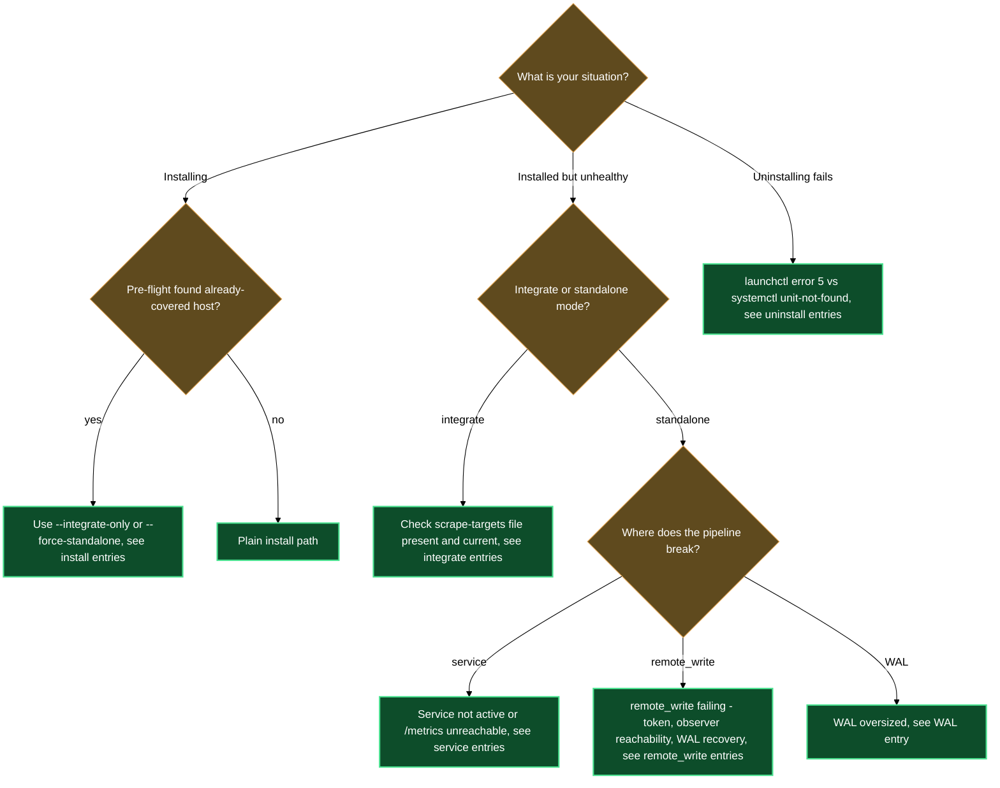

# Troubleshooting

## Install stops immediately: "collection is already covered on this host"

**Symptom**: `/lazy-observe.install` prints a list of detected signals (an existing lazycortex-observe service unit, a running scraper process such as Prometheus/otelcol/Alloy/grafana-agent, or an active scrape connection to a daemon's metrics port) and aborts without asking a single question.

**Likely cause**: The Step 0 pre-flight found a metrics-collection stack already working on this host. Installing a second shipper would be redundant, so the skill refuses by default.

**Fix**: This is the intended behavior on a host that's already covered — don't fight it. If the existing stack should also scrape this host, re-run `/lazy-observe.install --integrate-only`; it publishes a Prometheus file_sd scrape-targets file for your existing stack and installs no shipper of its own. If you genuinely want a dedicated lazycortex-observe shipper anyway, re-run with `/lazy-observe.install --force-standalone`.

---

## Doctor reports "not-installed"

**Symptom**: `/lazy-observe.doctor` immediately returns `FAIL not-installed` and skips all subsequent checks.

**Likely cause**: The answer file at `${XDG_CONFIG_HOME:-~/.config}/lazycortex/observe.toml` is absent. The shipper has never been installed on this host, or the file was deleted during a previous uninstall.

**Fix**: Run `/lazy-observe.install`. It walks through all setup steps and writes the answer file before loading the service.

---

## Doctor reports a missing or stale scrape-targets file (integrate mode)

**Symptom**: On a host installed with `/lazy-observe.install --integrate-only`, `/lazy-observe.doctor` reports `FAIL scrape-file-missing` or `WARN scrape-file-stale` on Step 5.

**Likely cause**: In integrate mode there is no local shipper — instead the operator's existing Prometheus reads a file_sd scrape-targets file at `${XDG_CONFIG_HOME:-~/.config}/lazycortex/scrape-targets.json`. That file is either missing, or its entry count no longer matches the daemons currently registered on this host (one was added or removed since the file was last generated).

**Fix**: Re-run `/lazy-observe.install --integrate-only`. It regenerates the scrape-targets file from the current daemon registry and prints the `file_sd_configs` snippet again — no other setting changes.

---

## Service unit shows as inactive

**Symptom**: `/lazy-observe.doctor` reports `FAIL inactive` on the service-unit check (Step 2). On macOS `launchctl print gui/$UID/com.lazycortex.observe` shows a state other than `running`; on Linux `systemctl --user is-active lazycortex-observe.service` returns `inactive` or `failed`.

**Likely cause**: The agent process crashed at startup or was stopped externally. The service unit is registered but not running.

**Fix**: Check the agent's logs before restarting — on macOS open `~/Library/Logs/lazycortex-observe/`, on Linux run `journalctl --user -u lazycortex-observe.service`. Once you understand the crash reason, restart via `launchctl kickstart -k gui/$UID com.lazycortex.observe` (macOS) or `systemctl --user restart lazycortex-observe.service` (Linux).

---

## Agent process is gone but service thinks it's running

**Symptom**: `/lazy-observe.doctor` reports `FAIL no-pid` on the agent-process check (Step 3). The service unit is loaded and shows an active state, but the actual process has exited.

**Likely cause**: The agent binary crashed after startup — the supervisor has not yet restarted it, or it is crash-looping and the supervisor gave up.

**Fix**: Inspect the agent's stderr log: `~/Library/Logs/lazycortex-observe/` on macOS or `journalctl --user -u lazycortex-observe.service` on Linux. A common cause is a config rendering error — re-run `/lazy-observe.install` (it is idempotent) to regenerate the agent config and reload the service.

---

## Local /metrics endpoint is unreachable

**Symptom**: `/lazy-observe.doctor` reports `FAIL endpoint-down` on the local-metrics check (Step 4). `curl http://127.0.0.1:9464/metrics` (or whichever port this host's daemon was allocated) hangs or returns a connection-refused error.

**Likely cause**: The lazycortex-core daemon for that checkout is not running, or runtime metrics are disabled for it. On a host running several lazycortex-core daemons, each gets its own port allocated sequentially from 9464 — check which `repo_label` the doctor report flags before restarting the wrong daemon.

**Fix**: Run `/lazy-core.install` for the affected checkout and answer "Yes" at its metrics prompt if you haven't already (see `references/lazy-core.runtime-schema.md § 12` for what the setting controls) — then restart that checkout's daemon supervisor. On macOS: `launchctl kickstart -k gui/$UID com.lazycortex.runtime`. On Linux: `systemctl --user restart lazycortex-runtime.service`.

---

## Metrics endpoint is up but shows no lazycortex series

**Symptom**: `/lazy-observe.doctor` reports `FAIL no-lazycortex-series`. The endpoint responds, but the body contains no `lazycortex_runtime_*` series.

**Likely cause**: The lazycortex-core daemon is running but has not yet dispatched a routine. Metrics are only emitted after the first routine tick.

**Fix**: Wait for the first routine tick — usually a few seconds after the daemon starts — then re-run `/lazy-observe.doctor`. No config change is needed.

---

## Agent is up but delivery rate is zero

**Symptom**: `/lazy-observe.doctor` reports `WARN zero-rate` on the agent self-metrics check (Step 5). The agent is running and its self-metrics endpoint is reachable, but `prometheus_remote_storage_succeeded_samples_total` (Alloy) or `otelcol_exporter_sent_metric_points` (otelcol) shows a zero rate.

**Likely cause**: Three common causes in order of likelihood: the auth token is wrong or expired; the observer URL is unreachable (Step 6 of doctor will also flag this); or the agent's WAL is still draining from a previous outage.

**Fix**: Check Step 6 of the doctor report first — if the observer URL is unreachable, that is the root cause. If the URL is reachable, rotate the token by re-running `/lazy-observe.install` Step 5 (which rewrites the token file and reloads the service). If the token is valid and the observer is up, the WAL is recovering on its own — wait and recheck.

---

## Agent self-metrics endpoint is not bound

**Symptom**: `/lazy-observe.doctor` reports `FAIL self-metrics-down` on the agent self-metrics check (Step 5). The agent process is running but `curl http://127.0.0.1:12345/-/ready` (Alloy) or `curl http://127.0.0.1:8888/metrics` (otelcol) returns a connection error.

**Likely cause**: The rendered agent config has a typo in the self-metrics listener address or port.

**Fix**: Re-run `/lazy-observe.install`. It re-renders the agent config from the shipped templates and reloads the service. The render step is idempotent and uses the answers already on disk.

---

## Observer URL is unreachable

**Symptom**: `/lazy-observe.doctor` reports `FAIL unreachable` on the observer-URL check (Step 6). `curl -I <remote_write_url>` returns a network error rather than any HTTP response.

**Likely cause**: The observer URL is wrong, the observer is down, or a firewall or DNS change is blocking the connection. The fix is on the operator's infrastructure, not in this plugin.

**Fix**: Verify the URL from outside Claude Code (`curl -I <your_remote_write_url>`). If the observer host is healthy but the URL has changed, re-run `/lazy-observe.install` — Step 4 lets you update the URL without changing any other setting.

---

## WAL directory is unusually large

**Symptom**: `/lazy-observe.doctor` reports `WARN oversized` on the WAL-bounds check (Step 7). The WAL directory at `${XDG_DATA_HOME:-~/.local/share}/lazycortex/observe/wal/` is larger than expected for the configured `wal_max_age`.

**Likely cause**: The observer was offline long enough for the WAL to accumulate more samples than a normal window. Once the observer is back, the agent drains the WAL automatically.

**Fix**: Confirm the observer is reachable (Step 6 of the doctor report) and leave the agent running. The WAL drains on its own — do not truncate it manually, as that would drop the buffered samples permanently. Re-run `/lazy-observe.doctor` after a few minutes to confirm the size is decreasing.

---

## Install fails with "already loaded" error

**Symptom**: `/lazy-observe.install` fails at Step 8 or Step 10 with a `bootstrap` or `enable` error containing "already loaded" or an equivalent message from launchctl or systemctl.

**Likely cause**: A previous install left a registered service unit under the same label (`com.lazycortex.observe` on macOS or `lazycortex-observe.service` on Linux). The new install cannot register a second copy.

**Fix**: Run `/lazy-observe.uninstall` first to remove the existing registration, then re-run `/lazy-observe.install`.

---

## Install fails because no daemon on this host has metrics enabled

**Symptom**: `/lazy-observe.install` aborts at Step 2 with outcome `core-metrics-disabled`.

**Likely cause**: No lazycortex-core daemon on this host has runtime metrics turned on yet, or one was turned on but its daemon hasn't been restarted since.

**Fix**: Run `/lazy-core.install` for the checkout you want scraped and answer "Yes" at its metrics prompt — it enables the endpoint and provisions a port automatically. If you already answered "Yes" previously, restart that checkout's daemon supervisor to pick up the change: `launchctl kickstart -k gui/$UID com.lazycortex.runtime` (macOS) or `systemctl --user restart lazycortex-runtime.service` (Linux). Then re-run `/lazy-observe.install`.

---

## Install reports remote_write 401 or 403 in agent self-metrics

**Symptom**: `/lazy-observe.install` completes at Step 10 with outcome `loaded-but-not-up`, and the agent's self-metrics show `prometheus_remote_storage_failed_samples_total` non-zero.

**Likely cause**: The bearer token or basic-auth password is wrong, expired, or missing the required scope for the observer's `remote_write` endpoint.

**Fix**: Rotate the credential at the observer side, then re-run `/lazy-observe.install`. At Step 5 you can update the token-source kind or write a new token file without changing any other setting.

---

## Uninstall fails on macOS with "Input/output error" (exit code 5)

**Symptom**: `/lazy-observe.uninstall` fails at Step 2 with `launchctl bootout` returning exit code 5 and a message containing "Input/output error".

**Likely cause**: macOS updated between the original install and now, leaving a stale plist label registration that launchctl cannot cleanly remove via `bootout`.

**Fix**: Run `launchctl remove com.lazycortex.observe` in your terminal, then re-run `/lazy-observe.uninstall`. The skill treats a clean "not loaded" state as `absent` and completes successfully.

---

## Uninstall on Linux says the unit does not exist

**Symptom**: `/lazy-observe.uninstall` reports that `systemctl --user disable` returned "Unit lazycortex-observe.service does not exist".

**Likely cause**: A previous partial uninstall removed the service unit file before the unit was formally disabled. systemd's unit database is now out of sync.

**Fix**: Run `systemctl --user daemon-reload` in your terminal, then re-run `/lazy-observe.uninstall`. The skill treats a missing unit as `absent` (not an error) and proceeds to clean up any remaining rendered configs.

---

## Diagnostic flowchart

