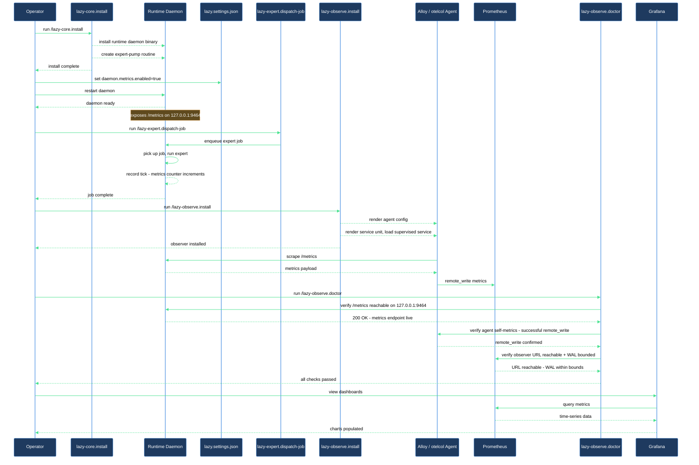

# Ship your first runtime metric to a self-hosted Prometheus stack

You have a fresh checkout. You want runtime metrics from this repo flowing into your own Prometheus or Grafana stack so you can chart routine throughput, error rates, queue depth, and Anthropic token spend. This walkthrough takes you from zero to a populated dashboard, end to end.

## What you need

- **A fresh `lazycortex` repo** (or one where you haven't yet run `/lazy-core.install`). The walkthrough creates state under `.experts/` and `.claude/lazy.settings.json`.
- **A Prometheus-compatible `remote_write` endpoint** you already operate — Grafana Cloud, self-hosted Prometheus, Mimir, VictoriaMetrics, anything that accepts the standard remote_write protobuf. This walkthrough does not stand up the observer side.
- **`grafana-alloy` or `otelcol-contrib`** on your `$PATH`. Install via `brew install grafana/grafana/alloy` (macOS) or your distro's package (Linux). The install skill prints the right command if missing.
- **A bearer token or basic-auth credential** for your observer's `remote_write` endpoint, ready to paste into the install wizard.

## The flow

### Step 1 — Install lazycortex-core

Run `/lazy-core.install`. The skill bootstraps the runtime daemon: copies rule templates into `.claude/rules/`, syncs authoring templates, seeds `lazy.settings.json` with sensible defaults, and offers to register `lazy-expert.pump` as the default routine consuming `.experts/.jobs/`. Say yes when it asks about the expert-runtime wizard — that's what produces traffic for the metrics you're about to ship.

After this step you have: a runnable daemon, an experts directory, the pump routine in the registry. No metrics endpoint yet.

### Step 2 — Enable the metrics endpoint

The daemon exposes a Prometheus-format `/metrics` endpoint, but it's off by default. Add a `metrics` block to the flat `daemon` section of `.claude/lazy.settings.json` (the same section `/lazy-core.install` Step 9c seeds — you're extending it with a sub-key the install skill leaves for you to opt into):

```json
{
  "daemon": {
    "metrics": {
      "enabled": true,
      "bind": "127.0.0.1",
      "port": 9464
    }
  }
}
```

Restart the daemon supervisor (`launchctl kickstart -k gui/$UID com.lazycortex.runtime` on macOS, `systemctl --user restart lazycortex-runtime.service` on Linux). The daemon re-reads settings on each iteration but `metrics.init` is one-shot at process start — restart is mandatory.

Verify locally: `curl -fsS http://127.0.0.1:9464/metrics | head` should show lines starting with `lazycortex_runtime_`. If you see nothing, re-check the settings JSON and the supervisor logs.

### Step 3 — Produce some traffic

The metrics endpoint is up but every counter is zero — nothing has ticked yet. Dispatch a single expert job to produce one tick:

```
/lazy-expert.dispatch-job <expert-name>
```

Where `<expert-name>` is whatever you registered in Step 1's wizard. The pump routine picks up the READY job within `polling_interval_sec` (default 5), runs the expert, records a `lazycortex_runtime_routine_ticks_total{routine="expert-pump",status="ok"}` increment, and writes a tokens record under `.logs/lazy-core/runtime/tokens.jsonl`.

Re-run `curl http://127.0.0.1:9464/metrics | grep ticks_total` — the counter should now read `1` (or higher).

### Step 4 — Install the shipper

Run `/lazy-observe.install`. The wizard asks four things in sequence (one `AskUserQuestion` each, in operator-driven order):

1. **Agent kind** — pick **Grafana Alloy** if your stack is Grafana-centric, **OpenTelemetry Collector** otherwise. Both emit identical Prometheus series, so the choice is reversible.
2. **`remote_write` URL** — paste your observer's endpoint (e.g. `https://prometheus-prod-XX-prod-eu-west-X.grafana.net/api/prom/push`).
3. **Auth kind** — bearer token, basic auth, or none.
4. **Token source** — write to a 0600 file at `${XDG_CONFIG_HOME:-~/.config}/lazycortex/observe.token` OR source from the `LAZYCORTEX_OBSERVE_TOKEN` env var. File is the default; env is for containers / secret-manager-injected setups.

After answering, the skill renders the agent config + the platform-appropriate service unit (launchd plist on macOS, systemd user unit on Linux), loads it via `launchctl bootstrap` / `systemctl --user enable --now`, and runs a smoke test. If everything passes you'll see `outcome=up` in the report.

### Step 5 — Verify end to end

Run `/lazy-observe.doctor`. The skill walks 8 checks read-only — service unit loaded, agent process up, local `/metrics` reachable, agent's self-metrics show successful `remote_write`, observer URL reachable, WAL bounded — and reports each as `PASS` / `WARN` / `FAIL` with a one-line fix on failure.

Expected output: all `PASS`, with `Step 5 — Agent self-metrics show successful remote_write` at `rate=N samples/min` (N > 0). If `Step 5` is `WARN zero-rate` your agent is up but not delivering — the doctor will name the likely cause (token expired / observer unreachable / WAL recovering).

## After you're done

Open your observer's UI (Grafana, Mimir Explore, etc.) and query `lazycortex_runtime_routine_ticks_total` — at least one series should show data. Import `claude/lazycortex-observe/dashboards/lazycortex-runtime.json` into Grafana for the prebuilt panel set (tick rate, error rate, p50/p95/p99 tick duration, queue depth, tokens/hour, halt status). Add `claude/lazycortex-observe/alerts/lazycortex-runtime.rules.yml` to your Prometheus `rule_files` glob to enable the four shipped alerts (`StaleNoTick`, `ErrorRateHigh`, `DaemonHalted`, `NoMetricsScraped`).

Re-run `/lazy-observe.doctor` periodically (e.g. weekly) to catch slow drift — token rotation gone wrong, WAL accumulation past the configured `max_age`, observer endpoint changes. The skill is read-only, so it's safe to run as often as you want.

To tear down: `/lazy-observe.uninstall` unloads the service and removes the rendered configs. Operator-private state under `${XDG_CONFIG_HOME:-~/.config}/lazycortex/` is preserved by default — re-installing later picks up the same answers without re-prompting.

## How it flows


