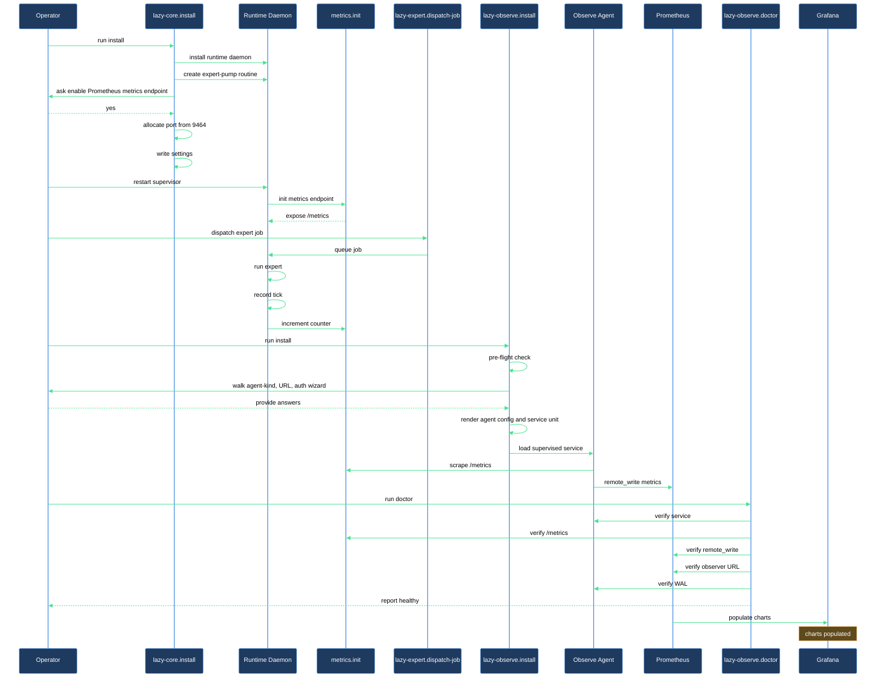

# Ship your first runtime metric to a self-hosted Prometheus stack

You have a fresh checkout. You want runtime metrics from this repo flowing into your own Prometheus or Grafana stack so you can chart routine throughput, error rates, queue depth, and Anthropic token spend. This walkthrough takes you from zero to a populated dashboard, end to end.

## What you need

- **A fresh `lazycortex` repo** (or one where you haven't yet run `/lazy-core.install`). The walkthrough creates state under `.experts/` and `.claude/lazy.settings.json`.
- **A Prometheus-compatible `remote_write` endpoint** you already operate — Grafana Cloud, self-hosted Prometheus, Mimir, VictoriaMetrics, anything that accepts the standard remote_write protobuf. This walkthrough does not stand up the observer side.
- **`grafana-alloy` or `otelcol-contrib`** on your `$PATH`. Install via `brew install grafana/grafana/alloy` (macOS) or your distro's package (Linux). The install skill prints the right command if missing.
- **A bearer token or basic-auth credential** for your observer's `remote_write` endpoint, ready to paste into the install wizard.

## The journey

### Step 1 — Install lazycortex-core with metrics enabled

Run `/lazy-core.install`. Answer yes to "does this project use the background daemon" (Gate 1) and yes to "run it for this checkout" (Gate 2) — that installs the daemon supervisor. Say yes when the expert wizard asks about registering an expert too — that expert produces the traffic you ship in Step 2.

Near the end of the same run, the wizard asks one more question: *"Enable the Prometheus `/metrics` endpoint for this checkout's daemon?"* Answer yes. The skill allocates a free port sequentially from `9464` (reusing this checkout's already-recorded port on any later re-run), writes `enabled` and a human-readable `repo_label` (default `local-<folder name>`) into the tracked `lazy.settings.json`, and stores the actual allocated port only in this checkout's gitignored local overlay — a port free on one machine can be taken on another, so it never travels through git. The install report's final line for this step reads `metrics-enabled port=<port> label=<label> scrape-targets=<count>` — note the port, you need it next.

The daemon supervisor was loaded earlier in this same run, before the metrics question was answered, and `metrics.init()` only runs once at process start — so restart the supervisor now to pick up the setting: `launchctl kickstart -k gui/$UID <label from the plist path the report named>` on macOS, or `systemctl --user restart <unit name from the report>` on Linux.

Verify locally: `curl -fsS http://127.0.0.1:<port>/metrics | head` should show lines starting with `lazycortex_runtime_`. If you see nothing, re-check the install report for the metrics step's outcome and the supervisor logs.

### Step 2 — Produce some traffic

The metrics endpoint is up but every counter is zero — nothing has ticked yet. Dispatch a single expert job to produce one tick:

```
/lazy-expert.dispatch-job <expert-name>
```

Where `<expert-name>` is whatever you registered in Step 1's expert wizard. The pump routine picks up the READY job within `polling_interval_sec` (default 5), runs the expert, records a `lazycortex_runtime_routine_ticks_total{routine="expert-pump",status="ok"}` increment, and writes a tokens record under `.logs/lazy-core/runtime/tokens.jsonl`.

Re-run `curl http://127.0.0.1:<port>/metrics | grep ticks_total` — the counter should now read `1` (or higher).

### Step 3 — Install the shipper

Run `/lazy-observe.install`. The skill first checks, read-only, whether metric collection is already covered on this host — an installed lazycortex-observe service, a running scraper process, or a live connection to a daemon's metrics port. On a clean host this reports clear and the wizard proceeds; if you already run a Prometheus/collector stack it aborts untouched instead, and names two deliberate ways forward: re-run with `--integrate-only` (feed your existing stack a target list, install no shipper) or `--force-standalone` (install anyway).

Assuming a clean host, the wizard asks four things in sequence (one `AskUserQuestion` each, in operator-driven order):

1. **Agent kind** — pick **Grafana Alloy** if your stack is Grafana-centric, **OpenTelemetry Collector** otherwise. Both emit identical Prometheus series, so the choice is reversible.
2. **`remote_write` URL** — paste your observer's endpoint (e.g. `https://prometheus-prod-XX-prod-eu-west-X.grafana.net/api/prom/push`).
3. **Auth kind** — bearer token, basic auth, or none.
4. **Token source** — write to a 0600 file at `${XDG_CONFIG_HOME:-~/.config}/lazycortex/observe.token` OR source from the `LAZYCORTEX_OBSERVE_TOKEN` env var. File is the default; env is for containers / secret-manager-injected setups.

After answering, the skill renders the agent config covering every metrics-enabled daemon on this host — if you later run several checkouts on the same machine, one shipper instance ships all of them, no re-install needed — plus the platform-appropriate service unit (launchd plist on macOS, systemd user unit on Linux), loads it via `launchctl bootstrap` / `systemctl --user enable --now`, and runs a smoke test. If everything passes you'll see `up` in the report.

### Step 4 — Verify end to end

Run `/lazy-observe.doctor`. The skill walks 7 checks read-only — service unit loaded, agent process up, local `/metrics` reachable for every daemon on this host, agent's self-metrics show successful `remote_write`, observer URL reachable, WAL bounded — and reports each as `PASS` / `WARN` / `FAIL` with a one-line fix on failure.

Expected output: all `PASS`, with `Step 5 — Agent self-metrics show successful remote_write` at `rate=N/min` (N > 0). If `Step 5` is `WARN zero-rate` your agent is up but not delivering — the doctor will name the likely cause (token expired / observer unreachable / WAL recovering).

## After you're done

Open your observer's UI (Grafana, Mimir Explore, etc.) and query `lazycortex_runtime_routine_ticks_total` — at least one series should show data. Import `claude/lazycortex-observe/dashboards/lazycortex-runtime.json` into Grafana for the shipped list-centric dashboard: a Daemons table up top (one row per repo — liveness, halt state, failed/dead jobs and errors with gradient bars, replacing the old single-checkout stat strip), a routine-health table with per-routine last-tick / ticks / errors / busy-time columns, error and halt tables, open-vs-problem queue charts sitting right under the queue table, and a token section closing the page with expert/model/repo/kind breakdown tables and donuts (model names drop the `claude-` prefix) — all driven by a single `period` selector instead of the time picker. Add `claude/lazycortex-observe/alerts/lazycortex-runtime.rules.yml` to your Prometheus `rule_files` glob to enable the four shipped alerts (`StaleNoTick`, `ErrorRateHigh`, `DaemonHalted`, `NoMetricsScraped`).

Re-run `/lazy-observe.doctor` periodically (e.g. weekly) to catch slow drift — token rotation gone wrong, WAL accumulation past the configured `max_age`, observer endpoint changes. The skill is read-only, so it's safe to run as often as you want.

To tear down: `/lazy-observe.uninstall` unloads the service and removes the rendered configs. Operator-private state under `${XDG_CONFIG_HOME:-~/.config}/lazycortex/` is preserved by default — re-installing later picks up the same answers without re-prompting.

## How it flows


