# Install and audit

Getting `lazycortex-obsidian` working in a project comes down to three skills that each own a distinct part of the lifecycle. `/lazy-obsidian.install` is the one-stop entry point: it syncs plugin rules and the tag-page template, installs Dataview into your vault, and chains into the iconize-sync and diagram render-glue setups so the full vault reaches a usable baseline in a single pass. `/lazy-obsidian.update-plugin` is the primitive beneath it — the workhorse that resolves, fetches, deep-merges opinionated settings, and registers any single Obsidian community plugin; you can also call it directly when you need to refresh one plugin out of band. `/lazy-obsidian.audit` is the semantic health check you run after updates or when something looks off — it verifies that the shipped artifacts stay internally coherent and presents a grouped PASS / WARN / FAIL report you can act on in-place.

All three are idempotent. Running `/lazy-obsidian.install` a second time produces no mutations if nothing changed, and `/lazy-obsidian.update-plugin` skips the binary copy when the vault is already at the latest version.

## When you'd use this

- Bootstrapping a freshly cloned repo: run `/lazy-obsidian.install` once to bring the vault to a working baseline (Dataview, Iconize, diagram render glue) without any manual setup.
- Refreshing a single vault plugin after a new upstream release: run `/lazy-obsidian.update-plugin <id>` directly — no need to re-run the full install.
- Checking that your plugin artifacts are still coherent after a plugin update or a cache refresh: run `/lazy-obsidian.audit` to surface any version drift, schema mismatches, or stale settings.
- Re-running install safely after a plugin update: `/plugin update lazycortex-obsidian@lazycortex` refreshes the plugin cache but does not re-sync rule or template files — follow it with `/lazy-obsidian.install` to pick up changes.

## How it fits together

You start with `/lazy-obsidian.install`. It detects whether you are installing at project scope (the common case) or user scope, then works through the rule-template sync, the tag-page template, and the Dataview install in order. For the Dataview install it calls `/lazy-obsidian.update-plugin dataview` — that primitive fetches the latest release from GitHub, deep-merges the opinionated `dataview` override block from `plugin-settings.json` onto the vault's `data.json`, and registers the id in `community-plugins.json`. After Dataview, the install skill chains into `/lazy-obsidian.iconize-install` and `/lazy-obsidian.diagram-install` automatically (no opt-in); those chains each call `/lazy-obsidian.update-plugin` again for their own dependencies. At the end you get a single structured report covering every step.

`/lazy-obsidian.update-plugin` is intentionally narrow: one plugin id per call, no side effects on sibling dirs, backup-safe (`manifest.json.bak` / `main.js.bak` are created before any download, restored on failure). When you pass `--bundled`, the skill copies binaries from the plugin's own templates instead of hitting GitHub — useful for `iconize-reloader`, which ships inside this plugin, and safe in offline environments. The state tuple it prints (`binary=... overrides=... community=...`) is machine-readable so the calling skill can log it verbatim.

`/lazy-obsidian.audit` runs independently of install — invoke it any time you want a coherence check. It works through a fixed set of phases: version constants in `iconize_sync.py` vs. template HOOK_VERSION markers; icon-map template schema validity; cross-artifact coherence for the two-writer model (worker writes frontmatter, the bundled `iconize-reloader` bridges folder-note frontmatter into `data.json`); protocol template sanity; skill cross-references; and the diagram render glue (CSS snippets and mermaid-popup override block). For every FAIL or WARN it offers fix / waive / skip — one question at a time. It is also the target of `lazy-core.doctor` Phase 3, so running the core doctor in any project that has this plugin enabled will delegate to this skill automatically.

## Common adjustments

- **Refreshing one Obsidian plugin**: run `/lazy-obsidian.update-plugin <id>`. Pass `--bundled` only for plugins that ship inside this plugin's templates (currently `iconize-reloader`).
- **Dry run before committing**: add `--dry-run` to any `/lazy-obsidian.update-plugin` call to see the state tuple (`binary`, `overrides`, `community`) that would be produced without writing anything.
- **Agent model routing**: if you want to adjust which tier handles `lazy-obsidian` subagents, run `/lazy-core.agent-models --scope=project` — it reads the canonical defaults from `lazycortex-core` and lets you override per-agent without hand-editing `lazy.settings.json`.
- **After a plugin update**: re-run `/lazy-obsidian.install` after every `/plugin update lazycortex-obsidian@lazycortex`. The cache refresh does not propagate rule or template changes into your repo; the install skill does.

## How the three skills compose

```mermaid
%%{init: {'themeVariables':{'background':'transparent','lineColor':'#000','textColor':'#000','edgeLabelBackground':'#fff'},'themeCSS':'.edgeLabel{background-color:transparent!important}.edgeLabel p{background-color:transparent!important}','flowchart':{'diagramPadding':5,'useMaxWidth':true}}}%%
flowchart LR
  userRunsInstall[User runs lazy-obsidian.install]
  checkVaultReady{Vault config ready?}
  resolvePluginList[Resolve plugin manifest list]
  installDataview[lazy-obsidian.update-plugin — Dataview]
  installIconize[lazy-obsidian.update-plugin — iconize-install]
  installCommunity[Install community plugin via iconize-install]
  runAudit[lazy-obsidian.audit — scan vault state]
  auditFindings{Findings present?}
  presentFindings[Present findings to user]
  userDecision{User decision}
  applyFix[Apply fix]
  recordWaiver[Record waiver]
  installDone[Install complete — Done]
  configError[Abort — vault not configured]

  userRunsInstall -->|invoke| checkVaultReady
  checkVaultReady -->|ready| resolvePluginList
  checkVaultReady -->|not configured| configError
  resolvePluginList -->|dispatch Dataview| installDataview
  resolvePluginList -->|dispatch iconize-install| installIconize
  installIconize -->|delegates install| installCommunity
  installDataview -->|installed| runAudit
  installCommunity -->|installed| runAudit
  runAudit -->|findings| auditFindings
  auditFindings -->|none| installDone
  auditFindings -->|has findings| presentFindings
  presentFindings -->|awaiting choice| userDecision
  userDecision -->|fix| applyFix
  userDecision -->|waive| recordWaiver
  applyFix -->|re-run audit| runAudit
  recordWaiver -->|re-run audit| runAudit

  classDef entry fill:#1e3a5f,stroke:#4a90e2,color:#fff
  classDef guard fill:#5f4a1e,stroke:#e2a14a,color:#fff
  classDef action fill:#1e5f3a,stroke:#4ae290,color:#fff
  classDef success fill:#0d4d2a,stroke:#4ae290,color:#fff,stroke-width:2px
  classDef error fill:#5f1e1e,stroke:#e24a4a,color:#fff,stroke-width:2px

  class userRunsInstall entry
  class checkVaultReady guard
  class auditFindings guard
  class userDecision guard
  class resolvePluginList action
  class installDataview action
  class installIconize action
  class installCommunity action
  class runAudit action
  class presentFindings action
  class applyFix action
  class recordWaiver action
  class installDone success
  class configError error
```

<!-- /lazy-diagram.draw lands the fence here; do not author a code block manually. -->

## See also

- [iconize](iconize.md) — the iconize-sync block (configure and apply vault icon mappings)
- [walkthroughs/fresh-vault-setup](walkthroughs/fresh-vault-setup.md) — end-to-end walkthrough using this block as its first step
