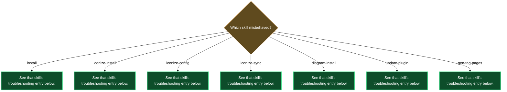

# Troubleshooting

## `/lazy-obsidian.install` aborts: "plugin not installed"

**Symptom**: Running `/lazy-obsidian.install` immediately exits with a message saying the plugin is not installed or the key `lazycortex-obsidian@lazycortex` is absent from `installed_plugins.json`.

**Likely cause**: The plugin is not listed in `enabledPlugins` in your `settings.json`, or Claude Code has not been restarted since the entry was added.

**Fix**: Add `"lazycortex-obsidian@lazycortex": true` to the `enabledPlugins` block in your `~/.claude/settings.json` (for global scope) or `.claude/settings.json` (for project scope), restart Claude Code, then run `/lazy-obsidian.install` again.

---

## `/lazy-obsidian.install` aborts: "plugin cache is empty"

**Symptom**: `/lazy-obsidian.install` reports that the plugin glob returned zero rule files and tells you the plugin cache is empty.

**Likely cause**: The plugin is enabled but the local cache was never populated or has become stale.

**Fix**: Run `/plugin update lazycortex-obsidian@lazycortex` to refresh the plugin cache, then re-run `/lazy-obsidian.install`.

---

## No Obsidian vault found when running `/lazy-obsidian.iconize-install` or `/lazy-obsidian.diagram-install`

**Symptom**: The skill aborts with "No Obsidian vault found at `<repo-root>/.obsidian/`".

**Likely cause**: The current repo has not been opened in Obsidian yet, so `.obsidian/` does not exist at the repo root.

**Fix**: Open the repo as an Obsidian vault (File → Open folder as vault, select the repo root), then re-run the skill. The skill requires `.obsidian/` to exist before it can scaffold vault-local artifacts.

---

## `/lazy-obsidian.iconize-install` aborts: "Hard dependency could not be installed"

**Symptom**: `/lazy-obsidian.iconize-install` aborts partway through Step 1.5 with a message like "Hard dependency `folder-notes` (or `obsidian-icon-folder` or `iconize-reloader`) could not be installed/updated."

**Likely cause**: `/lazy-obsidian.update-plugin` returned FAIL for one of the three required plugins — most commonly a network failure reaching the Obsidian community registry or GitHub releases.

**Fix**: Check network connectivity. Run `/lazy-obsidian.update-plugin <id>` for the failing plugin directly to see the underlying error. Once the network issue is resolved, re-run `/lazy-obsidian.iconize-install` — the skill is idempotent and will resume from a clean state.

---

## `/lazy-obsidian.iconize-config` aborts: icon-map not found

**Symptom**: `/lazy-obsidian.iconize-config` reports that `.claude/iconize/obsidian-icon-map.json` is missing and exits immediately.

**Likely cause**: `/lazy-obsidian.iconize-install` has not been run yet for this repo, so the icon-map has not been scaffolded.

**Fix**: Run `/lazy-obsidian.iconize-install` to scaffold the icon-map, pre-commit shim, and dependency plugins. Then re-run `/lazy-obsidian.iconize-config` to add or edit registry entries.

---

## Icons are not painting in Obsidian after running `/lazy-obsidian.iconize-sync`

**Symptom**: `/lazy-obsidian.iconize-sync` runs without errors, but files and folders show no icons in Obsidian.

**Likely cause**: One of two things: Iconize's `data.json` does not exist yet (Obsidian has never launched with the plugin enabled, so it hasn't initialized the file), or the Iconize plugin is not configured to read icons from frontmatter (`iconInFrontmatterEnabled` is not `true`).

**Fix**: Open Obsidian once with the Iconize plugin enabled so it initializes `data.json`. Then re-run `/lazy-obsidian.iconize-install` — Step 2.6 asserts the required frontmatter-feature settings (`iconInFrontmatterEnabled: true`, `iconInFrontmatterFieldName: "iconize_icon"`, `iconColorInFrontmatterFieldName: "iconize_color"`) and writes them if absent. After that, re-run `/lazy-obsidian.iconize-sync reconcile` to repopulate the frontmatter keys.

---

## `/lazy-obsidian.iconize-sync` exits with code 5 (hook version drift)

**Symptom**: The iconize-sync worker exits with code 5. The error message mentions MAJOR drift or an incompatible hook version between the installed `.githooks/pre-commit` shim and the current worker.

**Likely cause**: The plugin was updated via `/plugin update lazycortex-obsidian@lazycortex` but the pre-commit shim in `.githooks/pre-commit` was not refreshed to match the new worker's `HOOK_VERSION`. A MAJOR version bump in the worker renders the old shim inert (it exits 0 with a diagnostic but does not sync).

**Fix**: Run `/lazy-obsidian.iconize-install` — it invokes `install-hooks` which rewrites the shim to the current `HOOK_VERSION`. Alternatively, run `/lazy-obsidian.iconize-sync check-versions` to confirm the drift report, then re-run `/lazy-obsidian.iconize-install`.

---

## `/lazy-obsidian.update-plugin` aborts: "Could not fetch Obsidian community registry"

**Symptom**: `/lazy-obsidian.update-plugin` fails immediately with a message saying it could not fetch the community registry from `obsidianmd/obsidian-releases`.

**Likely cause**: No network access, or the GitHub raw content endpoint is temporarily unavailable.

**Fix**: Check network connectivity and retry. No vault files are modified before the registry fetch, so retrying is safe with no cleanup needed.

---

## `/lazy-obsidian.update-plugin` aborts: plugin id not in registry

**Symptom**: `/lazy-obsidian.update-plugin <id>` reports that `<id>` was not found in the Obsidian community registry.

**Likely cause**: The plugin id is misspelled, or you are trying to install a plugin that ships bundled inside lazycortex-obsidian (such as `iconize-reloader`) without the `--bundled` flag.

**Fix**: Verify the id against the Obsidian community plugins list. For bundled plugins, add `--bundled`: `/lazy-obsidian.update-plugin iconize-reloader --bundled`. If unsure whether a plugin is bundled, check whether a directory exists at `<installPath>/templates/obsidian/plugins/<id>/`.

---

## `/lazy-obsidian.update-plugin` aborts: binary download failed

**Symptom**: The skill starts successfully but fails during Step 5 with a message about being unable to fetch `manifest.json` or `main.js` from a GitHub release. It reports restoring from `.bak` files.

**Likely cause**: The GitHub releases endpoint for the plugin was unreachable mid-install (transient network error, or the latest release tag has no attached binaries).

**Fix**: The vault is restored to its pre-run state via the `.bak` files — no cleanup is needed. Check network connectivity and re-run `/lazy-obsidian.update-plugin <id>`.

---

## `/lazy-obsidian.update-plugin` aborts: `community-plugins.json` is not a JSON array

**Symptom**: The skill reaches Step 7 and aborts with "`community-plugins.json` is not a JSON array; cannot register `<id>` safely."

**Likely cause**: The vault's `<vault>/.obsidian/community-plugins.json` was corrupted — likely by a partial write during an Obsidian crash or a manual edit that introduced invalid JSON.

**Fix**: Open Obsidian once to let it repair the file, or fix the JSON manually (the file is a plain array of plugin id strings, e.g. `["dataview", "obsidian-icon-folder"]`). Then re-run `/lazy-obsidian.update-plugin <id>`.

---

## `/lazy-obsidian.update-plugin --bundled` aborts: plugin not found in templates

**Symptom**: `/lazy-obsidian.update-plugin <id> --bundled` aborts with "`<id>` is not bundled in `templates/obsidian/plugins/`."

**Likely cause**: The `--bundled` flag was passed for a plugin that is not shipped inside lazycortex-obsidian's templates directory, or the plugin cache is stale.

**Fix**: Remove `--bundled` to install from the community registry instead. If you expect the plugin to be bundled, run `/plugin update lazycortex-obsidian@lazycortex` to refresh the plugin cache and try again.

---

## `mermaid-popup` fails to install during `/lazy-obsidian.diagram-install`

**Symptom**: `/lazy-obsidian.diagram-install` Step 4 reports `failed:<reason>` for the `mermaid-popup` plugin. The skill continues and completes, but click-to-zoom on mermaid fences is unavailable.

**Likely cause**: The Obsidian community registry was unreachable, or `mermaid-popup` was not found in it at the time of install.

**Fix**: The CSS snippets (`mermaid-fit.css`, `ascii-fit.css`) are already installed and working — diagram rendering is fully functional without click-to-zoom. When network access is restored, run `/lazy-obsidian.update-plugin mermaid-popup` to install the plugin, or install it via Obsidian's Community Plugins UI. Re-running `/lazy-obsidian.diagram-install` later is also safe (idempotent).

---

## Tag pages don't generate: missing template error

**Symptom**: Running `/lazy-obsidian.gen-tag-pages` stops immediately with: "Missing tag-page template at `.claude/templates/obsidian.tag-page-template.md`. Run `/lazy-obsidian.install` to scaffold the default from the plugin."

**Likely cause**: `/lazy-obsidian.install` has not been run for this repo yet, or was run at global scope rather than project scope (the tag-page template is a project-only artifact).

**Fix**: Run `/lazy-obsidian.install` at project scope. The skill scaffolds the template to `.claude/templates/obsidian.tag-page-template.md`. After that, re-run `/lazy-obsidian.gen-tag-pages`.

---

## Diagnostic flowchart

