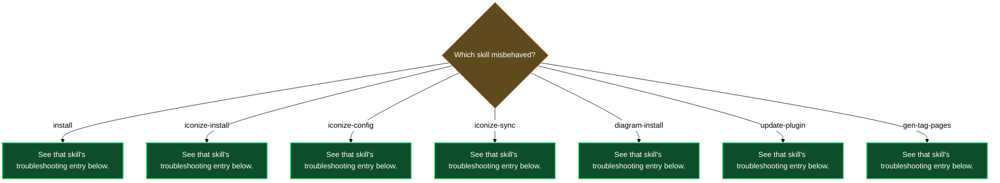

# Troubleshooting

## `/lazy-obsidian.install` aborts: "plugin not installed"

**Symptom**: Running `/lazy-obsidian.install` immediately exits with a message saying the plugin is not installed or the key `lazycortex-obsidian@lazycortex` is absent from `installed_plugins.json`.

**Likely cause**: The plugin is not listed in `enabledPlugins` in your `settings.json`, or Claude Code has not been restarted since the entry was added.

**Fix**: Add `"lazycortex-obsidian@lazycortex": true` to the `enabledPlugins` block in your `~/.claude/settings.json` (for global scope) or `.claude/settings.json` (for project scope), restart Claude Code, then run `/lazy-obsidian.install` again.

---

## `/lazy-obsidian.install` aborts: "plugin cache is empty"

**Symptom**: `/lazy-obsidian.install` reports that the plugin glob returned zero rule files and tells you the plugin cache is empty.

**Likely cause**: The plugin is enabled but the local cache was never populated or has become stale.

**Fix**: Run `/plugin update lazycortex-obsidian@lazycortex` to refresh the plugin cache, then re-run `/lazy-obsidian.install`.

---

## No Obsidian vault found when running `/lazy-obsidian.iconize-install` or `/lazy-obsidian.diagram-install`

**Symptom**: The skill aborts with "No Obsidian vault found at `<repo-root>/.obsidian/`".

**Likely cause**: The current repo has not been opened in Obsidian yet, so `.obsidian/` does not exist at the repo root.

**Fix**: Open the repo as an Obsidian vault (File → Open folder as vault, select the repo root), then re-run the skill. The skill requires `.obsidian/` to exist before it can scaffold vault-local artifacts.

---

## `/lazy-obsidian.iconize-install` aborts: "Hard dependency could not be installed"

**Symptom**: `/lazy-obsidian.iconize-install` aborts partway through Step 1.5 with a message like "Hard dependency `folder-notes` (or `obsidian-icon-folder` or `iconize-reloader`) could not be installed/updated."

**Likely cause**: `/lazy-obsidian.update-plugin` returned FAIL for one of the three required plugins — most commonly a network failure reaching the Obsidian community registry or GitHub releases.

**Fix**: Check network connectivity. Run `/lazy-obsidian.update-plugin <id>` for the failing plugin directly to see the underlying error. Once the network issue is resolved, re-run `/lazy-obsidian.iconize-install` — the skill is idempotent and will resume from a clean state.

---

## `/lazy-obsidian.iconize-config` aborts: icon-map not found

**Symptom**: `/lazy-obsidian.iconize-config` reports that `.claude/iconize/obsidian-icon-map.json` is missing and exits immediately.

**Likely cause**: `/lazy-obsidian.iconize-install` has not been run yet for this repo, so the icon-map has not been scaffolded.

**Fix**: Run `/lazy-obsidian.iconize-install` to scaffold the icon-map and dependency plugins. Then re-run `/lazy-obsidian.iconize-config` to add or edit registry entries.

---

## Icons are not painting in Obsidian after running `/lazy-obsidian.iconize-sync`

**Symptom**: `/lazy-obsidian.iconize-sync` runs without errors, but files and folders show no icons in Obsidian.

**Likely cause**: One of two things: Iconize's `data.json` does not exist yet (Obsidian has never launched with the plugin enabled, so it hasn't initialized the file), or the Iconize plugin is not configured to read icons from frontmatter (`iconInFrontmatterEnabled` is not `true`).

**Fix**: Open Obsidian once with the Iconize plugin enabled so it initializes `data.json`. Then re-run `/lazy-obsidian.iconize-install` — Step 2.6 asserts the required frontmatter-feature settings (`iconInFrontmatterEnabled: true`, `iconInFrontmatterFieldName: "iconize_icon"`, `iconColorInFrontmatterFieldName: "iconize_color"`) and writes them if absent. After that, re-run `/lazy-obsidian.iconize-sync reconcile` to repopulate the frontmatter keys.

---

## `/lazy-obsidian.iconize-sync` exits with code 5 (version drift)

**Symptom**: The iconize-sync worker exits with code 5. The error message mentions an incompatible icon-map schema.

**Likely cause**: The plugin was updated via `/plugin update lazycortex-obsidian@lazycortex` and the vault's icon-map declares a `schema_version` this worker no longer supports (or a `min_hook_version` the worker does not satisfy).

**Fix**: Run `/lazy-obsidian.iconize-sync check-versions` to confirm the drift report, then re-run `/lazy-obsidian.iconize-install` — it migrates the icon-map schema where a migration path exists.

---

## `/lazy-obsidian.update-plugin` aborts: "Could not fetch Obsidian community registry"

**Symptom**: `/lazy-obsidian.update-plugin` fails immediately with a message saying it could not fetch the community registry from `obsidianmd/obsidian-releases`.

**Likely cause**: No network access, or the GitHub raw content endpoint is temporarily unavailable.

**Fix**: Check network connectivity and retry. No vault files are modified before the registry fetch, so retrying is safe with no cleanup needed.

---

## `/lazy-obsidian.update-plugin` aborts: plugin id not in registry

**Symptom**: `/lazy-obsidian.update-plugin <id>` reports that `<id>` was not found in the Obsidian community registry.

**Likely cause**: The plugin id is misspelled, or you are trying to install a plugin that ships bundled inside lazycortex-obsidian (such as `iconize-reloader`) without the `--bundled` flag.

**Fix**: Verify the id against the Obsidian community plugins list. For bundled plugins, add `--bundled`: `/lazy-obsidian.update-plugin iconize-reloader --bundled`. If unsure whether a plugin is bundled, check whether a directory exists at `<installPath>/templates/obsidian/plugins/<id>/`.

---

## `/lazy-obsidian.update-plugin` aborts: binary download failed

**Symptom**: The skill starts successfully but fails during Step 5 with a message about being unable to fetch `manifest.json` or `main.js` from a GitHub release. It reports restoring from `.bak` files.

**Likely cause**: The GitHub releases endpoint for the plugin was unreachable mid-install (transient network error, or the latest release tag has no attached binaries).

**Fix**: The vault is restored to its pre-run state via the `.bak` files — no cleanup is needed. Check network connectivity and re-run `/lazy-obsidian.update-plugin <id>`.

---

## `/lazy-obsidian.update-plugin` aborts: `community-plugins.json` is not a JSON array

**Symptom**: The skill reaches Step 7 and aborts with "`community-plugins.json` is not a JSON array; cannot register `<id>` safely."

**Likely cause**: The vault's `<vault>/.obsidian/community-plugins.json` was corrupted — likely by a partial write during an Obsidian crash or a manual edit that introduced invalid JSON.

**Fix**: Open Obsidian once to let it repair the file, or fix the JSON manually (the file is a plain array of plugin id strings, e.g. `["dataview", "obsidian-icon-folder"]`). Then re-run `/lazy-obsidian.update-plugin <id>`.

---

## `/lazy-obsidian.update-plugin --bundled` aborts: plugin not found in templates

**Symptom**: `/lazy-obsidian.update-plugin <id> --bundled` aborts with "`<id>` is not bundled in `templates/obsidian/plugins/`."

**Likely cause**: The `--bundled` flag was passed for a plugin that is not shipped inside lazycortex-obsidian's templates directory, or the plugin cache is stale.

**Fix**: Remove `--bundled` to install from the community registry instead. If you expect the plugin to be bundled, run `/plugin update lazycortex-obsidian@lazycortex` to refresh the plugin cache and try again.

---

## `mermaid-popup` fails to install during `/lazy-obsidian.diagram-install`

**Symptom**: `/lazy-obsidian.diagram-install` Step 2 reports `failed:<reason>` for the `mermaid-popup` plugin. The skill continues and completes, but click-to-zoom on mermaid fences is unavailable.

**Likely cause**: The Obsidian community registry was unreachable, or `mermaid-popup` was not found in it at the time of install.

**Fix**: The mermaid/ascii fit CSS snippets are installed and enabled by `/lazy-obsidian.install`'s own shared snippet step (not by `diagram-install` itself) — so mermaid SVG fit and background/theme color already work without click-to-zoom, as long as you have run `/lazy-obsidian.install` at least once. When network access is restored, run `/lazy-obsidian.update-plugin mermaid-popup` to install the plugin, or install it via Obsidian's Community Plugins UI. Re-running `/lazy-obsidian.diagram-install` later is also safe (idempotent).

---

## `/lazy-obsidian.audit` reports vault manifest drift

**Symptom**: `/lazy-obsidian.audit` reports `drift: <N>` and lists entries where the live vault config and `.obsidian.manifest.json` disagree.

**Likely cause**: Something changed on one side since the manifest was last captured — you installed or updated a plugin, tweaked a setting, or added a snippet locally without recapturing, or you pulled a manifest change from another checkout without deploying it here yet.

**Fix**: The audit never auto-resolves drift — only you know which side is right. If the live vault is correct, run `/lazy-obsidian.capture` to record it. If the manifest is correct (for example, you just pulled a teammate's change), run `/lazy-obsidian.deploy` to restore it here.

---

## `/lazy-obsidian.capture` aborts: "No `.obsidian/` under `<repo_root>`"

**Symptom**: `/lazy-obsidian.capture` aborts immediately, reporting no `.obsidian/` directory at the repo root.

**Likely cause**: The checkout has no vault config to capture yet — either the repo was never opened as a vault in Obsidian, or the vault should be rebuilt from an existing manifest instead.

**Fix**: If `.obsidian.manifest.json` already exists in the repo, run `/lazy-obsidian.deploy` to build `.obsidian/` from it. Otherwise, open the repo folder as a vault in Obsidian first, then re-run `/lazy-obsidian.capture`.

---

## `/lazy-obsidian.capture` report lists `secrets_omitted`

**Symptom**: The capture report includes entries under `secrets_omitted`.

**Likely cause**: This is expected, not an error — the skill found an API token or password value in the vault config and deliberately left it out of the manifest.

**Fix**: Nothing to fix. Whoever deploys the vault on another machine enters that value by hand after `/lazy-obsidian.deploy` runs.

---

## `/lazy-obsidian.capture`'s manifest diff is huge on a vault that barely changed

**Symptom**: Committing after `/lazy-obsidian.capture` shows a large diff in `.obsidian.manifest.json` even though you only changed one setting.

**Likely cause**: A plugin rewrote its whole settings file — most commonly a schema migration triggered by a plugin update.

**Fix**: Read the diff before committing; the manifest is a reviewed file precisely so a wholesale rewrite like this is visible instead of landing silently. If the rewrite looks legitimate (matches a plugin update you just did), commit as usual.

---

## `/lazy-obsidian.deploy` aborts: "No `.obsidian.manifest.json`"

**Symptom**: `/lazy-obsidian.deploy` aborts immediately, reporting no manifest file in the repo.

**Likely cause**: This vault was never captured — nobody has run `/lazy-obsidian.capture` for this repo yet, so there is nothing to deploy from.

**Fix**: On a machine where the vault is already configured, run `/lazy-obsidian.capture` there, commit the manifest, pull it here, then re-run `/lazy-obsidian.deploy`.

---

## `/lazy-obsidian.deploy` reports a plugin `served from cache`

**Symptom**: The deploy report shows one or more plugins as `served from cache` instead of fetched fresh.

**Likely cause**: GitHub was unreachable, or the plugin's latest release had no attached binary assets, so deploy fell back to a vendored copy under the user's local cache.

**Fix**: Nothing is broken — the vault still works. Re-run `/lazy-obsidian.deploy` once network access to GitHub is available to pull the actual latest release.

---

## `/lazy-obsidian.deploy` reports a plugin `not in the community catalog`

**Symptom**: The deploy report shows a plugin as `not in the community catalog`.

**Likely cause**: The plugin the manifest references has no public Obsidian community-plugins catalog entry, so deploy has no `owner/name` repo to resolve it from.

**Fix**: Add a `repo` key (`owner/name`) to that plugin's entry in `.obsidian.manifest.json`, or, if the plugin ships bundled inside lazycortex-obsidian's own templates, deploy it via that bundled path instead.

---

## `/lazy-obsidian.deploy` reports a theme `not installed`

**Symptom**: The deploy report shows the vault's theme as `not installed`.

**Likely cause**: The manifest records only the theme's name, not its CSS — deploy never carries a theme's stylesheet.

**Fix**: Install the theme once from Obsidian's own Appearance settings; the manifest picks it up correctly on the next `/lazy-obsidian.capture`.

---

## Icons and folder colours are missing right after `/lazy-obsidian.deploy`

**Symptom**: `.obsidian/` rebuilds successfully, but files and folders show no icons immediately afterward.

**Likely cause**: Expected — icons are painted live by Iconize and the bundled `iconize-reloader` from note frontmatter, not written by the deploy skill itself.

**Fix**: Open Obsidian (it repaints on load), or run `/lazy-obsidian.iconize-sync reconcile` to force the frontmatter reconciliation immediately.

---

## Tag-page generation stops: "Missing tag-page template"

**Symptom**: Regenerating tag pages (`lazy-obsidian.gen-tag-pages`) stops immediately with a message about a missing tag-page template at `.claude/templates/lazy-obsidian.tag-page-template.md`.

**Likely cause**: `/lazy-obsidian.install` has not been run yet at project scope, so the template was never seeded into this repo. The generator refuses to fall back to a bundled default once a local template is expected — the local copy is the single source of truth once it exists.

**Fix**: Run `/lazy-obsidian.install` to scaffold the default template, then re-run tag-page generation.

---

## Diagnostic flowchart

```mermaid
%%{init: {'themeVariables':{'lineColor':'#000','textColor':'#000','edgeLabelBackground':'#fff'},'themeCSS':'.edgeLabel{background-color:transparent!important}.edgeLabel p{background-color:transparent!important}','flowchart':{'diagramPadding':5,'useMaxWidth':true}}}%%
flowchart TD
  whichSkill{Which skill misbehaved?}

  leafInstall[See that skill's troubleshooting entry below.]
  leafIconizeInstall[See that skill's troubleshooting entry below.]
  leafIconizeConfig[See that skill's troubleshooting entry below.]
  leafIconizeSync[See that skill's troubleshooting entry below.]
  leafDiagramInstall[See that skill's troubleshooting entry below.]
  leafUpdatePlugin[See that skill's troubleshooting entry below.]
  leafGenTagPages[See that skill's troubleshooting entry below.]

  whichSkill -->|install| leafInstall
  whichSkill -->|iconize-install| leafIconizeInstall
  whichSkill -->|iconize-config| leafIconizeConfig
  whichSkill -->|iconize-sync| leafIconizeSync
  whichSkill -->|diagram-install| leafDiagramInstall
  whichSkill -->|update-plugin| leafUpdatePlugin
  whichSkill -->|gen-tag-pages| leafGenTagPages

  classDef guard fill:#5f4a1e,stroke:#e2a14a,color:#fff
  classDef success fill:#0d4d2a,stroke:#4ae290,color:#fff,stroke-width:2px

  class whichSkill guard
  class leafInstall success
  class leafIconizeInstall success
  class leafIconizeConfig success
  class leafIconizeSync success
  class leafDiagramInstall success
  class leafUpdatePlugin success
  class leafGenTagPages success
```
