# Vault manifest — carry your Obsidian config as one tracked file

Obsidian's `.obsidian/` directory is not something you want in git directly — it is a hundred-odd files, several of them rewritten wholesale by the mobile app or by a plugin's own settings migrations, and committing it invites merge conflicts on files nobody meant to touch by hand. The vault-manifest block gives you a middle ground: `/lazy-obsidian.capture` snapshots the whole `.obsidian/` surface into one tracked, reviewable JSON file, `.obsidian.manifest.json`, and `/lazy-obsidian.deploy` rebuilds `.obsidian/` from that file on any checkout that needs it. Your vault's configuration travels through git as a single diff you can actually read, not as a pile of binary-ish plugin state.

## When you'd use this

- Cloning a repo whose Obsidian vault you've never opened on this machine — deploy rebuilds the whole config in one pass.
- Changed a setting, added a plugin, or tweaked a snippet or theme, and want that change to reach every other checkout — capture records it.
- Setting up a new machine or a fresh CI-style checkout where `.obsidian/` should exist but doesn't yet.
- Migrating a vault off blanket-committing `.obsidian/**` and onto the single-file manifest instead.
- Confirming that an API token or password living in some plugin's settings never ends up committed — the worker refuses to record secrets and tells you what it skipped.

## How it fits together

You run `/lazy-obsidian.capture` after changing anything under `.obsidian/` — install a plugin, tweak a setting, drop in a snippet, switch the theme. It runs the manifest worker (`bin/vault_manifest.py capture`), which walks the config directory and writes `.obsidian.manifest.json`: the list of installed plugins with their settings, snippet filenames (and whether each is vault-owned or plugin-shipped), the active theme, and top-level config files. Anything that looks like a secret — an API key, a password — is deliberately left out and reported as `secrets_omitted`, so you know to enter it by hand on any machine that deploys from this manifest. Capture is idempotent: re-running it on an unchanged vault rewrites the same bytes and commits nothing. It reviews the diff before committing (`git diff --stat`), so a plugin's schema-migration rewrite doesn't slip past you unnoticed. The commit carries the manifest and only the manifest.

On any checkout that needs `.obsidian/` — a fresh clone, a machine that never opened this vault — you run `/lazy-obsidian.deploy`. It reads `.obsidian.manifest.json` and rebuilds the config directory: every plugin fetched at its latest GitHub release, the captured settings layered on top, snippets, and the top-level config files restored. The theme is the one thing it never restores — the manifest carries the name, and a theme's CSS comes from Obsidian's own Appearance settings, so deploy reports a theme the vault lacks instead of installing it. Each plugin lands from one of three sources, and deploy tells you which: `upstream` (fetched fresh from GitHub), `cache` (a vendored fallback used because GitHub was unreachable or the release lacked assets), or `bundled` (shipped inside this LazyCortex plugin, like `iconize-reloader`). Deploy never pins a plugin to the exact version it was captured under — a plugin migrates its own settings forward the first time Obsidian opens it, which is why deploy always ends with a reminder to open Obsidian once after it finishes. If `.obsidian/` already exists at the target — this checkout already has a configured vault — deploy asks before overwriting, since local changes made since the last capture would be lost.

Neither skill touches `workspace*` files, caches, obsidian-git authentication, or Iconize's own runtime `data.json` — those are either genuinely local or, in Iconize's case, rebuilt by `iconize-reloader` from your notes' frontmatter rather than by this block.

## Common adjustments

**Passing a different vault root.** Both skills take an optional positional argument for the repo root; omit it and they use the current repo (`git rev-parse --show-toplevel`).

**A vault still tracks `.obsidian/**` directly.** Capture never untracks it or edits `.gitignore` for you — it tells you once, in its summary, the two commands to run by hand: add `.obsidian/` to `.gitignore`, then `git rm -r --cached .obsidian`. That's a one-time migration you do deliberately, not something the skill does silently.

**Deploy reports `secrets_omitted`.** Expected, not an error — the manifest deliberately never carries API tokens or passwords. Enter each listed value into Obsidian by hand after deploy finishes.

**A plugin reports `served from cache` after deploy.** GitHub was unreachable, or the release lacked the expected assets. Re-run deploy later when the network is back to pull the real latest release instead of the vendored fallback.

**A theme reports `not installed` after deploy.** Expected — deploy only ever names a theme it finds missing; it never installs one. Install it once from Obsidian's Appearance settings; the manifest records the name, not the theme's CSS.

**Deploying onto a checkout that already has `.obsidian/`.** Deploy asks before overwriting; default is to cancel. Say yes only when you're sure the manifest is more current than whatever local config is already there.

## How capture and deploy fit together

```mermaid
%%{init: {'themeVariables':{'background':'transparent','lineColor':'#000','textColor':'#000','edgeLabelBackground':'#fff'},'themeCSS':'.edgeLabel{background-color:transparent!important}.edgeLabel p{background-color:transparent!important}','flowchart':{'diagramPadding':5,'useMaxWidth':true}}}%%
flowchart LR
  captureSnapshotsAndCommits["lazy-obsidian.capture snapshots .obsidian/ into .obsidian.manifest.json and commits it"]
  commitReachesSecondMachine["Commit reaches second checkout via git"]
  deployReadsManifest["Fresh clone, .obsidian/ absent - lazy-obsidian.deploy reads manifest"]
  pluginSourceGuard{"Plugin source available?"}
  fetchLatestRelease["Fetch latest release from GitHub"]
  useVendoredCache["Fall back to vendored cache"]
  useBundledCopy["Use bundled copy"]
  rebuildObsidianDir["Rebuild .obsidian/"]
  operatorOpensObsidian["Operator opens Obsidian once"]
  pluginsRunMigrations["Plugins run their own settings migrations"]

  captureSnapshotsAndCommits -->|git sync| commitReachesSecondMachine
  commitReachesSecondMachine -->|second checkout| deployReadsManifest
  deployReadsManifest -->|for each plugin| pluginSourceGuard
  pluginSourceGuard -->|latest release| fetchLatestRelease
  pluginSourceGuard -->|release unavailable| useVendoredCache
  pluginSourceGuard -->|cache unavailable| useBundledCopy
  fetchLatestRelease -->|installed| rebuildObsidianDir
  useVendoredCache -->|installed| rebuildObsidianDir
  useBundledCopy -->|installed| rebuildObsidianDir
  rebuildObsidianDir -->|manual step| operatorOpensObsidian
  operatorOpensObsidian -->|on launch| pluginsRunMigrations

  classDef entry fill:#1e3a5f,stroke:#4a90e2,color:#fff
  classDef guard fill:#5f4a1e,stroke:#e2a14a,color:#fff
  classDef action fill:#1e5f3a,stroke:#4ae290,color:#fff
  classDef success fill:#0d4d2a,stroke:#4ae290,color:#fff,stroke-width:2px

  class captureSnapshotsAndCommits entry
  class pluginSourceGuard guard
  class commitReachesSecondMachine action
  class deployReadsManifest action
  class fetchLatestRelease action
  class useVendoredCache action
  class useBundledCopy action
  class rebuildObsidianDir action
  class operatorOpensObsidian action
  class pluginsRunMigrations success
```

## See also

- [`install-and-audit`](install-and-audit.md) — the broader vault bootstrap block; run it first on a brand-new vault before this block's manifest has anything to capture.
