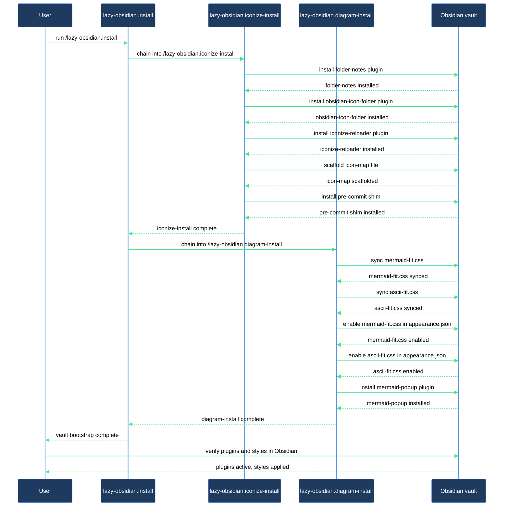

# How do I wire up a fresh vault from scratch?

This walkthrough takes you from a repo with a bare `.obsidian/` directory to a
fully configured vault: Iconize frontmatter-sync with its three hard-dependency
plugins, a pre-commit shim that keeps icons consistent, the diagram render
snippets that make mermaid fences fit the editor column, and click-to-zoom.
The journey is one entry point — `/lazy-obsidian.install` — that chains the
whole setup automatically. You get to the end without running three separate
commands.

## Outcome

After this walkthrough your vault has:

- **Iconize** (`obsidian-icon-folder`), **Folder Notes**, and the bundled
  **iconize-reloader** plugin installed and configured with the opinionated
  settings that enable frontmatter-driven icon painting.
- An icon-map scaffold at `.claude/iconize/obsidian-icon-map.json` ready for
  you to populate with role/path-to-icon rules via `/lazy-obsidian.iconize-config`.
- A pre-commit shim in `.githooks/pre-commit` that reconciles frontmatter icons
  before every commit, with `core.hooksPath` pointed at `.githooks`.
- `mermaid-fit.css` and `ascii-fit.css` installed in `.obsidian/snippets/` and
  enabled in `appearance.json`, so mermaid SVGs and ASCII diagrams fit the
  editor column automatically.
- The `mermaid-popup` community plugin installed for click-to-zoom on every
  mermaid fence.
- Obsidian's live `data.json` for Iconize listed in `.gitignore` so runtime
  state never creates merge conflicts.

## What you need

- `lazycortex-obsidian` enabled at **project scope** (not global — `.obsidian/`
  and `.mcp.json` are per-repo).
- An Obsidian vault already initialized in the repo root — meaning `.obsidian/`
  exists. Open the folder in Obsidian once to create it if it doesn't exist yet.
- `git`, `python3`, `jq`, and `curl` on `$PATH` (used by the sub-skills).
- Network access for the initial run so the community-registry lookups can
  resolve `folder-notes`, `obsidian-icon-folder`, and `mermaid-popup`.
- `lazycortex-core` enabled (declared as a dependency in `plugin.json`; the
  install pattern is reused).

## The journey

### Step 1 — Run the base install

```
/lazy-obsidian.install
```

This is the vault bootstrap entry point. It syncs any plugin rules and the
tag-page template used by the `lazy-obsidian.gen-tag-pages` agent, then
installs **Dataview** into `.obsidian/` via `/lazy-obsidian.update-plugin`
(Dataview renders the `Index` section of tag pages).

From there the base install chains automatically into
`/lazy-obsidian.iconize-install` and `/lazy-obsidian.diagram-install` — no
per-chain opt-in, no second command. Enabling the plugin means full
functionality; the chains always run.

The full set of chained work happens inside this one invocation.

### Step 2 — Iconize chain: three hard-dependency plugins

The iconize-install chain installs its three hard-dependency plugins in order —
`folder-notes`, `obsidian-icon-folder` (Iconize itself), and the bundled
`iconize-reloader` — by calling `/lazy-obsidian.update-plugin` for each. These
are non-optional: iconize-sync is non-functional without all three, so the
chain aborts rather than continuing if any one fails.

For each plugin, `/lazy-obsidian.update-plugin`:

- Resolves the community registry or reads from the bundled source for
  `iconize-reloader`.
- Fetches `manifest.json`, `main.js`, and `styles.css` from the latest GitHub
  release (backup-safe writes).
- Deep-merges the opinionated override block for that plugin id from
  `templates/obsidian/plugin-settings.json` onto the vault's `data.json`,
  registering the plugin in `community-plugins.json`.

After the plugins land, the chain asserts the three Iconize frontmatter-feature
settings (`iconInFrontmatterEnabled`, `iconInFrontmatterFieldName`,
`iconColorInFrontmatterFieldName`) directly in Iconize's `data.json`. These
must be set to the exact keys the worker writes (`iconize_icon` /
`iconize_color`) for Iconize to paint icons from frontmatter. The merge is
silent unless a value directly contradicts one you set deliberately — in that
case a single prompt asks which wins.

**Verification gate:** if any hard dependency returns FAIL the chain surfaces the
error and stops. Check network connectivity, run
`/lazy-obsidian.update-plugin <id>` directly to see the underlying error, then
re-run `/lazy-obsidian.install`.

### Step 3 — Iconize chain: icon-map, pre-commit shim, gitignore

With the plugins in place, the chain scaffolds the three remaining artifacts:

**Icon-map** — installs the starter template at
`.claude/iconize/obsidian-icon-map.json`. If the file already exists (re-run
scenario) the chain applies a three-way merge: keys only in the shipped template
are added silently, keys only in your file are kept silently, and only a
same-key value conflict prompts you. A schema-version mismatch triggers an
automatic in-place migration when the transform chain is complete.

**Pre-commit shim** — the worker's `install-hooks` subcommand writes
`.githooks/pre-commit`, then the chain sets `core.hooksPath` to `.githooks`
(or prompts if you already point git at a different hooks directory).

**Gitignore entry** — Iconize's `data.json` at
`.obsidian/plugins/obsidian-icon-folder/data.json` is appended to `.gitignore`
(or `.gitignore` is created if absent). The file is runtime state rewritten on
every icon click; tracking it produces merge conflicts and noisy diffs. If the
file is currently tracked the report tells you to run
`git rm --cached .obsidian/plugins/obsidian-icon-folder/data.json` — the chain
never does this automatically.

### Step 4 — Diagram chain: CSS snippets and click-to-zoom

The diagram-install chain then runs. It writes two CSS snippets into
`.obsidian/snippets/`:

- `mermaid-fit.css` — fits mermaid SVGs to container width without
  aspect-ratio distortion.
- `ascii-fit.css` — shrinks ASCII-diagram code blocks (`language-text` /
  `language-ascii`) in Reading Mode so wide diagrams fit the editor column with
  horizontal-scroll fallback.

Both snippets are written silently when absent or unchanged. A locally edited
snippet is merged silently when the shipped change and your edit touch disjoint
regions; only a same-region conflict prompts you.

After the snippets land, the chain enables both names in `appearance.json`
under `enabledCssSnippets`. Then it installs `mermaid-popup` via
`/lazy-obsidian.update-plugin` — this adds click-to-zoom (10% zoom step per
scroll wheel tick) on every mermaid fence. A registry fetch failure here does
not abort the chain: mermaid SVG fit and the transparent-background theme
directive still work via the CSS snippets alone, and you can re-run
`/lazy-obsidian.update-plugin mermaid-popup` later.

**Verification gate:** if the report shows any snippet outcome of `deferred`
(snippet file absent — can happen if a Step 2 conflict was kept-local in a way
that prevented writing), re-run `/lazy-obsidian.diagram-install` after
resolving the conflict.

### Step 5 — Read the install report and act on next steps

Both chains print a structured report at the end of the single
`/lazy-obsidian.install` invocation. Scan it for:

- Any **kept-local** outcome (icon-map merge conflict, Iconize frontmatter
  settings conflict, or CSS snippet conflict you chose to keep) — note the key
  or region so you can reconcile it later.
- Any **kept-orphan** notes — a pre-1.0.0 vault-local protocol doc or a
  stale PostToolUse entry in `.claude/settings.json` that the chain left in
  place. The report names each file; remove them manually if you want a clean
  setup.
- A WARN if `data.json` is currently tracked in git (action: run
  `git rm --cached .obsidian/plugins/obsidian-icon-folder/data.json`).
- Any **enabled** outcome from the diagram chain's appearance.json step — this
  means you need to **reload Obsidian** (or click ↻ next to each snippet in
  Settings → Appearance → CSS snippets) before the snippets take effect
  mid-session.
- Any **failed:** outcome for `mermaid-popup` — note the reason and re-run
  `/lazy-obsidian.update-plugin mermaid-popup` when the network is available.

### Step 6 — Reload Obsidian and verify

Reload Obsidian (Cmd-R / Ctrl-R, or quit and reopen) so the newly installed
plugins and enabled snippets take effect.

Verify the result:

1. **Iconize** — in the file explorer, open any note, add `iconize_icon: LiInfo`
   to its frontmatter, save. The icon should appear next to the file name
   immediately.
2. **mermaid-fit** — open a note containing a mermaid fence; the rendered SVG
   should fit the reading-pane width without overflowing.
3. **mermaid-popup** — click a rendered mermaid diagram; it should open in a
   zoom overlay.

If Iconize isn't painting from frontmatter, re-run `/lazy-obsidian.iconize-install`
(the `check-versions` step will surface any remaining drift) or open Obsidian's
plugin settings for Iconize and confirm the frontmatter field names are
`iconize_icon` / `iconize_color`.

## After you're done

The install is idempotent — re-run `/lazy-obsidian.install` any time to pick
up template changes after a plugin update, or to bring a newly cloned repo up
to the same baseline.

**Seed your icon registry.** The icon-map scaffold is intentionally empty.
Run `/lazy-obsidian.iconize-config` to add role/path-to-icon rules — that skill
is the canonical way to edit the registry without hand-editing JSON. Once rules
are in place, run `/lazy-obsidian.iconize-sync reconcile` to apply them across
all matched notes; Iconize and `iconize-reloader` repaint from the frontmatter
the worker writes.

**Install a single plugin out-of-band.** If you need to refresh one vault
plugin independently (e.g. after the community registry ships a new version),
use `/lazy-obsidian.update-plugin <id>`. Pass `--bundled` for
`iconize-reloader`.

**Diagram authoring.** The render glue installed here is the Obsidian-side half.
The lazycortex-diagram engine (`/lazy-diagram.draw`) is the recommended producer
— it emits mermaid fences with the correct theme directive so SVGs inherit the
panel background. The diagram-install chain works whether or not
`lazycortex-diagram` is enabled; it is useful for any vault that contains
mermaid fences.

## Journey at a glance


