# Code quality agents — review, document, test

Every meaningful batch of Python edits touches three concerns a linter alone cannot resolve: whether the code matches the project's style and docstring contracts, whether every public API is documented to spec, and whether tests verify documented behaviour rather than reverse-engineering the implementation. This block owns all three through three purpose-built members.

`/lazy-python.check-style` is the manual review entry point you run before committing. It opens by loading both the plugin's canonical guidelines and the project overlay, then walks your change set through seven inspection categories — the ones the automated tools cannot see — before handing off to `chk-py` and `tst-py` for a full gate. `lazy-python.docstring-writer` is a dispatched agent whose only job is writing and fixing docstrings; it never touches production code and self-checks eight semantic failure patterns before returning. `lazy-python.test-writer` is a second dispatched agent that writes test files covering all seven Paranoid-Testing categories, deriving every expected value from the documented contract rather than from the implementation.

All three members share one non-negotiable design: guidelines are never cached. On every invocation, each member re-reads the plugin's canonical reference files from `${CLAUDE_PLUGIN_ROOT}/references/` and the project overlay from `docs/guidelines/`, so a rule change in either layer takes effect immediately.

## When you'd use this

- You've finished a batch of Python edits and want a thorough review before committing — including semantic docstring quality, contract drift, and guard-clause placement, which `chk-py` cannot verify.
- A class is missing docstrings or has ones that have drifted from the project's documentation conventions; you want them written or corrected to spec without touching production code.
- A new class arrived without tests, or an existing class changed its public contract and the test file needs to track it; you want tests derived from the documented contract, not from what the implementation happens to return.
- You want consistent results across Claude Code sessions — every dispatch of the writer agents starts from the same authoritative source, not from whatever was loaded in the calling session.
- Another skill needs docstrings or tests produced as part of a larger workflow; both writer agents are designed to be dispatched from within other skills.

## How it fits together

`/lazy-python.check-style` is a seven-step workflow. It starts by reading the coding and documenting guidelines from the plugin plus your project overlay — both layers, every run, regardless of what is already in context. It then enumerates the modified Python files via `git diff` (or uses any file paths you pass explicitly). For each file it walks seven inspection categories: docstring quality, contract consistency, guard clauses, method organisation, naming, structural rules, and comment preservation. Only after the manual pass does it run `chk-py all <file>.py -q` per file, then `chk-py all -q` across the whole project, then `tst-py <module> -q` for each touched module. Every violation from either pass is fixed in a targeted single-line edit, and the skill re-verifies before it closes. The final step writes a run log.

`lazy-python.docstring-writer` is a focused seven-step agent. On dispatch it reads the documenting guidelines plus your overlay, reads the target files, identifies every missing or non-compliant docstring, and writes or fixes them — never touching any production code. Before returning it walks a mandatory pre-return self-check across eight semantic failure patterns: HOW-not-WHAT leakage, comma-chained call sequences in Summary, private internals in prose, algorithm narration in Scope, speculative future-plans, tautology on dunder summaries, missing `Returns:` sections, and private attributes in `Attributes:`. After the self-check it runs `chk-py` on every changed file. The full class, method, and property docstring rule set is embedded directly in the agent body, so the rules travel with every dispatch.

`lazy-python.test-writer` is an eight-step agent. It reads the testing and checking guidelines plus your overlay first, then reads the production class fully — paying special attention to the docstrings, because the docstring is the specification. It enumerates every testable claim: `__init__` paths, public methods, properties, documented guarantees, documented exceptions, and operator overloads. Tests are written across all seven Paranoid-Testing categories: happy path, wrong or invalid arguments, boundary values, error conditions, state transitions, operator overloading, and documented guarantees. A dedicated step then adds class and method docstrings to the test file itself (`"Test unit for ..."` on the class, `"Test that ..."` on each method), so the test file meets the same documentation standard as production code. When a correctly-specified test fails against the current implementation, the agent marks it `# FAILS: <reason>` and reports the divergence rather than silently adjusting the test. It verifies with `chk-py` and `tst-py` before returning and never writes a single line of production code.

The two writer agents and the review skill have a clean separation of concern: `/lazy-python.check-style` is the audit-and-fix entry point you run on your change set; the writer agents are composition units you (or another skill) dispatch when work needs to be created from scratch or brought up to a standard the review step surfaced.

## Common adjustments

**Passing an explicit file list to check-style.** If you pass file paths when invoking `/lazy-python.check-style`, the skill uses those instead of running `git diff` to find the change set. This is useful for reviewing a file that is not yet staged, or for re-checking a specific file after a targeted fix.

**Overlay rules take precedence.** Both writer agents apply the project overlay over the plugin canon when there is a conflict. The overlay for docstrings lives in `docs/guidelines/documenting_guidelines.md`; the overlays for tests live in `docs/guidelines/testing_guidelines.md` and `docs/guidelines/checking_guidelines.md`. Add or override rules there; the agents pick them up on the next dispatch without any plugin change. Run `/lazy-python.install` to get stub files for those overlay paths if they don't exist yet.

**Test base class mapping.** `lazy-python.test-writer` inherits the correct base test class from the overlay's `## Testing` declarations in `CLAUDE.md` or in `docs/guidelines/testing_guidelines.md`. When the overlay is silent on which base class to use for a given production-class category, the agent asks before proceeding — it never invents a class variable name or base class.

**Aggregate test files.** Some projects validate many sibling classes from one module through a single aggregate test file using `BaseClass.__subclasses__()` auto-discovery. When such a file is declared in the testing overlay, `lazy-python.test-writer` honours it: classes it covers do not get individual test files, and the aggregate file is placed at the root of the relevant test module directory.

**Implementation-vs-spec mismatches.** When `lazy-python.test-writer` finds that a correctly-specified test fails against the current implementation, it flags the test with `# FAILS:` rather than adjusting it. That flag is a prompt to investigate the implementation or update the docstring — not a signal to retune the test.

**Narrowing the per-file vs whole-project check.** Both agents and the review skill always run `chk-py all -q` (no path argument) as a final whole-project sweep, after the per-file pass is clean. If the project is large and the whole-project sweep is slow, the per-file pass alone is sufficient for a focused fix; the whole-project run is the regression guard.

## How the three members fit together

```mermaid
%%{init: {'themeVariables':{'background':'transparent','lineColor':'#000','textColor':'#000','edgeLabelBackground':'#fff'},'themeCSS':'.edgeLabel{background-color:transparent!important}.edgeLabel p{background-color:transparent!important}','flowchart':{'diagramPadding':5,'useMaxWidth':true}}}%%
flowchart LR
  invokeCheckStyle[User invokes /lazy-python.check-style]
  invokeDocstringWriter[User or skill dispatches lazy-python.docstring-writer]
  invokeTestWriter[User or skill dispatches lazy-python.test-writer]

  readGuidelinesShared[[Read canon coding + documenting guidelines and project overlay]]
  readDocGuidelinesShared[[Read documenting guidelines and project overlay]]
  readTestGuidelinesShared[[Read testing + checking guidelines and project overlay]]

  sevenCategoryReview[Run seven-category manual review]
  writeFixDocstrings[Write or fix docstrings only]
  noProductionCode[Write test files only - no production code]

  selfCheck{Pre-return self-check: 8 semantic checks pass?}

  chkPyPerFile1[chk-py per-file]
  chkPyWholeProject[chk-py whole-project]
  tstPyTouchedModules[tst-py per touched module]

  chkPyDocstring[chk-py]

  chkPyTest[chk-py]
  tstPyTest[tst-py]

  invokeCheckStyle -->|read guidelines| readGuidelinesShared
  invokeDocstringWriter -->|read guidelines| readDocGuidelinesShared
  invokeTestWriter -->|read guidelines| readTestGuidelinesShared

  readGuidelinesShared -->|begin review| sevenCategoryReview
  sevenCategoryReview -->|check per-file| chkPyPerFile1
  chkPyPerFile1 -->|check whole-project| chkPyWholeProject
  chkPyWholeProject -->|run tests| tstPyTouchedModules

  readDocGuidelinesShared -->|draft docstrings| writeFixDocstrings
  writeFixDocstrings -->|self-check| selfCheck
  selfCheck -->|all 8 pass| chkPyDocstring
  selfCheck -->|fix needed| writeFixDocstrings

  readTestGuidelinesShared -->|enforce constraint| noProductionCode
  noProductionCode -->|check| chkPyTest
  chkPyTest -->|run tests| tstPyTest

  classDef entry fill:#1e3a5f,stroke:#4a90e2,color:#fff
  classDef guard fill:#5f4a1e,stroke:#e2a14a,color:#fff
  classDef action fill:#1e5f3a,stroke:#4ae290,color:#fff
  classDef success fill:#0d4d2a,stroke:#4ae290,color:#fff,stroke-width:2px
  classDef error fill:#5f1e1e,stroke:#e24a4a,color:#fff,stroke-width:2px
  classDef sub fill:#2e2240,stroke:#7e63a8,color:#fff

  class invokeCheckStyle entry
  class invokeDocstringWriter entry
  class invokeTestWriter entry
  class readGuidelinesShared sub
  class readDocGuidelinesShared sub
  class readTestGuidelinesShared sub
  class sevenCategoryReview action
  class writeFixDocstrings action
  class noProductionCode error
  class selfCheck guard
  class chkPyPerFile1 action
  class chkPyWholeProject action
  class tstPyTouchedModules success
  class chkPyDocstring success
  class chkPyTest action
  class tstPyTest success
```

## See also

- [discipline](../discipline.md) — The always-loaded rules and reference guidelines both writer agents consult on every dispatch.
- [checkers](../checkers.md) — The `chk-py` and `tst-py` CLI wrappers these agents call to gate their output.
- [overlay](../overlay.md) — How to add project-specific rules that override the canon the writer agents read.
- [write-tests-for-new-class](../walkthroughs/write-tests-for-new-class.md) — End-to-end walkthrough of dispatching `lazy-python.test-writer` and verifying the result with `tst-py`.
