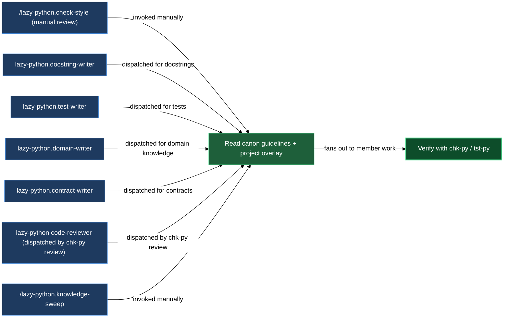

# Code quality agents — review, document, test, mark knowledge

Every meaningful batch of Python edits touches concerns a linter alone cannot resolve: whether the code matches the project's style and docstring contracts, whether every public API is documented to spec, whether tests verify documented behaviour rather than reverse-engineering the implementation, whether the change honours the guideline clauses no AST-based checker can prove, and — for anything implementing a domain mechanic or a caller-visible guarantee — whether that knowledge is captured in the code as a `Domain(...)` or `Contract:` block instead of rotting in a comment nobody updates. This block owns all of it through seven purpose-built members: one audit-and-fix skill, five dispatched writer/reviewer agents, and one sweep skill that backfills markers across a codebase that adopted the discipline late.

`/lazy-python.check-style` is the manual review entry point you run before committing. It opens by loading both the plugin's canonical guidelines and the project overlay, then walks your change set through eight inspection categories — the ones the automated tools cannot see — before handing off to `chk-py` and `tst-py` for a full gate. `lazy-python.docstring-writer` is a dispatched agent whose only job is writing and fixing docstrings; it never touches production code and self-checks eight semantic failure patterns before returning. It is project-neutral by design — its section set and its rules for private-attribute exposure come from your project's declarations, not from anything baked into the agent. `lazy-python.test-writer` is a second dispatched agent that writes test files covering all seven Paranoid-Testing categories, deriving every expected value from the documented contract rather than from the implementation. `lazy-python.domain-writer` and `lazy-python.contract-writer` are the knowledge-marker pair: the first captures domain mechanics and rules as `Domain(group):` blocks validated against your project's own dictionary, the second formalizes caller-visible guarantees as `Contract:` blocks and keeps the owning docstring's `Guarantees` section in sync. `lazy-python.code-reviewer` runs as the final phase of `chk-py all`, reviewing your change against every guideline layer — including whether changed code carries the knowledge markers it should — for clauses no deterministic checker can prove, and reporting findings only; it never edits the code it reviews. `lazy-python.knowledge-sweep` is the odd one out — a skill, not a dispatched agent — that backfills `Domain`/`Contract` markers across an already-written codebase instead of marking one file at a time.

All members share one non-negotiable design: guidelines are never cached. On every invocation, each member re-reads the plugin's canonical reference files from `${CLAUDE_PLUGIN_ROOT}/references/` and the project overlay from `docs/guidelines/`, so a rule change in either layer takes effect immediately. `lazy-python.code-reviewer` reads two additional layers beyond canon and overlay — the project's own Python-scoped `.claude/rules/*.md` files and `CLAUDE.md` / `.claude/CLAUDE.md` — because guideline drift often lives in project-specific reminders, not just the overlay stubs. `lazy-python.domain-writer` reads one more source besides guidelines: the project's domain-groups dictionary, whose path the dispatch names in `dictionary=<path>` (falling back to `docs/guidelines/domain-groups.md`) — the one registry every group must come from.

## When you'd use this

- You've finished a batch of Python edits and want a thorough review before committing — including semantic docstring quality, contract drift, and guard-clause placement, which `chk-py` cannot verify.
- A class is missing docstrings or has ones that have drifted from the project's documentation conventions; you want them written or corrected to spec without touching production code.
- Your project needs a docstring section the canon doesn't define — a domain-specific block your team always wants on certain classes — and you want the writer agent to honour it consistently instead of improvising a new shape each dispatch.
- A new class arrived without tests, or an existing class changed its public contract and the test file needs to track it; you want tests derived from the documented contract, not from what the implementation happens to return.
- A calculation or mechanic in your code implements a domain rule (loot odds, stacking behaviour, a formula) that isn't documented anywhere in plain language, and you want it captured as a `Domain(<group>):` block validated against your project's own dictionary rather than a code comment nobody will find again.
- A method makes a caller-visible promise — returns a deep copy, is idempotent, never raises for a documented input range — and you want that promise formalized as a `# Contract:` block with a synced `Guarantees` docstring section, so it can't quietly drift the next time the implementation changes.
- `chk-py all` finished clean but you want the guideline-level pass no checker can run — purpose comments on every block, guard-clause semantics, naming conventions, suppression hygiene, unmarked knowledge, and any overlay-specific clause your project added — before calling the change done.
- Your codebase adopted domain/contract markers late, or a pile of `Domain(unfiled):` findings has accumulated because the dictionary hasn't kept up, and you want a single sweep that proposes candidate groups, grows the dictionary on its own judgment (reporting every group so you can overrule it afterward), and refiles the backlog instead of clearing it file by file by hand.
- You want consistent results across Claude Code sessions — every dispatch of a writer agent starts from the same authoritative source, not from whatever was loaded in the calling session.
- Another skill needs docstrings, tests, or knowledge markers produced as part of a larger workflow; all four writer/reviewer agents are designed to be dispatched from within other skills.

## How it fits together

`/lazy-python.check-style` is a seven-step workflow. It starts by reading the coding and documenting guidelines from the plugin plus your project overlay — both layers, every run, regardless of what is already in context. It then enumerates the modified Python files via `git diff` (or uses any file paths you pass explicitly). For each file it walks eight inspection categories: docstring quality, contract consistency, guard clauses, method organisation, naming, structural rules, marker clauses, and comment preservation — the marker-clause pass includes noting a `Domain(unfiled):` block as a parked marker to route to `/lazy-python.knowledge-sweep`, not a violation to fix here. Only after the manual pass does it run `chk-py all <file>.py -q` per file — switching to `chk-py all <dir>/ -q` when more than three modified files share a directory — then `chk-py all -q` across the whole project, then `tst-py <module> -q` for each touched module. Every violation from either pass is fixed in a targeted single-line edit, and the skill re-verifies before it closes. If a fix would touch a file under `tests/**`, the skill stops instead of applying it — it asks you via `AskUserQuestion`, one question per test file, naming the exact issue and the assertion, fixture, or expected value the fix would change, with `edit-test` (apply it to that file now, this run only, never persisted) or `keep-test` (leave the test untouched and fix the code instead) as the two answers. The rule this enforces is the project's own test-edit policy: a test edit can turn a real regression green, and that call stays yours, never the agent's.

`lazy-python.docstring-writer` is a focused seven-step agent. On dispatch it reads the documenting guidelines plus your overlay, reads the target files, identifies every missing or non-compliant docstring, and writes or fixes them — never touching any production code. Its scope is class, method, and property docstrings only; it never adds a module-level docstring to a regular source file. Under the canon a module docstring is required in `__init__.py` and permitted in any other module; the agent simply does not own that layer — a new `__init__.py` gets its package docstring from the `init-template.py` scaffold, and a module docstring anywhere else is the author's to write. The canonical section order (Summary, Scope, Responsibilities, Guarantees, Subclassing, Notes, Type Parameters, Attributes for classes) is fixed, but any class-docstring section your project registers is inserted at its configured position alongside them — the agent carries no hardcoded knowledge of what those extra sections mean; it defers entirely to what the project declares. The same project-neutral stance applies to the `Attributes` section: private fields and `@property` methods are excluded unless the project has declared an escape hatch for them, and the agent invents nothing beyond what that declaration covers. Before returning the agent walks a mandatory pre-return self-check across eight semantic failure patterns: HOW-not-WHAT leakage, comma-chained call sequences in Summary, private internals in prose, algorithm narration in Scope, speculative future-plans, tautology on dunder summaries, missing `Returns:` sections, and private attributes in `Attributes:`. After the self-check it runs `chk-py` on every changed file. The guideline-review phase is not part of that run — `chk-py review` is its own command and never a step of `chk-py all` — so deciding what to do about a pending review stays the dispatching session's call, not something a docstring-only agent is positioned to make on its own. The full class, method, and property docstring rule set is embedded directly in the agent body, so the rules travel with every dispatch. `lazy-python.contract-writer` shares this "docstring-writer owns docstrings" boundary with one sanctioned exception, described below.

`lazy-python.test-writer` is an eight-step agent. It reads the testing and checking guidelines plus your overlay first, then reads the production class fully — paying special attention to the docstrings, because the docstring is the specification. It enumerates every testable claim: `__init__` paths, public methods, properties, documented guarantees, documented exceptions, and operator overloads. Tests are written across all seven Paranoid-Testing categories: happy path, wrong or invalid arguments, boundary values, error conditions, state transitions, operator overloading, and documented guarantees. A dedicated step then adds class and method docstrings to the test file itself — `"Test unit for ..."` on the class, `"Test that ..."` on each method, summary line only, in the multi-line quote form the format checker requires (`"""`, newline, the summary line, newline, `"""`; a single-line `"""Test unit for X."""` fails the check) — so the test file meets the same documentation standard as production code. The test file also follows the same import layout and typing discipline as production code: `from __future__ import annotations`, stdlib imports, a `TYPE_CHECKING` block, every test method and helper annotated, and a `Returns:` section on any helper — the shape `chk-py` checks when the test file's directory runs through the format gate. When a correctly-specified test fails against the current implementation, the agent marks it `# FAILS: <reason>` and reports the divergence rather than silently adjusting the test. It verifies with `chk-py` (which never carries the guideline-review phase, same reasoning as the docstring writer) and `tst-py` before returning, and never writes a single line of production code.

`lazy-python.domain-writer` is a six-step agent whose only job is writing and updating `# Domain(group):` blocks — plain-language descriptions of a mechanic, formula, or rule, answering "what are the rules?" and never "what does the code do?". It never touches code or docstrings. Before writing anything it enumerates every domain-knowledge candidate in the target file — not just the first rule that catches the eye — and judges each one purely against whether the problem domain, not engineering technique, imposes it; a candidate is never rejected just because a line comment, a docstring, or a `Contract:` block already says something similar nearby — those are different readers, and the domain document is written for people who will never open the source file. When the same rule recurs across sibling implementations of one interface or base class, the agent raises it to the shared declaration instead of duplicating it per file, leaving each implementation with only what is genuinely its own. Groups come from the project's domain-groups dictionary — the path the dispatch names in `dictionary=<path>`, else the conventional `docs/guidelines/domain-groups.md` — and the agent never invents a permanent group: when nothing listed fits (or the dictionary is absent), it parks the block under the reserved `Domain(unfiled):` group and reports a candidate name with a one-line gloss for the operator to file later. A proposed group name always carries at least two dot-separated segments — subject area, then topic (`entities.lifecycle`, `space.grids`) — drawn from the codebase's own vocabulary, never a synonym invented for the dictionary. A `refile=true` dispatch switches the agent into refile mode: it re-picks a group for a file's already-parked blocks — and for any block named in a `rename=<old-group>-><new-group>` instruction — against the current dictionary, rewriting only the header line; the `# #` title and the body stay byte-identical, because refile files knowledge, it never rewrites it. Every block is written in English regardless of the dispatch or project language, per the coding canon's Source Language rule. It verifies each changed file with `chk-py all <file>.py -q` (the guideline-review phase is not part of `all` and stays the dispatching session's call) and logs its run.

`lazy-python.contract-writer` is the sibling agent for caller-visible guarantees — a six-step agent that writes and updates `# Contract:` blocks: one guarantee per block, MUST/NEVER language for hard invariants, standalone with blank-line boundaries, never written for a pure implementation detail or for what the signature and type hints already make obvious. Before writing a block it also checks whether the method is declared on an interface or abstract base: when it is, the guarantee lives only on that declaration — the implementation gets a synced `Guarantees` bullet tracing back to it, and the agent never mirrors the same contract onto both layers; an implementation's own extra guarantee, one the interface doesn't state, still gets its own block. It also never writes a contract pinning presentation details — exact message text, log lines, pretty-print or repr formatting — unless a caller demonstrably parses that string programmatically, in which case the block names the parsed structure rather than the prose. Like `lazy-python.domain-writer`, it judges each guarantee against the code alone: a line comment, a docstring, or a `Domain(...):` block already saying something similar nearby is never a reason to skip it — those are different readers, and only an existing `Contract:` or `Domain(...):` block outranks a plain line comment covering the same ground. It carries the one sanctioned exception to "writer agents don't touch docstrings": after writing a contract it syncs the owning docstring's `Guarantees` section (or `Subclassing`, for a class-level obligation) to reflect it — reworded for concision, semantics preserved exactly — and touches no other docstring section, no other block. Verification (`chk-py all <file>.py -q` per changed file) and logging follow the same shape as the other writers.

`lazy-python.code-reviewer` is what `chk-py review` names for dispatch, and can also run directly against an explicit file list. `chk-py all` runs six deterministic checkers (`[1/6]`…`[6/6]`) and stops; the review phase is its own command on its own cadence, deliberately kept out of those six steps rather than inside the edit loop — one dispatch carries the entire guideline canon, so its cost is fixed per run rather than per file, and it belongs at the end of a unit of work. `chk-py review` resolves the scope — the current `git diff` against `HEAD`, or against an explicit `--base <ref>` when a unit of work landed several intermediate commits, plus any untracked `.py` files or paths you pass explicitly — hashes it into a scope key, and writes a manifest under `.runtime/lazy-python/review/` naming every applicable guideline layer in precedence order (a later layer overrides an earlier one on conflict): the plugin canon, your project overlay, any `.claude/rules/*.md` file that scopes itself to Python, and `CLAUDE.md` / `.claude/CLAUDE.md`. It prints the dispatch directive for the `lazy-python.code-reviewer` agent rather than calling the agent itself, so the phase works unchanged from a terminal, from pre-commit, or from CI where no LLM is available — but a review that has only been manifested, not yet dispatched and rendered, is unfinished work: `chk-py review` exits `2` in that state, failing that command and any CI step built on it until the review is resolved. You (or the calling skill) dispatch the agent against that manifest; it walks thirteen review-checklist categories — comment density and purpose, logical-block structure, guard-clause (`# guard:`) semantics, `# opt:` / `# limit:` / `# Decision:` marker semantics, naming, useless intermediate variables, docstring-vs-contract drift, structural placement, suppression (`# waiver:`) hygiene, the test-edit policy, every overlay-specific clause the project adds, unmarked knowledge, and mirrored interface/implementation contracts — changed code implementing a caller-visible guarantee with no `Contract:` block, or a domain mechanic with no `Domain(<group>):` block, is a finding judged only against the touched regions of changed files, and so is a `Contract:` block repeated on both an interface (or abstract base) declaration and its implementation of the same method, which draws a `WARN` naming the implementation's copy as the one to drop rather than the interface's. A block already parked under `Domain(unfiled):` because no listed group fit is not a finding under the unmarked-knowledge item; it's routed to `/lazy-python.knowledge-sweep` instead. The agent writes findings naming the file, line, severity, and the exact clause violated. Run `chk-py review --render <findings.json>` to print those findings in the same shape the other checkers use and get the real exit code: 0 when clean or only WARN/INFO findings are present, 1 when any finding is FAIL. An unchanged scope — nothing in the file set has changed since the last review — reuses the cached findings instead of re-dispatching the agent. `/lazy-python.install` also registers `lazy-python.code-reviewer` as an expert (`python.code-reviewer`) in the project's `lazy.settings.json`, so the same review can run through the expert runtime as well as through `chk-py review`.

`lazy-python.knowledge-sweep` is the one member that is a skill, not a dispatched agent, and the only one whose job is paying down existing debt rather than marking new code as it's written. It's the backfill route for a codebase that adopted domain/contract markers late, or whose dictionary hasn't kept up: it first resolves the domain-groups dictionary, then grows it by clustering everything already parked under `Domain(unfiled):` — plus, for a repo with no markers at all yet, the sources' own subject-area vocabulary (module and package names, recurring domain nouns) — into candidate groups. The skill is non-interactive: rather than asking you to tick each cluster, it settles the finest cut the clusters justify on its own and writes the accepted groups straight into the dictionary, reporting the full cut — every group, its gloss, and the blocks it absorbs — so you can overrule a name or a boundary after the fact rather than approve one before it. It also catches groups that were mistyped or invented at the keyboard: any `Domain(<group>):` whose group is neither `unfiled` nor listed is settled the same way — **add** (append it to the dictionary when the name is sound) or **rename** (move its blocks into the listed group it duplicates, carried into the writer dispatch as `rename=<old>-><new>`) — reported, not asked. Once the dictionary reflects those decisions, it enumerates the sweep scope — explicit paths, else the `wiki.domains.code` globs when configured, else every tracked `.py` file — and dispatches `lazy-python.domain-writer` (with `refile=true`, so it re-files what's already parked) and `lazy-python.contract-writer` per file, up to four dispatches in parallel and never both writers on the same file at once. Two consolidation passes follow the per-file sweep, because a defect that spans the whole corpus is invisible from any single file's view: one pass judges the dictionary itself — folding synonym groups, splitting an overloaded group whose blocks cover two unrelated subjects, folding a thin single-block group into its nearest neighbour, and re-checking every surviving name against the naming law — then refiles whatever block's group changed; the other judges the written `Contract:` blocks — dropping any that pin presentation details the canon excludes, converging one guarantee stated across sibling classes to a single phrasing, and folding duplicate blocks only when they address the same audience (a public method's callers, a protected hook's subclassers, a private helper's one caller — never collapsing two blocks that speak to different readers just because their text matches). It verifies with `chk-py all -q` and commits every touched file — marker edits plus a grown or created dictionary — under the operator identity, which is also what wakes any domain-spec generation routine the project runs.

Seven members split cleanly by role: `/lazy-python.check-style` is the audit-and-fix entry point you run on your change set; the writer agents (`docstring-writer`, `test-writer`, `domain-writer`, `contract-writer`) are composition units you — or another skill — dispatch when work needs to be created from scratch or brought up to a standard the review step surfaced; `lazy-python.code-reviewer` is a read-only findings producer that never edits anything it reviews; `lazy-python.knowledge-sweep` is the batch operation that catches the two writer agents up on a codebase that predates them.

## Common adjustments

**Passing an explicit file list to check-style.** If you pass file paths when invoking `/lazy-python.check-style`, the skill uses those instead of running `git diff` to find the change set. This is useful for reviewing a file that is not yet staged, or for re-checking a specific file after a targeted fix.

**Overlay rules take precedence.** All four writer agents apply the project overlay over the plugin canon when there is a conflict. The overlay for docstrings and knowledge markers lives in `docs/guidelines/documenting_guidelines.md`; the overlays for tests live in `docs/guidelines/testing_guidelines.md` and `docs/guidelines/checking_guidelines.md`. Add or override rules there; the agents pick them up on the next dispatch without any plugin change. Run `/lazy-python.install` to get stub files for those overlay paths if they don't exist yet.

**Registering a project-specific docstring section.** If your project wants a class-docstring section beyond the canonical set (Summary, Scope, Responsibilities, Guarantees, Subclassing, Notes, Type Parameters, Attributes), declare it under `[tool.pcf] extra_docstring_sections` in `pyproject.toml` — name, list style, and an order anchor (`after` / `before` another section) — then document its content rules in the project overlay. `lazy-python.docstring-writer` inserts it at the configured position and follows the overlay's rules for it; it never invents such a section on its own, and a project that declares nothing gets only the canonical set.

**Declaring the private-attribute escape hatch.** By default, private fields and `@property` methods never appear in a class's `Attributes` section. If your project genuinely needs some documented (e.g. a marker attribute other tooling reads), list them under `[tool.pcf] d2_exempt_marker_attrs` in `pyproject.toml` and describe the convention in the overlay. `lazy-python.docstring-writer` only documents names covered by that declared list — it does not extend the exemption to any other private name.

**Module docstrings are not part of docstring-writer's job.** If you dispatch `lazy-python.docstring-writer` expecting it to add a missing module-level docstring to a regular `.py` file, it won't — that's expected, not a gap. The canon only mandates a module docstring on `__init__.py`, and that one is seeded once by the `init-template.py` scaffold when the file is first created, not backfilled by the writer agent on later dispatches. If an existing `__init__.py` is missing its package docstring, add it by hand against the canon's `__init__.py` File Patterns section (or re-scaffold the file).

**Test base class mapping.** `lazy-python.test-writer` inherits the correct base test class from the overlay's `## Testing` declarations in `CLAUDE.md` or in `docs/guidelines/testing_guidelines.md`. When the overlay is silent on which base class to use for a given production-class category, the agent asks before proceeding — it never invents a class variable name or base class.

**Aggregate test files.** Some projects validate many sibling classes from one module through a single aggregate test file using `BaseClass.__subclasses__()` auto-discovery. When such a file is declared in the testing overlay, `lazy-python.test-writer` honours it: classes it covers do not get individual test files, and the aggregate file is placed at the root of the relevant test module directory.

**Implementation-vs-spec mismatches.** When `lazy-python.test-writer` finds that a correctly-specified test fails against the current implementation, it flags the test with `# FAILS:` rather than adjusting it. That flag is a prompt to investigate the implementation or update the docstring — not a signal to retune the test.

**Pointing the dictionary at a non-default path.** If your project keeps the domain-groups dictionary somewhere other than `docs/guidelines/domain-groups.md`, set `wiki.domains.dictionary` in `.claude/lazy.settings.json` — `lazy-python.domain-writer`, `lazy-python.knowledge-sweep`, and `chk-py`'s own `Domain(unfiled):` scan all resolve the same key, so a dispatch's `dictionary=<path>` argument (when the caller passes one explicitly) wins over that setting, which in turn wins over the hardcoded convention.

**Narrowing knowledge-sweep's scope.** `/lazy-python.knowledge-sweep` sweeps `wiki.domains.code` globs when that key is configured in `.claude/lazy.settings.json`, else every tracked `.py` file — a large repo where domain markers only matter for a subset of the tree should configure that key rather than let the sweep dispatch across everything. Explicit paths passed to the skill always win over either.

**A parked `Domain(unfiled):` block is not a defect to silence.** Neither `/lazy-python.check-style`'s manual pass nor `lazy-python.code-reviewer`'s checklist treats it as a finding — the checker output keeps surfacing it every run until the group gets filed, and that's by design: it's a nudge toward `/lazy-python.knowledge-sweep`, not a violation to work around with a broader group name.

**Narrowing the per-file vs whole-project check.** Both writer agents and `check-style` always run `chk-py all -q` (no path argument) as a final whole-project sweep, after the per-file pass is clean. If the project is large and the whole-project sweep is slow, the per-file pass alone is sufficient for a focused fix; the whole-project run is the regression guard. When invoking `tst-py`, always pass bare module names — never file paths or `.py` extensions.

**Reviewing an explicit path or range instead of the current diff.** `chk-py review` with no arguments scopes to `git diff --name-only HEAD` plus any untracked `.py` files. Pass explicit file or directory paths to review something outside that diff. Pass `--base <ref>` to scope the diff against an older commit instead of `HEAD` — useful for a unit of work that landed several intermediate commits and needs one review over the whole span rather than one per commit.

**Don't expect the reviewer to repeat what `chk-py` already found.** `lazy-python.code-reviewer` deliberately skips anything `pcf` / `toi` / `mypy` / `ruff` / `pylint` would already flag. Run the checker steps first — a clean `chk-py all -q` before the review phase means the reviewer's findings are additive, not overlapping.

**A pending review blocks its own gate.** `chk-py review` prints a manifest and the dispatch directive, then exits `2` while that scope has not yet been reviewed — so `chk-py review`, and any CI step built around it, reports a failure until you dispatch `lazy-python.code-reviewer` against the manifest and render its findings. It does not block `chk-py all`: the review phase is a separate command on its own cadence, which is why the writer agents' own `chk-py` verification never trips it. Deciding what happens with a pending review of the whole scope stays with the session that dispatched them.

**Headless dispatch for CI or pre-commit.** Setting `CHK_REVIEW=headless` before `chk-py review` runs makes the script invoke the `claude` CLI itself and render the findings inline, instead of printing a manifest for you to dispatch by hand. Useful in a pipeline where no interactive session is available to drive the dispatch.

**A contract on an interface method is written once, not per implementation.** When a guarantee applies to a method declared on an interface or abstract base, `lazy-python.contract-writer` places the `# Contract:` block only on that declaration; each implementation gets a `Guarantees` bullet that traces back to it, not a second copy of the block. If a review turns up a mirrored block on both layers, `lazy-python.code-reviewer` reports it as a `WARN` naming the implementation's copy as the one to remove — the interface's copy stays.

## How the seven members fit together

```mermaid
%%{init: {'themeVariables':{'background':'transparent','lineColor':'#000','textColor':'#000','edgeLabelBackground':'#fff'},'themeCSS':'.edgeLabel{background-color:transparent!important}.edgeLabel p{background-color:transparent!important}','flowchart':{'diagramPadding':5,'useMaxWidth':true}}}%%
flowchart LR
  checkStyle["/lazy-python.check-style (manual review)"]
  docstringWriter["lazy-python.docstring-writer"]
  testWriter["lazy-python.test-writer"]
  domainWriter["lazy-python.domain-writer"]
  contractWriter["lazy-python.contract-writer"]
  codeReviewer["lazy-python.code-reviewer (dispatched by chk-py review)"]
  knowledgeSweep["/lazy-python.knowledge-sweep"]
  readCanon["Read canon guidelines + project overlay"]
  verifyChkTst["Verify with chk-py / tst-py"]

  checkStyle -->|invoked manually| readCanon
  docstringWriter -->|dispatched for docstrings| readCanon
  testWriter -->|dispatched for tests| readCanon
  domainWriter -->|dispatched for domain knowledge| readCanon
  contractWriter -->|dispatched for contracts| readCanon
  codeReviewer -->|dispatched by chk-py review| readCanon
  knowledgeSweep -->|invoked manually| readCanon
  readCanon -->|fans out to member work| verifyChkTst

  classDef entry fill:#1e3a5f,stroke:#4a90e2,color:#fff
  classDef action fill:#1e5f3a,stroke:#4ae290,color:#fff
  classDef success fill:#0d4d2a,stroke:#4ae290,color:#fff,stroke-width:2px

  class checkStyle entry
  class docstringWriter entry
  class testWriter entry
  class domainWriter entry
  class contractWriter entry
  class codeReviewer entry
  class knowledgeSweep entry
  class readCanon action
  class verifyChkTst success
```

## See also

- [discipline](../discipline.md) — The always-loaded rules and reference guidelines both writer agents consult on every dispatch.
- [checkers](../checkers.md) — The `chk-py` and `tst-py` CLI wrappers these agents call to gate their output.
- [overlay](../overlay.md) — How to add project-specific rules that override the canon the writer agents read.
- [scaffold](../scaffold.md) — The `init-template.py` / `python-template.py` scaffold pair that seeds the module docstring on `__init__.py` and leaves regular modules without one.
- [write-tests-for-new-class](../walkthroughs/write-tests-for-new-class.md) — End-to-end walkthrough of dispatching `lazy-python.test-writer` and verifying the result with `tst-py`.
