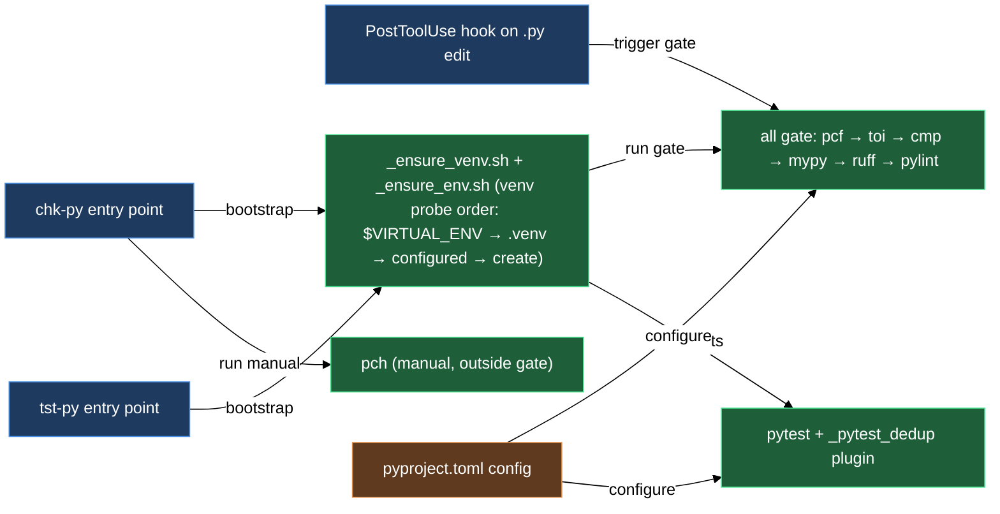

# Python checkers

`chk-py` and `tst-py` are the two commands you use every day in a project that has lazycortex-python installed. `chk-py` runs the style, type, and guideline pipeline — format rules, type-only import analysis, syntax checking, mypy, ruff, pylint, and a guideline review pass — against any path you point it at. `tst-py` runs pytest scoped to the module you name, or the whole `tests/` tree when you omit the argument. Both are thin wrappers in your project's `cli/` directory; they resolve the active lazycortex-python plugin at exec time rather than delegating to a path frozen at install time, so they keep working across plugin version updates without needing to be re-deployed. If a wrapper ever cannot find the plugin it prints a clear error directing you to re-run `/lazy-python.install`.

Behind both commands sits `_ensure_venv.sh`, a shared venv resolver that finds mypy, pylint, pytest, and ruff wherever they live in your project — an activated venv, a project-local `.venv/`, a path in `pyproject.toml`, or a fallback that creates and augments `.venv/` in the repo root — without requiring any environment setup beyond a plain terminal. Right after the venv is active, both wrappers also source `_ensure_env.sh`, an optional hook that loads your project's own environment-bootstrap script when one is on record, so checks and tests run with the same secrets/config your project normally needs.

## What's in this block

**`chk`** is the style, type, and guideline aggregator wrapper. You call it as `chk-py <subcommand> [path ...]`. The `all` subcommand runs seven checks in sequence — `pcf`, `toi`, `cmp`, `mypy`, `rf`, `pylint`, `review` — across every path you supply (defaulting to `.`). Each subcommand is also callable on its own, so `chk-py mypy src/` runs only mypy. The `-q` flag is accepted as a no-op for compatibility with the `lazy-python.style.md` verification-order mandate. `pch` is a separate standalone subcommand (`chk-py pch <file>`) that is NOT part of the `all` gate; it is also opt-in per repo via a `[tool.pch]` section in `pyproject.toml` — when that section is absent, `chk-py pch` prints a diagnostic and exits cleanly without affecting any other check.

**`pcf.py`** is the Python Code Format checker. It parses each `.py` file with the `ast` module and checks import block ordering (future → typing → stdlib → third-party → project → local → TYPE_CHECKING), blank-line rules between import blocks, required `from __future__ import annotations` and `if TYPE_CHECKING:` guards, docstring structure and banned phrases, line length, and code-level rules such as bare `assert` statements, magic literals, and purpose comments on code blocks. Configuration lives under `[tool.pcf]` in `pyproject.toml`; per-path overrides go in `[tool.pcf.overrides]`. `pcf.py` is also the tool the PostToolUse hook invokes on every `.py` edit — the hook passes the just-written file through `pcf.py` and surfaces any violations as `additionalContext` in the next turn so style errors appear inline rather than at commit time.

`check_block_comments` (on by default; set `check_block_comments = false` under `[tool.pcf]` to disable) requires that every code block inside a function or method body — any chunk of statements that follows a blank separator line, including branches nested inside `if`/`for`/`try`/`match` — opens with a comment on its first line. A `# waiver:`, `# noqa`, `# type:`, `# pylint:`, `# fmt:`, or `# noinspection` line does not count as a purpose comment; those exempt a checker rule, they don't state why the block exists. The body's opening statement is exempt (the docstring above it already carries the purpose), and a clause header (`elif`/`else`/`except`/`finally`/`case`) or a continuation line of a multi-line call never opens a block of its own. `pcf.py` only proves the comment is *present* — whether it actually says something, rather than restating the line below it, is judged by `chk-py review` (see below).

`pcf.py` also flags an `opt:`, `limit:`, or `Decision:` marker comment whose colon ends the line and carries no clause at all — `# opt:`, `# limit:`, or `# Decision:` with nothing after it. The whole value of each marker is the text after the colon: `opt:` states why a non-obvious implementation choice was made for performance, `limit:` names the ceiling of a deliberate simplification and the upgrade path past it, `Decision:` states the thesis of a recorded design fork (`chose X, not Y — why`, with overflow continuing on the following `#` lines and an optional `<asset-or-product path>#D-NNN` token linking to a decision record in the spec catalog). A marker that stops at the colon states none of them. As with block comments, `pcf.py` only proves the clause is *non-empty* — whether it names something real is `chk-py review`'s call, made by the `lazy-python.code-reviewer` agent. This check reads real comment tokens via the stdlib `tokenize` module, so the same text inside a string literal is not a marker, and inside a docstring it is a separate finding (the D7 marker-in-docstring check) rather than this one. The marker canon is `TODO:`, `TMP:`, `DBG:`, `ref:`, `opt:`, `guard:`, `limit:`, `Decision:`, `Contract:`, and `Domain(…):` — a marker's register encodes its category: CAPS markers (`TODO:`, `TMP:`, `DBG:`) are temporary and die before the work is done, Capitalized markers (`Domain(…):`, `Contract:`, `Decision:`) open standalone knowledge blocks, lowercase markers (`opt:`, `guard:`, `limit:`, `waiver:`, `ref:`) are one-line annotations. `REF:` renamed to `ref:` and `DOC(…):` renamed to `Domain(…):` to fold both into that lowercase/Capitalized split; `limit:` and `Decision:` are both covered by the D7 marker-in-docstring check the same way the rest of the set is.

`pcf.py` separately checks that every `# Contract:` marker is followed by guarantee text. `Contract:` marks caller-visible guarantees — the marker line itself carries no text (a bare `# Contract:`, nothing after the colon), and the guarantee lives on the `#` lines that follow it. A `# Contract:` with no comment line after it, or with an empty one, is flagged as carrying no guarantee. `Contract:` comments are the source of truth for a docstring's `Guarantees` section — nothing lands there without tracing back to either a `Contract:` comment or the public protocol. As with the other marker checks, `pcf.py` only proves the guarantee text is present — whether it names a real caller-visible invariant is `chk-py review`'s call.

`pcf.py` also checks that every block marker — `Domain(…):`, a bare `Contract:`, or `Decision:` — opens a standalone comment block. These Capitalized markers are not a comment to a code line: every `#` line adjacent to one is read as the block's own body, so `pcf.py` requires a blank line above the marker and a blank line after the block's last `#` line. A marker glued directly below a code line or below a foreign comment is flagged as glued to the line above; a block whose last body line runs straight into the code below it is flagged as touching the code below its body. `# Contract: see hook-writing rules` (text trailing the colon) is prose referencing a contract, not the marker, so it opens no block and is exempt from this check; a one-line `Decision:` marker is still a block and still needs blank-line separation on both sides. Like the other marker checks, this one only proves the shape — whether the block's content is worth keeping is the review phase's call.

As of the 2.0.0 release, three `[tool.pcf]` keys let your project register its own docstring conventions instead of only accepting the built-ins (`Responsibilities`, `Guarantees`, `Args`, `Attributes`, and the rest): `extra_docstring_sections` lets you declare a project-specific section by name, list style (`bulleted`, `definition`, or `plain`), and an `after`/`before` anchor that positions it relative to an existing section — add `ref_exempt = true` to shield the section's own `# ref:` lines from the phrasing and private-name checks, and a `definition`-style section is skipped by the private-name narrative scan the same way built-in definition sections (`Attributes`, `Args`, `Raises`) already are. `d2_exempt_marker_attrs` names class attributes whose declaration exempts that class from the private-label-in-`Attributes:` rule. `private_name_allowlist` names specific private identifiers (like `_my_filters`) that are allowed to appear in docstring narrative even outside an exempted section. All three default to empty — pcf ships with no built-in Generation Rules / Value Ranges / project-specific field-filter sections baked in, so a fresh install accepts only the stock sections until you register your own. Commented examples for all three live in the `[tool.pcf]` block of the shipped `pyproject.toml` template.

The magic-literal check's built-in trivial set — numeric values never flagged, currently `{-1, 0, 0.25, 0.5, 1, 2, 4}` — is a starting point, not the whole story. Two more `[tool.pcf]` keys extend it per project: `allowed_magic_numbers` and `allowed_magic_strings` each take a list of extra literal values that are merged onto (never replace) the built-in set, so a project with domain constants — angles like 45/90/180/270/360, or status strings like `ACTIVE`/`PENDING` — can register them once instead of waiving every occurrence.

**`toi.py`** is the type-only import analyzer. It walks the AST and distinguishes names used at runtime from names used only in type annotations. For each import that is annotation-only, it emits a `file:line: note:` suggestion to move it into the `if TYPE_CHECKING:` block. This keeps the runtime import footprint lean and avoids circular-import problems caused by type-only dependencies. Configuration is under `[tool.toi]` in `pyproject.toml`. `toi.py` also honours the same `# waiver: <reason>` comment convention as `pcf.py`, for the case where a runtime library actually resolves a name from its annotation (`inspect.signature(eval_str=True)`, `get_type_hints`, pydantic, FastMCP/FastAPI) and moving the import would break it: place the comment above or inline on the imported name to silence just that name, or above/inline on the `from x import (` header line to silence every name in the block. An empty-reason `# waiver:` marker never suppresses the finding — `-v`/`--verbose` reports both the count of waived findings and any empty-reason markers, flagged as invalid.

**`review.py`** is the guideline review phase — the seventh and final step of `chk-py all`. Unlike the other six checks, it does not run a deterministic tool against your code; deterministic checkers can only prove what an AST walk proves (import order, syntax, types, and now — via `pcf.py`'s `check_block_comments` — whether a purpose comment is present), and the project's other rules — whether a purpose comment actually states a purpose rather than restating the code below it, logical-block separation, naming semantics, your own overlay clauses — need a reader, not a parser. `chk-py review` resolves the scope (explicit paths, or your current working-tree diff plus untracked files when you pass none), collects every applicable guideline layer in precedence order — the canon reference guidelines, your `docs/guidelines/` overlay, any `.claude/rules/*.md` scoped to `.py`, and `CLAUDE.md` — and writes a manifest under `.runtime/lazy-python/review/`. It then prints the manifest path and names the `lazy-python.code-reviewer` agent to dispatch against it, and exits `2` (a distinct `PENDING` code) so a manifested-but-undecided review now fails `chk-py all` rather than passing silently. You (or the calling skill) run that agent, which writes a findings document; `chk-py review --render <findings.json>` prints those findings in the same `file:line: severity: message` shape as the other checkers and exits non-zero on a `FAIL`. Two escape hatches exist for callers that cannot dispatch an agent mid-run: `CHK_REVIEW=skip` opts a single invocation out of the phase entirely (prints `SKIPPED`, exits 0) — for nested writer agents and scripted sweeps that have no way to act on a pending review; `CHK_REVIEW=headless` has `review.py` dispatch the reviewer agent itself through the `claude -p` CLI and render its findings in the same run, for CI or automation contexts where the CLI is installed but no one is present to dispatch manually. Neither flag records an actual review decision — `skip` just defers it. A scope that has not changed since its last review reuses those findings instead of asking you to re-dispatch.

**`pch.py`** is the PyCharm offline inspection runner. It is opt-in per repo: `chk-py pch` only runs when `[tool.pch]` is present in `pyproject.toml`; without that section it prints a skip diagnostic and exits zero. When enabled, it locates `inspect.sh` (via `PYCHARM_HOME`, then known macOS paths), builds a sandbox config directory that symlinks your real PyCharm SDK and stubs while skipping exclusively-locked files, runs the inspection scoped to the path you supply, parses the XML results, filters them through `[tool.pch]` exclusions in `pyproject.toml`, and prints findings in the same `file:line: severity: description [inspection]` format as `pcf.py` and mypy. When PyCharm is not installed, the command prints a diagnostic and exits non-zero. Because `pch` is slow and depends on an optional external IDE, it is invoked manually rather than being part of the `all` gate. The install adds `[tool.pch]` to `pyproject.toml` automatically when PyCharm is present on the machine (and omits it otherwise — no prompt); if you install PyCharm later, add the section by hand to enable `pch` for the repo.

**`tst`** is the test runner aggregator wrapper. You call it as `tst-py [module]`. With no argument it runs `pytest -q tests/`; with a module name it runs `pytest -q tests/<module>/`. The `-q` flag is accepted as a no-op for compatibility. Pytest configuration lives under `[tool.pytest.ini_options]` in `pyproject.toml`. `tst-py` also always loads `_pytest_dedup.py` (via `pytest -p _pytest_dedup`) — it de-duplicates tests collected twice through re-export shims, keeping the first occurrence of each test and printing a one-line summary when it removes any; in a repo with no re-export shims it is a silent no-op.

**`_ensure_venv.sh`** is sourced by both `chk` and `tst` before invoking any tool. It resolves the project root via `git rev-parse --show-toplevel` (falling back to `$PWD` when git is unavailable), then tries four probes in order: (1) `$VIRTUAL_ENV` if it is set and contains mypy, pylint, pytest, ruff, pytest-clarity, and pytest-sugar; (2) `<project>/.venv/` if present and equipped with those tools; (3) the path in `[tool.lazy-python] venv` in `pyproject.toml`; (4) a fallback that creates or augments `.venv/` in the repo root using `uv`. The fallback never wipes an existing `.venv/` — if a project `.venv/` already exists but lacks the checker tools, `uv pip install` adds them in place without touching project dependencies. Once probe 4 creates `.venv/`, subsequent runs hit probe 2 and skip the fallback entirely. Using the git-derived root means the fallback always places `.venv/` at the repo root, even when you run `chk-py` from a subdirectory. `review` is the one subcommand that skips this resolver entirely — it is pure stdlib, by design, so the guideline-review phase also works from pre-commit and CI where no venv is set up.

## How they work together

`chk-py all` is the canonical gate you run before committing. It executes the seven-step pipeline in order: `pcf` (import, format, and block-comment rules), `toi` (type-only import suggestions), `cmp` (`py_compile` syntax check), `mypy` (type checking), `rf` (ruff lint), `pylint` (semantic lint), `review` (guideline review). Each step runs to completion before the next begins; if any step exits non-zero, the overall command exits non-zero — `review` included. A printed `review: PENDING` line means the gate now fails until you close it: dispatch the named `lazy-python.code-reviewer` agent against the printed manifest, then run `chk-py review --render <findings.json>` to get the real verdict, which exits non-zero on a `FAIL`. Set `CHK_REVIEW=skip` to opt a single run out of the phase when you genuinely cannot act on it in that context (nested writer agents, scripted sweeps), or `CHK_REVIEW=headless` to have `review.py` dispatch the reviewer agent itself via the `claude` CLI and render its findings without a manual step — useful for CI runners that have the CLI installed. Neither flag waives the review; `skip` only defers the decision.

`chk-py pch` is a separate, slower flow. Because PyCharm's offline inspection requires `inspect.sh` from a PyCharm installation and takes noticeably longer than the other checks, it is invoked on demand rather than as part of the `all` gate. It also requires an explicit `[tool.pch]` section in `pyproject.toml` to activate for your repo — without it the command skips cleanly. Run it when you want the depth of PyCharm's cross-file and semantic analysis, particularly for inspections that mypy and pylint do not cover.

Both `chk-py` and `tst-py` source `_ensure_venv.sh` before doing anything else, so they always run against the same Python environment. The resolver's probe order means an activated shell venv takes priority, the project `.venv/` is second, a `pyproject.toml`-configured path is third, and the fallback bootstrap is last — making the commands safe to call from any terminal, CI runner, or Claude skill without pre-activating an environment. Right after the venv resolves, both wrappers source `_ensure_env.sh` in the same shell — so if your project records `python.env_source`, every checker subcommand and every pytest run picks up that environment automatically, with no extra flag or manual sourcing on your part.

`tst-py` additionally loads `_pytest_dedup.py` on every run, so the dedup pass happens automatically alongside the venv and env resolution — you don't call it separately, and in a repo without re-export shims it makes no difference to the output.

The PostToolUse hook slots into this block at the `pcf` level: on every `.py` edit it runs `pcf.py` against the touched file (honoring the `[tool.pcf] exclude` list, so excluded paths are no-ops) and returns violations as `additionalContext`. This gives you format feedback inline after each write rather than only at the end of a session.

## Where this fits

The `install-and-audit` block is what puts `chk-py` and `tst-py` in your project's `cli/` directory. The wrappers are self-resolving: each time you run one, it locates the active lazycortex-python install (checking the dev source tree first, then the daemon-provided plugin-dirs env, then the Claude Code plugin manifest) rather than delegating to a path frozen at install time. This means the wrappers keep working across plugin version updates — the versioned cache dir changes on every `/plugin update`, but the wrapper finds the new location automatically. If the wrapper cannot locate the plugin — for example after an unusual cache clear — it prints `chk-py: cannot locate the lazycortex-python plugin` and directs you to re-run `/lazy-python.install`. The install also seeds the `[tool.pcf]`, `[tool.toi]`, and `[tool.ruff]` sections in `pyproject.toml` that these checkers read (plus `[tool.pch]` when PyCharm is present on the machine), and it is the same install step that records `python.env_source` when your repo ships an environment-bootstrap script. The `discipline` block documents the rules and guidelines that `pcf.py` enforces and that the writer agents consult when generating or reviewing code — the same canon and overlay layers `review.py` collects into its manifest.

## Common adjustments

**Excluding directories from pcf or toi.** Add paths to the `exclude` list under `[tool.pcf]` or `[tool.toi]` in `pyproject.toml`. The install wizard seeds these sections with defaults (`.venv`, `.claude`, `tests`, `~archive`, `~sandbox`); extend them for project-specific generated directories. When you explicitly target a directory that is normally excluded — `chk-py pcf tests/` — `pcf.py` drops that directory's exclusion entry so the scan runs as requested.

**Per-path pcf overrides.** Add entries to `[tool.pcf.overrides]` for subdirectories that need relaxed rules, for example `"tools" = { check_magic_literal = false }` or `"tests" = { check_assert = false }`. The last matching prefix wins.

**Registering a project-specific docstring section.** Add a `[[tool.pcf.extra_docstring_sections]]` table to `pyproject.toml` naming the section, its list style, and an `after`/`before` anchor, for example a `Field Semantics` bulleted section placed after `Guarantees`. Set `ref_exempt = true` if the section cites code via `# ref:` lines that should not trip the banned-phrase or private-name checks.

**Allowing a private name in docstring narrative.** Add the identifier to `private_name_allowlist` under `[tool.pcf]` in `pyproject.toml` (or name the class attribute that should exempt a whole class's `Attributes:` section in `d2_exempt_marker_attrs`). Both default to empty, so nothing is allowlisted until your project opts in.

**Widening the magic-literal allowlist.** Add values to `allowed_magic_numbers` or `allowed_magic_strings` under `[tool.pcf]` in `pyproject.toml` when a project has its own trivial constants — angle values, status-code strings, and the like — so `pcf.py` stops flagging them project-wide instead of you adding a `# waiver:` comment at every occurrence. Both lists merge onto the built-in trivial sets; they never replace them.

**Disabling the block-comment check.** Set `check_block_comments = false` under `[tool.pcf]` in `pyproject.toml` when a file or project intentionally skips the purpose-comment-on-every-block requirement. `chk-py review`'s comment-substance clause still judges whatever purpose comments are present in the code either way — this only turns off `pcf.py`'s presence gate, not the review-phase judgment call.

**Silencing a false type-only-import finding.** Add a `# waiver: <reason>` comment above or inline on the imported name (or on the `from x import (` header line to cover the whole block) when a runtime library actually resolves the name from its annotation — `inspect.signature(eval_str=True)`, `get_type_hints`, pydantic, and FastMCP/FastAPI are the common cases. `toi.py` requires a non-empty reason; an empty `# waiver:` marker is reported as invalid rather than silencing the finding.

**Banned docstring phrases.** The `banned_docstring_phrases` list under `[tool.pcf]` rejects any phrase appearing anywhere in a docstring body. Add project-specific phrases to the list directly in `pyproject.toml`.

**Enabling PyCharm inspections.** Ask the install wizard to add `[tool.pch]` during `/lazy-python.install`, or add the section to `pyproject.toml` manually. To suppress noisy inspections such as `"Spelling"`, `"Grammar"`, or `"Duplicated code fragment"`, add their names to the `ignore` list under `[tool.pch]`.

**Pointing to a specific venv.** Set `[tool.lazy-python] venv = "<path>"` in `pyproject.toml` to use a venv that is not at `.venv/` and not activated in the shell. Tilde expansion and relative paths (resolved against the project root) are both supported.

**Disabling the fallback bootstrap.** Set `[tool.lazy-python] bootstrap-fallback = false` in `pyproject.toml` when you want `chk-py` and `tst-py` to fail loudly rather than create a `.venv/` automatically. Useful in CI where the project venv is always pre-activated.

**Bootstrapping a repo-specific environment for checks and tests.** If your repo has its own environment script (`cli/env`, `.env.sh`, or `scripts/env.sh`) that exports secret paths or provider credentials, re-run `/lazy-python.install` — it detects the script and records it as `python.env_source`, so `chk-py` and `tst-py` source it automatically on every run. If more than one candidate script is present, the install skill asks you which one to use.

**Closing a pending guideline review.** `chk-py review` (or the `review` step inside `all`) exits `2` and prints a manifest path plus a dispatch directive whenever a scope has changed since its last review — this now fails `chk-py all`, not just `chk-py review` on its own. Dispatch the named `lazy-python.code-reviewer` agent against that manifest, then run `chk-py review --render <findings.json>` to print its findings and get the real pass/fail exit code — that render is what clears the gate. For a single invocation that has no way to dispatch an agent, set `CHK_REVIEW=skip` (exits 0, records no decision); for CI or scripted runs that have the `claude` CLI available, set `CHK_REVIEW=headless` to have `review.py` dispatch the reviewer agent itself and render its findings in the same run.

**Naming an `opt:`, `limit:`, or `Decision:` marker.** `pcf.py` only requires the colon to be followed by something — `# opt: batches writes to cut syscalls`, `# limit: global lock, per-account locks if throughput matters`, or `# Decision: dict over dataclass — the schema drifts with the config` all pass. A bare `# opt:`, `# limit:`, or `# Decision:` with nothing after the colon fails; the marker exists precisely to record the why, the ceiling, or the fork's thesis, and an empty one records none of them.

**Recording a `Contract:` guarantee.** Open the block with a bare `# Contract:` line (nothing after the colon), then state the guarantee on the `#` lines that follow it. `pcf.py` fails a `# Contract:` with no comment line after it, or with an empty one — the guarantee text is what a docstring's `Guarantees` section is allowed to trace back to.

**Separating a `Domain(…):`, `Contract:`, or `Decision:` block from surrounding code.** These Capitalized markers open a standalone comment block, not a comment to a code line: put a blank line above the marker and a blank line after the block's last `#` line, every time — including a one-line `Decision:`. `pcf.py` flags a marker glued to the code or a foreign comment above it, and a block whose body runs straight into the code below it.

## How the pieces connect

