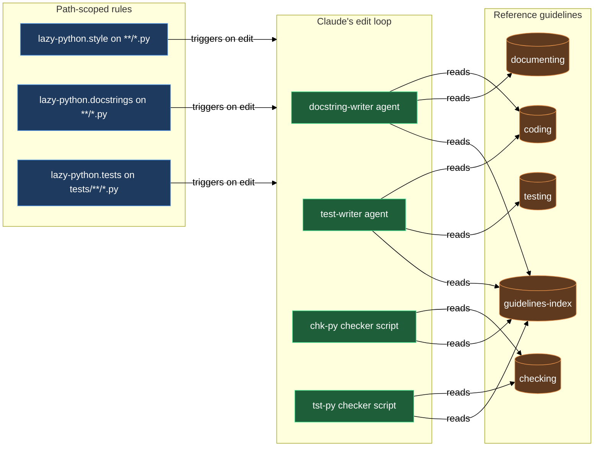

# Python coding discipline — rules and guidelines

The discipline block is the layer that makes every Python edit in your project consistent. It ships three rules that Claude Code loads automatically whenever it opens a `.py` file, and five reference guidelines that the `lazy-python.docstring-writer` agent, the `lazy-python.test-writer` agent, and the `chk-py` / `tst-py` checker scripts consult before doing their work. You do not invoke any of these members directly — they operate silently in the background, shaping what Claude writes and what the checkers accept.

The split between rules and guidelines is deliberate. Rules are short and always in context: they remind Claude of the highest-consequence style violations, direct it to the checker pipeline, and enforce the "use the agent, don't hand-write" discipline. Guidelines are long and loaded on demand: they carry the full canon with rationale, examples, and edge cases that would be too heavy to keep in context on every single edit.

## When you'd use this

- You want every Python file Claude touches to follow the same 2-space indentation, keyword-only `__init__` parameters, guard-clause comments, and waiver conventions — without repeating the instructions each session.
- You want docstrings written by an agent that has loaded the full documenting canon (section ordering, Zero-Tolerance Blockers, 8-point Pre-Return Self-Check) rather than from Claude's session memory.
- You want tests produced by an agent that has read the full testing canon (Paranoid Testing Strategy, base-class selection per the project overlay, assertion conventions) rather than guessing the project's shape.
- You want `chk-py` and `tst-py` to enforce the same rules that Claude used when writing the code, so checker runs are non-surprising.
- You want the verification order (per-file check → full-project check → tests) enforced automatically rather than having to remind Claude each time — including in projects that run their own test/check runner instead of the plugin wrappers.
- You want the docstring canon itself to stay project-neutral — no built-in assumptions about what extra sections or private-field exceptions your project needs — while still being able to add them through your own `pyproject.toml` declarations.
- You want Claude to catch itself before adding a parameter, flag, or branch to production code whose only reason to exist is to let a test bypass the real path.

## How it fits together

**`lazy-python.style`** loads on every `**/*.py` match and puts the highest-consequence style rules into Claude's active context: 2-space indentation, 117-character line limit, spaces around `=` in named arguments, spaces inside brackets, the `__init__` keyword-only rule, the ban on bare `type` and `Any`, the no-module-level-functions constraint, no local imports (all imports at module level, except deferred-import libraries per project settings), no `typing.cast()` (use `isinstance` and explicit narrowing instead), TypeAlias placement in module section 3 alongside TypeVars, `__init__` block separation when `super().__init__()` coexists with other code, no local aliases for simple property/attribute access, and the waiver comment convention. Every guard `if` requires a `# guard:` comment on the preceding line. When a `# noinspection` directive is required, it must be standalone — no text appended after the inspection name (PyCharm ignores it otherwise); put the explanation on a separate `#` line below. It also embeds the three-step Verification Order — `chk-py all <file>.py -q`, then `chk-py all -q`, then `tst-py <module> -q` — so the escalation sequence runs after every batch of edits. The `-q` flag is mandatory for any automated invocation; without it, desktop notifications fire and per-file output is too verbose for the context window. If a project rule or a `docs/guidelines/*.md` overlay declares its own test/check runner, that runner replaces `chk-py` / `tst-py` at every step of the Verification Order — the order and intent of the three steps stay the same, only the command differs. Finally, it hard-prohibits calling `mypy`, `pylint`, `ruff`, or `pytest` directly; everything goes through the `chk-py` / `tst-py` aggregators (or the project's declared runner, when one exists), which apply the full six-step pipeline (`pcf → toi → cmp → mypy → ruff → pylint`) in the correct order. (`pch` is a separate, slower manual step — `chk-py pch <file>` — not part of the `all` gate.) When Claude needs to go deeper than the reminders in this rule, it reads `lazy-python.coding-guidelines.md` for the full canon.

**`lazy-python.docstrings`** also loads on `**/*.py` and enforces a single hard constraint: never write docstrings manually — dispatch the `lazy-python.docstring-writer` agent instead. The rule explains why: the agent reads the full documenting canon plus the project overlay on every dispatch, and hand-writing from session memory reliably violates at least one of the eight Self-Check clauses. The rule also covers the most-forgotten inline conventions: opening and closing `"""` each on their own line, single backticks for inline code, no descriptions of internal algorithms, and preservation of `TODO:`, `TMP:`, `DBG:`, `REF:`, `opt:`, `guard:`, and `DOC(…)` markers. Formulas in `DOC(…)` line comments must use Obsidian-compatible LaTeX, not plain text. The full canon lives in `lazy-python.documenting-guidelines.md`.

**`lazy-python.tests`** loads only on `tests/**/*.py` — narrower scope because test discipline is only relevant when Claude is actually working inside the test tree. Its core mandate mirrors the docstrings rule: never write tests manually — dispatch the `lazy-python.test-writer` agent. It also carries the placement rules (test tree mirrors source tree), naming rules (`test_init`, `test_prop__<name>`, `test_feature__<variation>`, max 35 characters), and the ban on `setUp` / `tearDown` (pytest fixtures only). The base test class is intentionally not hardcoded in the plugin canon — the correct base class for each test type lives in your project's `docs/guidelines/testing_guidelines.md` overlay, and the `lazy-python.test-writer` agent reads that overlay on every dispatch. The rule also hard-prohibits modifying an existing test to fix a failing assertion — that is a code fix, not a test fix. The full canon lives in `lazy-python.testing-guidelines.md`.

**`lazy-python.coding-guidelines`** is the main reference, covering code formatting, blank-line rules, function signature wrapping, import ordering, naming conventions (classes, methods, variables, enums, TypeVars, TypeAliases), type annotations, class design, method and parameter design, error handling, magic literals, and the waiver comment system. The magic-literals auto-exempt sets (trivial numbers `-1`/`0`/`0.25`/`0.5`/`1`/`2`/`4`, trivial strings) extend rather than replace via `[tool.pcf] allowed_magic_numbers` / `allowed_magic_strings` in your `pyproject.toml` — declare domain constants such as angle values (`45`/`90`/`180`/`270`/`360`) once instead of wrapping them in an Enum every time. Its General Principles now include **No Test-Driven Production Surface**: production code must never grow a parameter, dual-path accessor, "test mode" flag, or extra indirection whose only consumer is a test — production design decides itself, and tests adapt to it (feeding data through the same loading path production uses, using fixtures and monkeypatch for test-only needs) rather than the other way around. Its Module Structure section reserves the module docstring for `__init__.py` files only — a regular `.py` file carries no module docstring at all; the canonical module order goes copyright header straight into imports. Claude reads this before making non-trivial code changes; `chk-py` enforces many of the same rules mechanically.

**`lazy-python.documenting-guidelines`** is the docstring canon: Zero-Tolerance Blockers (what must never appear), Preservation Rules (what must survive edits), section ordering and style for class, method, and property docstrings, DOC comments, Contract comments, and Marker comments (including a precise, exit-only definition of `guard:` — the `if` body must return, continue, break, raise, or exit; a branch or accumulation `if` gets a plain comment instead, never a `guard:` label that invents a skip the code doesn't perform). No LaTeX in docstrings — formulas go in `DOC(…)` line comments only, where Obsidian renders them. The canon is deliberately project-neutral: it does not ship any built-in project-specific docstring sections or private-field exceptions. Instead, the class-docstring section order carries a generic "Project-registered sections" clause — your project registers additional sections through `[tool.pcf] extra_docstring_sections` in its own `pyproject.toml` (section name, list style, and an order anchor naming a built-in or previously declared section, plus an optional `ref_exempt` flag for sections whose body carries `# REF:` lines), and the content rules for those sections live in your project overlay, not in the canon. The same project-neutral shape applies to the Attributes section's escape hatch for private fields or properties — shown only when your project declares `[tool.pcf] d2_exempt_marker_attrs` (and, for narrative mentions elsewhere in the docstring, `private_name_allowlist`). Without those declarations, private fields and properties never appear in Attributes and no extra sections are recognized. The `lazy-python.docstring-writer` agent reads this canon on every dispatch, plus your project overlay for the content of any registered sections and the exact names covered by the escape hatch.

**`lazy-python.testing-guidelines`** covers test directory structure, class inheritance (base class selected from the project overlay), test-class and test-method naming, the Paranoid Testing Strategy (7-category coverage), assert conventions, fixture patterns, and logging suppression in tests. The `lazy-python.test-writer` agent reads this on every dispatch.

**`lazy-python.checking-guidelines`** documents the tool chain — `ruff`, `mypy`, `pylint`, `pytest`, `py_compile`, and `toi` (type-only-import detection, which now honours the same `# waiver: <reason>` convention as `pcf` to silence false positives for names a runtime library resolves from annotations, e.g. `inspect.signature(eval_str = True)`, pydantic, or FastMCP/FastAPI schemas) — and the mandatory verification order. `chk-py` and `tst-py` implement this order; the rule in `lazy-python.style` surfaces a condensed version so Claude respects the sequence even before running a checker, including the project-runner precedence clause.

**`lazy-python.guidelines-index`** is the entry point that maps each concern ("writing code", "writing docstrings", "running tests", "running checks") to the correct reference file. If you extend or override the canon with a project overlay (`docs/guidelines/<topic>_guidelines.md`), the index is where to understand which file to modify and which agent reads it.

## Common adjustments

**Adding project-specific style rules.** The canon in `lazy-python.coding-guidelines.md` is the floor. Project-specific additions go in `docs/guidelines/coding_guidelines.md`. The writer agents and checkers read the overlay after the canon; overlay rules override on conflict. You create and maintain that file directly — it is not managed by a plugin skill.

**Registering a project-specific docstring section.** The canon doesn't assume your project needs any extra class-docstring sections. To add one — say a "Field Semantics" section your project wants on every configuration class — declare it under `[[tool.pcf.extra_docstring_sections]]` in `pyproject.toml` (the shipped template carries a commented-out example) with the section's `name`, `style` (`bulleted` / `definition` / `plain`), and an `after` / `before` order anchor naming a built-in or previously declared section. Then write the section's content rules into `docs/guidelines/documenting_guidelines.md` — the checker enforces only order, list style, and the optional `ref_exempt` shield, while `lazy-python.docstring-writer` follows your overlay's content rules for what actually goes inside it.

**Exempting a private field from the Attributes check.** By default, the canon excludes every private field and every `@property` from a class's Attributes section. If your project has a documented reason to show one anyway — for example, a well-known internal mapping that callers are expected to reference by name — declare it under `[tool.pcf] d2_exempt_marker_attrs` in `pyproject.toml` (and add it to `private_name_allowlist` if it should also be tolerated in narrative prose elsewhere in the docstring). Without that declaration the escape hatch stays disabled and private or property fields never appear in Attributes.

**Changing the base test class.** `lazy-python.testing-guidelines.md` deliberately does not hardcode a base test class name — it uses `<YourBaseTest>` as a placeholder. The project-specific base class convention lives in your `docs/guidelines/testing_guidelines.md` overlay. Dispatch `lazy-python.test-writer` after setting up that overlay and it will pick the correct base class for each test type.

**Suppressing a style violation.** When code is correct but a checker flags it, add `# waiver: <reason>` on the line above the exempted code. The reason is mandatory — a bare `# waiver:` is rejected. For PyCharm inspections, use `# noinspection InspectionName` on its own line, standalone, with the explanation on a separate `#` line below (appending text after the inspection name causes PyCharm to ignore the directive). The same `# waiver: <reason>` convention silences false positives from `toi` (type-only-import detection) — place it above the import line, or above/inline on a single name inside a multi-line `from x import (...)` block to scope the waiver to just that name. Never restructure working code to silence a tool; waivers are the intended mechanism.

**Allow-listing domain-specific magic literals.** When a numeric or string literal is genuinely conventional in your domain (angle constants `45`/`90`/`180`/`270`/`360`, a fixed sentinel string), declare it under `[tool.pcf] allowed_magic_numbers` / `allowed_magic_strings` in `pyproject.toml` instead of wrapping it in an Enum. The declaration extends the built-in trivial set — it never replaces it.

**Checking a single file quickly.** Run `chk-py all <file>.py -q`. For a module-wide change (more than three files in the same directory) run `chk-py all <module-dir>/ -q` instead. Always pass `-q` — without it, desktop notifications fire and per-file output is too verbose. Never run `mypy`, `pylint`, `ruff`, or `pytest` directly — the aggregator applies them in the correct order with shared config.

**Adapting the CLI wrapper names.** The reference guidelines use `chk-py` and `tst-py` as the canonical wrapper names — the names `/lazy-python.install` plants in your `cli/` directory. If you work in a repo where the wrappers were installed under different names (for example, a project that predates the plugin may have named them `./cli/chk` and `./cli/tst`), substitute those names wherever the guidelines say `chk-py` / `tst-py`. The underlying tool order and flags are the same.

**Using a project-declared runner instead of `chk-py`/`tst-py`.** When a project rule or a `docs/guidelines/*.md` overlay declares its own test/check runner, that runner takes precedence over `chk-py` / `tst-py` at every step of the Verification Order — Claude invokes the project's runner instead of the plugin wrappers. This is a stronger override than the wrapper-rename case above: the command itself changes, not just its name, but the three-step escalation (per-file → whole-project → tests) still applies in the same order.

**Where a module docstring belongs.** Only `__init__.py` files carry a module docstring — package summary, extended description, subpackage list, dependencies/dependents. A regular source file (anything the scaffold seeds from `python-template.py`) never gets one; the canon's Module Structure order starts with the copyright header and goes straight into imports. If you're touching a Python file that already has a stray module docstring at the top and it isn't `__init__.py`, that's drift from an earlier canon revision — the docstring belongs on the package's `__init__.py` instead, or should be removed if the content doesn't apply at the package level.

**Adding a parameter or branch "so tests can reach it".** That's the No Test-Driven Production Surface principle firing. Name the production caller that needs the new surface; if there isn't one, the change belongs in the test file (a fixture, a monkeypatch, test-local setup) instead of the class under test.

**Writing a `# guard:` comment on a non-exiting `if`.** The `guard:` marker is reserved for a true guard clause — an `if` whose body exits the current scope (`return`, `continue`, `break`, `raise`, or `sys.exit`). Cover the `if` body mentally: if control leaves the function or loop iteration, it's a guard. If the body instead assigns, appends, calls, or mutates and execution continues normally afterward, use a plain descriptive comment (or none) — never a `guard:` label that narrates a skip the code doesn't actually perform.

## How rules and guidelines connect

## See also

- [checkers](../checkers.md) — the `chk-py` and `tst-py` wrappers that implement the verification order this block describes
- [agents](../agents.md) — the `lazy-python.docstring-writer` and `lazy-python.test-writer` agents that this block's rules dispatch
- [overlay](../overlay.md) — how to extend or override the reference guidelines per-repo
- [scaffold](../scaffold.md) — the `python-template.py` / `init-template.py` skeletons that put the Module Structure rule (including the `__init__.py`-only docstring placement) into practice for every new file
