# Install and audit

Getting the lazycortex-python plugin working in a new repo is a two-verb operation: `/lazy-python.install` wires everything in, and `/lazy-python.audit` tells you whether it's all still healthy. Install is idempotent — you can re-run it after any plugin update without fear of overwriting your own work. Audit is read-only — it never changes anything, so it's safe to run at any time.

Both skills operate against the current working directory, so run them once per repo that adopts the plugin.

## When you'd use this

- You've just enabled `lazycortex-python@lazycortex` in your `~/.claude/settings.json` and need to wire it into an existing Python project.
- You've updated the plugin from the marketplace and want to refresh the rule mirrors and wrapper scripts in a consumer repo.
- Something feels off — checks aren't running, `chk-py` is missing, or a rule file looks wrong — and you want a read-only diagnosis before you fix anything.
- You're onboarding a new machine or a new team member to a repo that already has the plugin and need to confirm all 11 invariants hold.
- You're upgrading from a pre-2.0 install and need to know what changed in the `pyproject.toml` checker defaults.

## How it fits together

You start with `/lazy-python.install`. The install runs its steps in order, each targeting a different piece of the installation contract. Step 1 copies the three plugin rule files (`lazy-python.style.md`, `lazy-python.docstrings.md`, `lazy-python.tests.md`) byte-identical into your project's `.claude/rules/` — these are plugin-managed mirrors that Claude Code loads automatically, and you must not hand-edit them. Step 2 renders `chk-py` and `tst-py` wrapper scripts into your `cli/` directory and ensures `.venv/` is listed in your `.gitignore` (adding the line if absent). The wrappers are path-agnostic self-resolving scripts: they locate the active lazycortex-python plugin at exec time via Claude Code's install manifest, with dev-source and `$LAZYCORTEX_PLUGIN_DIRS` fallbacks — no absolute version-pinned path is baked in. Step 3 probes for PyCharm's `inspect.sh`, and step 4 merges the always-on checker sections (`[tool.pcf]`, `[tool.toi]`, `[tool.pytest]`, `[tool.mypy]`, `[tool.pylint]`, `[tool.ruff]`) into your `pyproject.toml` without touching sections you've already configured — consumer wins on every merge; `[tool.pch]` for PyCharm offline inspections is added automatically when PyCharm is present and omitted otherwise — no prompt. Step 5 scaffolds four overlay stub files under `docs/guidelines/` with canonical `# Project additions to <topic>` headers; existing files are left alone. Step 6 dispatches `lazy-core.scaffold-sync`, which copies both Python file templates — `python-template.py` for regular `**/*.py` files and `init-template.py` for `**/__init__.py` (the more specific glob wins, so a new package file gets the package-docstring skeleton and every other new file gets the plain one) — into `.claude/templates/python/` and upserts the matching entries in `lazy-core.scaffold.md` so new `.py` files start from the canonical skeleton. Step 7 records `python.env_source` in `.claude/lazy.settings.json` when your repo ships a recognised bootstrap script (`cli/env`, `.env.sh`, or `scripts/env.sh`) — `chk-py` / `tst-py` source that script after the venv activates, so a repo that pulls secrets or provider credentials from its own wrapper keeps working under the plugin runners. Zero or one candidate script is handled silently; if more than one is found, install asks once which one to use and records your choice — that disambiguation, plus a genuine File-sync conflict, are the only two prompts this install ever raises. A value already on record is never re-asked or overwritten. The install never touches your `CLAUDE.md` — the plugin rules load from `.claude/rules/` regardless. The PostToolUse hook that runs `pcf.py` on every `.py` edit is not an install step; it auto-registers from the plugin's `hooks/hooks.json` manifest the moment the plugin is enabled.

Once the install completes, `/lazy-python.audit` is the instrument you reach for to verify the result. It walks all 11 invariants in order: Check 1 confirms the three mirrored rules are byte-identical to the plugin canon. Check 2 confirms every `${CLAUDE_PLUGIN_ROOT}/references/...` path cited from a mirrored rule resolves to an existing file. Check 3 confirms the plugin tree on disk carries every required artifact — the manifest and overview, three rules, five references, six binaries, the PostToolUse hook script and its `hooks.json` manifest, the check-style skill, both authoring agents, and six templates (the `pyproject.toml` defaults, the `chk-py` / `tst-py` wrapper sources, `python-template.py`, `init-template.py`, and the scaffold manifest). Check 4 confirms both wrappers exist and are executable; a missing wrapper is `WARN`, and an unsubstituted placeholder in a wrapper from a previous install is `FAIL` (a sign the install was interrupted before rendering completed). Check 5 confirms the six always-on `pyproject.toml` checker sections are present (`pcf`, `toi`, `pytest`, `mypy`, `pylint`, `ruff`); `[tool.pch]` is optional (added only when PyCharm is present), so its absence is never a finding. Check 6 probes for `inspect.sh` (informational — its absence is always `WARN`, never `FAIL`). Check 7 confirms each of the four overlay files opens with the canonical header so writer agents can identify them. Check 8 confirms the scaffold registry entry for `python-template.py` is present in `lazy-core.scaffold.md`. Check 9 reports, informationally, whether a `lazy-python` pointer is in `CLAUDE.md` — never a finding, since install never writes one. Check 10 confirms the plugin ships a well-formed `hooks.json` declaring the PostToolUse hook. Check 11 probes the venv resolution chain (`$VIRTUAL_ENV` → `<repo>/.venv` → `[tool.lazy-python].venv` in pyproject → implicit fallback) and verifies that all four tools (`mypy`, `pylint`, `pytest`, `ruff`) plus the two pytest plugins (`pytest-clarity`, `pytest-sugar`) are available in whichever venv is found, or that the `uv`-driven fallback can bootstrap them on first `chk-py`. Nothing is modified. None of the 11 checks inspects `python.env_source` — recording it is an install-time convenience for repos with a bootstrap script, not a verified invariant. The final report shows `pass=<n> warn=<n> fail=<n>`.

The connection between them is intentionally simple: the fix for any `FAIL` or `WARN` from audit is to re-run install. Install is idempotent and always overwrites its own outputs, so a fresh run resets every check to green.

## Common adjustments

**Updating after a plugin version bump.** Re-run `/lazy-python.install` in each repo. The rule mirrors, wrapper scripts, and scaffold templates are overwritten with the new plugin versions. A bare `/plugin update lazycortex-python@lazycortex` refreshes the plugin templates on disk but does not redeploy the `cli/` wrappers — only `/lazy-python.install` does that. Your `pyproject.toml` custom sections are preserved — consumer wins on the merge.

**Docstring sections and field names are now project-neutral (2.0 migration).** Earlier versions of `pcf` shipped built-in "Generation Rules" / "Value Ranges" docstring sections and a hardcoded `_field_filters` escape hatch for private-name tolerance. As of 2.0, `pcf` ships with no project-specific sections or names baked in — every project declares its own via `[tool.pcf]` in `pyproject.toml`: `extra_docstring_sections` (a repeatable `[[tool.pcf.extra_docstring_sections]]` table with `name`, `style`, `after`/`before` anchor, and optional `ref_exempt`) for custom docstring sections, `d2_exempt_marker_attrs` for the D2 private-attribute escape hatch, and `private_name_allowlist` for the D9 private-identifier allowlist. If your repo relied on the old built-in sections or `_field_filters`, re-run `/lazy-python.install` to get the current `pyproject-defaults.toml` template — it ships all three fields as commented-out examples in `[tool.pcf]` — then uncomment and adapt them to your project's own section names and field names. Step 4's merge only appends missing sections; it never removes a section you've already customised, so this migration is opt-in per repo.

**PyCharm inspections (pch).** The install probes for PyCharm's `inspect.sh` and adds `[tool.pch]` to `pyproject.toml` automatically when PyCharm is present — no prompt. On a machine without PyCharm the section is omitted (pch is meaningless there); the rest of the checker stack runs regardless. If you install PyCharm later, re-run `/lazy-python.install` — it skips sections already present and adds the missing `[tool.pch]` now that PyCharm is detected.

**Overlay guidelines.** After install, open the four stub files under `docs/guidelines/` and add your project-specific rules. Writer agents read canon first, then the overlay; the `# Project additions to <topic>` header must be preserved so agents recognise the file as an overlay rather than the canon. If audit's Check 7 reports `WARN` or `FAIL` on an overlay header, you can restore the header by hand — it's a single-line edit to the consumer file, and it's the one field the overlay check reads.

**PyCharm `inspect.sh` not found.** Check 6 and install Step 3 both probe for this script and report `WARN` when it's missing; the rest of the checker stack (`pcf`, `toi`, `mypy`, `pylint`, `ruff`, `pytest`) is unaffected. If you want `pch.py` to work, install PyCharm and ensure its `bin/inspect.sh` is on your `$PATH`.

**Venv.** Check 11 probes `$VIRTUAL_ENV`, then `<repo>/.venv`, then `[tool.lazy-python].venv` in `pyproject.toml`, then falls back to an implicit bootstrap via `uv`. If Check 11 reports `WARN` and you have a venv that's missing some tools, activate it and run `chk-py` once — `_ensure_venv.sh` augments the existing venv in place rather than replacing it. A `WARN` from Check 11 never blocks the rest of the checker stack; it only means the bootstrap hasn't run yet.

**`python.env_source` disambiguation.** If your repo ships more than one recognised bootstrap script (`cli/env`, `.env.sh`, `scripts/env.sh`), `/lazy-python.install` asks once which one `chk-py` / `tst-py` should source after the venv activates, then records the choice as `python.env_source` in `.claude/lazy.settings.json` — this and a genuine File-sync conflict are the only two prompts install ever raises. A repo with zero or one candidate is handled silently and nothing is asked. Once a value is on record, re-running install never re-asks or overwrites it, and no audit check inspects the recorded value.

**New `.py` files start from the right skeleton.** Step 6 syncs two scaffold templates, not one: a plain `python-template.py` for regular files and a dedicated `init-template.py` for `**/__init__.py` (the package-docstring lives there now, not on every file). `lazy-core.scaffold` picks the more specific glob, so Claude starts a new `__init__.py` from the package skeleton and everything else from the plain one automatically — nothing to configure.

**Plugin not found.** If install aborts with a "plugin source not found" message, `${CLAUDE_PLUGIN_ROOT}` is unset or points at an incomplete tree. Confirm the plugin is enabled in `~/.claude/settings.json` and restart Claude Code, then re-run.

## How install and audit relate

```mermaid
%%{init: {'themeVariables':{'background':'transparent','lineColor':'#000','textColor':'#000','edgeLabelBackground':'#fff'},'themeCSS':'.edgeLabel{background-color:transparent!important}.edgeLabel p{background-color:transparent!important}','flowchart':{'diagramPadding':5,'useMaxWidth':true}}}%%
flowchart LR
  userInvokesInstall[User runs /lazy-python.install]
  mirrorAndDeploy[Mirror rules, deploy wrappers]
  detectPycharm{PyCharm present?}
  bootstrapPyproject[Bootstrap pyproject]
  scaffoldAndSync[Scaffold overlays, sync templates - python-template.py, init-template.py]
  recordEnvSource{Multiple bootstrap candidates?}
  installState[Verified install state]
  userInvokesAudit[User runs /lazy-python.audit]
  walkChecks[Walk read-only checks]
  auditOutcome{Check outcome}
  auditReport[Audit report]
  rerunInstall[Re-run install]

  userInvokesInstall -->|runs install steps| mirrorAndDeploy
  mirrorAndDeploy -->|next| detectPycharm
  detectPycharm -->|pycharm found| bootstrapPyproject
  detectPycharm -->|no pycharm| bootstrapPyproject
  bootstrapPyproject -->|pch auto when applicable| scaffoldAndSync
  scaffoldAndSync -->|record env source| recordEnvSource
  recordEnvSource -->|single candidate| installState
  recordEnvSource -->|disambiguate| installState
  installState -->|triggers| userInvokesAudit
  userInvokesAudit -->|walks install state| walkChecks
  walkChecks -->|evaluate| auditOutcome
  auditOutcome -->|PASS or INFO| auditReport
  auditOutcome -->|WARN| auditReport
  auditOutcome -->|FAIL| rerunInstall
  rerunInstall -->|fixes FAIL| userInvokesInstall

  classDef entry fill:#1e3a5f,stroke:#4a90e2,color:#fff
  classDef guard fill:#5f4a1e,stroke:#e2a14a,color:#fff
  classDef action fill:#1e5f3a,stroke:#4ae290,color:#fff
  classDef success fill:#0d4d2a,stroke:#4ae290,color:#fff,stroke-width:2px
  classDef error fill:#5f1e1e,stroke:#e24a4a,color:#fff,stroke-width:2px

  class userInvokesInstall entry
  class mirrorAndDeploy action
  class detectPycharm guard
  class bootstrapPyproject action
  class scaffoldAndSync action
  class recordEnvSource guard
  class installState success
  class userInvokesAudit entry
  class walkChecks action
  class auditOutcome guard
  class auditReport success
  class rerunInstall error
```

## See also

- **discipline** — the three rules and five reference guidelines that install puts in place and audit verifies.
- **checkers** — the `chk-py` and `tst-py` wrappers that Step 2 deploys, and the `python.env_source` script they source after the venv activates.
- **hook** — the PostToolUse hook that auto-registers from the plugin manifest; audit Check 10 verifies its manifest is well-formed.
</content>
