# Python file scaffold

Every Python file Claude composes starts from the same canonical skeleton rather than from the model's session memory. The scaffold block ships two artifacts — a template file and a manifest — that `/lazy-python.install` copies into your project during Step 6 and registers with `lazy-core.scaffold`. From that point on, any new `*.py` file Claude creates begins from the project-local copy of the template, with the correct import order, `TYPE_CHECKING` guard, docstring placeholders, and the `from __future__ import annotations` import already in place.

## What's in this block

**`python-template.py`** is the canonical module skeleton. It encodes the conventions from `lazy-python.coding-guidelines.md` sections "Module Structure" and "Import Organization" directly into a starting shape: a module-level docstring with summary and optional extended-description placeholders, a `from __future__ import annotations` declaration, the six import blocks in canonical order (future, typing, stdlib, third-party, local project, and the `TYPE_CHECKING`-guarded block for deferred annotations), a comment slot for module-level constants and TypeVars, and a separator-commented example class stub. The authoring note at the top of the template instructs Claude to replace all placeholder markers and strip the scaffolding docstring before adding real content.

**`scaffold.entries.json`** is the manifest that tells `lazy-core.scaffold-sync` exactly what to install and how. It declares one entry under a `templates` key: the consumer-local destination path (`.claude/templates/python/python-template.py`) mapped to the glob `**/*.py`. When `/lazy-python.install` Step 6 dispatches `lazy-core.scaffold-sync`, the sync skill reads this manifest, copies `python-template.py` to that consumer-local path, and upserts a `lazycortex-python` registry key in the project's `lazy-core.scaffold.md` rule — so the scaffold rule fires on every new `.py` file you compose.

## How they work together

The two members are a template-and-manifest pair that do nothing in isolation inside the plugin but become active once they land in your project. When you run `/lazy-python.install`, Step 6 dispatches `lazy-core.scaffold-sync` with the plugin's install path and the detected scope. The sync skill reads `scaffold.entries.json` to discover what to install, copies `python-template.py` into `.claude/templates/python/` in your project, and upserts the glob-to-template mapping in your local `lazy-core.scaffold.md` rule under the `lazycortex-python` key. The `_local` key and any existing `lazycortex-core` key in your scaffold rule stay byte-for-byte unchanged — the upsert is surgical.

After the install, the scaffold rule is live. The next time Claude composes any new `.py` file in your project, `lazy-core.scaffold` matches the `**/*.py` glob against the consumer-local template and starts from it. This means the import order, the `from __future__ import annotations` line, the `TYPE_CHECKING` guard, and the example class shape are all in place before a single line of real code is written. Claude's task becomes filling in the blanks rather than reconstructing conventions from memory.

If the plugin updates and the template changes, re-running `/lazy-python.install` runs Step 6 again. The sync skill detects whether the consumer-local copy has diverged from the plugin copy. If your project has not edited the template it reports `updated`; if your project has customised it, it reports `kept-local` and leaves your version in place.

## Common adjustments

The consumer-local copy at `.claude/templates/python/python-template.py` is yours to customise after install. The sync skill reports it as `kept-local` on subsequent installs when it detects a difference — your customisations are not overwritten. Use this to add project-specific header comments, swap the example class for a base class from your own codebase, or extend the import stubs.

The `**/*.py` glob that the scaffold rule registers is intentionally broad. If you want the template applied only in a subtree (e.g. `src/**/*.py`), adjust the glob in your project's `lazy-core.scaffold.md` under the `lazycortex-python` key after install. That key is yours once written; subsequent `lazy-core.scaffold-sync` runs will not overwrite it unless you explicitly re-run the sync.

## How the template reaches your project

```mermaid
%%{init: {'themeVariables':{'background':'transparent','lineColor':'#000','textColor':'#000','edgeLabelBackground':'#fff'},'themeCSS':'.edgeLabel{background-color:transparent!important}.edgeLabel p{background-color:transparent!important}','flowchart':{'diagramPadding':5,'useMaxWidth':true}}}%%
flowchart LR
  pluginShipsTemplate[python-template.py ships in plugin]
  pluginShipsEntries[scaffold.entries.json ships in plugin]
  scaffoldSyncRuns{scaffold-sync invoked?}
  copyTemplateToDotClaude[lazy-core.scaffold-sync copies template to .claude/templates/python/]
  updateEntriesInConsumer[lazy-core.scaffold-sync registers entry in consumer scaffold registry]
  newPyFileCreated{New *.py file created in consumer?}
  ruleMatchesFile[lazy-core.scaffold rule matches file against consumer-local copy]
  agentReadsTemplate[Agent reads .claude/templates/python/python-template.py]
  scaffoldApplied[Scaffold applied to new file]

  pluginShipsTemplate -->|provides| scaffoldSyncRuns
  pluginShipsEntries -->|provides| scaffoldSyncRuns
  scaffoldSyncRuns -->|yes| copyTemplateToDotClaude
  scaffoldSyncRuns -->|no - skip| newPyFileCreated
  copyTemplateToDotClaude -->|writes| updateEntriesInConsumer
  updateEntriesInConsumer -->|ready| newPyFileCreated
  newPyFileCreated -->|yes| ruleMatchesFile
  newPyFileCreated -->|no - idle| agentReadsTemplate
  ruleMatchesFile -->|resolves| agentReadsTemplate
  agentReadsTemplate -->|loads| scaffoldApplied

  classDef entry fill:#1e3a5f,stroke:#4a90e2,color:#fff
  classDef guard fill:#5f4a1e,stroke:#e2a14a,color:#fff
  classDef action fill:#1e5f3a,stroke:#4ae290,color:#fff
  classDef success fill:#0d4d2a,stroke:#4ae290,color:#fff,stroke-width:2px

  class pluginShipsTemplate entry
  class pluginShipsEntries entry
  class scaffoldSyncRuns guard
  class newPyFileCreated guard
  class copyTemplateToDotClaude action
  class updateEntriesInConsumer action
  class ruleMatchesFile action
  class agentReadsTemplate action
  class scaffoldApplied success
```

