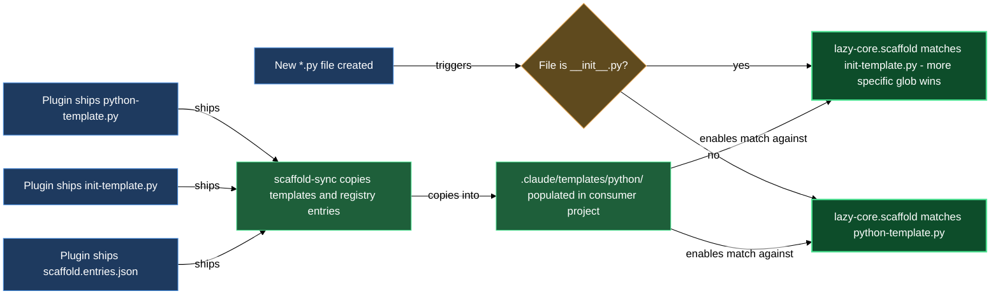

# Python file scaffold

Every Python file Claude composes starts from the same canonical skeleton rather than from the model's session memory. The scaffold block ships two template files and a manifest that `/lazy-python.install` copies into your project during Step 6 and registers with `lazy-core.scaffold`. From that point on, any new `*.py` file Claude creates begins from the project-local copy of the matching template — a regular module gets the correct import order, `TYPE_CHECKING` guard, and docstring placeholders with no module docstring, while a new `__init__.py` gets the package-docstring shape instead. The scaffold rule always picks the more specific template when both globs could match.

## What's in this block

**`python-template.py`** is the canonical module skeleton for regular source files. It encodes the conventions from `lazy-python.coding-guidelines.md` sections "Module Structure" and "Import Organization" directly into a starting shape: a `from __future__ import annotations` declaration, the import blocks in canonical order (typing, stdlib, third-party, local project, and the `TYPE_CHECKING`-guarded block for deferred annotations), a comment slot for module-level constants and TypeVars, and a separator-commented example class stub. It carries no module-level docstring — per the canon, module docstrings belong to `__init__.py` only. The authoring note at the top of the template instructs Claude to replace all placeholder markers and strip the scaffolding comment before adding real content.

**`init-template.py`** is the dedicated skeleton for `__init__.py` files. It encodes the canon's `__init__.py` File Patterns section: a module-level package docstring with a one-sentence summary, an optional extended description, a `Subpackages:` list, and `Dependencies:` / `Dependents:` sections — each omitted entirely when empty — followed by `from __future__ import annotations` and the `from .submodule import *` wildcard-export pattern that must lead the import block. This template is new in this release; before it existed, every new `.py` file (including `__init__.py`) scaffolded from `python-template.py`, which never carried a docstring slot.

**`scaffold.entries.json`** is the manifest that tells `lazy-core.scaffold-sync` exactly what to install and how. It declares two entries under a `templates` key: `.claude/templates/python/python-template.py` mapped to the glob `**/*.py`, and `.claude/templates/python/init-template.py` mapped to the more specific glob `**/__init__.py`. When `/lazy-python.install` Step 6 dispatches `lazy-core.scaffold-sync`, the sync skill reads this manifest, copies both templates to their consumer-local paths, and upserts a `lazycortex-python` registry key in the project's `lazy-core.scaffold.md` rule — so the scaffold rule fires on every new `.py` file you compose and resolves to the right template.

## How they work together

The three members are a template-pair-and-manifest set that do nothing in isolation inside the plugin but become active once they land in your project. When you run `/lazy-python.install`, Step 6 dispatches `lazy-core.scaffold-sync` with the plugin's install path and the detected scope. The sync skill reads `scaffold.entries.json` to discover what to install, copies `python-template.py` and `init-template.py` into `.claude/templates/python/` in your project, and upserts the glob-to-template mapping in your local `lazy-core.scaffold.md` rule under the `lazycortex-python` key. The `_local` key and any existing `lazycortex-core` key in your scaffold rule stay byte-for-byte unchanged — the upsert is surgical.

After the install, the scaffold rule is live and matches on two globs at once. The next time Claude composes any new `.py` file in your project, `lazy-core.scaffold` checks the filename first: an `__init__.py` matches the more specific `**/__init__.py` glob and starts from `init-template.py`, picking up the package-docstring shape; every other new `.py` file matches the broader `**/*.py` glob and starts from `python-template.py`, with no module docstring. Either way the import order, the `from __future__ import annotations` line, and the file's canonical shape are in place before a single line of real code is written. Claude's task becomes filling in the blanks rather than reconstructing conventions from memory.

If the plugin updates and a template changes, re-running `/lazy-python.install` runs Step 6 again. The sync skill checks each consumer-local copy independently: if your project has not edited a given template it reports `updated`; if your project has customised it, it reports `kept-local` and leaves your version in place.

## Common adjustments

Both consumer-local copies — `.claude/templates/python/python-template.py` and `.claude/templates/python/init-template.py` — are yours to customise after install. The sync skill reports each as `kept-local` on subsequent installs when it detects a difference, so your customisations are not overwritten. Use this to add project-specific header comments, swap the example class for a base class from your own codebase, or adjust the package-docstring sections `init-template.py` expects.

The globs the scaffold rule registers are intentionally broad (`**/*.py` and `**/__init__.py`). If you want a template applied only in a subtree (e.g. `src/**/*.py`), adjust the corresponding glob in your project's `lazy-core.scaffold.md` under the `lazycortex-python` key after install. That key is yours once written; subsequent `lazy-core.scaffold-sync` runs will not overwrite it unless you explicitly re-run the sync.

## How the templates reach your project

