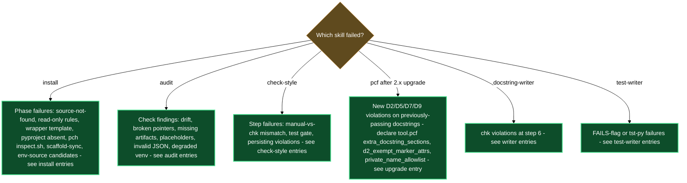

# Troubleshooting

## `/lazy-python.install` stops immediately: "plugin source not found"

**Symptom**: Running `/lazy-python.install` aborts at the very first phase with a message that `${CLAUDE_PLUGIN_ROOT}` is unset or contains no `rules/lazy-python.*.md` files.

**Likely cause**: The `lazycortex-python` plugin is not installed or not enabled in `~/.claude/settings.json`, so Claude Code never set `CLAUDE_PLUGIN_ROOT` for it.

**Fix**: Confirm `lazycortex-python@lazycortex` appears under `enabledPlugins` in `~/.claude/settings.json` and that the marketplace entry for `lazycortex` is present. Restart Claude Code after saving, then re-run `/lazy-python.install`.

---

## `/lazy-python.install` Step 1 fails: rule file is read-only

**Symptom**: Phase 1 of the install exits with a permission error when trying to write one of the three mirrored rule files under `.claude/rules/`.

**Likely cause**: A previous session or version-control operation left a `lazy-python.*.md` rule file with no write permission. The mirror step always overwrites, so a locked file blocks it.

**Fix**: Unlock the affected file (`chmod u+w .claude/rules/lazy-python.<name>.md`) and re-run `/lazy-python.install`. The mirror is intentionally clobbered — do not hand-edit the file after unlocking; the install will write the correct canon content.

---

## `/lazy-python.install` Step 2 fails: wrapper template missing

**Symptom**: Phase 2 cannot find `chk-wrapper.sh` or `tst-wrapper.sh` under the plugin's `templates/` directory, leaving `cli/chk-py` and `cli/tst-py` undeployed.

**Likely cause**: The local plugin cache is incomplete — the templates directory was not fully synced when the plugin was installed or last updated.

**Fix**: Run `/plugin update lazycortex-python@lazycortex` to restore the full plugin cache, then re-run `/lazy-python.install`.

---

## `chk-py` or `tst-py` cannot locate the lazycortex-python plugin

**Symptom**: Running `chk-py` or `tst-py` from the terminal (or via `/lazy-python.check-style`) fails immediately with a message like "cannot locate the lazycortex-python plugin" — even though the wrappers are present in `cli/`.

**Likely cause**: The wrappers deployed in `cli/` contain absolute paths to the plugin's binaries that were resolved at install time. After a plugin version bump, those paths point at a now-superseded cache directory. A `/plugin update` refreshes the plugin's templates but does not redeploy the per-repo `cli/` wrappers — that step requires re-running `/lazy-python.install`. The same symptom can appear if the plugin is uninstalled or disabled between the original install and the current session.

**Fix**: Ensure `lazycortex-python@lazycortex` is installed and enabled, then re-run `/lazy-python.install`. Phase 2 redeploys both wrappers with paths that resolve against the current plugin cache, making them operational again.

---

## `pyproject.toml` is absent and checker sections never merged

**Symptom**: `/lazy-python.install` completes but the six always-on checker sections (`[tool.pcf]`, `[tool.toi]`, `[tool.pytest]`, `[tool.mypy]`, `[tool.pylint]`, `[tool.ruff]`) are missing when you run `/lazy-python.audit` (`[tool.pch]` is separate — added only when PyCharm is present, never a finding). The audit reports `check5 FAIL` (three or more sections missing, or `pyproject.toml` not found).

**Likely cause**: The project has no `pyproject.toml` at the repo root. Phase 3 merges into the existing file; it does not create one from scratch.

**Fix**: Create a minimal `pyproject.toml` at the repo root (a `[build-system]` section is enough to start), then re-run `/lazy-python.install`. Phase 3 will append all missing sections.

---

## After upgrading to lazycortex-python 2.x, `pcf` flags docstring sections that used to pass

**Symptom**: A repo that was clean under `chk-py` before the upgrade now reports new `D2`, `D5`, `D7`, or `D9` violations on docstrings nobody touched — private-attribute labels in `Attributes:` sections, unrecognized custom sections, or private-name references in prose that were previously tolerated.

**Likely cause**: `pcf`'s docstring rules used to bake in one project's own conventions (custom section names like Generation Rules / Value Ranges, an implicit private-attribute escape hatch for `_field_filters`-style markers) as hardcoded defaults. As of 2.0.0, those defaults are gone — `pcf` ships project-neutral, and any project that relied on the old built-in behavior sees it as a fresh set of violations until the project declares its own equivalents.

**Fix**: Add the missing declarations under `[tool.pcf]` in `pyproject.toml` (this section is consumer-owned config — `/lazy-python.install` only merges in missing keys, it never overwrites values you set):

- `extra_docstring_sections` — register any custom docstring section your project used to rely on (name, list style, and an `after`/`before` order anchor).
- `d2_exempt_marker_attrs` — class attribute names whose presence exempts a class from the private-attribute check in `Attributes:` (`D2`).
- `private_name_allowlist` — private identifiers your project's docstrings are allowed to reference by name in prose (`D9`).

Re-run `chk-py all -q` after saving; the newly-declared config keys restore the previous pass/fail boundary for your project without reintroducing project-specific behavior into the plugin's shipped defaults.

---

## After the marker-register-scheme upgrade, `chk-py` flags markers that used to pass

**Symptom**: Code carrying `# DOC(group):`, `# REF:`, or `# Contract!` markers that passed `pcf` before the 3.0.0 upgrade now fails — `pcf` either reports the old marker spelling as unrecognized text, or reports a block marker as "glued to the line above" / "touches the code below its body" even though the marker itself is unchanged.

**Likely cause**: 3.0.0 renamed three marker forms as part of a register scheme where a marker's capitalization now encodes its category: CAPS markers (`TODO:`, `TMP:`, `DBG:`) stay temporary annotations, Capitalized markers (`Domain(…):`, `Contract:`, `Decision:`) open standalone knowledge blocks, and lowercase markers (`opt:`, `guard:`, `limit:`, `waiver:`, `ref:`) are one-line annotations. `DOC(group):` is renamed to `Domain(group):`, `REF:` is renamed to lowercase `ref:`, and `Contract!` is renamed to `Contract:` (a colon, no bang) so it shares the Capitalized register with `Decision:`. `pcf` also gained a new structural check alongside the renames: a block marker (`Domain(…):`, `Contract:`, `Decision:`) must now be a standalone block — separated from the code above it and from the code below its body by a blank line — because every `#` line adjacent to the marker is read as part of the block's own text, never as a comment glued to a statement.

**Fix**: Rename every `DOC(group):` to `Domain(group):`, every `REF:` to lowercase `ref:`, and every `Contract!` to `Contract:` across your project's Python source — this is a mechanical rename; the marker's meaning and placement rules are otherwise unchanged. Then check every `Domain(…):`, `Contract:`, and `Decision:` block has a blank line both above it and after its last body line — glue a block onto a `def`/class line or a preceding comment and `pcf` now reports it. If your project registered `[tool.pcf] extra_docstring_sections` with `ref_exempt = true`, the exemption now covers `# ref:` lines (lowercase) rather than `# REF:` — no config change needed, just the marker rename. Re-run `chk-py all -q` after the renames and re-spacing; the checks that passed under the old spellings resolve once the text and layout match the new register.

---

## `pcf` suddenly flags comments or docstrings as written in the wrong language

**Symptom**: A file that always passed `chk-py all` (or the PostToolUse hook) now reports a new finding — something like `comment is not written in a configured language -- 'т' is CYRILLIC, allowed: english (add '# waiver: <reason>' to exempt)` (or `docstring` in place of `comment`) — on prose nobody thought was a violation.

**Likely cause**: `pcf` gained a `check_language` check. `[tool.pcf] allowed_languages` (default `["english"]`) declares which natural languages a project's comments and docstrings may use; a letter is admitted by the unicode script its language maps to (Latin covers every Latin-alphabet language, Cyrillic covers Russian and Ukrainian, and so on), so any prose written in a script outside the configured set is a finding — one per offending line, naming only the first offending letter. String literals are exempt (a quoted foreign word is data the code handles, not prose a reader follows); only real comments and docstrings are scanned. This backs the plugin's own Source Language norm: comments, docstrings, and knowledge-marker blocks (`Domain(…):`, `Contract:`) are meant to stay English regardless of the project's own configured language — translation, when a project needs one, happens only where a document is generated from them (the wiki plugin's domain-spec writer), never in the source.

**Fix**: Translate the flagged comment or docstring text into English. If the project genuinely needs another language admitted project-wide (e.g. a codebase whose whole team writes comments in Russian), declare it explicitly: `[tool.pcf] allowed_languages = ["english", "russian"]`. A one-off exception — a deliberately foreign proper noun or quoted phrase inside otherwise-English prose — gets a `# waiver: <reason>` on the line above instead of widening the project-wide list. Re-run `chk-py all -q` to confirm the finding cleared.

---

## `pcf` misclassifies the project's own imports as third-party (or vice versa) after upgrading

**Symptom**: Import-ordering findings from `pcf` change shape after a plugin upgrade with no import changes on your part — either your own package's imports start being sorted as third-party instead of first-party, or a parent-import violation that used to be caught stops firing at all.

**Likely cause**: `pcf` used to classify "first-party" imports against a hardcoded package name. It now resolves `[tool.pcf] project_package` if the project set it, otherwise autodetects it by scanning the project root and `src/` for a single top-level directory carrying `__init__.py` (skipping hidden directories, virtualenvs, caches, and `tests/`). Autodetection only resolves when exactly one candidate is found — a `src/`-layout repo that also carries a top-level tooling or namespace package at the root, or a monorepo with more than one top-level package, autodetects to nothing, which silently disables both project-import classification and the parent-import check.

**Fix**: Declare the package explicitly in `pyproject.toml`: `[tool.pcf] project_package = "<your_package_name>"`. An explicit value always wins over autodetection, so a layout that can never resolve to exactly one candidate on its own still gets correct classification. Re-run `chk-py all -q` to confirm import findings are back to the expected shape.

---

## `chk-py pch` always skips: PyCharm `inspect.sh` not found

**Symptom**: Running `chk-py pch <file>.py` exits immediately with a message that `inspect.sh` was not found. `/lazy-python.audit` reports `check6 WARN`.

**Likely cause**: PyCharm is not installed, or its `inspect.sh` script is not on `$PATH`. The `pch` component of the aggregator depends on this script to run PyCharm's offline inspections.

**Fix**: The rest of the checker stack (`pcf`, `toi`, `mypy`, `pylint`, `pytest`, `ruff`, `review`) is unaffected. Install PyCharm and ensure its `bin/inspect.sh` is on `$PATH` if full `pch` coverage is needed. Until then, `check6 WARN` is expected and safe to ignore.

---

## `/lazy-python.install` Step 6 scaffold-sync fails or skips

**Symptom**: After install, `cli/chk-py` and the rules are in place, but new `*.py` files are not being matched to the Python scaffold template by `lazy-core.scaffold`. The audit's `check8` reports `WARN` (scaffold registry entry absent).

**Likely cause**: Phase 6 dispatches `lazy-core.scaffold-sync`. If `lazycortex-core` is not installed or its `scaffold-sync` skill is not reachable, the registry entry in `.claude/rules/lazy-core.scaffold.md` is never written.

**Fix**: Verify `lazycortex-core` is installed and enabled, then re-run `/lazy-python.install`. Phase 6 will retry the `scaffold-sync` dispatch and upsert the `python-template.py` entry.

---

## `chk-py` / `tst-py` seem to run against the wrong Python or environment

**Symptom**: Style, type, or test runs behave as though a different environment is active than expected — for example `mypy` / `pylint` report against packages that don't match what's installed in the repo's own `.venv`, or a secret / credential from an unrelated bootstrap script shows up during a run.

**Likely cause**: Two resolvers run back-to-back before every `chk-py` / `tst-py` invocation. `_ensure_venv.sh` picks the Python venv first (active `$VIRTUAL_ENV`, then `<repo>/.venv`, then a `pyproject.toml`-configured path, then a fallback bootstrap). Immediately after, `_ensure_env.sh` sources whichever script is on record as `python.env_source`. `/lazy-python.install` Step 7 records that key automatically when it finds exactly one candidate bootstrap script (`cli/env`, `.env.sh`, `scripts/env.sh`) — but when a repo ships more than one candidate and nothing is recorded yet, the value stays unset until you disambiguate, and any checker run in the meantime sources none of them (or picks up stray state from your shell instead).

**Fix**: Re-run `/lazy-python.install`. If `python.env_source` has not been recorded yet, Step 7 detects the multiple candidates and asks — via `AskUserQuestion`, naming each script — which one your project actually uses (with a `skip` option). Pick the correct script; the install records it, and every subsequent `chk-py` / `tst-py` run sources it automatically alongside the resolved venv. A value already on record is never silently replaced — the disambiguation only fires when nothing is recorded yet, so if the repo's bootstrap script layout changed since the last recorded choice, confirm which script your project intends before re-running.

---

## `chk-py all -q` passes clean, but the guideline review never ran

**Symptom**: A unit of work runs `chk-py all -q` and gets a fully clean six-step gate — but the change still gets flagged later (in `/lazy-python.check-style`, at the end of a plan, or by a human reviewer) for never having gone through the guideline review. `chk-py all -q` itself gives no warning that a review is outstanding.

**Likely cause**: As of lazycortex-python 4.0.0, the guideline review is no longer a step of `chk-py all`. It used to run as the aggregator's seventh phase, which meant the inner edit loop manifested a fresh review scope after every batch of edits — expensive, since one dispatch carries the entire guideline canon regardless of how many files it judges. `chk-py all` is now six deterministic checks only (`pcf → toi → cmp → mypy → ruff → pylint`); `chk-py review` is a standalone command with its own cadence, and nothing runs it for you.

**Fix**: Per the always-loaded style rule's Verification Order, `chk-py review` is a distinct fourth step, not part of `chk-py all`: recommended at the end of a logical piece of work or after a subagent cycle that produced substantial Python, and **mandatory** at the end of a full cycle of planned work — a plan whose last step didn't run it is not finished. Run `chk-py review` yourself (add `--base <ref>` to cover a unit of work with intermediate commits — see the next entry). It prints a manifest path and exits `2` (pending) until the scope is judged; dispatch `lazy-python.code-reviewer` against that manifest, then render its findings with `chk-py review --render <findings.json>`. There is no `CHK_REVIEW=skip` escape hatch anymore — it existed only so nested writer agents could suppress a phase they had no way to resolve, and neither `lazy-python.docstring-writer` nor `lazy-python.test-writer` triggers the review phase at all now. If you genuinely cannot dispatch the agent in the current context, ask the operator via `AskUserQuestion` what to do with the pending scope — moving on and mentioning it in a summary is not a substitute.

---

## `chk-py review --base <ref>` exits with an unresolvable-ref error

**Symptom**: `chk-py review --base <ref>` prints `review: base ref '<ref>' does not resolve to a commit` and exits `1` — no manifest is written, so there is nothing to dispatch the reviewer agent against.

**Likely cause**: `--base` widens the review scope from the default (the working tree against `HEAD`) to a named starting point, so a unit of work that landed several intermediate commits gets reviewed whole instead of only its tail — typically the branch's merge-base with its integration branch. The command resolves the ref with `git rev-parse --verify` before doing anything else and refuses outright on failure, rather than falling back to an empty scope: an empty scope would print exactly like "nothing to review", and silently waving through a typo would be worse than failing loudly.

**Fix**: Confirm the ref resolves locally — fetch it first if it names a remote branch that hasn't been fetched yet, or pass the actual merge-base instead of a branch name that might not exist as a local ref: `chk-py review --base "$(git merge-base HEAD <integration-branch>)"`. Re-run once the ref resolves.

---

## `chk-py review --render` still exits non-zero after the findings are rendered

**Symptom**: After dispatching `lazy-python.code-reviewer` and running `chk-py review --render <findings.json>`, the command prints one or more `fail:`-severity lines followed by `Found blocking guideline issues: <N> finding(s)`, and exits `1`.

**Likely cause**: The reviewer recorded at least one `FAIL`-severity finding — a violated guideline clause the deterministic checkers cannot see, such as an unapproved test-assertion change, a checker-relaxing suppression without a `# waiver:` reason, or a docstring that contradicts the code it documents. A `WARN`-only review (missing purpose comments, naming mismatches, useless locals) does not block; only a `FAIL` does.

**Fix**: Apply the fix the finding names — in the code the finding cites, never by editing the findings document itself. Re-run `chk-py review`: because the file content changed, the scope key changes too, so the review phase re-manifests and needs a fresh `lazy-python.code-reviewer` dispatch against the new scope before it can pass.

---

## `/lazy-python.audit` reports a check crash instead of a `FAIL`

**Symptom**: Running `/lazy-python.audit` exits with a stack trace, or `audit_checks.py check<N>` returns a non-zero exit code, instead of a clean `PASS` / `WARN` / `FAIL` line landing in the report.

**Likely cause**: The check itself crashed — a missing positional argument, an unrecognized check ID, or an internal exception — rather than finding an actual invariant violation. A check that finds a real problem always reports `FAIL` and exits `0`; a crash is a different failure class and means the check never ran to completion.

**Fix**: Read the command's stderr for the underlying traceback, confirm the check argument is one of `check1`–`check12`, and re-run `/lazy-python.audit`. If the crash persists on a clean re-run with a valid argument, the plugin's own `audit_checks.py` has a bug — file an issue against `lazycortex-python@lazycortex` rather than treating it as a project-level finding.

---

## `/lazy-python.audit` `check1` reports `FAIL` — rule drift detected

**Symptom**: Audit check 1 shows `FAIL` with a message that one or more `.claude/rules/lazy-python.*.md` files differ from the plugin canon.

**Likely cause**: A rule file under `.claude/rules/` was hand-edited after install. The mirror is plugin-managed; consumer edits are not supported and will be clobbered on the next install run.

**Fix**: Re-run `/lazy-python.install`. Phase 1 intentionally overwrites the mirror with the current plugin canon. If you need project-specific overrides, add them to the overlay files under `docs/guidelines/` — writer agents read those after the canon and overlay rules win on conflict.

---

## `/lazy-python.audit` `check2` reports `FAIL` — broken reference pointer

**Symptom**: Check 2 exits `FAIL` reporting that a mirrored rule cites a `${CLAUDE_PLUGIN_ROOT}/references/lazy-python.*.md` path that no longer exists in the plugin.

**Likely cause**: Either the plugin's canon was reorganised (a references file was renamed or removed) and your local mirror is stale, or the plugin shipped an inconsistent release.

**Fix**: Re-run `/lazy-python.install` first — the new mirror may reference the correct path and resolve the check. If the error persists after reinstall, the plugin itself has a broken reference; file an issue against `lazycortex-python@lazycortex`.

---

## `/lazy-python.audit` `check3` reports `FAIL` — plugin tree incomplete

**Symptom**: Check 3 exits `FAIL` listing one or more artifact paths (rules, references, binaries, hook script, `hooks.json`, skill files, agent files, templates) that are absent from `${CLAUDE_PLUGIN_ROOT}`.

**Likely cause**: The plugin was only partially synced to the local cache, or a file was deleted from the plugin directory after install.

**Fix**: Run `/plugin update lazycortex-python@lazycortex` to restore the full plugin tree, then re-run `/lazy-python.audit` to confirm all checks pass.

---

## `/lazy-python.audit` `check4` reports `FAIL` — unsubstituted placeholder in wrapper

**Symptom**: Check 4 exits `FAIL` reporting that `cli/chk-py` or `cli/tst-py` still contains a `{{CHK_BIN_PATH}}` or `{{TST_BIN_PATH}}` literal — the template was copied but the path substitution never ran.

**Likely cause**: Phase 2 of the install was interrupted after copying the wrapper template but before completing the substitution and `chmod +x` steps.

**Fix**: Re-run `/lazy-python.install`. Phase 2 redeploys both wrappers from scratch, performing substitution and setting the executable bit. The step is idempotent.

---

## `/lazy-python.audit` `check10` reports `FAIL` — `hooks.json` is invalid JSON

**Symptom**: Check 10 exits `FAIL` (not `WARN`) with a JSON parse error on the plugin's `hooks/hooks.json` manifest. The PostToolUse check-style hook will not auto-register until this is fixed.

**Likely cause**: The plugin cache on disk is corrupted — the `hooks.json` file was partially written or manually edited.

**Fix**: Run `/plugin update lazycortex-python@lazycortex` to restore the manifest, then re-run `/lazy-python.audit` to confirm `check10` passes.

---

## `/lazy-python.audit` `check11` reports `WARN` — venv degraded

**Symptom**: Check 11 shows `WARN`. Running `cli/chk-py` immediately fails because `mypy`, `pylint`, `pytest`, or `ruff` is not found, or the `pytest-clarity`/`pytest-sugar` plugins are absent from the venv.

**Likely cause**: The venv probe could not find a usable virtual environment — either no `$VIRTUAL_ENV` is active, no `.venv` exists in the project root, no `[tool.lazy-python].venv` entry in `pyproject.toml`, and the plugin-data fallback either has not been bootstrapped or is stale.

**Fix**: Activate a project venv that has `mypy`, `pylint`, `pytest`, and `ruff` installed (or create one with `uv venv && uv pip install mypy pylint pytest ruff pytest-clarity pytest-sugar`). Re-run `/lazy-python.audit`; check 11 will upgrade to `PASS` once it finds the venv. Alternatively, re-run `/lazy-python.install` to trigger the fallback bootstrap via `_ensure_venv.sh` if `uv` is on `$PATH`.

---

## `/lazy-python.audit` `check12` reports `WARN` — Domain-groups dictionary missing

**Symptom**: Check 12 shows `WARN` with a message that the sources carry `Domain(…)` blocks but no domain-groups dictionary was found.

**Likely cause**: The style checker deliberately never validates a `Domain(<group>):` marker's group against anything — it only ever matches the reserved `unfiled` literal — so a project whose knowledge markers all cite real-looking group names passes every checker even if the dictionary meant to define those groups was never created. Check 12 closes that blind spot: once any source carries a `Domain(…)` block, it looks for the dictionary at `.claude/lazy.settings.json[wiki.domains.dictionary]` when configured, else the conventional `docs/guidelines/domain-groups.md`.

**Fix**: Run `/lazy-python.knowledge-sweep` — it builds the dictionary from the project's parked and in-use `Domain(…)` groups (with the operator confirming candidates) and refiles blocks that don't yet cite a real one. Re-run `/lazy-python.audit`; check 12 passes once the dictionary exists (or immediately, if the codebase carries no `Domain(…)` blocks at all).

---

## `chk-py` reports clean but `/lazy-python.check-style` still finds issues

**Symptom**: Step 4 of `/lazy-python.check-style` shows no `chk-py` violations, but Step 3 (manual review) already recorded issues — or the user can see obvious style problems that the checker did not flag.

**Likely cause**: The automated checkers cover syntactic and type-level rules; they do not enforce semantic docstring quality, contract consistency (docstring vs. signature drift), guard-clause presence, method ordering, or comment preservation. A clean `chk-py` run does not mean the file is review-complete.

**Fix**: This is expected behaviour. The manual review in Step 3 is mandatory precisely because the checkers have this gap. Work through the manual-review categories (docstring quality, contract consistency, guard clauses, method organization, naming, comment preservation) and apply targeted fixes via Step 5 before treating the file as done.

---

## `/lazy-python.check-style` Step 5 stops and asks before editing a test file

**Symptom**: During the fix pass, the skill pauses and asks via `AskUserQuestion` whether it may edit a file under `tests/**`, naming the specific file.

**Likely cause**: A violation found in Step 3 or Step 4 is inside a test file. The skill enforces a hard gate: test files may not be silently modified to keep the suite green.

**Fix**: This is correct behaviour, not a bug. If the test file genuinely has a style violation unrelated to the test's contract (e.g. a line-length issue), approve the edit. If the violation is in an assertion, the underlying production code likely has a regression — fix the production code, not the test.

---

## `/lazy-python.check-style` Step 6 still reports violations after fixes landed

**Symptom**: After Step 5 applied targeted fixes, the re-verify pass in Step 6 reports that violations remain. The skill surfaces the remaining list and asks how to proceed rather than looping.

**Likely cause**: The fix was targeted at a single file or line, but the violation spans multiple files (a removed public API, a broken import chain, a cross-file type reference) or the canon rule was misread and the fix introduced a different issue.

**Fix**: Read the remaining violation list carefully. If the issue is cross-file, run `chk-py all -q` manually to see the full picture and address each file in turn. If the violation is a misread rule, consult `${CLAUDE_PLUGIN_ROOT}/references/lazy-python.coding-guidelines.md` for the canonical wording before re-applying the fix.

---

## `lazy-python.docstring-writer` Step 6 reports `chk-py` violations after writing

**Symptom**: After the agent writes or fixes docstrings, its Step 6 verification run of `chk-py all <file>.py -q` reports violations — typically line-length errors (exceeding 117 characters) or indentation issues inside the newly written docstring blocks.

**Likely cause**: The generated docstring text exceeded the 117-character line limit, or a section body was indented at the wrong depth. These are syntactic violations the agent should have caught in its Step 5 self-check but may have missed on long prose lines.

**Fix**: The agent will apply targeted fixes in Step 6 and re-run the check. If violations persist, the agent reports them and stops. You can re-dispatch `lazy-python.docstring-writer` against the specific file, or run `/lazy-python.check-style` to perform the full review loop — Step 4 will surface the remaining violations and Step 5 will fix them.

---

## `lazy-python.test-writer` marks a test `# FAILS:` — what does that mean?

**Symptom**: After `lazy-python.test-writer` finishes, one or more test methods carry a `# FAILS: <reason>` comment above them. Running `tst-py <module> -q` confirms those tests fail.

**Likely cause**: A test correctly reflects documented behaviour (what the class's docstring promises) but fails against the current implementation. The agent follows the Golden Rule: it does not alter the test to match a possibly buggy implementation, and it does not delete the test. The `# FAILS:` flag is intentional — it signals a divergence between the spec (docstring) and the code.

**Fix**: The flagged test is a bug report, not a broken test. Investigate the production class: either the implementation has a defect (fix the code), or the docstring overstates what the class actually does (update the docstring via `lazy-python.docstring-writer` to reflect the real contract, then revisit the test). Do not remove the `# FAILS:` comment or alter the assertion to make it pass without first resolving the underlying divergence.

---

## Diagnostic flowchart

