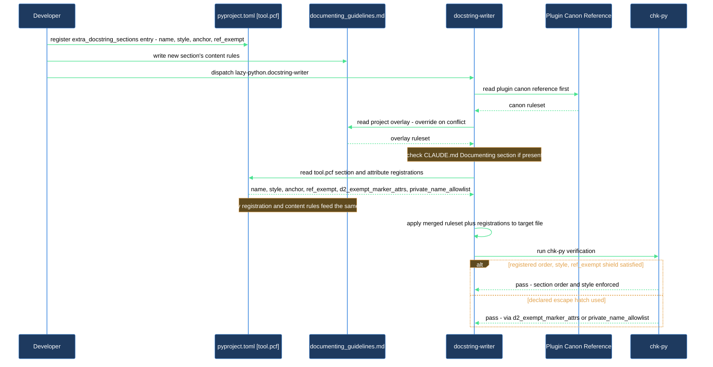

# Add a project-specific docstring section and attribute escape hatch

Your project has documentation needs the plugin's canon docstring rules don't cover — a section unique to your domain, or classes whose private fields are load-bearing enough to belong in the public `Attributes:` list. `lazy-python.docstring-writer` supports both, but they are declared in two different places: the machinery (which sections exist, their order, their style, which private names are exempt) lives in `pyproject.toml` under `[tool.pcf]`; the content rules for what to actually write in a registered section live in your project overlay at `docs/guidelines/documenting_guidelines.md`. Neither plugin code nor a Claude Code restart is involved — the agent re-reads both on every dispatch.

This walkthrough takes you from an install-created overlay stub and an untouched `[tool.pcf]` block to a verified project-specific docstring section and attribute escape hatch that show up in a freshly generated docstring.

## Outcome

After completing this walkthrough you have:

- At least one project-registered docstring section declared in `pyproject.toml` `[tool.pcf] extra_docstring_sections`, with its content rules written in the overlay.
- Optionally, a declared private-attribute escape hatch (`d2_exempt_marker_attrs`) and/or a narrative allowlist (`private_name_allowlist`) for classes whose private fields need to appear in `Attributes:` or in prose.
- Confirmation that `lazy-python.docstring-writer` reads all of the above on dispatch and produces output that reflects it, verified by `chk-py`.
- A reusable pattern for adding further sections or exemptions as your project's documentation needs evolve.

## What you need

- `lazycortex-python` installed in your repo (`/lazy-python.install` completed — Phase 4 bootstraps the `[tool.pcf]` block in `pyproject.toml`, Phase 5 creates the overlay stubs).
- `pyproject.toml` with a `[tool.pcf]` section present. If Phase 4 ran successfully, the section already exists with the commented-out `extra_docstring_sections`, `d2_exempt_marker_attrs`, and `private_name_allowlist` keys ready to uncomment.
- `docs/guidelines/documenting_guidelines.md` present. If Phase 5 ran successfully, the file already exists with a `# Project additions to documentation` header and an empty body.
- At least one Python class in your project that needs the section, or that has a private field you want documented.

If either file is missing, re-run `/lazy-python.install` — Phases 4 and 5 are idempotent and will create the missing pieces without touching any other installation artifact.

## The journey

### Step 1 — Understand the two-place split

Docstring customization for `lazy-python.docstring-writer` spans two files with different jobs:

- **`pyproject.toml` `[tool.pcf]`** — the machinery. This is where you register that a section exists, its list style, where it sits in the section order, and whether its body is shielded from the narrative checks. This is also where you declare the private-attribute escape hatch (`d2_exempt_marker_attrs`) and the private-name narrative allowlist (`private_name_allowlist`). The `chk-py` checker (`pcf.py`) reads this section to enforce order, style, and the exemptions.
- **`docs/guidelines/documenting_guidelines.md`** — the content. Once a section is registered in `pyproject.toml`, this overlay file is where you write the prose rules for what actually belongs in that section for your project. The canon has no opinion on a project-registered section's content — that responsibility is entirely yours.

On every dispatch, `lazy-python.docstring-writer` reads guidelines in three layers, in this order:

1. The canonical plugin guidelines at `${CLAUDE_PLUGIN_ROOT}/references/lazy-python.documenting-guidelines.md`.
2. Your project overlay at `${CLAUDE_PROJECT_DIR}/docs/guidelines/documenting_guidelines.md`.
3. The `## Documenting` section of your `${CLAUDE_PROJECT_DIR}/CLAUDE.md`, if that section exists.

Independently of that three-layer read, the agent also honours whatever is registered in `pyproject.toml` `[tool.pcf]` — the section list, its order anchors, and the attribute exemptions — because those are structural facts about your project, not prose guidance.

### Step 2 — Register a docstring section in pyproject.toml

Open `pyproject.toml` and find the `[tool.pcf]` section installed by `/lazy-python.install`. Uncomment and fill in an `extra_docstring_sections` entry:

```toml
[[tool.pcf.extra_docstring_sections]]
name = "Field Semantics"
style = "definition"
after = "Guarantees"
ref_exempt = true
```

- `name` — the section heading exactly as it should appear in the docstring.
- `style` — `"bulleted"` (hyphen-prefixed list, like `Responsibilities`), `"definition"` (`name: description` lines, like `Attributes`), or `"plain"` (free prose, like `Notes`).
- `after` / `before` — an order anchor naming a built-in section or a previously declared entry. An anchor that doesn't resolve appends the section at the end of the order instead of failing.
- `ref_exempt` — set `true` only if this section's body carries `# REF:` lines your own tooling consumes; it shields those lines from the narrative checks (D5/D7/D9).

A `style = "definition"` section is also skipped by the private-name narrative check, the same way `Attributes` and `Args` are — useful when the section legitimately lists internal names.

You can register more than one section. Each gets its own `[[tool.pcf.extra_docstring_sections]]` block.

### Step 3 — Write the section's content rules in the overlay

`pyproject.toml` only told the checker the section exists, its style, and its position — it says nothing about what belongs inside it. Open `docs/guidelines/documenting_guidelines.md` and add that:

```markdown
# Project additions to documentation

## Field Semantics section

  Classes that model a persisted record use a `Field Semantics:` section (registered
  in pyproject.toml, positioned after Guarantees) to document validation rules that
  don't fit `Attributes:` — for example cross-field constraints or units that apply
  to a group of fields rather than one.

  - One bullet per constraint, `name: description` in definition style.
  - Reference the fields it constrains by name; do not repeat their individual
    descriptions from Attributes.
```

Write it as prose the agent can interpret — not a machine-readable schema. The agent reads this the same way it reads the canonical guidelines, just with overlay content winning on conflict.

### Step 4 — Declare the private-attribute escape hatch, if you need one

If your project has classes where a private field genuinely needs to appear in a docstring's `Attributes:` section — a common case for classes that expose stable internal state to a documented subclass contract — declare the escape hatch in the same `[tool.pcf]` block:

```toml
d2_exempt_marker_attrs = ["_dataset_schema", "_fixture_seed"]
```

Only fields named here are exempt from the "no private attributes in Attributes" zero-tolerance blocker; every other private field is still excluded, no matter how important it seems.

Separately, if a private identifier needs to appear in a docstring's narrative prose (Summary, Scope, Notes) rather than in a definition-style section, add it to the narrative allowlist instead:

```toml
private_name_allowlist = ["_dataset_schema"]
```

`private_name_allowlist` governs prose mentions; `d2_exempt_marker_attrs` governs `Attributes:` entries. A name can need one, the other, or both depending on where your project needs it to surface.

### Step 5 — Verify the pieces are in place

Run a quick sanity check before dispatching:

```
/lazy-python.audit
```

Check 7 (`Overlay scaffolding headers`) confirms `documenting_guidelines.md` still carries its canonical header — a `WARN` or `FAIL` means the stub was altered or removed; re-run `/lazy-python.install` to restore it. The audit does not validate `pyproject.toml` section content — a syntax error in `[[tool.pcf.extra_docstring_sections]]` only surfaces once `chk-py` or the writer agent runs against a file.

### Step 6 — Dispatch lazy-python.docstring-writer against a target file

Pick a Python file with a class or method that should use your new section, or that has one of the private fields you exempted. Invoke the agent:

```
Use the lazy-python.docstring-writer agent to write docstrings for src/mymodule/dataset.py
```

The agent's Step 1 — Read guidelines — reads the canonical reference, the overlay, and the `## Documenting` section of your `CLAUDE.md` if present; its Step 6 — Verify against rules — runs `chk-py all <file>.py -q`, which is what actually enforces your `pyproject.toml` registrations (section order, style, `ref_exempt` shield, and the attribute/narrative exemptions).

### Step 7 — Confirm the registered section and escape hatch appear in the output

Look at the generated docstring and cross-check it against what you registered:

- **New section**: it appears at the position you anchored it to (e.g. immediately after `Guarantees`), in the list style you declared, and its content follows the rules you wrote in the overlay — not invented content, and not a section you never registered.
- **Attribute escape hatch**: a field you listed in `d2_exempt_marker_attrs` appears in `Attributes:`, separated from the public fields by an empty line; every other private field is still excluded.
- **Narrative allowlist**: a name you listed in `private_name_allowlist` can appear in Summary/Scope/Notes prose without `chk-py` flagging it as a private-internal leak.

If the output doesn't reflect your registration, check three things:

1. The `[[tool.pcf.extra_docstring_sections]]` block (or the `d2_exempt_marker_attrs` / `private_name_allowlist` list) is syntactically valid TOML and uncommented.
2. The overlay actually contains prose for the section — a registered-but-undocumented section has no content rules to follow.
3. `chk-py all <file>.py -q` runs clean; a checker failure means the registration and the actual docstring disagree.

### Step 8 — Iterate and expand

Once the first section and exemption are confirmed, add more as your project's conventions evolve — further `[[tool.pcf.extra_docstring_sections]]` blocks, more exempted names, or refined content rules in the overlay. Because the agent and `chk-py` re-read both files on every dispatch and every check, each change takes effect immediately.

## After you're done

`pyproject.toml` `[tool.pcf]` and `docs/guidelines/documenting_guidelines.md` are both living project config. As your documentation needs evolve, edit them directly — the next dispatch of `lazy-python.docstring-writer` and the next `chk-py` run pick up the change automatically.

Track both files in version control. When a teammate's dispatch produces a docstring that violates a project-registered section or leaks a private name that isn't exempted, the fix is a `pyproject.toml` registration or an overlay rule — not a code review comment repeated file by file.

To verify the overlay stub itself is intact, run `/lazy-python.audit` at any time — Check 7 reports whether the header survived; it does not validate section content or `pyproject.toml` registrations, that judgment belongs to you and your team, backed by `chk-py`.

If the agent produces a docstring that contradicts a registered section's rules, the most likely cause is ambiguous wording in the overlay, not a `pyproject.toml` misconfiguration — rewrite the rule to be explicit and re-dispatch.

## How the overlay and pyproject.toml layers combine


