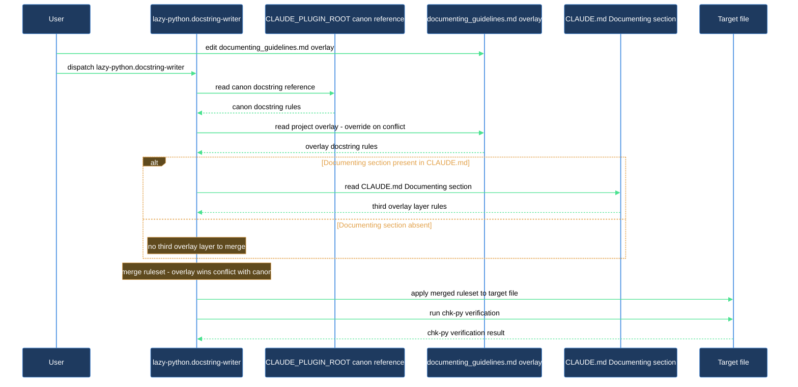

# Add project-specific docstring rules that the writer agent always honours

Your project has naming patterns, base classes, or documentation expectations that go beyond the plugin's built-in docstring rules. The `lazy-python.docstring-writer` agent was designed for this: on every dispatch it reads the plugin's canonical guidelines first, then reads your project's overlay file at `docs/guidelines/documenting_guidelines.md`, and finally reads the `## Documenting` section of your `CLAUDE.md` if one exists. Anything you put in the overlay or the `CLAUDE.md` section either extends or overrides the canon — no plugin changes required, no Claude Code restart needed.

This walkthrough takes you from an empty overlay stub (created by `/lazy-python.install` Phase 5) to a verified overlay rule that shows up in a freshly generated docstring.

## Outcome

After completing this walkthrough you have:

- At least one project-specific docstring rule written in `docs/guidelines/documenting_guidelines.md`.
- Confirmation that `lazy-python.docstring-writer` reads the overlay on dispatch and produces output that reflects your rule.
- A reusable pattern for adding further overlay rules whenever your project's conventions evolve.

## What you need

- `lazycortex-python` installed in your repo (`/lazy-python.install` completed — specifically Phase 5, which creates the overlay stubs).
- `docs/guidelines/documenting_guidelines.md` present. If Phase 5 ran successfully, the file already exists with a `# Project additions to documentation` header and an empty body.
- At least one Python file in your project with a class, method, or property you can use to verify the output.

If the overlay file does not exist, re-run `/lazy-python.install` — Phase 5 is idempotent and will create the stub without touching any other installation artifact.

## The journey

### Step 1 — Understand what the overlay file is for

Open `docs/guidelines/documenting_guidelines.md`. After a fresh install it looks like this:

```markdown
# Project additions to documentation

<!-- Add project-specific rules and conventions here. -->
<!-- These override the plugin canon on conflict. -->
```

The file is intentionally empty — the plugin ships the format; you fill in the content. On every dispatch the agent reads guidelines in three layers, in this order:

1. The canonical plugin guidelines at `${CLAUDE_PLUGIN_ROOT}/references/lazy-python.documenting-guidelines.md`.
2. Your project overlay at `${CLAUDE_PROJECT_DIR}/docs/guidelines/documenting_guidelines.md`.
3. The `## Documenting` section of your `${CLAUDE_PROJECT_DIR}/CLAUDE.md`, if that section exists.

When two layers conflict, the later layer wins — your overlay overrides the canon, and a `## Documenting` section in `CLAUDE.md` overrides both. You can use any combination of the three layers; most projects use only the overlay file.

Phase 5 creates four overlay stubs in `docs/guidelines/`, each read by a different skill:

- `documenting_guidelines.md` — docstring rules, read by `lazy-python.docstring-writer` (this walkthrough).
- `testing_guidelines.md` — test shape and base-class rules, read by `lazy-python.test-writer`.
- `coding_guidelines.md` — coding style additions, read by `/lazy-python.check-style`.
- `checking_guidelines.md` — checker configuration notes, read by `/lazy-python.check-style` and `lazy-python.test-writer`.

Each file is independent. You can leave any of them at the install stub and the agent will simply find nothing to override.

Typical things that go in `documenting_guidelines.md`:

- **Base-class declarations** — which classes in your codebase are "data-set initializers" (the agent applies a different Generation Rules / Value Ranges / Attributes treatment to them).
- **Line-length override** — if your project enforces a different limit than the plugin default of 117 characters.
- **Section additions or exclusions** — additional sections your project uses that aren't in the canon, or sections the project forbids.
- **Project-specific Scope wording rules** — for example, "In this project, Scope sections for repository classes must describe the persistence boundary, not internal storage details."

### Step 2 — Write your first overlay rule

Edit `docs/guidelines/documenting_guidelines.md` and add a rule. Here is a concrete example you can adapt:

```markdown
# Project additions to documentation

## Line length

  Maximum line length for docstrings is 100 characters (project setting; overrides the
  plugin default of 117).

## Base classes for data-set initializers

  The following base classes mark a class as a data-set initializer. The agent applies
  Generation Rules, Value Ranges, and full Attributes treatment to any class that
  inherits from one of these:

  - `DataSetBase` (module: `myproject.core.dataset`)
  - `FixturePrototype` (module: `myproject.testing.fixtures`)
```

You are editing a plain Markdown file that belongs to your project — not a skill-managed config file. Write it the same way you would any other project guideline document.

The agent looks for prose and headings in this file, not a structured schema. Write natural-language rules; the agent interprets them the same way it interprets the canonical guidelines.

### Step 3 — Verify the overlay file is in the expected location

The agent resolves the overlay path as `${CLAUDE_PROJECT_DIR}/docs/guidelines/documenting_guidelines.md`. In a standard repo layout this is `<repo-root>/docs/guidelines/documenting_guidelines.md`.

Run a quick sanity check before dispatching:

```
/lazy-python.audit
```

Check 7 in the audit output (`Overlay scaffolding headers`) confirms all four overlay files — including `documenting_guidelines.md` — carry the canonical `# Project additions to <topic>` header. A `PASS` means the stubs are all present and correctly headed; a `WARN` or `FAIL` means one or more stubs are missing or their header was altered — re-run `/lazy-python.install` to restore them.

### Step 4 — Dispatch lazy-python.docstring-writer against a target file

Pick a Python file that has a class or method whose docstring you want to write or update. Invoke the agent:

```
Use the lazy-python.docstring-writer agent to write docstrings for src/mymodule/widget.py
```

The agent's Step 1 — Read guidelines — reads the canonical reference first, then the overlay, then the `## Documenting` section of your `CLAUDE.md` if present. In its outcome line you will see `guidelines-loaded` reported for that step, confirming all layers were consumed.

If your overlay introduced a base-class declaration, include a file that has one of those classes in the dispatch — that is the clearest way to see the overlay in action.

### Step 5 — Confirm the overlay delta appears in the output

Look at the generated docstring and cross-check it against the rule you added:

- **Line-length rule**: select the longest line in any generated docstring. It should not exceed the limit you set in the overlay.
- **Base-class rule**: for a class inheriting from a declared data-set-initializer base, the docstring should include a `Generation Rules:` section (if `DOC(...)` comments exist in the class) and a full `Attributes:` section with per-field descriptions rather than brief noun phrases.
- **Any other rule**: the docstring should reflect the project-specific wording or structural constraint you wrote.

If the output does not reflect your overlay rule, check two things:

1. The overlay file has the correct header and content — re-run `/lazy-python.audit` and check the Check 7 result.
2. The rule is written as prose the agent can interpret — not as a machine-readable schema or a blank section.

### Step 6 — Iterate and expand the overlay

Once you confirm the first rule is honoured, add further project-specific rules as your conventions evolve. Because the agent re-reads the overlay on every dispatch, each new rule takes effect immediately without any configuration change.

## After you're done

The overlay file is a living document. As your project's conventions solidify or evolve, edit `docs/guidelines/documenting_guidelines.md` directly — the next dispatch of `lazy-python.docstring-writer` picks up the change automatically.

Track the overlay file in version control. When a teammate's dispatch of the agent produces a docstring that violates the project's style, the fix is a rule in the overlay, not a code review comment.

To verify the full installation including all overlay files, run `/lazy-python.audit` at any time. Check 7 reports whether each overlay stub carries the canonical header; the audit does not validate the content of your rules — that judgment belongs to you and your team.

If the agent produces a docstring that contradicts one of your overlay rules, the most likely cause is ambiguous or conflicting wording in the overlay itself. Rewrite the rule to be explicit and re-dispatch; the agent will apply the updated version immediately.

## How the overlay layers stack


