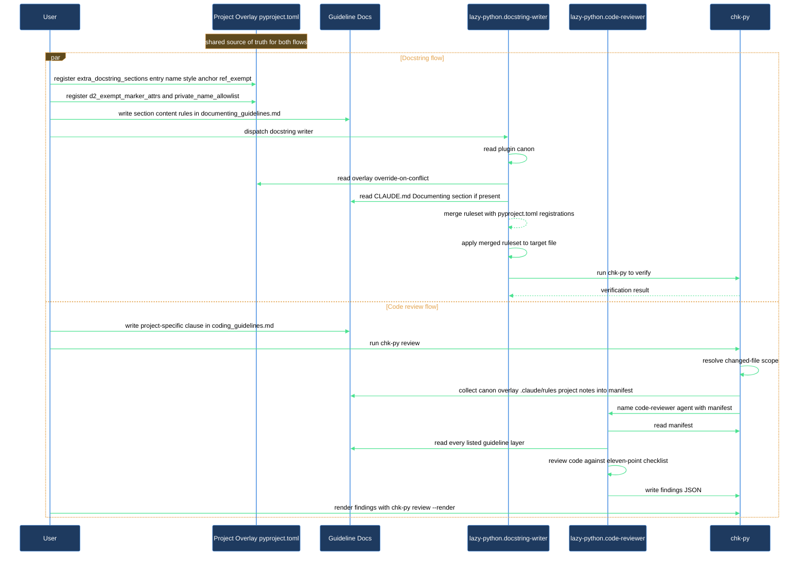

# Add a project-specific documentation-guideline clause and confirm the docstring writer honors it

Your project has documentation conventions the plugin's canon doesn't cover — an extra docstring section your team wants on certain classes, an escape hatch for a private attribute your API intentionally exposes, project-specific narrative rules. `lazycortex-python` gives you `docs/guidelines/documenting_guidelines.md` for the content rules and `pyproject.toml`'s `[tool.pcf]` table for the structural registrations (`extra_docstring_sections`, `d2_exempt_marker_attrs`, `private_name_allowlist`), and `lazy-python.docstring-writer` is the agent that reads both on every dispatch. Neither plugin code nor a Claude Code restart is involved — the agent re-reads the overlay every time it runs.

This walkthrough takes you from an install-created overlay stub to a verified project-specific documentation clause — confirmed by the docstring `lazy-python.docstring-writer` actually writes.

## Outcome

After completing this walkthrough you have:

- At least one project-specific clause written in `docs/guidelines/documenting_guidelines.md`, optionally backed by a structural registration in `pyproject.toml`'s `[tool.pcf]` table.
- A `lazy-python.docstring-writer` dispatch whose output visibly reflects that clause — a new section, an included attribute, a narrative rule honored — on a file the clause applies to.
- A working understanding of the three layers the agent reads in order (plugin canon, project overlay, `CLAUDE.md`), so you know where to add the next rule as your project's documentation conventions grow.

## What you need

- `lazycortex-python` installed in your repo — Step 1 below confirms `/lazy-python.install` has scaffolded `docs/guidelines/documenting_guidelines.md` (and the other three overlay stubs), and re-runs the install if it's missing.
- A class, method, or property whose docstring you can regenerate for the verification half of this walkthrough — something the new clause changes the shape of.

## The journey

### Step 1 — Confirm the overlay stub is scaffolded

`/lazy-python.install` Phase 5 is what creates the four overlay stubs under `docs/guidelines/`, including `documenting_guidelines.md`, the one this walkthrough edits. If you already ran `/lazy-python.install` when you first set up the plugin, it's already in place — check that `docs/guidelines/documenting_guidelines.md` exists.

If it's missing, re-run:

```
/lazy-python.install
```

The install is idempotent and quiet: Phase 5 creates only the missing stub files and never touches an overlay you've already started editing — safe to re-run mid-project without losing prior work.

### Step 2 — Understand what lazy-python.docstring-writer reads

`lazy-python.docstring-writer`'s own Step 1 reads three layers, every dispatch, in this order:

1. The plugin's canonical `lazy-python.documenting-guidelines.md` — the docstring section order, style rules, and zero-tolerance blockers that hold regardless of project.
2. `docs/guidelines/documenting_guidelines.md` — your project overlay, read next; it overrides the canon on conflict.
3. `CLAUDE.md`'s `## Documenting` section if present — a third layer for project-wide notes that don't belong to a single topic.

The agent is dispatched fresh each time and does not inherit the main session's loaded rules, so it re-reads all three layers on every run — there is nothing to restart or reload after you edit the overlay.

This same canon-then-overlay layering is how every `docs/guidelines/<topic>_guidelines.md` file works — `coding_guidelines.md`, `testing_guidelines.md`, and `checking_guidelines.md` follow the identical pattern for their own writer and checker consumers. The coding canon's Knowledge Marker Rules — never remove or alter `TODO:`, `TMP:`, `DBG:`, `ref:`, `Domain(…):`, `Contract:` comments — apply here too: `lazy-python.docstring-writer`'s own Special Comment Handling rules mirror them, so a class's `Domain(…)` or `Contract:` markers keep their meaning as its docstring evolves under this walkthrough.

### Step 3 — Write a project-specific clause in the documenting overlay

Open `docs/guidelines/documenting_guidelines.md` and add a clause the canon doesn't carry. For example, a narrative rule:

```markdown
# Project additions to documenting

## Field Semantics section

  Classes under `src/protocol/` that serialize to an external wire format
  carry a `Field Semantics` section listing wire-level constraints (units,
  valid ranges, endianness) that don't belong in `Attributes`.
```

A section like this also needs a structural registration so the docstring machinery (`pcf`'s docstring checks and `lazy-python.docstring-writer`) know it exists. Add it to `pyproject.toml`'s `[tool.pcf]` table — the install-bootstrapped section already carries a commented-out example to uncomment and adapt:

```toml
[[tool.pcf.extra_docstring_sections]]
name = "Field Semantics"
style = "bulleted"
after = "Guarantees"
ref_exempt = true
```

`name` must match the overlay's section heading exactly. `style` is `"bulleted"`, `"definition"`, or `"plain"`. `after` (or `before`) anchors the section's position relative to a built-in section or a previously declared entry. `ref_exempt = true` shields the section's body from checks that would otherwise flag its `# ref:`-style lines.

Without both pieces — the content rule in the overlay and the structural registration in `pyproject.toml` — `lazy-python.docstring-writer` has nothing to add: the canon has no opinion on your wire-format documentation, and an unregistered section name is not one the agent is allowed to invent.

### Step 4 — Dispatch lazy-python.docstring-writer

Pick (or write) a class the new clause applies to — for instance, a class under `src/protocol/` with a wire-level constraint worth documenting — then dispatch:

```
Dispatch the lazy-python.docstring-writer agent against <path/to/file.py>
```

The agent's Step 1 re-reads the three layers from Step 2 above, including your edited overlay and the `pyproject.toml` registration. Its Step 2 reads the target file, Step 3 identifies non-compliant or missing docstrings, and Step 4 writes them — following your overlay's content rule for the new `Field Semantics` section at the position and style you registered.

### Step 5 — Verify the clause took effect

Read the docstring the agent wrote (or edited). Confirm:

- The `Field Semantics` section (or whatever you named it) appears at the position you anchored it (`after = "Guarantees"` in the example above).
- Its content follows the style you declared (`bulleted`, in the example) and the wording rule you wrote in the overlay.
- Every other section still follows the canon's ordinary rules — the overlay only adds to the section machinery, it doesn't relax the zero-tolerance blockers.

The agent's own Step 6 already runs `chk-py all <file>.py -q` against the changed file as part of its dispatch — a clean run confirms the file passes the deterministic checks; it does not by itself confirm your new section's wording, which is your judgment call at this step.

If the section is missing, confirm the registration in `pyproject.toml` uses the exact section `name` your overlay heading uses — a mismatch means the agent has no rule to follow for a section it isn't told exists.

### Step 6 — Iterate and expand

Once the first clause is confirmed, add more as your project's documentation conventions grow — further sections, escape-hatch registrations (`d2_exempt_marker_attrs` for private attributes your API intentionally exposes, `private_name_allowlist` for private identifiers your narrative legitimately names), or additional prose in `documenting_guidelines.md`. Because `lazy-python.docstring-writer` re-reads both files on every dispatch, each new clause takes effect immediately without touching plugin code.

## After you're done

`docs/guidelines/documenting_guidelines.md` and the `[tool.pcf]` registrations in `pyproject.toml` are living project config. Track both in version control. When a teammate's `lazy-python.docstring-writer` dispatch produces a docstring that disagrees with a project convention, the fix is an overlay edit (and, for structural additions, a `pyproject.toml` registration) — not a one-off manual rewrite repeated file by file.

To verify the overlay stub itself is intact (not accidentally deleted or corrupted), run `/lazy-python.audit` — its overlay check covers all four `docs/guidelines/*.md` files, not just the one this walkthrough touches. It does not validate clause content — that judgment belongs to you and your team, backed by the docstrings `lazy-python.docstring-writer` actually produces.

## How the overlay and pyproject.toml layers combine


```mermaid
%%{init: {'themeVariables':{'background':'transparent','primaryColor':'#1e3a5f','primaryBorderColor':'#4a90e2','primaryTextColor':'#fff','lineColor':'#4ae290','actorBkg':'#1e3a5f','actorBorder':'#4a90e2','actorTextColor':'#fff','actorLineColor':'#4a90e2','signalColor':'#4ae290','signalTextColor':'#000','noteBkgColor':'#5f4a1e','noteBorderColor':'#e2a14a','noteTextColor':'#fff','labelBoxBkgColor':'#5f4a1e','labelBoxBorderColor':'#e2a14a','labelTextColor':'#fff','loopTextColor':'#e2a14a'},'sequence':{'diagramPadding':5,'useMaxWidth':true}}}%%
sequenceDiagram
  participant user as User
  participant overlay as Project Overlay pyproject.toml
  participant guidelines as Guideline Docs
  participant writer as lazy-python.docstring-writer
  participant reviewer as lazy-python.code-reviewer
  participant chkpy as chk-py

  Note over overlay: shared source of truth for both flows

  par Docstring flow
    user->>overlay: register extra_docstring_sections entry name style anchor ref_exempt
    user->>overlay: register d2_exempt_marker_attrs and private_name_allowlist
    user->>guidelines: write section content rules in documenting_guidelines.md
    user->>writer: dispatch docstring writer
    writer->>writer: read plugin canon
    writer->>overlay: read overlay override-on-conflict
    writer->>guidelines: read CLAUDE.md Documenting section if present
    writer-->>writer: merge ruleset with pyproject.toml registrations
    writer->>writer: apply merged ruleset to target file
    writer->>chkpy: run chk-py to verify
    chkpy-->>writer: verification result
  and Code review flow
    user->>guidelines: write project-specific clause in coding_guidelines.md
    user->>chkpy: run chk-py review
    chkpy->>chkpy: resolve changed-file scope
    chkpy->>guidelines: collect canon overlay .claude/rules project notes into manifest
    chkpy->>reviewer: name code-reviewer agent with manifest
    reviewer->>chkpy: read manifest
    reviewer->>guidelines: read every listed guideline layer
    reviewer->>reviewer: review code against eleven-point checklist
    reviewer->>chkpy: write findings JSON
    user->>chkpy: render findings with chk-py review --render
  end
```
