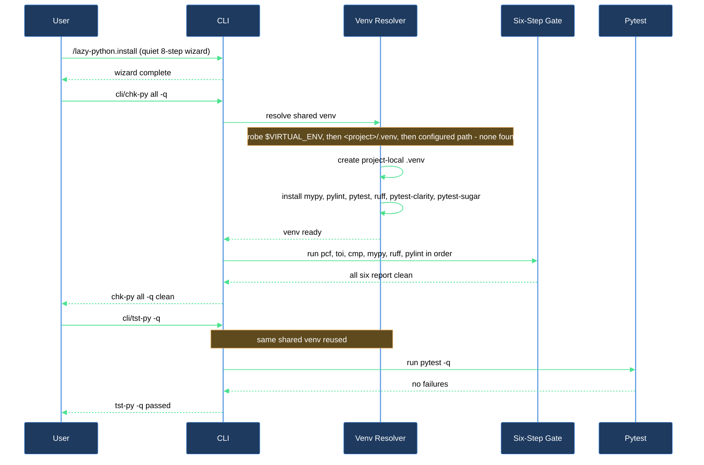

# Bootstrap the plugin in a clean repo and confirm the checker stack is wired up

This walkthrough is for anyone enabling `lazycortex-python` in a repo for the first time and wanting proof — not just an install report — that the checker stack actually works: the project-local venv builds, and the aggregator wrappers run clean end to end.

## Outcome

After this walkthrough you have:

- The plugin installed — rule mirrors, `cli/chk-py` / `cli/tst-py` wrappers, bootstrapped `pyproject.toml` sections, and overlay stubs all in place (see the **install-and-audit** block article for the full wizard).
- A project-local `.venv` at the repo root with `mypy`, `pylint`, `pytest`, `ruff`, `pytest-clarity`, and `pytest-sugar` installed, built automatically the first time you invoke either wrapper.
- A completed `chk-py all -q` run reporting all six steps clean, and a completed `tst-py -q` run confirming the same venv's pytest works.
- Confidence that the venv resolver and the six-step gate are correctly wired before you start relying on them for real edits.

## What you need

- `lazycortex-core` installed and enabled in Claude Code (this plugin layers on its runtime).
- `lazycortex-python@lazycortex` installed and enabled — `enabledPlugins` in your `~/.claude/settings.json`.
- Python 3.12+ reachable on `$PATH`, and `uv` on `$PATH` if you want the venv-bootstrap fallback to work (`brew install uv` on macOS).
- A terminal at the repo root — the wrappers run standalone once deployed, no Claude Code session required.

## The journey

### Step 1 — Install the plugin

```
/lazy-python.install
```

This is a quiet, mostly prompt-free install — the only two prompts it can ever raise are a genuine file-sync conflict and, when your repo ships more than one recognised environment-bootstrap script, a one-time choice of which one `python.env_source` should record. The full 8-step breakdown — rule mirroring, wrapper deployment, the PyCharm `pch` probe, `pyproject.toml` bootstrapping, overlay scaffolding, scaffold-template sync, and `env_source` detection — is covered in the **install-and-audit** block article, not here.

**Verification gate**: the install ends with a one-line-per-step report. Confirm every line shows an outcome word (`installed`, `wrappers-deployed-2 + gitignore-ensured`, `pyproject-bootstrapped + pch-skipped-no-pycharm`, etc.) with no `ERROR`. Once that report is clean, `./cli/chk-py` and `./cli/tst-py` exist at the repo root and are executable.

### Step 2 — Run the six-step gate and let it build the venv

From a plain terminal at the repo root:

```
./cli/chk-py all -q
```

`chk-py` is the rendered wrapper around the plugin's shared `chk` aggregator. `all` runs six checks in order — `pcf` (code format), `toi` (type-only imports), `cmp` (`py_compile` syntax check), `mypy`, `ruff`, `pylint` — against `.` by default. Before the first check runs, the shared venv resolver probes for a usable venv in this order: an already-activated `$VIRTUAL_ENV`, an existing `<repo>/.venv`, then a `[tool.lazy-python] venv` path configured in `pyproject.toml`. On a freshly installed repo none of those exist yet, so the resolver falls back to creating `<repo>/.venv` with `uv venv --python 3.12` and installing `mypy`, `pylint`, `pytest`, `ruff`, `pytest-clarity`, and `pytest-sugar` into it — never wiping a pre-existing venv, only adding what's missing.

**Verification gate**: expect this run to take roughly 30–60 seconds the first time (venv creation + package installs); every later run reuses the venv and is fast. The output prints `>>> [N/6] <step> - ...` for each of the six checks. On a clean tree you should see all six report success with no `ERROR`, no `py_compile errors detected`, and no violation lines. If a check does report findings, those are real issues against your existing code, not an install problem — work through them (or point `chk-py all -q <path>` at a single known-clean file first to confirm the plumbing) before treating the checker stack as verified.

### Step 3 — Confirm the shared venv also serves pytest

```
./cli/tst-py -q
```

`tst-py` sources the same venv the previous step built or reused — it never creates its own — then runs `pytest -q` across everything under `tests/`. Because Step 2 already installed `pytest` (plus the `pytest-clarity` and `pytest-sugar` plugins) into `<repo>/.venv`, this step should activate instantly with no new installs.

**Verification gate**: on a repo with no `tests/` directory yet, `pytest` reports no tests collected — that's expected and not a failure. On a repo with existing tests, confirm the run completes with `0 failed` (whatever the passed/skipped counts happen to be). Either outcome confirms the venv resolver and the pytest wiring both work; a hard error here (e.g. `pytest: command not found`) means the venv from Step 2 didn't build correctly and is worth re-running `chk-py all -q` to diagnose before moving on.

## After you're done

`chk-py all -q` is the routine gate to run before committing any real edit — pair it with `/lazy-python.check-style` when you also want the manual-review categories (docstring quality, naming, structural rules) that the automated checkers can't see. `tst-py -q` (or `tst-py <module> -q` to scope to one `tests/<module>/` directory) is the routine test pass once you have tests to run.

The venv you built in Step 2 persists at the repo root and is reused by every future `chk-py` / `tst-py` / `check-style` run — it's only rebuilt if you delete it, and re-running the resolver only adds missing tools, never removes anything. If you ever suspect the install itself has drifted (missing wrapper, stale rule mirror, broken venv resolution) rather than the checker findings themselves, `/lazy-python.audit` — covered in the install-and-audit block article — is the read-only diagnostic to reach for before re-running install.

## Install-and-first-check flow


