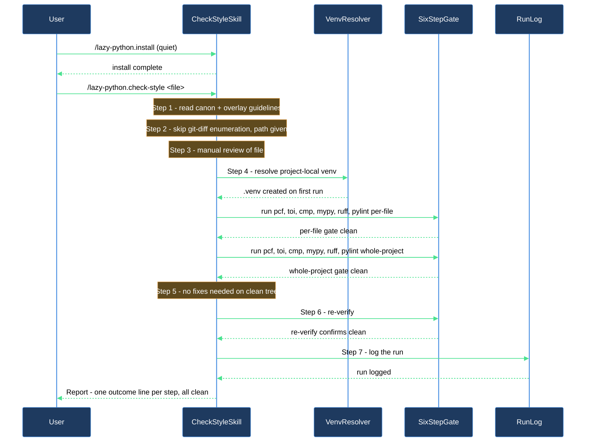

# Bootstrap the plugin in a clean repo and confirm the checker stack is wired up

This walkthrough is for anyone enabling `lazycortex-python` in a repo for the first time and wanting proof — not just an install report — that the checker stack actually works: the project-local venv builds, the six-step gate runs clean, and the manual review skill exercises the whole pipeline end to end.

## Outcome

After this walkthrough you have:

- The plugin installed — rule mirrors, `cli/chk-py` / `cli/tst-py` wrappers, bootstrapped `pyproject.toml` sections, and overlay stubs all in place (see the **install-and-audit** block article for the full wizard).
- A project-local `.venv` (repo root) with `mypy`, `pylint`, `pytest`, `ruff`, `pytest-clarity`, and `pytest-sugar` installed, built automatically on the first automated-check pass.
- A completed `/lazy-python.check-style` run against at least one file, with every one of its seven steps reporting a clean outcome.
- Confidence that the PostToolUse hook, the venv resolver, and the six-step gate are all correctly wired before you start relying on them for real edits.

## What you need

- `lazycortex-core` installed and enabled in Claude Code (this plugin layers on its runtime).
- `lazycortex-python@lazycortex` installed and enabled — `enabledPlugins` in your `~/.claude/settings.json`.
- Python 3 reachable on `$PATH` (the checker scripts and hook are Python).
- The plugin already installed in this repo via `/lazy-python.install` — if you haven't run it yet, do that first; the install wizard, its seven steps, and the `python.env_source` disambiguation prompt are covered in the **install-and-audit** block article, not here.
- At least one tracked `.py` file to point the check at.

## The journey

### Step 1 — Install the plugin (if you haven't already)

```
/lazy-python.install
```

This is a quiet, mostly prompt-free install — the only two prompts it can ever raise are a genuine file-sync conflict and, when your repo ships more than one recognised environment-bootstrap script, a one-time choice of which one `python.env_source` should record. Full step-by-step detail, the report format, and troubleshooting live in the **install-and-audit** block article — read that first if this is your first time running it.

**Verification gate**: the install ends with a one-line-per-step report. Confirm every line shows an outcome word (`installed`, `wrappers-deployed-2 + gitignore-ensured`, `pyproject-bootstrapped + pch-skipped-no-pycharm`, etc.) with no `ERROR`. Once that report is clean, move on — the rest of this walkthrough doesn't re-check install state.

### Step 2 — Pick a file and run your first check-style pass

Pick any existing tracked `.py` file in the repo — it doesn't need to have uncommitted changes:

```
/lazy-python.check-style <path/to/file.py>
```

Passing an explicit path matters on a freshly installed repo: `lazy-python.check-style`'s Step 2 normally enumerates your current change set via `git diff --name-only HEAD` (plus `--cached`), and on a clean tree with nothing staged that enumeration comes back empty — the skill would exit immediately with `no-files-changed` and never touch the checker stack. Passing the path explicitly skips that enumeration and forces the full seven-step review to run right now.

The skill executes in order:

- **Step 1** reads the canonical coding and documenting guidelines from the plugin, then your project's `docs/guidelines/` overlay if it exists. Outcome: `guidelines-loaded`.
- **Step 2** records the file you passed instead of diffing. Outcome: `1-files-identified`.
- **Step 3** manually walks docstring quality, contract consistency, guard-clause comments, method organization, naming, structural rules, and comment-marker preservation against that file. Outcome: `manual-clean` on a file with no issues, or `<N>-issues-found-manually`.
- **Step 4** runs the automated aggregator: `chk-py all <file>.py -q` for the file, then `chk-py all -q` for the whole project. **This is the step that builds your venv** — if no `.venv` exists yet at the repo root (and none is found via `$VIRTUAL_ENV` or a configured path), the resolver creates one here and installs `mypy`, `pylint`, `pytest`, `ruff`, `pytest-clarity`, and `pytest-sugar` into it. Expect this specific step to take roughly 30–60 seconds the first time; every later run reuses the venv and is fast. Outcome: `chk-clean` or `<N>-violations-from-chk`.
- **Step 5** applies fixes for anything Steps 3 or 4 found. On a clean file this is a no-op. Outcome: `no-fixes-needed` or `<N>-issues-fixed`.
- **Step 6** re-runs the same checks to confirm any fixes landed. Outcome: `verified-clean` or `<N>-issues-remain`.
- **Step 7** writes a run log to `./.logs/claude/lazy-python.check-style/`. Outcome: `logged`.

**Verification gate**: the skill's final Report lists one outcome line per step above. On a clean file and a working install, you should see `guidelines-loaded`, `1-files-identified`, `manual-clean`, `chk-clean`, `no-fixes-needed`, `verified-clean`, `logged` — seven lines, no gaps, no violation counts. If Step 4 instead reports `<N>-violations-from-chk`, those are real findings against your existing code, not an install problem; work through them (or pick a different file to confirm the plumbing first) before treating the checker stack as verified.

### Step 3 — Confirm the PostToolUse hook is live

Edit any `.py` file in Claude Code (a one-character whitespace change is enough) — you don't need to invoke anything. The PostToolUse hook fires automatically on the edit; it auto-registers from the plugin's `hooks/hooks.json` manifest the moment the plugin is enabled, so there's no settings.json step to check.

**Verification gate**: the next Claude turn should include any `pcf.py` violations for that file in its context. On a clean file you'll see nothing appended — that's the expected, passing outcome.

## After you're done

`/lazy-python.check-style <path>` (or with no path, scoped to your actual change set) is the routine pass to run before committing any real edit — invoke it whenever you want the manual-review categories the automated checkers can't see, paired with the full gate. `chk-py all -q` alone is the lighter-weight option when you only want the automated six-step gate without the manual review or the log write.

The venv you built in Step 2 persists at the repo root and is reused by every future `chk-py` / `tst-py` / `check-style` run — it's only rebuilt if you delete it. If you ever suspect the install itself has drifted (missing wrapper, stale rule mirror, broken venv resolution) rather than the checker findings themselves, `/lazy-python.audit` — covered in the install-and-audit block article — is the read-only diagnostic to reach for before re-running install.

## Install-and-first-check flow


