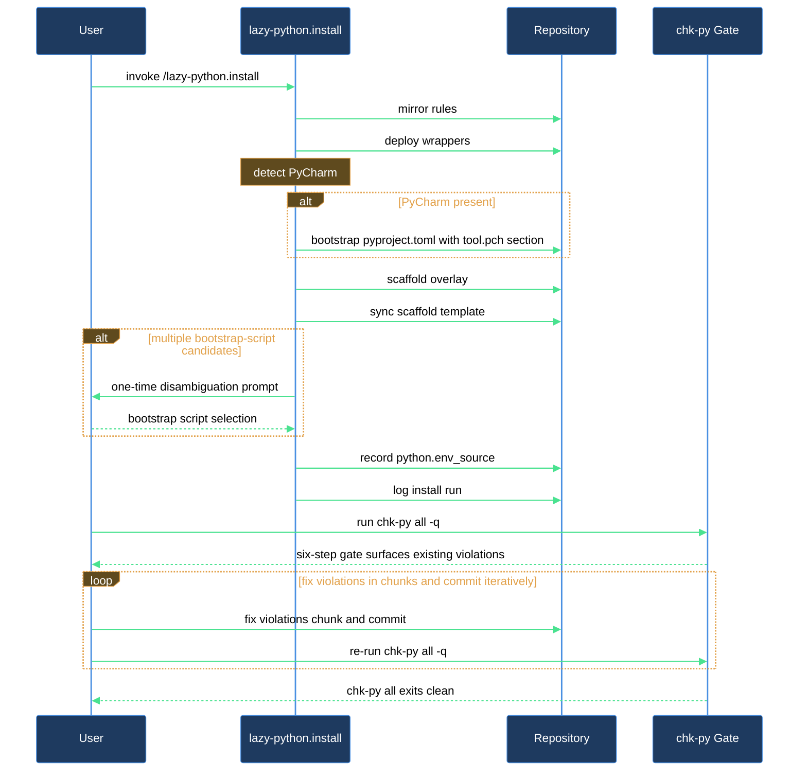

# Adopt the plugin in a repo with pre-existing Python that drifted from the canon

This walkthrough is for anyone bringing `lazycortex-python` into a repo that already has Python files — code written before the plugin existed, imported from another project, or accumulated without a consistent discipline layer. The install wires up the checker stack without touching your existing source; `chk-py all -q` then inventories every violation the canon sees against your tree so you can work through them in small, committed chunks rather than one enormous diff. By the end, every checker passes and the PostToolUse hook prevents new drift from silently accumulating.

## Outcome

After this walkthrough you have:

- The full plugin wired: rule mirrors, `cli/chk-py` / `cli/tst-py` wrappers, `pyproject.toml` checker sections, overlay stubs, scaffold template, and PostToolUse hook live.
- A baseline `chk-py all` run with every pre-existing violation captured in its output — nothing hidden, nothing auto-fixed.
- Each violation batch committed as a separate, passing checkpoint so `git log` reflects coherent units of remediation work.
- A clean `chk-py all -q` exit on the final tree — the repo is now on the same footing as a green-field install.

## What you need

- `lazycortex-core` installed and enabled in Claude Code.
- `lazycortex-python@lazycortex` installed and enabled — `enabledPlugins` in your `~/.claude/settings.json`.
- Python 3 reachable on `$PATH`.
- Write access to the repo root (`pyproject.toml`, `.gitignore`, `cli/`, `docs/guidelines/`, `.claude/`).
- A `pyproject.toml` at the repo root — even a minimal one. If the repo predates `pyproject.toml`, create a stub with `[project]` before running the install; Step 4 merges checker sections into it without replacing consumer sections.

## The journey

### Step 1 — Run the install

In your Claude Code session, with the repo open, invoke:

```
/lazy-python.install
```

The install runs 8 ordered steps automatically and asks you almost nothing. Install scope doesn't need resolving — lazycortex-python always targets your project's `${CLAUDE_PROJECT_DIR}`, regardless of where the plugin is enabled. PyCharm support (`pch`) is derived from whether `inspect.sh` is present on the machine — Step 3 probes for it, Step 4 deploys `[tool.pch]` in `pyproject.toml` only when PyCharm is actually available. Step 7 records `python.env_source` in `.claude/lazy.settings.json` when your repo ships a recognised bootstrap script (`cli/env`, `.env.sh`, `scripts/env.sh`) — zero or one candidate is handled silently, and more than one triggers a one-time disambiguation prompt naming each candidate. That prompt, plus a genuine File-sync conflict, are the only two questions this install ever raises. The install never touches `CLAUDE.md` (the plugin rules load from `.claude/rules/` automatically once the plugin is enabled). The full per-step breakdown lives in the **install-and-audit** block chapter; this walkthrough only needs the outcome.

Every step is idempotent — safe to re-run if interrupted.

**Verification gate**: the install ends with a one-line-per-step report. Confirm each step shows an outcome word: `mirrored-3`, `wrappers-deployed-2 + gitignore-ensured`, `pch-ready` or `pch-missing-inspect-sh`, `pyproject-bootstrapped`, an `env-source-*` outcome, and so on. If any line shows `ERROR` or is missing, see the troubleshooting doc before proceeding.

### Step 2 — Take a full violation inventory

Run the checker stack against the entire tree:

```bash
./cli/chk-py all -q
```

On first run the venv resolver creates `.venv/` at the repo root and installs `mypy`, `pylint`, `pytest`, `ruff`, `pytest-clarity`, and `pytest-sugar` — this takes 30–60 seconds. Subsequent runs are fast.

`chk-py all` runs the six-step gate in order: `pcf` (style critical-fail) → `toi` (test-of-intent) → `cmp` (py_compile syntax check) → `mypy` → `ruff` → `pylint`. The `-q` flag suppresses per-file progress and shows only violations and the final summary.

Save the full output — it is your remediation queue. Do not start fixing yet; complete the inventory first so you know the scope before touching any file.

**What to expect in a drifted repo**: `pcf` and `ruff` typically surface the most findings — missing or malformed docstrings, import-block ordering, line-length overruns, and bare `except` clauses. `mypy` surfaces type annotation gaps. `pylint` adds naming and complexity findings. A repo with a few dozen Python files may produce hundreds of lines of output; that is normal and expected.

### Step 3 — Audit the install (optional but recommended)

Before starting remediation, confirm the installation is complete and healthy:

```
/lazy-python.audit
```

The audit runs 11 read-only checks and prints a `pass/warn/fail` line for each. You are looking for all greens (or only `WARN` on `pch` absent, which is expected if PyCharm was not detected in Step 1). Any `FAIL` finding means the install did not complete cleanly — re-run `/lazy-python.install` to resolve it before proceeding.

### Step 4 — Fix violations in chunks, committing as you go

Work through the violation queue in logical batches rather than one enormous commit. Recommended grouping:

1. **Syntax and critical style (`pcf` / `cmp` findings)** — These gate the other checkers; clear them first. A `pcf` violation blocks the whole `chk-py all` run from advancing past the first step cleanly.
2. **Type annotations (`mypy` findings)** — Group by module or class; one commit per module keeps the diff readable.
3. **Import ordering and minor style (`ruff` findings)** — Usually mechanical; `ruff` can auto-fix many of these. Run `ruff check --fix <path>` for the mechanical subset, review the diff, then let `pcf` confirm the critical-fail layer still passes.
4. **Naming, complexity, and docstrings (`pylint` / `pcf` docstring findings)** — Most labour-intensive; work file by file. Use `/lazy-python.docstring-writer` to generate canonical docstrings for classes and methods rather than hand-authoring them — the agent reads the canon and your overlay before writing.

After each batch:

```bash
./cli/chk-py all -q
```

Confirm the batch clears the targeted checker without introducing new violations in others. Then commit:

```bash
git commit -am "fix(<scope>): remediate <checker> violations"
```

Repeat until `chk-py all -q` exits with `All checks passed`.

**Chunk sizing guidance**: aim for commits where `chk-py all -q` passes — not just "fewer violations than before". A partial-fix commit that still fails `mypy` is harder to bisect later than a commit that leaves `mypy` files untouched until they are fully resolved.

### Step 5 — Confirm the PostToolUse hook is live

Make a one-character whitespace edit to any `.py` file in Claude Code. The PostToolUse hook fires after the edit and appends any `pcf.py` violations for that file to the next turn's context. On a file you have already cleaned you should see no violations appended — that is the expected result.

You do not configure the hook. It auto-registers from the plugin's `hooks/hooks.json` manifest the moment the plugin is enabled; no `settings.json` write is involved.

### Step 6 — Run a final clean check

Once all violation batches are committed:

```bash
./cli/chk-py all -q
```

The exit should be clean. Then run the audit one more time to confirm the installation invariants still hold after all the edits:

```
/lazy-python.audit
```

All 11 checks should show `PASS` or `WARN` (only the PyCharm `pch` check is expected to `WARN` if PyCharm was not present at install time).

## After you're done

The install is idempotent — re-running `/lazy-python.install` after any future plugin update overwrites only what changed (rule mirrors, wrapper scripts, any missing `pyproject.toml` sections) and leaves your consumer sections and overlay stubs untouched. Re-running is the recommended upgrade path, not a manual diff.

`chk-py all` is the routine pre-commit gate going forward. The PostToolUse hook covers the inner loop — every `.py` edit surfaces `pcf.py` violations inline so drift is caught at the moment it is introduced rather than at commit time.

If you added project-specific conventions during remediation — naming patterns, docstring shape requirements, module-level invariants — capture them in `docs/guidelines/coding_guidelines.md` (or the matching topic overlay). Writer agents read the overlay on every dispatch, so project conventions flow into generated code without repetition. The **add-project-overlay** walkthrough covers that in full.

To verify the installation stays healthy over time, run `/lazy-python.audit` at any point — no writes, no prompts, 11 checks, one report.

## Migration flow


