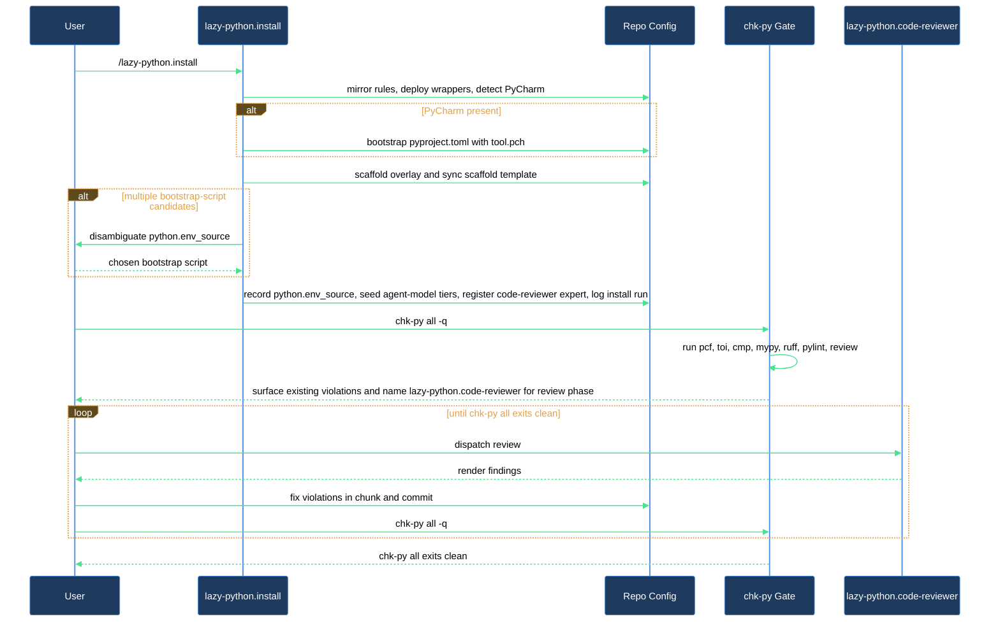

# Adopt the plugin in a repo with pre-existing Python that drifted from the canon

This walkthrough is for anyone bringing `lazycortex-python` into a repo that already has Python files — code written before the plugin existed, imported from another project, or accumulated without a consistent discipline layer. The install wires up the checker stack without touching your existing source; `chk-py all -q` then inventories every violation the canon sees against your tree — style, imports, type-only imports, syntax, types, and lint — so you can work through them in small, committed chunks rather than one enormous diff. A drifted repo commonly surfaces two findings that a green-field repo never does: `pcf`'s language check (comments and docstrings not written in a configured language) and its project-package resolution (import-boundary checks aimed at the wrong first-party package). Once the checker gate is clean, `lazy-python.knowledge-sweep` catches up the repo's `Domain(...):` / `Contract:` knowledge markers — building the domain-groups dictionary from whatever the remediation pass parked along the way. By the end, every checker passes, the domain-groups dictionary reflects the repo's actual subject areas, and the PostToolUse hook prevents new drift from silently accumulating.

## Outcome

After this walkthrough you have:

- The full plugin wired: rule mirrors, `cli/chk-py` / `cli/tst-py` wrappers, `pyproject.toml` checker sections, overlay stubs, scaffold template, and PostToolUse hook live.
- A baseline `chk-py all` run with every pre-existing violation captured in its output — nothing hidden, nothing auto-fixed.
- A `[tool.pcf]` section in `pyproject.toml` that actually matches this repo — `allowed_languages` declared if the existing comments/docstrings aren't English, `project_package` pinned if autodetection picked the wrong first-party package.
- Each violation batch committed as a separate, passing checkpoint so `git log` reflects coherent units of remediation work.
- A domain-groups dictionary built (or grown) from the `Domain(unfiled):` blocks the remediation pass parked, with every block filed under a real group via `lazy-python.knowledge-sweep`.
- A clean `chk-py all -q` exit on the final tree — the repo is now on the same footing as a green-field install.

## What you need

- `lazycortex-core` installed and enabled in Claude Code.
- `lazycortex-python@lazycortex` installed and enabled — `enabledPlugins` in your `~/.claude/settings.json`.
- Python 3 reachable on `$PATH`.
- Write access to the repo root (`pyproject.toml`, `.gitignore`, `cli/`, `docs/guidelines/`, `.claude/`).
- A `pyproject.toml` at the repo root — even a minimal one. If the repo predates `pyproject.toml`, create a stub with `[project]` before running the install; Step 4 merges checker sections into it without replacing consumer sections.
- A sense of what language the existing comments and docstrings are written in — `pcf` checks this by default (see Step 2) and a repo that isn't purely English needs a decision before remediation starts.

## The journey

### Step 1 — Run the install

In your Claude Code session, with the repo open, invoke:

```
/lazy-python.install
```

The install runs its ordered steps automatically and asks you almost nothing. Install scope doesn't need resolving — lazycortex-python always targets your project's `${CLAUDE_PROJECT_DIR}`, regardless of where the plugin is enabled. PyCharm support (`pch`) is derived from whether `inspect.sh` is present on the machine — the install probes for it and deploys `[tool.pch]` in `pyproject.toml` only when PyCharm is actually available. It records `python.env_source` in `.claude/lazy.settings.json` when your repo ships a recognised bootstrap script (`cli/env`, `.env.sh`, `scripts/env.sh`) — zero or one candidate is handled silently, and more than one triggers a one-time disambiguation prompt naming each candidate. That prompt, plus a genuine file-sync conflict, are the only two questions this install ever raises. The install never touches `CLAUDE.md` (the plugin rules load from `.claude/rules/` automatically once the plugin is enabled).

One step matters specifically for a migration: the install scaffolds `docs/guidelines/*.md` overlay stubs but deliberately does **not** seed `docs/guidelines/domain-groups.md` — that dictionary is a language-neutral registry the install leaves for Step 4 of this walkthrough to build from what your repo actually contains, rather than guessing at empty groups up front.

Every step is idempotent — safe to re-run if interrupted.

**Migrating from a pre-2.0 install.** If this repo adopted `lazycortex-python` before the 2.0.0 release, its docstrings may depend on things `pcf` used to ship built-in: `Generation Rules` / `Value Ranges` docstring sections and a hardcoded `_field_filters` private-name escape hatch. As of 2.0, none of that is baked in — every project declares its own via `[tool.pcf]` in `pyproject.toml`. The install only appends checker sections that are missing; it never touches a `[tool.pcf]` block you already have, so re-running `/lazy-python.install` on an existing repo is safe. If your repo relied on the old built-ins, open `pyproject.toml` and find the commented-out `extra_docstring_sections`, `d2_exempt_marker_attrs`, and `private_name_allowlist` examples under `[tool.pcf]` — uncomment and adapt them to your project's actual section names and field names before Step 2's inventory run, or `chk-py` will flag every class that used the old built-in sections as missing them.

**Migrating past the 3.0 marker rename.** Release 3.0 renamed three marker comments to fit a name-register scheme (the register a marker's name uses now encodes its category): `REF:` became `ref:` (lowercase, one-line annotation), `# DOC(...):` became `# Domain(...):` (Capitalized, opens a standalone knowledge block), and `# Contract!` became `# Contract:` (also Capitalized, also standalone — no text after the colon on the marker line itself). `pcf` also enforces a blank-line boundary around every Capitalized block marker (`Domain(...):`, `Contract:`, `Decision:`) — a marker glued to a statement, or a block whose last line touches the code that follows, is a violation in its own right, independent of the rename. If this repo's Python predates 3.0, expect leftover `REF:` / `DOC(...):` / `Contract!` occurrences and un-separated `Domain(...):` / `Contract:` / `Decision:` blocks to surface as `pcf` findings in Step 2's inventory — rename the markers and insert the separating blank lines as part of remediation.

**Verification gate**: the install ends with a one-line-per-step report. Confirm each step shows an outcome word: `mirrored-3`, `wrappers-deployed-2 + gitignore-ensured`, `pch-ready` or `pch-missing-inspect-sh`, `pyproject-bootstrapped`, an `env-source-*` outcome, a `seeded` or `unchanged` tier-seed outcome, an `expert-registered` or `expert-already-registered` outcome, and so on. If any line shows `ERROR` or is missing, see the troubleshooting doc before proceeding.

### Step 2 — Take a full violation inventory

Run the checker stack against the entire tree:

```bash
./cli/chk-py all -q
```

On first run the venv resolver creates `.venv/` at the repo root and installs `mypy`, `pylint`, `pytest`, `ruff`, `pytest-clarity`, and `pytest-sugar` — this takes 30–60 seconds. Subsequent runs are fast.

`chk-py all` runs the six-step gate in order: `pcf` (style critical-fail) → `toi` (type-only imports) → `cmp` (py_compile syntax check) → `mypy` → `ruff` → `pylint`. The `-q` flag suppresses per-file progress and shows only violations and the final summary.

Save the full output — it is your remediation queue. Do not start fixing yet; complete the inventory first so you know the scope before touching any file.

**What to expect in a drifted repo**: `pcf` and `ruff` typically surface the most findings — missing or malformed docstrings, import-block ordering, line-length overruns, and bare `except` clauses. Two `pcf` finding classes are specific to repos that predate this discipline layer, and both are configured, not hand-fixed line by line:

- **Language.** `pcf` checks that every comment and docstring is written in a configured language — by default just `english`, resolved by matching each letter's Unicode script against the language names in `[tool.pcf] allowed_languages`. A repo whose existing comments were written in another language (or several) surfaces one finding per offending line, naming the first letter that doesn't match. Add the languages this repo actually uses to `[tool.pcf] allowed_languages` in `pyproject.toml` before working through the language findings — a single wrong assumption otherwise produces a finding on every non-English comment in the tree. A finding you genuinely want to keep as-is (a proper noun, a quoted external string) is exempted with a trailing `# waiver: <reason>` rather than a config change.
- **Project package.** `pcf`'s import-boundary checks (which imports count as first-party vs. third-party) resolve the project's own package name — from `[tool.pcf] project_package` when set, otherwise autodetected from the repo layout. A repo whose layout confuses the autodetector (an unconventional `src/` shape, multiple top-level packages) surfaces import-classification findings that trace back to the wrong package being treated as first-party. Pin `project_package` explicitly in `pyproject.toml` rather than fighting individual findings.

If Step 1's pre-2.0 migration note applies to your repo and you skipped uncommenting the `[tool.pcf]` examples, expect `pcf` to also flag every class that used the old `Generation Rules` / `Value Ranges` sections or the old `_field_filters` escape hatch — go back to Step 1 and declare them before continuing. If Step 1's 3.0 marker-rename note applies, expect additional `pcf` findings for any leftover `REF:` / `DOC(...):` / `Contract!` markers and for `Domain(...):` / `Contract:` / `Decision:` blocks that aren't blank-line-separated from their surroundings. `mypy` surfaces type annotation gaps. `pylint` adds naming and complexity findings. A repo with a few dozen Python files may produce hundreds of lines of output; that is normal and expected.

Also run the existing test suite once, before any remediation, so you know its starting state:

```bash
./cli/tst-py -q
```

Called without a module argument, `tst-py` runs every module's tests. Note any pre-existing failures now — those are not something this walkthrough introduces, and you don't want to chase them down mid-remediation thinking you caused them.

### Step 3 — Fix violations in chunks, committing as you go

Work through the violation queue in logical batches rather than one enormous commit. Recommended grouping:

1. **Language and project-package config** — Resolve these first, in `pyproject.toml` (`allowed_languages`, `project_package`), before touching individual files. Fixing config once clears an entire finding class; fixing it file-by-file only re-derives the same config change dozens of times.
2. **Syntax and critical style (`pcf` / `cmp` findings)** — These gate the other checkers; clear them first. A `pcf` violation blocks the whole `chk-py all` run from advancing past the first step cleanly. If this repo predates the 3.0 marker rename, fold the mechanical rename (`REF:` → `ref:`, `# DOC(...):` → `# Domain(...):`, `# Contract!` → `# Contract:`) and the blank-line separation those blocks now need into this same batch.
3. **Type annotations (`mypy` findings)** — Group by module or class; one commit per module keeps the diff readable.
4. **Import ordering and minor style (`ruff` findings)** — Usually mechanical; `ruff` can auto-fix many of these. Run `ruff check --fix <path>` for the mechanical subset, review the diff, then let `pcf` confirm the critical-fail layer still passes.
5. **Naming, complexity, and docstrings (`pylint` / `pcf` docstring findings)** — Most labour-intensive; work file by file.

After each batch:

```bash
./cli/chk-py all -q
./cli/tst-py -q
```

Confirm the batch clears the targeted checker without introducing new violations elsewhere, and that `tst-py` still reports the same (or better) pass/fail state as your Step 2 baseline — a batch that turns `chk-py` green while breaking a previously-passing test is not done. Then commit:

```bash
git commit -am "fix(<scope>): remediate <checker> violations"
```

Repeat until `chk-py all -q` exits with `All checks passed`.

**Chunk sizing guidance**: aim for commits where `chk-py all -q` passes — not just "fewer violations than before". A partial-fix commit that still fails `mypy` is harder to bisect later than a commit that leaves `mypy` files untouched until they are fully resolved.

### Step 4 — Backfill domain and contract markers with knowledge-sweep

A drifted repo's remediation pass in Step 3 routinely surfaces (or writes) `Domain(unfiled):` blocks — mechanics documented without a listed group to file them under, because the repo has no domain-groups dictionary yet. Rather than filing these by hand, dispatch the sweep:

```
/lazy-python.knowledge-sweep
```

The sweep resolves the dictionary path (`.claude/lazy.settings.json[wiki.domains.dictionary]` when set, else `docs/guidelines/domain-groups.md`), then always runs its dictionary-growth step: it collects every parked `Domain(unfiled):` block plus the sources' recurring subject-area vocabulary, clusters them into candidate groups, and puts each candidate to you with `AskUserQuestion` — you tick, edit, or reject each one. Accepted candidates are appended to the dictionary; a rejected cluster stays parked for the next sweep. It also catches groups that are misspelled or simply invented at the keyboard (present in a `Domain(<group>):` block but not in the dictionary), offering **add** or **rename** for each.

Once the dictionary reflects this repo's real subject areas, the sweep enumerates its scope (explicit paths, `wiki.domains.code` globs when configured, or every tracked `.py` file), and dispatches the `lazy-python.domain-writer` and `lazy-python.contract-writer` agents across it — `refile=true` is set automatically so blocks already parked under `unfiled` get re-picked against the grown dictionary, not just newly-written ones. It then re-runs `chk-py all -q` over the touched files to catch cross-file fallout, and commits everything it touched (marker edits plus the dictionary) under an explicit pathspec.

**A repo with nothing parked and no recognisable domain vocabulary yet** is a legitimate outcome — the sweep proposes no candidates and leaves the dictionary untouched. That's not a failure; it means this repo's Python doesn't (yet) carry domain-marker discipline, and the sweep has nothing to cluster from until some markers exist.

### Step 5 — Confirm the PostToolUse hook is live

Make a one-character whitespace edit to any `.py` file in Claude Code. The PostToolUse hook fires after the edit and appends any `pcf.py` violations for that file to the next turn's context — including a language finding if you introduce a comment outside the languages declared in `[tool.pcf] allowed_languages`. On a file you have already cleaned you should see no violations appended — that is the expected result.

You do not configure the hook. It auto-registers from the plugin's `hooks/hooks.json` manifest the moment the plugin is enabled; no `settings.json` write is involved.

### Step 6 — Run a final clean check

Once all violation batches are committed and the knowledge sweep has run:

```bash
./cli/chk-py all -q
./cli/tst-py -q
```

Confirm all six checker steps report clean and `tst-py` shows every test passing (no new failures relative to your Step 2 baseline).

## After you're done

The install is idempotent — re-running `/lazy-python.install` after any future plugin update overwrites only what changed (rule mirrors, wrapper scripts, any missing `pyproject.toml` sections) and leaves your consumer sections and overlay stubs untouched. Re-running is the recommended upgrade path, not a manual diff.

`chk-py all` (paired with `tst-py` for the test layer) is the routine pre-commit gate going forward. The PostToolUse hook covers the inner loop — every `.py` edit surfaces `pcf.py` violations (style, imports, language, project-package boundary) inline so drift is caught at the moment it is introduced rather than at commit time.

`lazy-python.knowledge-sweep` isn't a one-time migration step — run it again whenever parked `Domain(unfiled):` findings pile up, or when the dictionary needs new groups for a subject area the codebase has grown into.

## Migration flow


```mermaid
%%{init: {'themeVariables':{'background':'transparent','primaryColor':'#1e3a5f','primaryBorderColor':'#4a90e2','primaryTextColor':'#fff','lineColor':'#4ae290','actorBkg':'#1e3a5f','actorBorder':'#4a90e2','actorTextColor':'#fff','actorLineColor':'#4a90e2','signalColor':'#4ae290','signalTextColor':'#000','noteBkgColor':'#5f4a1e','noteBorderColor':'#e2a14a','noteTextColor':'#fff','labelBoxBkgColor':'#5f4a1e','labelBoxBorderColor':'#e2a14a','labelTextColor':'#fff','loopTextColor':'#e2a14a'},'sequence':{'diagramPadding':5,'useMaxWidth':true}}}%%
sequenceDiagram
  participant user as User
  participant installSkill as lazy-python.install
  participant repoConfig as Repo Config
  participant chkPyGate as chk-py Gate
  participant codeReviewer as lazy-python.code-reviewer

  user->>installSkill: /lazy-python.install
  installSkill->>repoConfig: mirror rules, deploy wrappers, detect PyCharm
  alt PyCharm present
    installSkill->>repoConfig: bootstrap pyproject.toml with tool.pch
  end
  installSkill->>repoConfig: scaffold overlay and sync scaffold template
  alt multiple bootstrap-script candidates
    installSkill->>user: disambiguate python.env_source
    user-->>installSkill: chosen bootstrap script
  end
  installSkill->>repoConfig: record python.env_source, seed agent-model tiers, register code-reviewer expert, log install run
  user->>chkPyGate: chk-py all -q
  chkPyGate->>chkPyGate: run pcf, toi, cmp, mypy, ruff, pylint, review
  chkPyGate-->>user: surface existing violations and name lazy-python.code-reviewer for review phase
  loop until chk-py all exits clean
    user->>codeReviewer: dispatch review
    codeReviewer-->>user: render findings
    user->>repoConfig: fix violations in chunk and commit
    user->>chkPyGate: chk-py all -q
  end
  chkPyGate-->>user: chk-py all exits clean
```
