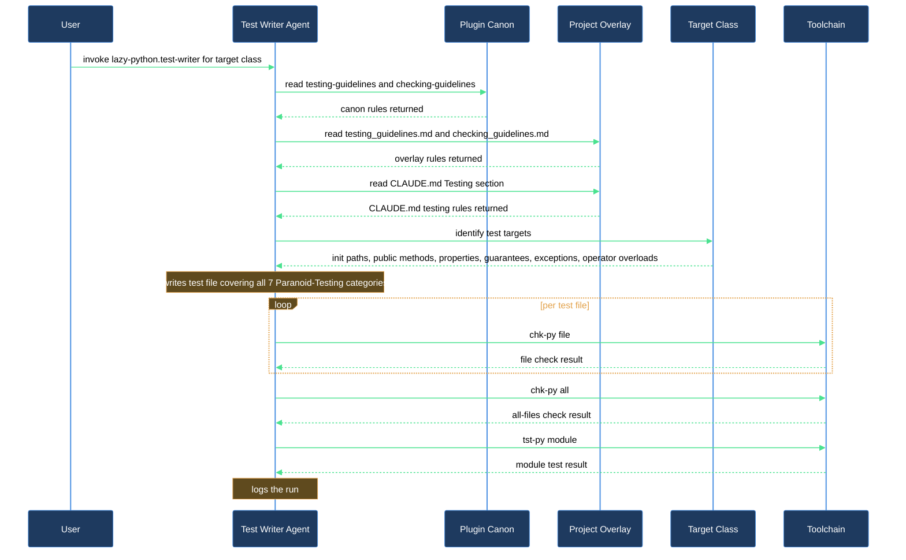

# Generate tests that cover all seven Paranoid-Testing categories for a new class

You've written a new class and it needs tests. The challenge isn't writing any tests — it's writing tests with a consistent shape: one that covers every corner the guidelines demand, names methods correctly, uses the right base class, and passes `chk-py` before `tst-py` ever runs. `lazy-python.test-writer` is the agent that does this: on every dispatch it reads the plugin's canonical testing and checking guidelines, then reads your project's testing overlay, then walks all seven Paranoid-Testing categories before producing the file.

This walkthrough takes you from a freshly written class to a verified test file that satisfies every coverage requirement.

## Outcome

After completing this walkthrough you have:

- A test file at the mirrored path (e.g. `src/mymodule/widget.py` → `tests/mymodule/widget.py`) that covers all seven Paranoid-Testing categories.
- The file passing `chk-py all -q` (style + type clean) and `tst-py <module> -q` (suite green, or `# FAILS:` comments on any test the implementation does not yet satisfy).
- A run log at `.logs/claude/lazy-python.test-writer/YYYY-MM-DD_HH-MM-SS.md` recording every action the agent took.

## What you need

- `lazycortex-python` installed in your repo (`/lazy-python.install` completed). This deploys `chk-py` and `tst-py` into `cli/`. Add `cli/` to your `$PATH` to invoke them without a prefix, or call `./cli/chk-py` and `./cli/tst-py` directly from the repo root.
- A Python class whose public API has docstrings. The agent derives every testable claim from docstrings (Summary, Guarantees, Args, Returns, Raises) — a class without docstrings produces shallow tests. If the class has no docstrings yet, dispatch `lazy-python.docstring-writer` first.
- Your source tree following the standard mirrored layout (`src/<module>/<file>.py` → `tests/<module>/<file>.py`). The agent uses this convention to place the generated test file. If your project uses a different layout, declare it in `docs/guidelines/testing_guidelines.md`.
- `docs/guidelines/testing_guidelines.md` present (created by `/lazy-python.install` Phase 5). If it does not exist, re-run `/lazy-python.install` — Phase 5 is idempotent and creates the stub without touching other installation artifacts.
- If your project bootstraps secrets or provider credentials from its own shell script before tests can run, make sure `/lazy-python.install` has recorded it — the skill's Step 7 detects a bootstrap script (`cli/env`, `.env.sh`, or `scripts/env.sh`) and records it as `python.env_source` automatically. With that in place, `chk-py` and `tst-py` source the script before running, so the agent's own verification step and your later `tst-py` runs never execute against a half-configured environment.

## The journey

### Step 1 — Confirm your class has docstrings

Open the production class file and check that each public method and the class itself has a docstring. The agent reads:

- The class-level docstring for `Guarantees` bullets — each one becomes its own test.
- Each method's `Args`, `Returns`, and `Raises` sections — each `Raises` entry gets a `pytest.raises` test; each `Returns` description drives happy-path assertions.

A class with only stub docstrings (`"""TODO"""`) gives the agent nothing to anchor to. Sparse docstrings produce correspondingly sparse tests.

If the docstrings are thin, stop here and run:

```
Use the lazy-python.docstring-writer agent to write docstrings for src/mymodule/widget.py
```

Come back to this walkthrough once the docstrings are substantive.

### Step 2 — Check the testing overlay declares your base class

Open `docs/guidelines/testing_guidelines.md`. Find (or add) the section that maps production-class categories to test base classes. A typical entry looks like:

```markdown
## Base test classes

- Plain classes: inherit from `BaseTest` (module: `tests.base`).
- Entity-style classes (those inheriting from `Entity`): inherit from `EntityBaseTest` (module: `tests.entity_base`).
- Data-set-style classes (those whose init accepts `data` / `mode` keywords): inherit from `DataSetBaseTest` (module: `tests.dataset_base`).
```

The agent reads this mapping in Step 1 of its own execution. If the overlay is silent, the agent falls back to a `<YourBaseTest>` placeholder and asks you before proceeding — which interrupts the flow. Writing the mapping in advance keeps the dispatch non-interactive.

You are editing a plain Markdown file that belongs to your project. Write natural-language prose; the agent interprets it the same way it interprets the canonical guidelines.

### Step 3 — Dispatch the agent

Invoke the agent and name the target class or file:

```
Use the lazy-python.test-writer agent to write tests for src/mymodule/widget.py
```

Or target a specific class by name:

```
Use the lazy-python.test-writer agent to write tests for the Widget class in src/mymodule/widget.py
```

The agent's very first action is to create a task list — one task per step — before any file read or write. This structural discipline makes dropped steps impossible: you can watch each task move from pending to completed in the sidebar as the agent works.

The agent then runs its eight ordered steps:

1. **Read guidelines** — reads the plugin canon (`lazy-python.testing-guidelines.md`, `lazy-python.checking-guidelines.md`), then your project overlay (`docs/guidelines/testing_guidelines.md`, `docs/guidelines/checking_guidelines.md`), then the `## Testing` section of `CLAUDE.md`. Outcome: `guidelines-loaded`.
2. **Read production class** — reads the full source file. Outcome: `read`.
3. **Identify test targets** — enumerates `__init__` paths, public methods, properties, documented guarantees, documented exceptions, and operator overloads. Outcome: `<N>-targets`.
4. **Write tests** — writes the test file covering all 7 Paranoid-Testing categories (see Step 4 below for what that means). Outcome: `<N>-tests-written`.
5. **Add class and method docstrings** — ensures every test class starts with `"Test unit for "` and every test method starts with `"Test that "`. Outcome: `done` or `already-present`.
6. **Handle implementation-vs-spec mismatches** — if a test correctly reflects documented behavior but the implementation does not satisfy it yet, the agent adds a `# FAILS: <reason>` comment above that method and reports the divergence. It does not delete the test or fix production code. Outcome: `none` or `<N>-mismatches-flagged`.
7. **Verify with toolchain** — runs `chk-py all <test_file>.py -q`, then `chk-py all -q` for the full project, then `tst-py <module> -q`. Outcome: `clean` or `<N>-violations-fixed`.
8. **Log the run** — writes a structured log to `.logs/claude/lazy-python.test-writer/`. Outcome: `logged`.

Watch for the Step 3 outcome line. It tells you the exact test targets the agent found — if the count is lower than you expect, the missing targets are likely undocumented methods.

### Step 4 — Understand what seven-category coverage means

The agent does not stop after happy-path tests. It walks all seven Paranoid-Testing categories for the class:

1. **Happy path** — every public method and property called with valid arguments. At least one test per public surface.
2. **Wrong / invalid arguments** — `None`, wrong types, empty strings, empty collections, negative numbers, zero where a positive value is expected. At least two per method that accepts arguments.
3. **Boundary values** — `min`, `max`, one-beyond-boundary, single-element collections, `float('inf')`, `float('nan')` where applicable. At least two per method with numeric or collection parameters.
4. **Error conditions** — every `Raises` entry in the docstring gets its own `pytest.raises(ExceptionType, match = "...")` test. The agent tests the exact exception type and matches the message pattern.
5. **State transitions** — if the class has lifecycle states (e.g. initialized → active → closed), the agent tests valid transitions and attempts invalid ones.
6. **Operator overloading** — if the class defines `__add__`, `__matmul__`, `__eq__`, or any other operator, the agent tests with wrong operand types and expects `TypeError` via Python's `NotImplemented` protocol.
7. **Documented guarantees** — every bullet in the class's `Guarantees` docstring section becomes its own test method.

Categories 1–3 come from the public API surface. Categories 4–7 come directly from the docstring. A class with thorough docstrings produces a test file that covers all seven; a class with sparse docstrings will have thin coverage in categories 4 and 7.

### Step 5 — Review the generated file

After the agent completes, open the test file at the mirrored path. Check:

- **Naming**: test class is `Test<ProductionClassName>`, test methods are under 35 characters, no production class name repeated in method names.
- **Coverage**: scan the seven categories above. Each category should have at least the minimums the guidelines require.
- **`# FAILS:` comments**: any test the agent marked as failing against the current implementation. These are not errors in the test file — they are signals that the production code does not yet satisfy its own documented contract. Decide whether to fix the implementation or update the docstring.
- **Assertion messages**: every `assert` statement should carry an f-string message showing both expected and actual values.

### Step 6 — Run the suite yourself

The agent ran `tst-py <module> -q` in Step 7. Run it again to confirm the suite is still green in your shell:

```bash
tst-py mymodule -q
```

`tst-py` is the project-local wrapper deployed into `cli/` by `/lazy-python.install`, layered over the plugin's shipped `tst` runner. It uses bare module names, not file paths and not `.py` extensions. If the module path is nested, use the dotted path:

```bash
tst-py mymodule.subpackage -q
```

If your project declares `python.env_source` (see "What you need" above), `tst-py` sources that script automatically before running pytest — no extra step needed on your part.

If your project aggregates its suites through re-export shims (a `test_all.py` that star-imports every package, plus per-package shim files re-exporting a package's own test classes), the new test class the agent just wrote may get collected twice — once through its own module, once through the aggregator. `tst-py` deduplicates this automatically via its bundled pytest plugin: no setting to enable, nothing to configure. When it removes at least one duplicate you'll see a one-line summary in the output:

```
[lazy-python] deduplicated N re-exported test items
```

If your project has no such shims, no key ever repeats and the line never prints — the run behaves exactly as before.

A green run with no `# FAILS:` comments means the class is fully covered and the implementation satisfies its contract. A run with `# FAILS:` comments means the agent found divergences between the docstring contract and the implementation — these need your attention before the tests can be considered passing.

### Step 7 — Iterate as the class evolves

When you add a new public method to the class later, dispatch the agent again:

```
Use the lazy-python.test-writer agent to add tests for the new render() method in src/mymodule/widget.py
```

The agent re-reads the guidelines on every dispatch. It will add new test methods alongside the existing ones rather than regenerating the entire file.

## After you're done

The test file lives at the mirrored path and is a stable contract. The `lazy-python.tests.md` rule (auto-loaded on any `tests/**/*.py` edit) reminds Claude to use `lazy-python.test-writer` whenever future edits to the test file are needed — Claude does not hand-edit test files when the agent is available.

Run `/lazy-python.audit` at any time to confirm the full installation is intact. Check 10 (`overlay-present`) tells you whether the testing overlay exists; the audit does not validate overlay content.

If a future dispatch produces tests that contradict your project's conventions, the fix is a more explicit rule in `docs/guidelines/testing_guidelines.md`, not a hand-edit to the test file. The overlay is re-read on every dispatch; updating it takes effect immediately.

If your project uses an aggregate test file pattern (one file that validates many sibling classes via auto-discovery rather than individual per-class files), declare that pattern in your testing overlay. The agent reads the overlay before deciding whether to create a new file or skip a class it detects is already covered. Separately, `tst-py`'s automatic dedup (Step 6 above) handles the double-collection this pattern causes at run time — the two mechanisms address different problems: the overlay controls whether the agent writes a new file at all, dedup controls whether an already-written class gets counted twice when the suite runs.

Track `docs/guidelines/testing_guidelines.md` in version control. When a teammate dispatches the agent and gets tests that violate your project's base-class mapping, the shared overlay is the single place to fix it.

## How test-writer walks a class


