# Install and configure lazycortex-review

Getting lazycortex-review running in a repo is a three-command sequence: install bootstraps the settings scaffold and working directories, configure wires the first document class through a guided wizard, and audit confirms the result is coherent before any review loop starts. All three skills own their corner of `.claude/lazy.settings.json` — you drive the workflow through slash commands and the skills write the file; there is nothing to hand-edit.

## What's in this block

**`/lazy-review.install`** seeds the repo for review. It merges the `review.classes`, `experts`, and `routines` defaults into `.claude/lazy.settings.json`, creates the `.experts/.jobs/` job queue and `.logs/lazy-review/runs/` log tree, and adds the `Bash(lazycortex-review *)` allow-pattern to `settings.local.json` so that cross-skill CLI calls succeed in `dontAsk` permission mode. If the project's `daemon.enabled` flag is `false`, install registers everything except the `lazy-review.scan` routine — a daemon-gated routine that can't run is dead config. When the routine does survive the gate, install also offers any optional routine protocols relevant to reviewing authored markdown documents; accept or decline each one, the mandatory doc-review and markdown-style protocols stay attached either way. The skill is idempotent: re-running it on an already-bootstrapped repo is a no-op on every setting and directory that already exists.

**`/lazy-review.configure`** turns an empty `review.classes` block into a live class definition. The wizard collects the glob pattern that identifies which documents belong to the class, the main-writer and historian expert assignments, any `validation` or `terminal` section definitions, and the edit-marker style. Every question is read-first: if a value is already recorded in the settings file the wizard skips the prompt and reuses the persisted value silently. Once all values are collected, the skill writes them back and immediately calls `/lazy-review.audit` so you see any configuration inconsistencies before the first review round starts. When the daemon is running, it also folds this class's globs into the `lazy-review.scan` routine — coarsening each into a directory-level mask, filtering the scan to only documents that have opted into review, and running on a minute cadence — so the daemon watches the right directories without re-scanning documents nobody opted in.

**`/lazy-review.audit`** is the read-only health check for the review configuration. It runs the `audit.py` script against `.claude/lazy.settings.json`, checks schema correctness, verifies that every expert name referenced by a class exists in the top-level `experts` dictionary, confirms `git_author` completeness, and validates `edit_marker_style`. It returns `PASS`, `WARN`, or `FAIL` with per-finding detail grouped by severity. You can run it at any time — it never writes anything.

## How they work together

The typical setup path is linear: install once per repo, configure once per document class, then audit to confirm. Run `/lazy-review.install` immediately after enabling the plugin. It prints the `.gitignore` lines you should add by hand (`.experts/` and `.logs/lazy-review/`) and tells you when it is done. Then run `/lazy-review.configure`. The wizard walks you through each required value one question at a time — you only see prompts for values that aren't already on record, so a fully-configured class reruns silently. At the end, the wizard surfaces the audit findings so you can fix any FAIL-level issues before starting a review.

Once a class is configured, you can run `/lazy-review.audit` on its own whenever you edit the settings manually for a class, add a new expert to the registry, or want to confirm nothing has drifted. If configure ends with `audit: FAIL`, re-enter the wizard (`/lazy-review.configure`) and supply the missing values — the wizard is read-first, so it only re-asks the questions whose answers are still absent or invalid.

You can run configure multiple times to register additional document classes. Each invocation appends a new class to `review.classes`; existing classes are left untouched.

## Common adjustments

- **Change which experts are assigned to a class** — run `/lazy-review.configure`. The wizard detects existing values and skips settled questions; answer only the prompts that appear for the changed role.
- **Add a new section (validation or terminal) to a class** — run `/lazy-review.configure`. Existing sections are read from record; only the "Add another section?" loop is active.
- **Switch the edit-marker style** — run `/lazy-review.configure` and change the `edit_marker_style` value when the prompt appears. Supported values: `simple`, `diff`, `criticmarkup`, `html`.
- **Enable or disable the `lazy-review.scan` routine** — the routine's presence is controlled by `daemon.enabled` in the core settings; use `/lazy-core.install` to toggle the daemon flag, then re-run `/lazy-review.install` to sync the routine registration.
- **Register the CLI allow-pattern after a settings reset** — re-run `/lazy-review.install`. It adds `Bash(lazycortex-review *)` to `settings.local.json` only if the pattern is absent; re-running is safe.

## How install, configure, and audit fit together

```mermaid
%%{init: {'themeVariables':{'background':'transparent','lineColor':'#000','textColor':'#000','edgeLabelBackground':'#fff'},'themeCSS':'.edgeLabel{background-color:transparent!important}.edgeLabel p{background-color:transparent!important}','flowchart':{'diagramPadding':5,'useMaxWidth':true}}}%%
flowchart LR
  installSeedsSettings[Run lazy-review.install]
  daemonEnabledGate{daemon.enabled?}
  registerScanRoutine[Register lazy-review.scan routine]
  unregisterScanRoutine[Unregister lazy-review.scan routine]
  configureAddsReviewClasses[Run lazy-review.configure wizard]
  auditValidatesResult[Run lazy-review.audit]
  setupComplete[Setup complete]

  installSeedsSettings -->|Step 2| daemonEnabledGate
  daemonEnabledGate -->|true or unset| registerScanRoutine
  daemonEnabledGate -->|false| unregisterScanRoutine
  registerScanRoutine -->|install done| configureAddsReviewClasses
  unregisterScanRoutine -->|install done| configureAddsReviewClasses
  configureAddsReviewClasses -->|classes added| auditValidatesResult
  auditValidatesResult -->|validated| setupComplete

  classDef entry fill:#1e3a5f,stroke:#4a90e2,color:#fff
  classDef guard fill:#5f4a1e,stroke:#e2a14a,color:#fff
  classDef action fill:#1e5f3a,stroke:#4ae290,color:#fff
  classDef success fill:#0d4d2a,stroke:#4ae290,color:#fff,stroke-width:2px

  class installSeedsSettings entry
  class daemonEnabledGate guard
  class registerScanRoutine action
  class unregisterScanRoutine action
  class configureAddsReviewClasses action
  class auditValidatesResult action
  class setupComplete success
```

## See also

- The `review-loop` block covers `/lazy-review.start`, `/lazy-review.status`, `/lazy-review.stop`, and `/lazy-review.finalize` — the day-to-day verbs you reach for after install-and-audit is complete.
