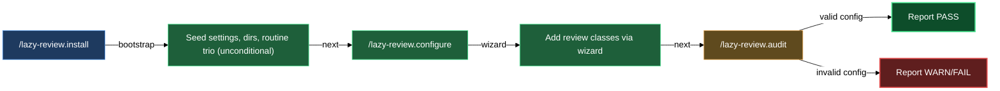

# Install and configure lazycortex-review

Getting lazycortex-review running in a repo is a three-command sequence: install bootstraps the settings scaffold and working directories, configure wires the first document class through a guided wizard, and audit confirms the result is coherent before any review loop starts. All three skills own their corner of `.claude/lazy.settings.json` — you drive the workflow through slash commands and the skills write the file; there is nothing to hand-edit.

## What's in this block

**`/lazy-review.install`** seeds the repo for review. It merges the `review.classes`, `experts`, and `routines` defaults into `.claude/lazy.settings.json`, creates the `.experts/.jobs/` job queue and `.logs/lazy-review/runs/` log tree, and adds the `Bash("${LAZYCORTEX_PYTHON:-python3}" *)` allow-pattern to `settings.local.json` so that cross-skill CLI calls succeed in `dontAsk` permission mode. The seed registers a trio of routines: `lazy-review.coordinator-watch` (the git-watch that turns a commit into a coordinator wake), `lazy-review.collect` (the interval postman that lands finished expert payloads), and `lazy-review.sanitize` (a daily cron sweep that repairs the review loop's stuck-state cases — a lost writer wake, an orphaned review, or markers left behind on a document that no longer exists). The trio registers unconditionally, regardless of the project's `daemon.enabled` setting — a checkout with no daemon running can still fire the interval, git-watch, and cron routines by hand via `/lazy-runtime.tick`, so withholding the registration would only strip config that tick needs. Whether the daemon itself is up and running them on schedule is `/lazy-core.install`'s concern, not this skill's. Install always attaches the coordinator watch routine's two mandatory protocols — the coordination playbook the woken coordinator reasons from, and the shared markdown-style protocol every wake needs since it produces markdown in the vault — and asks nothing, since a mandatory protocol is not an operator choice; `lazy-review.collect` takes no protocols at all, being a mechanical sweep that dispatches no agent. Install never offers optional protocols on top of that pair — reach for `/lazy-routine.offer-protocols` afterwards if you want to attach an extra one. Install also seeds the canonical model tier for the plugin's shipped agents (`review.coordinator` and `lazy-review.doc_doctor`) into the project's agent-model configuration, so they run on the right model from the first invocation without a separate setup step. In a vault (a repo with an `.obsidian/` directory), install also drops the `review-callouts.css` snippet into `.obsidian/snippets/` and enables it in `appearance.json`, so the review loop's own callouts — the banner, the operator command channel, escalation questions, and concerns — render distinctly from ordinary Obsidian callouts instead of looking alike. The skill is idempotent: re-running it on an already-bootstrapped repo is a no-op on every setting, directory, and file that already exists.

Running install on a repo that was set up before the coordinator loop existed also migrates it in the same pass, unconditionally: it retires the old `lazy-review.scan` routine (its `process-file` consumer is gone with the script state machine), derives `review.watch_root` from that routine's former path globs so the new watch keeps scanning the same tree, and drops the retired `history` group from every class's expert assignments (the coordinator now writes `# History` inline, so a link to a dedicated historian expert points at nothing). None of this touches an operator-set `review.watch_root` — a value already on record always wins over the derivation.

**`/lazy-review.configure`** turns an empty `review.classes` block into a live class definition. The wizard collects the glob pattern that identifies which documents belong to the class, a short unique identity token for the class (used to find and extend the entry on a later run), the main-writer assignments, any `validation` or `terminal` section definitions, and the edit-marker style. Every question is read-first: if a value is already recorded in the settings file the wizard skips the prompt and reuses the persisted value silently, and every prompt it does ask now opens with a short context block — where in the wizard you are, what's already on record, and why the question can't be derived — before the question itself, so a fully-configured class still reruns silently while a genuinely new one explains itself as it goes. Once all values are collected, the skill writes them back, then — only when the watch routine is already registered, which is always true once `/lazy-review.install` has run, since install no longer gates the trio on the daemon flag — widens `review.watch_root` to cover the new class's paths (the watch carries one pathspec, so this widening is monotonic: it only grows the scanned tree, never narrows it away from a class configured earlier) and calls `/lazy-review.audit` so you see any configuration inconsistencies before the first review round starts. A class can also carry a `protocols` list of extra plugin-namespaced references the coordinator folds into every writer dispatch for that class's documents; the wizard never asks for this — it is seeded by whichever plugin owns the document kind and simply preserved on every configure run.

**`/lazy-review.audit`** is the read-only health check for the review configuration. It runs the `audit.py` script against `.claude/lazy.settings.json`, checks schema correctness, verifies that every expert name referenced by a class exists in the top-level `experts` dictionary, confirms `git_author` completeness, and validates `edit_marker_style`. For classes using the section-writer schema it also checks each `validation` / `terminal` entry's section-id alphabet and uniqueness, its position enum (`top` / `bottom`), and that its expert name resolves and flattens to a tag-safe string. It additionally scans every document matched by a configured class's `paths` for `#review/<tag>` callouts and flags any tag outside the closed vocabulary of operator/coordinator markers and banner states. It returns `PASS`, `WARN`, or `FAIL` with per-finding detail grouped by severity. You can run it at any time — it never writes anything.

## How they work together

The typical setup path is linear: install once per repo, configure once per document class, then audit to confirm. Run `/lazy-review.install` immediately after enabling the plugin. It prints the `.gitignore` lines you should add by hand (`.experts/` and `.logs/lazy-review/`) and tells you when it is done. Then run `/lazy-review.configure`. The wizard walks you through each required value one question at a time — you only see prompts for values that aren't already on record, so a fully-configured class reruns silently. At the end, the wizard surfaces the audit findings so you can fix any FAIL-level issues before starting a review.

Once a class is configured, you can run `/lazy-review.audit` on its own whenever you edit the settings manually for a class, add a new expert to the registry, or want to confirm nothing has drifted. If configure ends with `audit: FAIL`, re-enter the wizard (`/lazy-review.configure`) and supply the missing values — the wizard is read-first, so it only re-asks the questions whose answers are still absent or invalid.

You can run configure multiple times to register additional document classes. Each invocation appends a new class to `review.classes` and — while the watch routine is registered, which install always ensures — widens the coordinator's single watch pathspec to keep covering it; existing classes are left untouched.

## Common adjustments

- **Change which experts are assigned to a class** — run `/lazy-review.configure`. The wizard detects existing values and skips settled questions; answer only the prompts that appear for the changed role.
- **Add a new section (validation or terminal) to a class** — run `/lazy-review.configure`. Existing sections are read from record; only the "Add another section?" loop is active.
- **Switch the edit-marker style** — run `/lazy-review.configure` and change the `edit_marker_style` value when the prompt appears. Supported values: `simple`, `diff`, `criticmarkup`, `html`. The new value only governs review cycles that start after the change: `/lazy-review.start` (and `/lazy-review.submit`) stamps the style into the document's own frontmatter as `review_marker_style` the moment its cycle opens, and the coordinator writes that document's edit markers against the pinned value from then on — a class-wide style change never rewrites the markers on a document already mid-review.
- **Make the review routines actually run** — `/lazy-review.install` always registers `lazy-review.coordinator-watch`, `lazy-review.collect`, and `lazy-review.sanitize`, whether or not the core daemon is on; a registered-but-idle routine just means nothing is consuming it yet. What decides whether they fire on schedule is the `lazycortex-core` runtime daemon itself — toggle `daemon.enabled` and run the supervisor via `/lazy-core.install`, or use `/lazy-runtime.tick` to fire the same routines by hand on a checkout with no daemon running.
- **Attach an extra protocol to the coordinator's watch routine** — `/lazy-review.install` only ever attaches the mandatory coordination-playbook and markdown-style protocols, and never asks; run `/lazy-routine.offer-protocols` afterwards to add anything beyond that pair.
- **Register the CLI allow-pattern after a settings reset** — re-run `/lazy-review.install`. It adds `Bash("${LAZYCORTEX_PYTHON:-python3}" *)` to `settings.local.json` only if the pattern is absent; re-running is safe.
- **Review callouts still look alike after install** — in a vault, `/lazy-review.install` writes `appearance.json` on its own but Obsidian doesn't watch that file mid-session; reload the vault, or click the reload icon next to `review-callouts` in Settings → Appearance → CSS snippets.
- **Repo has no `.obsidian/` directory** — install skips the callout-styling step entirely; review still works, the callouts just render with Obsidian's default look.
- **Snippet conflict during an unattended install** — when a hand-edited `review-callouts.css` conflicts with the shipped update, `/lazy-review.install` normally asks which side wins. Running it non-interactively (for example via `/lazy-core.autosetup`) skips that question instead of stalling: it keeps your local region, still applies the rest of the shipped delta, and names the file so you can resolve the conflict later by running `/lazy-review.install` yourself.

## How install, configure, and audit fit together

```mermaid
%%{init: {'themeVariables':{'background':'transparent','lineColor':'#000','textColor':'#000','edgeLabelBackground':'#fff'},'themeCSS':'.edgeLabel{background-color:transparent!important}.edgeLabel p{background-color:transparent!important}','flowchart':{'diagramPadding':5,'useMaxWidth':true}}}%%
flowchart LR
  runLazyReviewInstall["/lazy-review.install"]
  seedSettingsAndDirs["Seed settings, dirs, routine trio (unconditional)"]
  runLazyReviewConfigure["/lazy-review.configure"]
  addReviewClasses["Add review classes via wizard"]
  runLazyReviewAudit["/lazy-review.audit"]
  reportPass["Report PASS"]
  reportFail["Report WARN/FAIL"]

  runLazyReviewInstall -->|bootstrap| seedSettingsAndDirs
  seedSettingsAndDirs -->|next| runLazyReviewConfigure
  runLazyReviewConfigure -->|wizard| addReviewClasses
  addReviewClasses -->|next| runLazyReviewAudit
  runLazyReviewAudit -->|valid config| reportPass
  runLazyReviewAudit -->|invalid config| reportFail

  classDef entry fill:#1e3a5f,stroke:#4a90e2,color:#fff
  classDef action fill:#1e5f3a,stroke:#4ae290,color:#fff
  classDef guard fill:#5f4a1e,stroke:#e2a14a,color:#fff
  classDef success fill:#0d4d2a,stroke:#4ae290,color:#fff,stroke-width:2px
  classDef error fill:#5f1e1e,stroke:#e24a4a,color:#fff,stroke-width:2px

  class runLazyReviewInstall entry
  class seedSettingsAndDirs action
  class runLazyReviewConfigure action
  class addReviewClasses action
  class runLazyReviewAudit guard
  class reportPass success
  class reportFail error
```

## See also

- The `review-cycle` block covers `/lazy-review.start`, `/lazy-review.status`, `/lazy-review.stop`, and `/lazy-review.finalize` — the day-to-day verbs you reach for after install-and-audit is complete.
