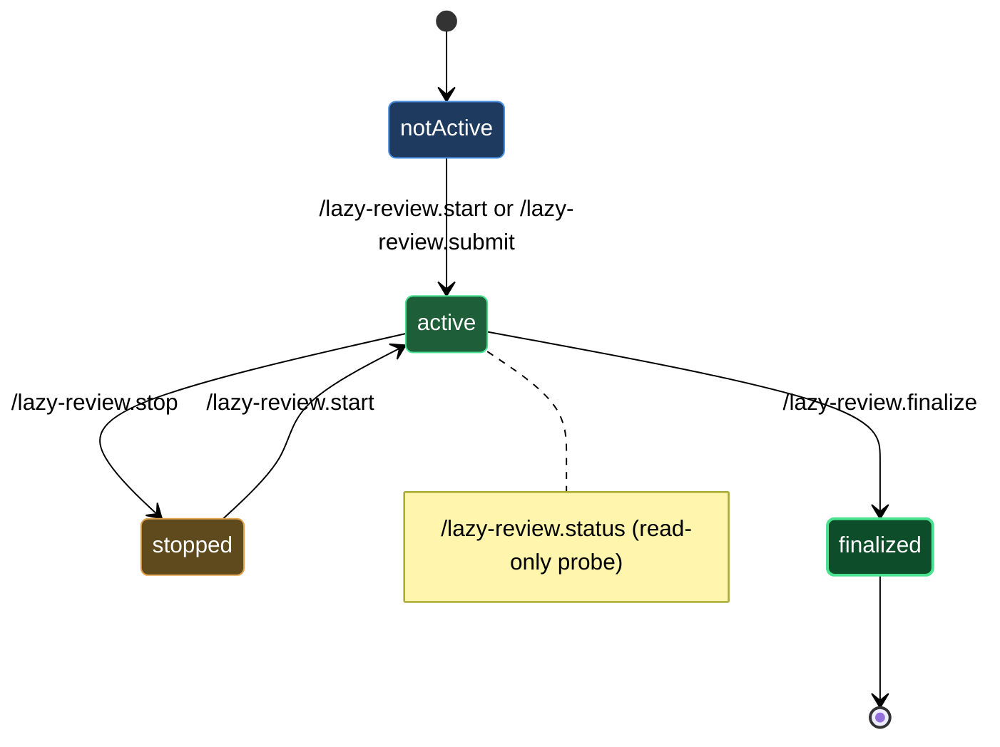

# Review cycle

The five verbs in this block are the operator's handles on a document that lives inside a review loop. Together they answer one practical question: "where is this document right now, and what do I do next?" You opt a document in with `/lazy-review.start` or `/lazy-review.submit`, check its state at any time with `/lazy-review.status`, pause the loop cleanly with `/lazy-review.stop`, and seal the finished document with `/lazy-review.finalize`. Every transition commits under your git identity, so the full lifecycle is auditable from the repo log.

The review loop itself — dispatching expert jobs, splicing suggestions, advancing rounds — is handled by the daemon running in the background. These five verbs are the entry and exit points you control directly; the daemon drives the middle.

## When you'd use this

- Opting a spec or RFC into review so the expert team picks it up on the next daemon tick.
- Skipping the opening writer round on a document whose revisions are already in the file and landing directly on the reviewer queue.
- Checking at a glance whether a doc is still waiting, under review, or approved — without opening the file.
- Pulling a document out of the loop mid-round (for a break, a hard edit, or an indefinite hold) without losing round history.
- Closing out a fully-approved document so it looks like an ordinary markdown file again, with a `# History` section as the only trace of the review lifecycle.

## How it fits together

You start the lifecycle with either `/lazy-review.start <file>` or `/lazy-review.submit <file>`. Both set the same frontmatter bootstrap (`review_active: true`, `review_round: 1`, `approved: false`) and drop a Waiting banner above the first heading, committing the change under your git identity. The difference is the starting position: `start` hands the document to the opening main-writer expert first; `submit` pre-seeds that round as already done and lands the document directly on the reviewer queue. Use `submit` when you have already revised the document yourself and want reviewer feedback without a redundant writer pass. The optional `--expert <name>` flag on `submit` pins a per-document expert override on top of the class default.

Once a document is active, `/lazy-review.status <file>` gives you a read-only JSON snapshot: `review_active`, `review_round`, `approved`, the current banner state, and the list of sections with their assigned expert owners. Nothing is written; nothing is committed. Run it any time you want to know what the daemon last touched.

If you need to halt the loop — to make substantial edits, hold the review, or simply park the document — run `/lazy-review.stop <file>`. The skill flips `review_active: false` and commits, leaving `review_round`, `approved`, and `# History` intact. When you are ready to resume, `/lazy-review.start <file>` on a stopped document re-enters from the same round. The idempotency contract applies in both directions: calling `stop` on an already-stopped document is a no-op; calling `start` on an already-active document is a no-op.

When every section is approved — either by the daemon completing its final round automatically, or by you deciding the document is ready — run `/lazy-review.finalize <file>`. The skill folds all edit-annotation markers into the final text, strips the banner and approve checkbox, removes every system callout (keeping `# History`), sets `review_active: false`, and commits with a `Doc-Review-Phase: finalize` trailer. After that commit the document is an ordinary markdown file. The finalize commit is the audit-trail terminator: `approved: true` in frontmatter and a populated `# History` section are the only evidence the review lifecycle ever ran.

## Common adjustments

- **Pin an expert per document** — pass `--expert <name>` to `/lazy-review.submit` to override the class `experts.main` assignment for that file only. To change the class-level assignment for all future documents, run `/lazy-review.configure`.
- **Resume from a paused state** — after `/lazy-review.stop`, re-running `/lazy-review.start <file>` picks up from the preserved `review_round` and `approved` values. No manual frontmatter editing needed.
- **Hand-crank finalization** — normally the daemon fires finalization automatically once the final writer confirms. Run `/lazy-review.finalize <file>` directly if you want to close out the document yourself rather than waiting for the daemon tick.
- **Change edit-marker style** — finalization reads `lazycortex-review.edit_marker_style` from `lazy.settings.json`. To change the style for future reviews, run `/lazy-review.configure`.

## Document lifecycle

## See also

- [install-and-audit](install-and-audit.md) — install the plugin, define review classes, and validate the configuration before starting your first review.
