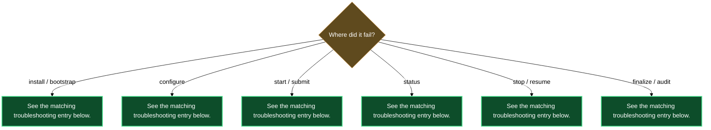

# Troubleshooting

## `/lazy-review.install` fails with a permission error on `.claude/lazy.settings.json`

**Symptom**: Step 1 exits with an OS permission error, something like `PermissionError: [Errno 13] Permission denied: '.claude/lazy.settings.json'`.

**Likely cause**: The file or its parent `.claude/` directory is owned by a different system user — often from a previous install run under `sudo` or from a file copy that changed ownership.

**Fix**: From your terminal, fix ownership with `chown` on the `.claude/` directory so your current shell user has write access. Then re-run `/lazy-review.install`.

---

## `/lazy-review.install` Step 1 stops on a JSON parse error

**Symptom**: The skill prints a JSON parse error against `.claude/lazy.settings.json` and exits before doing anything.

**Likely cause**: The settings file was hand-edited and is now syntactically invalid JSON.

**Fix**: Open `.claude/lazy.settings.json` and repair the syntax error (a missing comma, an unclosed brace, or a trailing comma after the last key are the usual culprits). Then re-run `/lazy-review.install`.

---

## `/lazy-review.install` Step 2 cannot find the `lazycortex-core` bin

**Symptom**: Step 2 fails to read the `daemon.enabled` flag and prints something like "cannot resolve core bin — $LAZYCORTEX_PLUGIN_DIRS unset and no lazycortex-core cache found".

**Likely cause**: `lazycortex-core` was never installed in this environment, or its cache was cleared.

**Fix**: Run `/lazy-core.install` first. Once the core plugin is installed and its cache is populated, re-run `/lazy-review.install`.

---

## `/lazy-review.configure` aborts with "run `/lazy-review.install` first"

**Symptom**: Phase 1 of the configure wizard immediately exits with the message *"run `/lazy-review.install` first"*.

**Likely cause**: `.claude/lazy.settings.json` does not exist — the per-repo bootstrap has not been run in this checkout.

**Fix**: Run `/lazy-review.install` to create the settings file and seed the default `review.classes` block. Then re-run `/lazy-review.configure`.

---

## `/lazy-review.configure` audit reports FAIL after the wizard completes

**Symptom**: Phase 5 invokes `/lazy-review.audit` and it returns FAIL — typically `expert_<name>_missing` — even though the wizard appeared to complete normally.

**Likely cause**: A class was written referencing an expert name that does not appear in the top-level `experts` dict in `lazy.settings.json`. This happens when the expert display name picked in the wizard does not match any registered expert key.

**Fix**: Run `/lazy-review.configure` again. The wizard is read-first and will only re-ask values that are missing or inconsistent. Adding the missing expert entry, or removing the stale class reference, brings the audit back to PASS.

---

## Section-id prompt in `/lazy-review.configure` keeps re-asking

**Symptom**: When adding a section, the wizard re-asks the section-id question in a loop without accepting any input.

**Likely cause**: Either the entered id does not match `^[a-z][a-z0-9_-]*$` (contains uppercase, spaces, or starts with a digit), or the id is already taken by another section in the same class.

**Fix**: Enter a lowercase alphabetic string with only lowercase letters, digits, hyphens, and underscores — for example `final_check` or `routing`. Check existing section ids by running `/lazy-review.audit`, which lists all registered section ids for every class.

---

## `/lazy-review.start` appears to do nothing (no commit, no banner)

**Symptom**: Running `/lazy-review.start <file>` produces the output `already opted-in: <file>` or makes no visible change.

**Likely cause**: The document already has `review_active: true` in its frontmatter. `start` is idempotent — it does nothing when the document is already in the review loop.

**Fix**: Run `/lazy-review.status <file>` to confirm the current state. If the document is already active and you want to restart from round 1, run `/lazy-review.stop <file>` first to close the current session, then `/lazy-review.start <file>` to open a fresh one.

---

## `/lazy-review.submit` does not land on the reviewer — it lands on the main writer

**Symptom**: After `/lazy-review.submit <file>`, the first round that fires goes to the main writer instead of skipping ahead to a reviewer.

**Likely cause**: `submit` pre-seeds `review_main_done` so the dispatcher skips the opening writer pass, but the dispatcher reads the effective class config at tick time. If the configured class has no reviewer assigned after the main writer, the state machine has nowhere to advance.

**Fix**: Run `/lazy-review.status <file>` and check `owners[]`. If the reviewer slots are empty, run `/lazy-review.configure` to add the required expert assignments for this document's class. Then run `/lazy-review.stop <file>` and `/lazy-review.submit <file>` again to reset the skip-seed.

---

## `/lazy-review.status` returns empty or unhelpful JSON

**Symptom**: `/lazy-review.status <file>` outputs `{}` or a JSON object with every field `null` or `false`.

**Likely cause**: The document has never been opted into the review loop — it has no `review_active` or `review_round` frontmatter fields.

**Fix**: Run `/lazy-review.start <file>` (or `/lazy-review.submit <file>` if you want to skip the opening writer pass) to initialise the frontmatter. Re-run `/lazy-review.status <file>` afterwards to confirm.

---

## `/lazy-review.stop` stops the document but a later `/lazy-review.start` resets the round

**Symptom**: After stopping and restarting a document, `review_round` is back at 1 instead of continuing from where it was.

**Likely cause**: `stop` preserves `review_round` and `approved` as it found them. `start` always writes `review_round: 1` and `approved: false` on first open — it is not a resume operation; it is a fresh open. This is expected behaviour.

**Fix**: If you need to resume mid-round without resetting state, edit the document's frontmatter manually before restarting — set `review_round` to the round you want to resume from. Alternatively, use `/lazy-review.submit <file>` which also opens the document but gives more control over which stage the dispatcher enters.

---

## `/lazy-review.finalize` exits with `already finalized`

**Symptom**: Running `/lazy-review.finalize <file>` prints `already finalized: <file>` and makes no commit.

**Likely cause**: The document is already in finalized shape — its frontmatter has `review_active: false` and all review-loop scaffolding (banner, approve checkbox, system callouts) has already been stripped in a previous finalize run.

**Fix**: No action is needed. If you believe the document was not fully finalized, run `/lazy-review.status <file>` to check the current frontmatter state. If `review_active` is still `true`, the file is still in the loop and `/lazy-review.finalize` should proceed normally — re-run it.

---

## `/lazy-review.finalize` commits but edit-annotation markers remain in the text

**Symptom**: After finalize commits, the document still contains `~~old~~`, `{++ new ++}`, or similar edit-marker syntax in the body.

**Likely cause**: The `edit_marker_style` value recorded in `lazy.settings.json` does not match the actual markers in the document — for example, the document uses `criticmarkup` syntax but the class is configured with `simple`.

**Fix**: Run `/lazy-review.audit` to confirm the configured `edit_marker_style`. If it is wrong, run `/lazy-review.configure` to correct the style for this class (the wizard will read the current value and allow you to update it). Then re-run `/lazy-review.finalize <file>`.

---

## `/lazy-review.audit` reports `settings_present FAIL`

**Symptom**: Running `/lazy-review.audit` returns a FAIL finding with check `settings_present` and a message like "settings file not found".

**Likely cause**: `/lazy-review.install` has not been run in this repo, so `.claude/lazy.settings.json` does not exist.

**Fix**: Run `/lazy-review.install` to create and seed the settings file. Then re-run `/lazy-review.audit`.

---

## `/lazy-review.audit` reports `expert_<name>_missing FAIL`

**Symptom**: Audit returns FAIL with check `expert_<name>_missing` — a class references an expert name that is not in the top-level `experts` dict.

**Likely cause**: A class was configured referencing an expert that was never registered in the experts registry, or the expert entry was deleted after the class was created.

**Fix**: Run `/lazy-review.configure` to re-enter the wizard and supply the missing expert, or to remove the class member that references a non-existent expert. Audit will pass once every class reference has a corresponding `experts` entry.

---

## Expert jobs are dispatched but never drain from the queue

**Symptom**: `/lazy-review.status <file>` shows the document is active and waiting, but no expert round fires — the banner stays "Waiting" indefinitely.

**Likely cause**: The `lazycortex-core` expert runtime daemon is not running or the `lazy-review.scan` routine was unregistered during install because `daemon.enabled` was `false` at install time.

**Fix**: Check whether the daemon is enabled: run `/lazy-core.audit` and look for the `daemon.enabled` value. If the daemon is disabled, enable it via `/lazy-core.configure` and re-run `/lazy-review.install` so the `lazy-review.scan` routine gets registered. If the daemon is enabled but not running, start it via `/lazy-core.start`.

---

## Diagnostic flowchart

