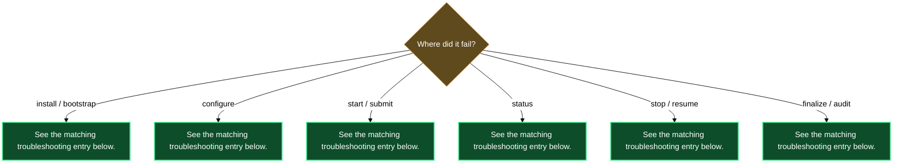

# Troubleshooting

## `/lazy-review.install` fails with a permission error on `.claude/lazy.settings.json`

**Symptom**: Step 1 exits with an OS permission error, something like `PermissionError: [Errno 13] Permission denied: '.claude/lazy.settings.json'`.

**Likely cause**: The file or its parent `.claude/` directory is owned by a different system user — often from a previous install run under `sudo` or from a file copy that changed ownership.

**Fix**: From your terminal, fix ownership with `chown` on the `.claude/` directory so your current shell user has write access. Then re-run `/lazy-review.install`.

---

## `/lazy-review.install` Step 1 stops on a JSON parse error

**Symptom**: The skill prints a JSON parse error against `.claude/lazy.settings.json` and exits before doing anything.

**Likely cause**: The settings file was hand-edited and is now syntactically invalid JSON.

**Fix**: Open `.claude/lazy.settings.json` and repair the syntax error (a missing comma, an unclosed brace, or a trailing comma after the last key are the usual culprits). Then re-run `/lazy-review.install`.

---

## `/lazy-review.install` reports `review.watch_root` as `.` after migrating an old routine

**Symptom**: On a repo that used to run the retired file-scan routine, the install report shows `review.watch_root: "."` — the coordinator's git-watch is now scoped to the whole repo instead of the doc subtree it used to cover.

**Likely cause**: Install derives `review.watch_root` from the retired routine's `paths` globs by taking their common wildcard-free directory prefix. When those globs share no literal root (for example `specs/core/**/*.md` and `docs/**/*.md`), there is nothing to derive, so it falls back to `.`.

**Fix**: Set `review.watch_root` in `.claude/lazy.settings.json` by hand to the directory your review classes actually live under, then re-run `/lazy-review.install`. An operator-set value is never re-derived.

---

## Review callouts render as plain Obsidian callouts after install

**Symptom**: The Waiting banner and the `#review/command`, `#review/question`, `#review/concern` callouts all look identical — no distinct colour or icon.

**Likely cause**: Either this repo has no `.obsidian/` vault (install reports `no-vault` and skips styling entirely — review still works, just unstyled), or the snippet was enabled in `appearance.json` while Obsidian was already running and the app has not picked up the change.

**Fix**: If the repo has a vault, reload it, or click the reload icon next to `review-callouts` in Settings → Appearance → CSS snippets. If there is no `.obsidian/` directory, there is nothing to fix — the callouts work identically, just without the distinct styling.

---

## `/lazy-review.install` keeps my old review-callouts snippet after an unattended install run

**Symptom**: After running install through an unattended flow (for example a cross-repo rollout that drives install with no one at the keyboard), the `review-callouts.css` snippet in the vault still has your old customisation instead of the newer shipped version, and the report names the file as `kept-local-unattended`.

**Likely cause**: Your local copy of `review-callouts.css` and the shipped update touch the same region, which normally makes Step 5.6 ask you which version should win. An unattended run has nobody to ask, so it resolves the conflict deterministically by keeping your local region and applying the rest of the shipped delta, rather than stalling forever.

**Fix**: Run `/lazy-review.install` yourself, interactively, in this repo. It detects the same conflict and this time asks you to pick `merge-shipped` (shipped wins for the conflicting region) or `keep-local` (your edits win); either way the non-conflicting part of the shipped update still lands.

---

## `/lazy-review.configure` aborts with "run `/lazy-review.install` first"

**Symptom**: Phase 1 of the configure wizard immediately exits with the message *"run `/lazy-review.install` first"*.

**Likely cause**: `.claude/lazy.settings.json` does not exist — the per-repo bootstrap has not been run in this checkout.

**Fix**: Run `/lazy-review.install` to create the settings file and seed the default `review.classes` block. Then re-run `/lazy-review.configure`.

---

## `/lazy-review.configure` audit reports FAIL after the wizard completes

**Symptom**: Phase 5 invokes `/lazy-review.audit` and it returns FAIL — typically `expert_<name>_missing` — even though the wizard appeared to complete normally.

**Likely cause**: A class was written referencing an expert name that does not appear in the top-level `experts` dict in `lazy.settings.json`. This happens when the expert display name picked in the wizard does not match any registered expert key.

**Fix**: Run `/lazy-review.configure` again. The wizard is read-first and will only re-ask values that are missing or inconsistent. Adding the missing expert entry, or removing the stale class reference, brings the audit back to PASS.

---

## Section-id prompt in `/lazy-review.configure` keeps re-asking

**Symptom**: When adding a section, the wizard re-asks the section-id question in a loop without accepting any input.

**Likely cause**: Either the entered id does not match `^[a-z][a-z0-9_-]*$` (contains uppercase, spaces, or starts with a digit), or the id is already taken by another section in the same class.

**Fix**: Enter a lowercase alphabetic string with only lowercase letters, digits, hyphens, and underscores — for example `final_check` or `routing`. Check existing section ids by running `/lazy-review.audit`, which lists all registered section ids for every class.

---

## `/lazy-review.start` appears to do nothing (no commit, no banner)

**Symptom**: Running `/lazy-review.start <file>` produces the output `already opted-in: <file>` or makes no visible change.

**Likely cause**: The document already has `review_active: true` in its frontmatter. `start` is idempotent — it does nothing when the document is already in the review loop.

**Fix**: Run `/lazy-review.status <file>` to confirm the current state. If the document is already active and you want to restart from round 1, run `/lazy-review.stop <file>` first to close the current session, then `/lazy-review.start <file>` to open a fresh one.

---

## `/lazy-review.submit` doesn't skip straight to the operator — a main writer fires anyway

**Symptom**: After `/lazy-review.submit <file>`, instead of landing directly on the operator's Ready banner, a main-writer round fires on the next wake.

**Likely cause**: `submit` pre-fills `review_main_done` with the class's `experts.main` list as it stood at submit time, then advances the document straight to the operator's turn. Every wake, though, re-evaluates who is still pending against the class's *current* `experts.main` order minus the names already recorded in `review_main_done`. If the class was reconfigured after this document was submitted — a main writer added, or the chain extended with a new name — that added writer isn't in the stale seed, so it counts as pending and its round fires.

**Fix**: Run `/lazy-review.status <file>` to see which owner is currently active. If a class change is what caused this, either let the newly-added writer's round complete — the document lands on the operator's Ready banner once its payload is in — or run `/lazy-review.configure` to remove that writer from the class if it shouldn't apply to documents already in flight.

---

## `/lazy-review.status` returns empty or unhelpful JSON

**Symptom**: `/lazy-review.status <file>` outputs `{}` or a JSON object with every field `null` or `false`.

**Likely cause**: The document has never been opted into the review loop — it has no `review_active` or `review_round` frontmatter fields.

**Fix**: Run `/lazy-review.start <file>` (or `/lazy-review.submit <file>` if you want to skip the opening writer pass) to initialise the frontmatter. Re-run `/lazy-review.status <file>` afterwards to confirm.

---

## `/lazy-review.stop` stops the document but a later `/lazy-review.start` shows round 1

**Symptom**: After stopping and restarting a document, `review_round` reads 1 instead of continuing from where it was.

**Likely cause**: Not a reset — `start` seeds `review_round` and `review_approved` **absent-only**, and `stop` flips `review_active` alone, leaving both keys standing. A stopped document therefore resumes at its preserved round. Reading 1 means the keys were genuinely gone when `start` ran: the document had been finalized (finalize unsets every `review_*` key but `review_result`), or the frontmatter was hand-edited between the two calls.

**Fix**: Nothing, when the document was only stopped — it already resumed. After a finalize, round 1 is correct: the previous cycle closed and this is a new one. If you deliberately want to re-enter at a later round, set `review_round` in the frontmatter before running `start`; the absent-only seeding will honour it.

---

## `/lazy-review.finalize` exits with `already finalized`

**Symptom**: Running `/lazy-review.finalize <file>` prints `already finalized: <file>` and makes no commit.

**Likely cause**: The document is already in finalized shape — its frontmatter carries no `review_*` key but `review_result` (finalize unsets them rather than writing them false), and all review-loop scaffolding (banner, approve checkbox, system callouts) has already been stripped in a previous finalize run.

**Fix**: No action is needed. If you believe the document was not fully finalized, run `/lazy-review.status <file>` to check the current frontmatter state. If `review_active` is still `true`, the file is still in the loop and `/lazy-review.finalize` should proceed normally — re-run it.

---

## `/lazy-review.finalize` commits but edit-annotation markers remain in the text

**Symptom**: After finalize commits, the document still contains `~~old~~`, `{++ new ++}`, or similar edit-marker syntax in the body.

**Likely cause**: Since a document enters the review loop, its edit-marker style is pinned once — into a `review_marker_style` frontmatter field written the moment `/lazy-review.start` or `/lazy-review.submit` opens it — and every later step (dispatch, strip-markup, finalize) reads that pin rather than the live `review.edit_marker_style` setting. This closes the old failure mode where changing the setting mid-cycle corrupted a document already under review, but it means finalize strips against whatever style was pinned at open time. A mismatch shows up when the class's `edit_marker_style` was already wrong *before* the document was opened (for example the class is configured for `simple` but writers actually leave `criticmarkup` spans), or when the document was opened under an older, incorrect setting and never re-opened since.

**Fix**: First check whether the class setting itself is wrong: run `/lazy-review.audit` to confirm the configured `edit_marker_style`, and `/lazy-review.configure` to correct it if needed — this fixes every document opened *after* the correction. For a document already mid-cycle with a stale pin, the setting fix alone will not reach it: open the document and check its frontmatter `review_marker_style` field directly against the markers actually present in the body, and correct that field by hand to the matching style. Then re-run `/lazy-review.finalize <file>`.

---

## `/lazy-review.audit` reports `settings_present FAIL`

**Symptom**: Running `/lazy-review.audit` returns a FAIL finding with check `settings_present` and a message like "settings file not found".

**Likely cause**: `/lazy-review.install` has not been run in this repo, so `.claude/lazy.settings.json` does not exist.

**Fix**: Run `/lazy-review.install` to create and seed the settings file. Then re-run `/lazy-review.audit`.

---

## `/lazy-review.audit` reports `expert_<name>_missing FAIL`

**Symptom**: Audit returns FAIL with check `expert_<name>_missing` — a class references an expert name that is not in the top-level `experts` dict.

**Likely cause**: A class was configured referencing an expert that was never registered in the experts registry, or the expert entry was deleted after the class was created.

**Fix**: Run `/lazy-review.configure` to re-enter the wizard and supply the missing expert, or to remove the class member that references a non-existent expert. Audit will pass once every class reference has a corresponding `experts` entry.

---

## Expert jobs are dispatched but never drain from the queue

**Symptom**: `/lazy-review.status <file>` shows the document is active and waiting, but no expert round fires — the banner stays "Waiting" indefinitely.

**Likely cause**: `/lazy-review.install` registers the `lazy-review.collect` / `lazy-review.coordinator-watch` / `lazy-review.sanitize` routine trio unconditionally now, regardless of the project's daemon posture — so a missing registration is no longer the explanation. What actually drains the queue is either the `lazycortex-core` runtime daemon ticking on its own, or `/lazy-runtime.tick` being run by hand on a checkout with no daemon.

**Fix**: Run `/lazy-review.status <file>` to confirm the document is genuinely stuck rather than mid-round. If this project runs the daemon, `/lazy-runtime.preflight` reports what is stopping it. If this project has no daemon, expert jobs and routine wakes only advance when something calls `/lazy-runtime.tick` — run it by hand, or set up a recurring trigger for it.

---

## Diagnostic flowchart

```mermaid
%%{init: {'themeVariables':{'lineColor':'#000','textColor':'#000','edgeLabelBackground':'#fff'},'themeCSS':'.edgeLabel{background-color:transparent!important}.edgeLabel p{background-color:transparent!important}','flowchart':{'diagramPadding':5,'useMaxWidth':true}}}%%
flowchart TD
  whereDidItFail{Where did it fail?}

  installBootstrap[See the matching troubleshooting entry below.]
  configure[See the matching troubleshooting entry below.]
  startSubmit[See the matching troubleshooting entry below.]
  statusCheck[See the matching troubleshooting entry below.]
  stopResume[See the matching troubleshooting entry below.]
  finalizeAudit[See the matching troubleshooting entry below.]

  whereDidItFail -->|install / bootstrap| installBootstrap
  whereDidItFail -->|configure| configure
  whereDidItFail -->|start / submit| startSubmit
  whereDidItFail -->|status| statusCheck
  whereDidItFail -->|stop / resume| stopResume
  whereDidItFail -->|finalize / audit| finalizeAudit

  classDef guard fill:#5f4a1e,stroke:#e2a14a,color:#fff
  classDef success fill:#0d4d2a,stroke:#4ae290,color:#fff,stroke-width:2px

  class whereDidItFail guard
  class installBootstrap success
  class configure success
  class startSubmit success
  class statusCheck success
  class stopResume success
  class finalizeAudit success
```
