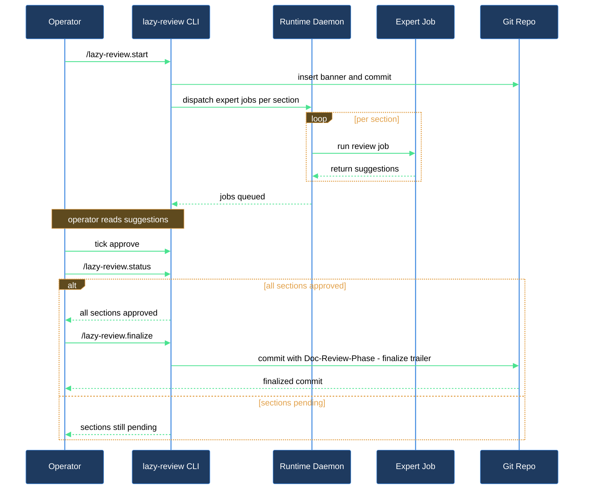

# Run a document through the review loop

You have a markdown document — a spec, RFC, or design doc — that needs structured feedback from multiple expert lenses. This walkthrough takes you from the moment you opt that document in, through the round-by-round review cycle, to a clean finalized commit. `/lazy-review.start` opens the loop, `/lazy-review.status` tells you where things stand at any point, and `/lazy-review.finalize` seals the document when every section is approved.

## What you need

- `lazycortex-review` installed in the repo — run `/lazy-review.install` if you haven't yet.
- `lazycortex-core` installed and the expert runtime daemon running — experts are dispatched through its queue.
- At least one review class configured for your document's path — run `/lazy-review.configure` to set one up if this is a new repo or a new file location.
- A git repo with a clean working tree (or at least the target file committed) — each state transition is one commit.

## The journey

### Step 1 — Opt the document in

Run `/lazy-review.start <file>` with the path to your markdown document. The skill sets `review_active: true` unconditionally into the document's frontmatter, then seeds the rest of the loop's keys — `review_round: 1`, `review_approved: false`, and a couple of internal bookkeeping fields — only where they are not already present. It also seats an empty `# History` section at the end of the body (or reconciles its explainer line if the section is already there) and clears any `review_result` left behind by an earlier finalize. It then inserts a Waiting banner above the first H1 and produces a single commit under your git identity.

It also pins the review cycle's edit-marker style into a `review_marker_style` frontmatter field — read from your repo's configured `edit_marker_style` review setting (falling back to `simple` when unset). Every later step in the cycle reads that pin off the document itself rather than re-reading settings, so changing the setting mid-cycle never reaches a review that is already open.

If the document is already opted in, the command is a no-op — it exits cleanly without a new commit.

After this step the daemon sees a human commit and begins the first dispatch cycle: one expert job per section, routed according to your review class configuration.

### Step 2 — Wait for expert suggestions to land

The expert runtime processes jobs from the queue and splices suggestions back into the document. You do not need to do anything during this phase. When a section's expert has finished, an edit-annotation marker and an approve checkbox appear in that section.

You can check progress at any time — see Step 3.

### Step 3 — Check the current state

Run `/lazy-review.status <file>` at any point. The skill returns a one-line JSON object with:

- `review_active` — whether the loop is running.
- `review_round` — the current round number.
- `review_approved` — overall approval state.
- `banner` — the current banner text visible in the document.
- `owners[]` — each section with its assigned expert.

Use this to confirm which sections are still pending before you start reading.

### Step 4 — Read suggestions and tick approve

Open the document in your editor. For each section that has a suggestion from its expert, read the annotation, decide whether to accept it (you may edit the text directly), and tick the approve checkbox for that section.

Repeat for every section in the current round. The daemon monitors approve state; when all sections in a round are approved it automatically advances to the next round (bumping `review_round`) and dispatches the next set of expert jobs.

Run `/lazy-review.status <file>` again after ticking to confirm the state has been picked up.

### Step 5 — Repeat for subsequent rounds

Continue reading suggestions and approving sections across as many rounds as your review class defines. The round counter in the JSON from `/lazy-review.status` tells you exactly where you are. Each round transition is committed automatically by the daemon with a `Doc-Review-*` trailer, giving you a full audit trail in `git log`.

### Step 6 — Finalize the document

Once every section in the final round is approved, run `/lazy-review.finalize <file>`. The skill:

- Folds all edit-annotation markers into the final document text, using the edit-marker style pinned into `review_marker_style` at Step 1 — the document's own pin wins over the current repo setting, so a setting change made mid-cycle never changes how an already-open review gets folded.
- Strips the Waiting banner, approve checkboxes, and system callouts.
- Preserves the `# History` section the coordinator built up across rounds.
- Unsets every `review_*` key in frontmatter except `review_result` — a finalized document carries no `review_active` at all, unlike a stopped one, which keeps `review_active: false`.
- Commits with the `Doc-Review-Phase: finalize` trailer.

After this commit the document looks like an ordinary markdown file with no review scaffolding. The `# History` section remains as a human-readable summary of what changed across rounds.

If `/lazy-review.finalize` reports `already finalized: <file>`, the document is already in its final state — no action needed.

## After you're done

The finalized document lives at the same path with no review scaffolding. The `# History` section records what the review cycle produced, opening with a short explanatory line — in your vault's configured language, falling back to English — that marks it as automatically maintained; it isn't meant to be hand-edited.

To resume a document later (e.g. a follow-up review pass), run `/lazy-review.start <file>` again — it re-opens the loop from `review_round: 1`. The old `# History` section is preserved; the coordinator appends a new line to it each time the document reaches an approved state. Re-opening also re-pins `review_marker_style` only if the document does not already carry one, so a document finalized under an earlier style keeps that style across a later reopen.

## How the review loop flows

```mermaid
%%{init: {'themeVariables':{'background':'transparent','primaryColor':'#1e3a5f','primaryBorderColor':'#4a90e2','primaryTextColor':'#fff','lineColor':'#4ae290','actorBkg':'#1e3a5f','actorBorder':'#4a90e2','actorTextColor':'#fff','actorLineColor':'#4a90e2','signalColor':'#4ae290','signalTextColor':'#000','noteBkgColor':'#5f4a1e','noteBorderColor':'#e2a14a','noteTextColor':'#fff','labelBoxBkgColor':'#5f4a1e','labelBoxBorderColor':'#e2a14a','labelTextColor':'#fff','loopTextColor':'#e2a14a'},'sequence':{'diagramPadding':5,'useMaxWidth':true}}}%%
sequenceDiagram
  participant operator as Operator
  participant reviewCli as lazy-review CLI
  participant daemon as Runtime Daemon
  participant expertJob as Expert Job
  participant gitRepo as Git Repo

  operator->>reviewCli: /lazy-review.start
  reviewCli->>gitRepo: insert banner and commit
  reviewCli->>daemon: dispatch expert jobs per section
  loop per section
    daemon->>expertJob: run review job
    expertJob-->>daemon: return suggestions
  end
  daemon-->>reviewCli: jobs queued
  Note over operator,reviewCli: operator reads suggestions
  operator->>reviewCli: tick approve
  operator->>reviewCli: /lazy-review.status
  alt all sections approved
    reviewCli-->>operator: all sections approved
    operator->>reviewCli: /lazy-review.finalize
    reviewCli->>gitRepo: commit with Doc-Review-Phase - finalize trailer
    gitRepo-->>operator: finalized commit
  else sections pending
    reviewCli-->>operator: sections still pending
  end
```
