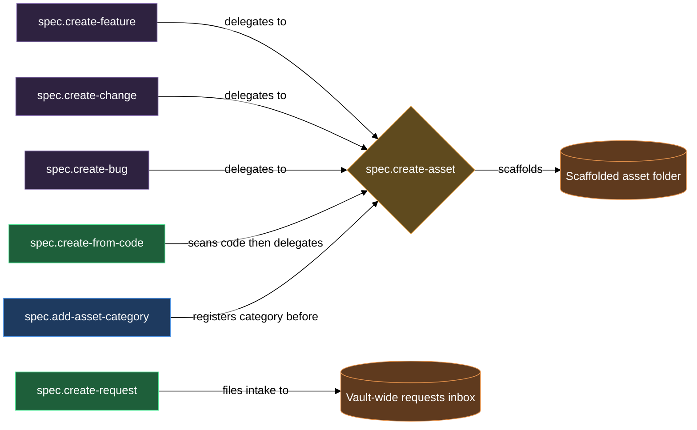

# Authoring spec assets and capturing requests

The authoring block is where new specification work enters the vault. It covers two intake paths: scaffolding a new asset (feature, change, bug, or any operator-defined category) under a registered product, and capturing a raw user idea into the vault-wide `requests/` inbox for later routing. Either way, you end up with structured Markdown on disk — docs with the right frontmatter, stages, and diagrams — ready for the gate-and-review cycle to carry forward.

`spec.create-asset` is the scaffold engine at the centre of this block. Three thin wrappers — `spec.create-feature`, `spec.create-change`, and `spec.create-bug` — pin the category and delegate to it, so you rarely type the full `create-asset` invocation for the built-in categories. For code-first workflows, `spec.create-from-code` scans a registered source repo through parallel agents and then delegates feature scaffolding to `spec.create-asset` per discovered candidate. When you want a new kind of asset beyond the built-in three, `spec.add-asset-category` wires it into config, templates, and the review loop so that `spec.create-asset` can produce it. `spec.create-request` is a completely separate intake path: it writes a body-only file into the vault-wide `requests/` inbox, leaving frontmatter to the `spec.request-open` daemon routine.

## What's in this block

**`/spec.create-asset`** is the universal scaffold engine that every other creation skill in this block delegates to. You give it a product key, category, and slug; it resolves the product from config, validates the category against the built-in set plus any operator-defined categories, asks 2–5 targeted clarifying questions scaled to the category, then hands off to the `scaffold-asset` primitive, which writes the asset folder with its status folder-note and authored docs, seeds per-file stages, and stamps the history line. After the scaffold, `spec.create-asset` authors the design or bug prose in the product's language, draws the primary behavioral diagram(s), and authors a one-sentence asset précis into the folder-note's `# Summary` section. Running it directly is most useful when you are creating an operator-defined category asset and there is no dedicated wrapper, or when you want to pass `--empty` to scaffold a shell for the request system to populate without prose or diagrams.

**`/spec.create-feature`** pins the category to `feature` and delegates to `spec.create-asset`. It takes a product key and a slug, passes `--empty` through when present, and reports the delegate's outcome verbatim. Features use the `design.md` + `plan.md` layout — `design.md` describing what the feature does in behavior terms, `plan.md` starting empty for a planning tool to fill. The clarifying questions cover scope, users, and edge-case behavior; the diagram is a `flow` in `design.md`'s behavior section.

**`/spec.create-change`** pins the category to `change` and delegates to `spec.create-asset`. A change is the atomic modification unit — peer to a feature, not a subcategory of it. The same `design.md` + `plan.md` layout applies; the clarifying questions focus on what changes from current state to new state, plus compatibility and migration implications.

**`/spec.create-bug`** pins the category to `bug` and delegates to `spec.create-asset`. Bugs use a different layout: `bug.md` (repro, observed vs expected, environment) instead of `design.md`, plus an empty `plan.md` placeholder. The clarifying questions extract repro steps, observed behavior, expected behavior, and environment context. Two diagrams are drawn: a `flow` under `## Repro steps` and a `sequence` under `## Observed behavior`.

**`/spec.add-asset-category`** registers a new operator-defined asset category on a product, end to end. It walks a one-question-at-a-time wizard to collect the category name, description, icon, optional color, and per-role expert assignments (designer, developer, tester, historian). It writes the category block into `lazy.settings.json[products][<key>].asset_categories`, seeds the four per-category template files into `.claude/templates/spec.<name>/` (copied from the plugin's `spec._content/` baseline so the operator can specialise them), scaffolds the category folder-note from the `group-note.md` template, and appends the two default review classes (design + plan) to `lazy.settings.json[review.classes]`. Once it finishes, `spec.create-asset <product> <category> <slug>` recognises the new category and `spec.request-classify` can route requests into it.

**`/spec.create-from-code`** generates a spec from existing source code for a product already registered with a `source` binding. In product mode it fans source scanning out to four parallel Explore agents (structure and APIs, data surfaces, hazards and history, candidate features), authors a behavior-only `design.md` and a code-grounded `tech.md` loose at the product root, and draws four product-level diagrams: a `flow` in `design.md`'s `## Behavior` section, a `layout` in `design.md`'s `## Layout` section, a `c4-container` in `tech.md`'s `## Architecture` section, and a `class` in `tech.md`'s `## Components` section. For each feature candidate Agent D discovers, you decide per candidate: scaffold it as a feature (delegates to `spec.create-asset`), document it as an architectural area in the tech doc's `## Architectural Areas`, or skip it. In feature mode, the skill scaffolds a single named candidate by delegating directly to `spec.create-asset` with source-file grounding.

**`/spec.create-request`** writes a body-only file into the vault-wide `requests/` inbox at `<vault-root>/requests/<slug>.md`. It runs a 3–5 question wizard to clarify the raw idea before saving — scope, outcome, trigger, known constraints, and optionally a class hint — then writes the result as a `# <title>` + `## Clarified` body with no frontmatter. The `spec.request-open` daemon routine adds `spec_role`, `request_status`, `request_class`, and status-mirror tags on the next md-scan tick. The file then enters the request routing pipeline independently of this block.

## How they work together

For most new work, the flow starts at one of the three wrappers: `/spec.create-feature`, `/spec.create-change`, or `/spec.create-bug`. Each immediately delegates to `spec.create-asset`, which owns the wizard, scaffold, prose, and diagrams. You answer the clarifying questions, the asset folder appears under `<spec_path>/<category>/<slug>/`, and the docs are ready for the gate cycle to pick up.

When your product models a domain that does not fit the built-in three categories, run `/spec.add-asset-category` first — it is a prerequisite, not an optional step. `spec.create-asset` refuses an unknown category and directs you back to this skill. After registration, use `/spec.create-asset <product> <category> <slug>` directly (or create your own thin wrapper) to scaffold instances. The seeded template files in `.claude/templates/spec.<name>/` are yours to customise before or after registration; the creation skills pick up any edits on the next scaffold run.

For code-first work — when you have source code but no spec yet — `/spec.create-from-code` is the right entry point, not `spec.create-feature`. It produces the product `design.md` and `tech.md` from the source itself, then lets you scaffold each discovered candidate as a feature by delegating into `spec.create-asset`. The feature creation is identical to a manual `/spec.create-feature` run; the difference is that the candidate's behavior summary and source files are passed as grounding context, so the clarifying questions and prose are anchored in the actual code rather than starting from a blank slate. Product docs live flat at the product root — `design.md` and `tech.md` alongside the product folder-note, with no `docs/` subfolder.

`/spec.create-request` is a separate intake path that does not produce an asset immediately. Use it when the right category, target product, or scope is still unclear, or when stakeholder input arrives that needs routing before work begins. The request lands in the vault-wide `requests/` inbox (not under a product `spec_path`) and the request routing pipeline handles classification, candidate matching, and either attachment to an existing entity or spawn of a new one via `spec.create-asset --empty`. The authoring block's creation skills and the requests block's routing skills divide intake into two tracks: known and scoped work goes through the creation skills directly; ambiguous or unscoped work goes through `spec.create-request`.

The `--empty` flag is the handoff mechanism between the two tracks. Any of the creation skills or `spec.create-asset` directly can be invoked with `--empty` to produce the folder and doc files at their start stages without clarifying questions, prose, or diagrams. The request system's spawn path (`spec.request-spawn`) uses this flag when it creates an asset from a classified request, then populates the docs through `spec.request-attach`.

## Where this fits

- [gates](gates.md) — advance an asset through its readiness gates and per-file stages after the asset is authored here.
- [requests](requests.md) — route a captured request into the spec tree (classify, find candidates, attach or spawn). This is where `spec.create-request` output is consumed.
- [install-and-audit](install-and-audit.md) — register a product and bootstrap the plugin before authoring the first asset. `/spec.product-config` is the prerequisite for all creation skills; `/spec.create-from-code` additionally requires a `source` binding on the product.
- [new-product-from-code](walkthroughs/new-product-from-code.md) — end-to-end walkthrough: register a product, generate its spec from code, and scaffold the first feature using this block's full path.

## How the pieces fit together

