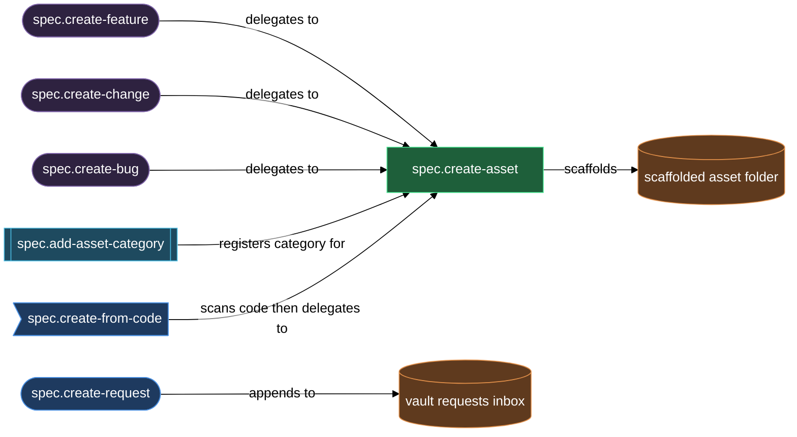

# Authoring spec assets and capturing requests

The authoring block is where new specification work enters the vault. It covers two intake paths: scaffolding a new asset (feature, change, bug, or any operator-defined category) under a registered product, and capturing a raw user idea into the vault-wide `requests/` inbox for later routing. Either way, you end up with structured Markdown on disk — docs with the right frontmatter, stages, and diagrams — ready for the gate-and-review cycle to carry forward.

`spec.create-asset` is the universal scaffold engine: it resolves your product from `lazy.settings.json`, asks focused clarifying questions, scaffolds the asset folder with its authored docs, and draws the behavioral diagrams. Three thin wrappers — `spec.create-feature`, `spec.create-change`, and `spec.create-bug` — pin the category and delegate to it, so you rarely type the full `create-asset` invocation for the built-in categories. For code-first workflows, `spec.create-from-code` scans a registered source repo through parallel agents and then delegates feature scaffolding the same way. When you want a new kind of asset beyond the built-in three, `spec.add-asset-category` wires it into config, templates, and the review loop so that `spec.create-asset` can produce it.

## When you'd use this

- Starting work on a new capability: run `/spec.create-feature` to scaffold the feature folder, author the design doc, and get a behavioral flow diagram without leaving the chat.
- Recording a concrete modification to an existing product: run `/spec.create-change` to give the change its own tracked doc, separate from both features and bugs.
- Filing a bug with repro steps and observed-vs-expected behavior: run `/spec.create-bug` to get the `bug.md` + `plan.md` layout and the repro-flow diagram.
- Generating a spec foundation from an existing codebase — no blank-page spec exists yet: run `/spec.create-from-code` against a registered, code-bound product to scan the source and author the product design and tech docs.
- Modeling a domain that does not fit feature / change / bug — such as a game with characters and scenes, or a course with modules and lessons: run `/spec.add-asset-category` to register the category, then use `/spec.create-asset` (or the category wrapper, once you have one) to scaffold instances.
- Capturing a raw user idea, stakeholder request, or feedback that has not been classified or routed yet: run `/spec.create-request` to write a body-only intake file into the vault's `requests/` inbox.

## What's in this block

**`/spec.create-asset`** is the scaffolding engine that every other creation skill in this block delegates to. You give it a product key, category, and slug; it resolves the product from config, validates the category against the built-in set plus any operator-defined categories, asks 2–5 targeted clarifying questions scaled to the category, scaffolds the asset folder (`<spec_path>/<category>/<slug>/`) with status folder-note and authored docs, fills the design or bug prose in the product's language, and draws the primary behavioral diagram(s). Running it directly is most useful when you are creating an operator-defined category asset and there is no dedicated wrapper, or when you want to pass `--empty` to scaffold a shell for the request system to populate.

**`/spec.create-feature`** pins the category to `feature` and delegates to `spec.create-asset`. Features use the `design.md` + `plan.md` layout, with `design.md` at `draft` stage and `plan.md` starting `empty` for a planning tool to fill. The clarifying questions cover scope, users, and edge-case behavior. The drawer produces a `flow` diagram under `design.md`'s behavior section.

**`/spec.create-change`** pins the category to `change` and delegates to `spec.create-asset`. A change is the atomic modification unit — peer to a feature, not a subcategory of it. The clarifying questions focus on what changes from the current state to the new state, plus compatibility and migration implications. Same layout as a feature: `design.md` + `plan.md`.

**`/spec.create-bug`** pins the category to `bug` and delegates to `spec.create-asset`. Bugs use a different layout: `bug.md` (repro, observed vs expected, environment) rather than `design.md`, plus an empty `plan.md` placeholder. The clarifying questions extract repro steps, observed behavior, expected behavior, and environment context. Two diagrams are drawn: a `flow` under `## Repro steps` and a `sequence` under `## Observed behavior`.

**`/spec.add-asset-category`** registers a new operator-defined asset category on a product, end to end. It walks a wizard to collect the category name, description, icon, and per-role expert assignments, then writes the category block into `lazy.settings.json[products][<key>].asset_categories`, seeds the per-category templates in `.claude/templates/spec.<name>/`, scaffolds the category folder-note, and appends the two default review classes (design + plan) to `lazy.settings.json[review.classes]`. Once it finishes, `spec.create-asset <product> <category> <slug>` recognises the new category and `spec.request-classify` can route requests into it.

**`/spec.create-from-code`** generates a spec from an existing codebase for a product already registered with a `source` binding. It fans source scanning out to parallel Explore agents (structure and APIs, data surfaces, hazards and history, candidate features), then authors a behavior-only `docs/design.md` and a code-grounded `docs/tech.md` with source URLs, and draws four product-level diagrams. For each candidate feature the scan discovers, you decide per-candidate: scaffold it as a feature (delegates to `spec.create-asset`), document it as an architectural area in the tech doc, or skip it. In feature mode, it scaffolds a single named candidate the same way.

**`/spec.create-request`** writes a body-only file into the vault-wide `requests/` inbox at `<vault-root>/requests/<slug>.md`. It runs a 3–5 question wizard to clarify the raw idea before saving — scope, outcome, trigger, constraints, and optionally a class hint. It never sets frontmatter; the `spec.request-open` daemon routine adds `spec_role`, `request_status`, `request_class`, and mirror tags on the next md-scan tick. The file then enters the request routing pipeline (`spec.request-router`, `spec.request-classify`, `spec.request-find-candidates`) independently of this skill.

## How they work together

For most new work, the flow starts at one of the three wrappers: `/spec.create-feature`, `/spec.create-change`, or `/spec.create-bug`. Each immediately delegates to `spec.create-asset`, which owns the questions, scaffold, prose, and diagrams. You answer the clarifying questions, the asset folder appears, and the docs are ready for the gate cycle to pick up.

When your product models a domain that does not fit the built-in three categories, run `/spec.add-asset-category` first. It is a prerequisite, not an optional step: `spec.create-asset` refuses an unknown category, directing you back to this skill. After registration, use `/spec.create-asset <product> <category> <slug>` directly (or create your own thin wrapper skill) to scaffold instances.

For code-first work — when you have source code but no spec yet — `/spec.create-from-code` is the right start, not `spec.create-feature`. It produces the product design and tech docs from the source itself, then lets you scaffold each discovered candidate as a feature by delegating into `spec.create-asset`. The feature creation is identical to a manual `/spec.create-feature` run; the difference is that the candidate's behavior summary and source files are passed as grounding context, so the clarifying questions and prose are anchored in the actual code.

`/spec.create-request` is a separate intake path that does not produce an asset immediately. Use it when the right category, target product, or scope is still unclear, or when stakeholder input arrives that needs routing before work begins. The request lands in `requests/` and the request routing pipeline (`requests` block) handles classification, candidate matching, and either attachment to an existing entity or spawn of a new one via `spec.create-asset --empty`. The authoring block's creation skills and the requests block's routing skills divide intake into these two tracks: known and scoped work goes through the creation skills directly; ambiguous or unscoped work goes through `spec.create-request`.

## Common adjustments

- **Override the product's language.** Prose in authored docs is rendered in the language set on the product record. To change the language for a product, run `/spec.product-config` (edit mode) — it updates `lazy.settings.json[products][<key>].language`. The creation skills pick up the new value on the next invocation.
- **Scaffold a shell without prose or diagrams.** Pass `--empty` to `/spec.create-feature`, `/spec.create-change`, `/spec.create-bug`, or `/spec.create-asset` directly. The scaffold runs (folder-note + authored doc files at their start stages) but the clarifying questions, prose authoring, and diagram drawing are all skipped. The request-spawn path uses `--empty` exactly this way and then populates docs through `spec.request-attach`.
- **Use a different icon or color for an operator-defined category.** The icon and optional color live in `lazy.settings.json[products][<key>].asset_categories[<name>]`. Run `/spec.add-asset-category` with the category name pre-supplied to update the icon interactively — the skill updates config and re-writes the managed icon keys in the category folder-note.
- **Override templates for a category.** The seeded templates live in `.claude/templates/spec.<category>/`. Edit `design.md` (or `bug.md`) and `plan.md` there to specialise the scaffold for that category. The creation skills pick up the override at next scaffold time; the plugin-baseline templates are the fallback when a per-project template is absent.
- **Register a product for code-first generation.** `/spec.create-from-code` requires a product registered with a `source` block (`repo` + `paths`). If the product has no source binding, run `/spec.product-config` in edit mode to attach the repo. `/spec.create-from-code` then resolves it on the next invocation.

## See also

- [gates](gates.md) — advance an asset through its readiness gates and per-file stages after the asset is authored.
- [requests](requests.md) — route a captured request into the spec tree (classify, find candidates, attach or spawn).
- [install-and-audit](install-and-audit.md) — register a product and bootstrap the plugin before authoring the first asset.
- [new-product-from-code](walkthroughs/new-product-from-code.md) — end-to-end walkthrough: register a product, generate its spec from code, and scaffold the first feature.

## How the pieces fit together

<!-- /lazy-diagram.draw lands the fence here; do not author a code block manually. -->
