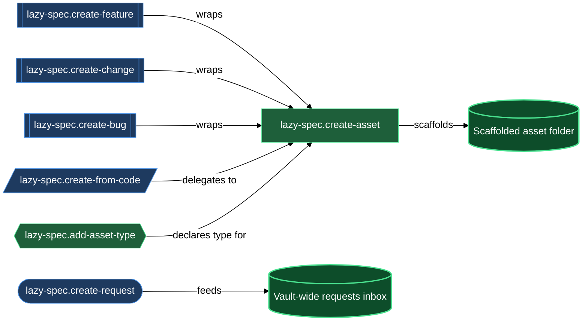

# Authoring spec assets and capturing requests

The authoring block is where new specification work enters the vault. It covers two intake paths: scaffolding a new asset (feature, change, bug, or any operator-declared asset type) under a registered product, and capturing a raw user idea into the vault-wide `requests/` inbox for later routing. Either way, you end up with structured Markdown on disk — docs with the right frontmatter, stages, and diagrams — ready for the gate-and-review cycle to carry forward. A separate skill in this block, `lazy-spec.record-decision`, records the forks behind those docs once a genuine one comes up.

`lazy-spec.create-asset` is the scaffold engine at the centre of this block. Three thin wrappers — `lazy-spec.create-feature`, `lazy-spec.create-change`, and `lazy-spec.create-bug` — pin the asset type and delegate to it, so you rarely type the full `create-asset` invocation for the shipped types. For code-first workflows, `lazy-spec.create-from-code` scans a registered source repo through parallel agents and then delegates feature scaffolding to `lazy-spec.create-asset` per discovered candidate. When you want a kind of asset beyond the shipped set, `lazy-spec.add-asset-type` declares it in config so that `lazy-spec.create-asset` can produce it. `lazy-spec.create-request` is a completely separate intake path: it writes a body-only file into the vault-wide `requests/` inbox, leaving frontmatter to the `lazy-spec.request-open` daemon routine.

## What's in this block

**`/lazy-spec.create-asset`** is the universal scaffold engine that every other creation skill in this block delegates to. You give it a product key, asset type, and slug; it resolves the product from config, validates the type against the shipped set plus any the product declares, resolves the document the type starts from (and, for a nested asset, where it lands) from that type's own declaration, asks 2–5 targeted clarifying questions scaled to the type, then hands off to the `scaffold-asset` primitive, which writes the asset folder with its status folder-note and seeded docs, seeds per-file stages, and stamps the history line. The seeded doc set can widen beyond the type's own start doc: a type whose declaration carries `vision: mandatory` (the shipped `feature` type does) gets `vision.md` seeded automatically, ahead of the start doc, so the asset's goals and requirements are captured from the first scaffold; a type carrying `vision: opt-in` (`change`, `content`, `research`) instead offers it — alongside `use-cases.md` and `ui-design.md` where the type's playbook allows them — through one multi-select question, and a declined document stays available to add later. (Under `--empty`, none of this widening fires — only the start doc is seeded.) After the scaffold, `lazy-spec.create-asset` authors the prose for every seeded document (vision, design or bug, and any opt-in doc taken) in the product's language, records any genuine decision fork the clarification settled as a `[!decision]` callout right inside the document it belongs to, and writes a one-sentence asset précis into the folder-note's `# Summary` section — it draws no diagrams itself; you ask for one afterward via `/lazy-diagram.draw` against a section the prose just established, or leave it to the writing experts, who carry their own figures discipline. Running it directly is most useful when you are creating an asset of an operator-declared type and there is no dedicated wrapper, or when you want to pass `--empty` to scaffold a shell for the request system to populate without prose or diagrams.

**`/lazy-spec.create-feature`** pins the asset type to `feature` and delegates to `lazy-spec.create-asset`. It takes a product key and a slug, passes `--empty` through when present, and reports the delegate's outcome verbatim. Because the shipped `feature` type declares its vision mandatory, the scaffold seeds `vision.md` ahead of `design.md`: `vision.md` covers `Overview / Goals / Requirements / Value Proposition / Design Concept` — the feature's goals live there and nowhere else, and its `## Requirements` section states them in the canonical requirement form — condition, subject, action, object, constraint (ISO/IEC/IEEE 29148 § 5.2.4) — each one necessary, singular, verifiable, and free of implementation — and `design.md` covers `Overview / Design / Behavior / Constraints / Risks / Known Limitations / Boundaries`, opening with a reference back to the sibling vision and describing what the feature does in behavior terms; its own `## Constraints` section states the externally imposed limitations (arc42 § Architecture Constraints) the design works within, kept separate from the requirements the vision already states, and its `## Risks` section works the design's risks directly — what could sink it and what the design does about each — rather than restating anything from vision. The opt-in `code-plan.md` / `test-plan.md` are authored later, never seeded here. The clarifying questions cover scope, users, and edge-case behavior; no diagram is drawn during creation — request one via `/lazy-diagram.draw` against `design.md`'s `## Behavior` section once the prose is in place.

**`/lazy-spec.create-change`** pins the asset type to `change` and delegates to `lazy-spec.create-asset`. A change is the atomic modification unit — peer to a feature, not a subcategory of it. `design.md` walks `Overview / Current State / Target State / Risks / Known Limitations / Boundaries` instead of the feature skeleton, opening with a reference to a sibling vision rather than restating goals — because `change` declares its vision opt-in rather than mandatory, one multi-select question during the scaffold offers to also seed `vision.md` for a change whose own goals and requirements are worth recording separately from what it targets. The clarifying questions focus on what changes from current state to new state, plus compatibility and migration implications, and — as a separate targeted question — which existing asset(s) the change modifies, recorded as `spec_targets` for the design cascade once the change's own design is approved. No diagram is drawn during creation; request one via `/lazy-diagram.draw` against `## Target State` once there's something to visually walk through.

**`/lazy-spec.create-bug`** pins the asset type to `bug` and delegates to `lazy-spec.create-asset`. Bugs use a different layout: `bug.md` (repro, observed vs expected, environment) instead of `design.md` or `vision.md` — the shipped `bug` type declares no vision at all, so the scaffold seeds only that one doc; the opt-in `code-plan.md` (fix plan) and `test-plan.md` are authored later. The clarifying questions extract repro steps, observed behavior, expected behavior, and environment context. No diagrams are drawn during creation; request them via `/lazy-diagram.draw` against `## Repro steps` (flow) or `## Observed behavior` (sequence) once the prose is in place.

**`/lazy-spec.add-asset-type`** declares a new asset type on a product. It walks a one-question-at-a-time wizard to collect the type's name (and whether it is standalone or an alias of another type), its icon and optional color, the start document a fresh asset of the type is seeded with, the tools such an asset implies, and the folder new assets land in by default. It writes that block into `lazy.settings.json[products][<key>].asset_types`, then settles the type's playbook — the reference the coordinator loads on every wake of an asset of this type — either picking one of the shipped playbooks or writing a stub under `.claude/references/` for you to fill in. **The skill creates nothing on disk beyond that playbook stub**: no type folder, no folder-note, no template files. The type's folder appears the first time an asset of it is scaffolded, and a type needs no templates of its own — the plugin's shipped bases cover every document. Review coverage needs no separate step either — the product's behavior-keyed review classes (`design@<key>` / `code-plan@<key>` / `test-plan@<key>`, written once by `lazy-spec.product-config` with wildcard globs spanning every asset folder) already match the new type's docs, so `lazy-spec.add-asset-type` writes no review classes itself. Once it finishes, `lazy-spec.create-asset <product> <type> <slug>` recognises the new type and `lazy-spec.request-classify` can route requests into it.

**`/lazy-spec.create-from-code`** generates a spec from existing source code for a product already registered with a `source` binding. In product mode it fans source scanning out to four parallel Explore agents (structure and APIs, data surfaces, hazards and history, candidate features), then authors `vision.md` first when it doesn't exist yet — `Overview / Goals / Requirements / Value Proposition / Design Concept`, the code's outcomes and value read straight off the evidence, with the `## Requirements` section stating what the code implements as canonical requirement statements (ISO/IEC/IEEE 29148) rather than free prose — followed by a behavior-only `design.md` (`Overview / Principles / Design / Behavior / Risks / Known Limitations / Boundaries`; the design opens with a reference back to the vision rather than restating goals, and its own `## Risks` section works those risks directly rather than carrying them over from vision) and a code-grounded `tech.md`, all loose at the product root. A follow-up question offers to also author the product-level `use-cases.md` from the same code survey — actors and cross-feature scenarios, opt-in and skipped silently on decline. Wherever the code shows a real fork was taken, the skill marks it in `design.md` as a `[!decision]` callout, ready for `/lazy-spec.record-decision`'s `promote` once the doc is approved. It draws no diagrams itself — a product picture (a `flow` in `design.md`'s `## Behavior`, an `architecture` or `class` diagram in `tech.md`, or a `layout` for a UI-bearing product) is drawn only on your own `/lazy-diagram.draw` call against an existing heading, and the writing experts carry their own figures discipline. For each feature candidate Agent D discovers, you decide per candidate: scaffold it as a feature (delegates to `lazy-spec.create-asset`, which seeds its own `vision.md` + `design.md` per the feature type's mandatory vision), document it as an architectural area in the tech doc's `## Architectural Areas`, or skip it. Scaffolded candidates leave no trace in `design.md` itself — the asset-type folder-note aggregates the assets. In feature mode, the skill scaffolds a single named candidate by delegating directly to `lazy-spec.create-asset` with source-file grounding.

**`/lazy-spec.create-request`** writes a body-only file into the vault-wide `requests/` inbox at `<vault-root>/requests/<slug>.md`. It runs a 3–5 question wizard to clarify the raw idea before saving — scope, outcome, trigger, known constraints, and optionally a class hint — then writes the result as a `# <title>` + `## Clarified` body with no frontmatter. The `lazy-spec.request-open` daemon routine adds `spec_role`, `request_status`, `request_class`, and status-mirror tags on the next md-scan tick. The file then enters the request routing pipeline independently of this block.

**`/lazy-spec.record-decision`** manages the spec catalog's decisions registry — the record of genuine forks made while authoring an asset, a product, or the project as a whole, kept separate from the design/bug prose so a later session can find *why* a choice was made without re-deriving it. It wraps four operations: `add` (a fresh entry), `supersede <id>` (a fresh entry that also marks an older one superseded), `obsolete <id>` (marks an existing entry obsolete with a reason), and `promote <living-doc>` (pulls decision blocks already written inline into a `design.md` / `bug.md` / `tech.md` / `architecture.md` body out into its sibling `decisions.md`). `add` / `supersede` / `obsolete` resolve their target along a three-rung ladder — asset (`<asset_dir>/decisions.md`), product (`<spec_path>/decisions.md`), or project (`<content-root>/decisions.md`, for a decision about the system pair or a cross-product concern) — and the file need not exist yet; the first record lazily creates it. Every write goes through the `decide` primitive — the skill never hand-edits a `decisions.md` file or a living doc's decision blocks itself. Before recording a new decision it holds you to a three-part weight test — a real fork existed, reversal is expensive, the reasoning is unrecoverable from the artifact itself — so the registry doesn't fill up with restated conclusions. `promote` refuses on a plan or report (neither is a living doc) and on any asset that is cancelled, halted, or released.

## How they work together

For most new work, the flow starts at one of the three wrappers: `/lazy-spec.create-feature`, `/lazy-spec.create-change`, or `/lazy-spec.create-bug`. Each immediately delegates to `lazy-spec.create-asset`, which owns the wizard, scaffold, and prose. You answer the clarifying questions, the asset folder appears under the type's default folder (`<spec_path>/<default_path>/<slug>/`, or anywhere else under `spec_path` you point it — including nested inside another asset), and the docs are ready for the gate cycle to pick up. For a `feature`, the mandatory vision-then-design seed order means the asset's goals and requirements are settled before its design's WHAT; for `change` / `content` / `research`, an extra multi-select question offers the same `vision.md` (plus `use-cases.md` / `ui-design.md` where the playbook allows them) up front instead of assuming it.

When your product models a domain that none of the shipped types fits, run `/lazy-spec.add-asset-type` first — it is a prerequisite, not an optional step. `lazy-spec.create-asset` refuses an undeclared type and directs you back to this skill. After the declaration, use `/lazy-spec.create-asset <product> <type> <slug>` directly (or create your own thin wrapper) to scaffold instances; the type's folder is created by that first scaffold, not by the declaration. Documents resolve from the plugin's shipped templates, so nothing needs customising to get started — when you do want a specialisation, create `.claude/templates/spec.<type>/` yourself and drop in the files to override, and the creation skills pick them up on the next scaffold run. Because review coverage is already established by the product's behavior-keyed classes, a freshly declared type is fully reviewable the moment its first asset is scaffolded — there is no separate review-wiring step to remember.

For code-first work — when you have source code but no spec yet — `/lazy-spec.create-from-code` is the right entry point, not `lazy-spec.create-feature`. It produces the product `vision.md`, `design.md`, and `tech.md` from the source itself — vision first, so goals, value, and requirements are settled before the design's WHAT — then lets you scaffold each discovered candidate as a feature by delegating into `lazy-spec.create-asset`. The feature creation is identical to a manual `/lazy-spec.create-feature` run; the difference is that the candidate's behavior summary and source files are passed as grounding context, so the clarifying questions and prose are anchored in the actual code rather than starting from a blank slate. Product docs live flat at the product root — `vision.md`, `design.md`, and `tech.md` (plus an opt-in `use-cases.md` on request) alongside the product folder-note, with no `docs/` subfolder.

None of the creation skills in this block draw a diagram as part of scaffolding an asset. Once the prose is in place, ask for a picture yourself with `/lazy-diagram.draw` against whichever heading the text just established, or let it happen later — the writing experts that carry the document through review apply their own figures discipline instead of a fixed per-type diagram list.

`/lazy-spec.record-decision` sits alongside creation rather than inside its flow. Reach for it whenever a design or bug session settles a genuine fork — either right away with `add` (or `supersede` when it replaces an earlier record), or after the fact with `promote` once a document already carries inline `[!decision]` blocks you want lifted into the registry proper (the creation skills in this block write those blocks in place as they author prose, so `promote` usually has something waiting once the doc is approved). It writes to the same `decisions.md` shape whether the target is a fresh asset (`<asset_dir>/decisions.md`), the product root (`<spec_path>/decisions.md`), or the project's content-root (`<content-root>/decisions.md`) for a cross-product concern, and that file is the first thing to read before touching any of that asset's documents again — recorded decisions constrain what a later edit is allowed to casually reverse.

`/lazy-spec.create-request` is a separate intake path that does not produce an asset immediately. Use it when the right asset type, target product, or scope is still unclear, or when stakeholder input arrives that needs routing before work begins. The request lands in the vault-wide `requests/` inbox (not under a product `spec_path`) and the request routing pipeline handles classification, candidate matching, and either attachment to an existing entity or spawn of a new one via `lazy-spec.create-asset --empty`. The authoring block's creation skills and the requests block's routing skills divide intake into two tracks: known and scoped work goes through the creation skills directly; ambiguous or unscoped work goes through `lazy-spec.create-request`.

The `--empty` flag is the handoff mechanism between the two tracks. Any of the creation skills or `lazy-spec.create-asset` directly can be invoked with `--empty` to produce the folder and doc files at their start stages without clarifying questions, prose, or the vision/opt-in-doc widening question — the scaffold seeds only the type's own start doc. The request system's spawn path uses the same scaffold underneath it when it creates an asset from a classified request — see [requests](requests.md) for how the deterministic apply worker seeds the new entity's primary doc afterward.

## Where this fits

- [gates](gates.md) — advance an asset through its readiness gates and per-file stages after the asset is authored here.
- [requests](requests.md) — route a captured request into the spec tree (classify, find candidates, attach or spawn). This is where `lazy-spec.create-request` output is consumed.
- [install-and-audit](install-and-audit.md) — register a product and bootstrap the plugin before authoring the first asset. `/lazy-spec.product-config` is the prerequisite for all creation skills; `/lazy-spec.create-from-code` additionally requires a `source` binding on the product.
- [new-product-from-code](walkthroughs/new-product-from-code.md) — end-to-end walkthrough: register a product, generate its spec from code, and scaffold the first feature using this block's full path.

## How the pieces fit together

```mermaid
%%{init: {'themeVariables':{'background':'transparent','lineColor':'#000','textColor':'#000','edgeLabelBackground':'#fff'},'themeCSS':'.edgeLabel{background-color:transparent!important}.edgeLabel p{background-color:transparent!important}','flowchart':{'diagramPadding':5,'useMaxWidth':true}}}%%
flowchart LR
  createFeature[[lazy-spec.create-feature]]
  createChange[[lazy-spec.create-change]]
  createBug[[lazy-spec.create-bug]]
  createFromCode[/lazy-spec.create-from-code/]
  createRequest([lazy-spec.create-request])
  addAssetType{{lazy-spec.add-asset-type}}
  createAsset[lazy-spec.create-asset]
  assetFolderStore[(Scaffolded asset folder)]
  requestsInboxStore[(Vault-wide requests inbox)]

  createFeature -->|wraps| createAsset
  createChange -->|wraps| createAsset
  createBug -->|wraps| createAsset
  createFromCode -->|delegates to| createAsset
  addAssetType -->|declares type for| createAsset
  createAsset -->|scaffolds| assetFolderStore
  createRequest -->|feeds| requestsInboxStore

  classDef entry fill:#1e3a5f,stroke:#4a90e2,color:#fff
  classDef action fill:#1e5f3a,stroke:#4ae290,color:#fff
  classDef success fill:#0d4d2a,stroke:#4ae290,color:#fff,stroke-width:2px

  class createFeature,createChange,createBug,createFromCode,createRequest entry
  class addAssetType,createAsset action
  class assetFolderStore,requestsInboxStore success
```
