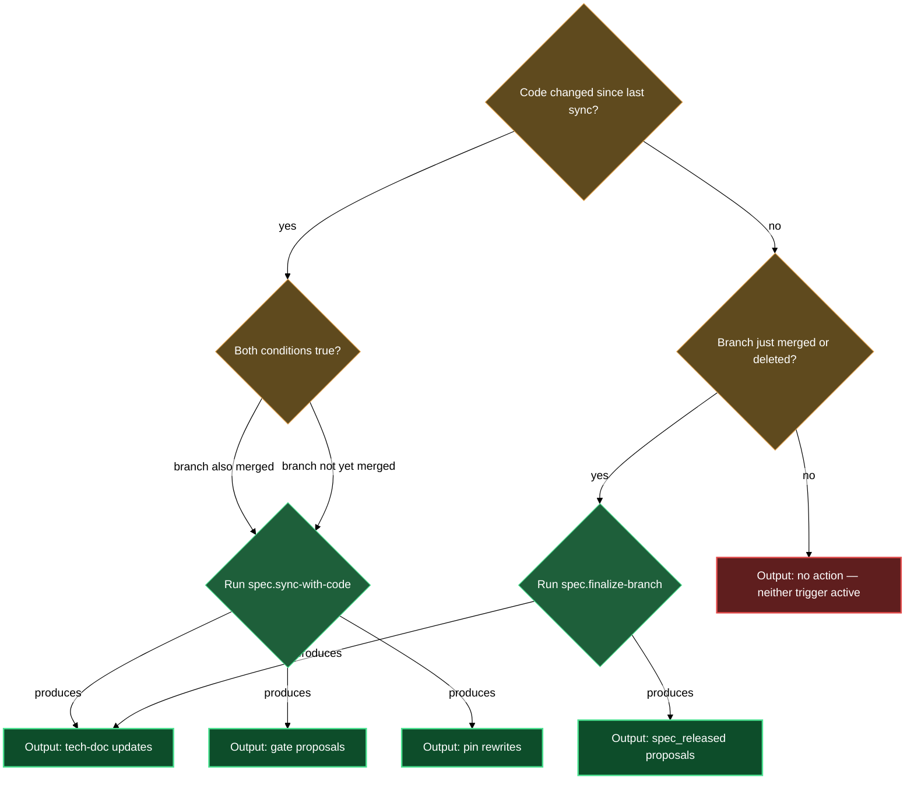

# Keeping specs aligned with source code

Specs drift from code as soon as the first commit lands without a corresponding update. The code-sync block gives you two targeted tools: one for pulling in-flight code changes into the spec, and one for cleaning up after a branch closes. Together they prevent the documentation-decay loop where the tech doc silently describes a system that no longer exists and spec gates stall because no one notices the code already shipped.

Both skills work against a registered, code-bound product — a product with a `source` binding in `lazy.settings.json[products]`. If your product is design-only (specs ahead of code, no repo attached), these skills no-op until you attach a repo via `/spec.product-config`.

## When you'd use this

- A sprint's worth of commits have landed in the source repo and the product tech doc needs to catch up — new routes, changed signatures, removed components.
- You want the spec gates (specifically `spec_develop_done`) proposed and confirmed against actual code evidence rather than guesswork.
- A feature branch just merged or was squash-merged and you need its source URLs rebased from the feature branch to the default branch.
- You're checking whether a merged branch is enough to propose `spec_released` for the assets it covered.

## How it fits together

Run `/spec.sync-with-code <product>` any time source code has moved since the last sync. The skill reads the product's `.state/spec-sync-<product-key>.json` file to find the last synced commit, then pulls every commit from that point to `HEAD` that touched the product's configured source paths. It fans large commit sets out to parallel read-only agents that categorize structural changes (routes, classes, functions), data and template changes, and user-visible behavior signals separately — then the main session synthesizes and presents you with a grouped summary before touching any file.

Changes land in the right place by role: code-level changes (routes, functions, new files, signature shifts) go into the product tech doc; anything that looks like a behavior change visible to end users is surfaced as a candidate for the product design doc, which you approve or decline per item. The skill never silently rewrites the design doc. After any approved prose rewrites, it re-draws the affected architecture and component diagrams. It then walks every asset under the product, proposes a `spec_develop_done` flip for any asset whose code provably landed on the default branch, and proposes per-file stage corrections where the current stage is objectively inconsistent with the code state. Every gate flip and stage change goes through `/spec.flip-gate` and `/spec.set-stage` respectively — the skill never edits gate frontmatter directly.

Run `/spec.finalize-branch <branch>` (or `/spec.finalize-branch --merged` to sweep all closed branches at once) after a branch is merged or deleted. The skill fetches fresh refs, greps the vault for any spec whose frontmatter contains `spec_source_branches:` entries for that branch, and applies the Pin Reconciliation primitive: merged and deleted branches get their source URLs rewritten to the default branch and the `spec_source_branches` entry removed; open branches are skipped without modification. After the rebase, for each asset whose docs were touched, the skill proposes a `spec_released` flip — if and only if the release precondition ladder (`spec_tests_passing` true, which requires `spec_develop_done`, `spec_plan_done`, `spec_design_done` in turn) is already satisfied. When the precondition is unmet, `/spec.flip-gate` refuses and names the blocking gate; the rebase is applied regardless, and you settle the stuck gate separately before re-running.

The two skills share one underlying primitive — Pin Reconciliation — but operate at different moments: `sync-with-code` runs it opportunistically while processing code changes; `finalize-branch` runs it as its primary job after a branch lifecycle event. Running both in sequence (sync first, then finalize) is the canonical end-of-sprint rhythm.

## Common adjustments

**Squash-merges.** The ancestor check that `finalize-branch` uses returns false for squash-merged branches because the squashed commit is not an ancestor of the source branch tip. Pass `--force-merged` to skip the check: `/spec.finalize-branch <branch> --force-merged`. Alternatively, delete the branch after squash-merging — `finalize-branch` treats a branch that is gone after `fetch --prune` as merged.

**First sync.** On a product with no `.state/` file yet, `sync-with-code` asks which commit to start from. You can accept the default (the first commit touching `source.paths` after the product folder-note's creation time) or supply a specific hash.

**Design-only products.** Neither skill does anything on a product without a `source` binding. Run `/spec.product-config` (edit mode) to attach a repo, then re-invoke.

**After sync, run doctor.** `sync-with-code` automatically runs `/spec.doctor` at the end of each sync and reports findings without auto-fixing — review them as a follow-up step.

## How the two skills relate

<!-- /lazy-diagram.draw lands the fence here; do not author a code block manually. -->

## See also

- **gates** block — the gate-flip and stage-correction primitives that code-sync calls under the hood.
- **source-links** block — the resolve-repo and source-url primitives that both skills rely on for forge-correct URL construction.
- **asset-to-release** walkthrough — full end-to-end journey from asset creation through sync, finalize, and release.
