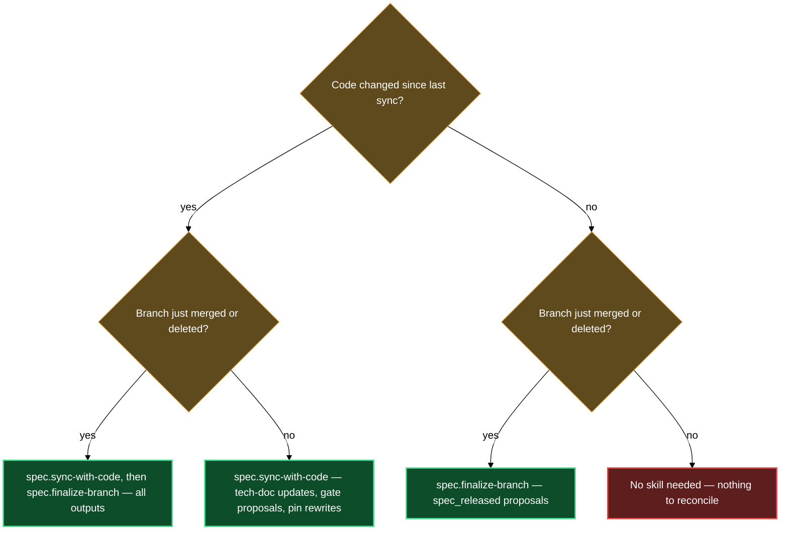

# Keeping specs aligned with source code

Specs drift from code as soon as the first commit lands without a corresponding update. The code-sync block gives you two targeted tools: one for pulling in-flight code changes into the spec, and one for cleaning up after a branch closes. Together they prevent the documentation-decay loop where the tech doc silently describes a system that no longer exists and spec gates stall because nobody noticed the code already shipped.

Both skills require a code-bound product — a product with a `source` binding in `lazy.settings.json[products]`. On a design-only product (specs ahead of code, no repo attached), both skills no-op until you attach a repo via `/spec.product-config`.

## What's in this block

**`/spec.sync-with-code`** is the commit-to-spec translator. You run it whenever source code has moved since the last sync. It reads the product's sync state to find the last-synced commit, collects every commit from that point to HEAD that touched the product's configured source paths, and fans large commit sets out to parallel read-only agents — one for structural changes (routes, classes, functions), one for data and template changes, one for user-visible behavior signals. The main session synthesizes those findings and presents a grouped summary before touching any file. Code-level changes go into the product tech doc; user-visible behavior changes are surfaced as candidates for the product design doc that you approve or decline per item. After approved prose rewrites land, the skill re-dispatches diagrams for every rewritten section, proposes `spec_develop_done` for any asset whose code objectively landed on the default branch, and proposes per-file stage corrections where the current stage is inconsistent with the code state. All gate flips and stage changes go through `/spec.flip-gate` and `/spec.set-stage` — the skill never edits gate frontmatter directly.

**`/spec.finalize-branch`** is the post-merge cleanup skill. You run it after a branch is merged or deleted — or with `--merged` to sweep all closed branches at once. It fetches fresh refs, greps the vault for any spec whose frontmatter contains `spec_source_branches:` entries for that branch, and applies Pin Reconciliation: merged and deleted branch pins get their source URLs rewritten to the default branch and the `spec_source_branches` entry removed; open branch pins are skipped without modification. After the rebase, for each asset whose docs were touched, it proposes a `spec_released` flip — but only if the release precondition ladder (`spec_tests_passing` true, which requires `spec_develop_done`, `spec_plan_done`, and `spec_design_done` in turn) is already satisfied. When the precondition is unmet, `/spec.flip-gate` refuses and names the blocking gate; the rebase is applied regardless, and you settle the stuck gate separately before re-running.

## How they work together

The two skills share one underlying primitive — Pin Reconciliation — but operate at different moments in the development cycle. `sync-with-code` runs it opportunistically while processing code changes; `finalize-branch` runs it as its primary job after a branch lifecycle event.

The canonical end-of-sprint rhythm is to run sync first, then finalize. Run `/spec.sync-with-code <product>` to pull the sprint's commits into the tech doc and advance any gate proposals grounded in the landed code. Then run `/spec.finalize-branch --merged` to rebase every spec whose branch has since merged, and collect any `spec_released` proposals that the precondition ladder now permits.

You can also run either skill in isolation. Sync is for any moment source code has moved — mid-sprint, after a hotfix, after a revert. Finalize is for any moment a branch closes — immediately after a merge, or after a squash-merge once you've confirmed there's nothing left on that branch.

**First sync.** On a product with no sync state file yet, `sync-with-code` asks which commit to start from. You can accept the default (the first commit touching `source.paths` after the product folder-note's creation time) or supply a specific hash.

**Squash-merges.** The ancestor check that `finalize-branch` uses returns false for squash-merged branches because the squashed commit is not an ancestor of the source branch tip. Pass `--force-merged` to skip the check: `/spec.finalize-branch <branch> --force-merged`. Alternatively, delete the branch after squash-merging — a branch gone locally and remotely after `fetch --prune` is treated as merged.

**After sync, review doctor output.** `sync-with-code` runs `/spec.doctor` at the end of each sync and reports findings without auto-fixing. Review them as a follow-up step before the next commit.

## Where this fits

The gates block provides the `/spec.flip-gate` and `/spec.set-stage` primitives that both sync skills call when they propose gate flips and stage corrections — code-sync surfaces the proposals; gates block skills execute the mutations.

The source-links block provides the repo resolution and forge-correct URL primitives that both sync skills rely on. Every source URL produced during sync or pin reconciliation goes through `/spec.source-url` — never an inline forge-specific path scheme.

The **asset-to-release** walkthrough traces the full journey from asset creation through sync, finalize, and release — the code-sync block is the spine of that journey.

## How the two skills relate

