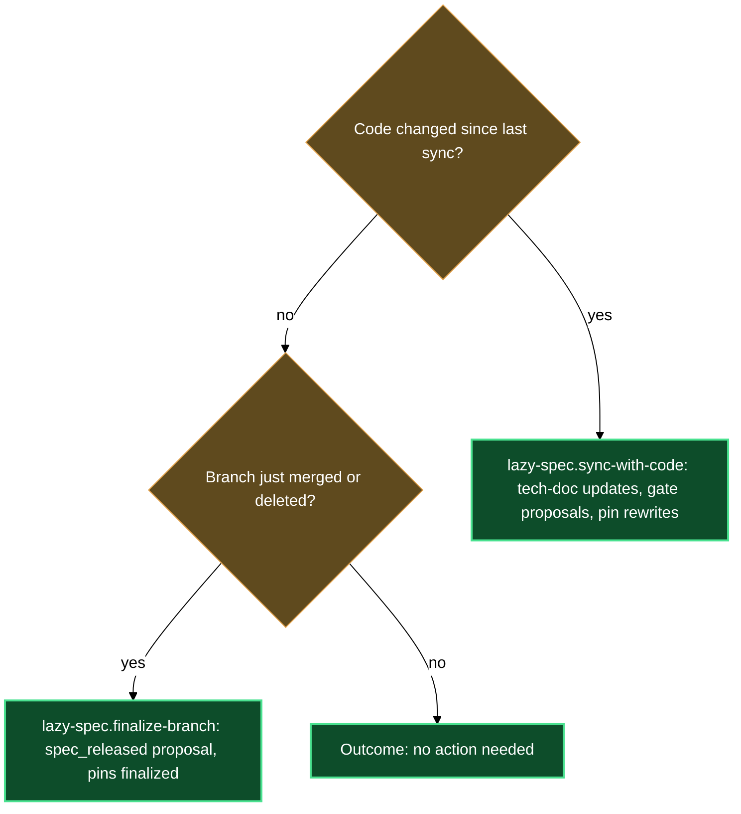

# Keeping specs aligned with source code

Specs drift from code as soon as the first commit lands without a corresponding update — and some capabilities never get a spec at all. The code-sync block gives you three targeted tools: one for pulling in-flight code changes into an already-documented asset, one for cleaning up after a branch closes, and one for finding capabilities the spec tree never picked up in the first place. Together they prevent the documentation-decay loop where the tech doc silently describes a system that no longer exists, spec gates stall because nobody noticed the code already shipped, and whole features sit undocumented because nothing ever prompted a retro-spec.

All three skills require a code-bound product — a product with a `source` binding in `lazy.settings.json[products]`. On a design-only product (specs ahead of code, no repo attached), they no-op until you attach a repo via `/lazy-spec.product-config`.

## What's in this block

**`/lazy-spec.sync-with-code`** is the commit-to-spec translator. You run it whenever source code has moved since the last sync. It reads the product's sync state to find the last-synced commit, collects every commit from that point to HEAD that touched the product's configured source paths, and fans large commit sets out to parallel read-only agents — one for structural changes (routes, classes, functions), one for data and template changes, one for user-visible behavior signals. The main session synthesizes those findings and presents a grouped summary before touching any file. Code-level changes go into the product tech doc; user-visible behavior changes are surfaced as candidates for the product design doc that you approve or decline per item. After approved prose rewrites land, the skill re-dispatches diagrams for every rewritten section, proposes `spec_develop_done` for any asset whose code objectively landed on the default branch, and proposes per-file stage corrections where the current stage is inconsistent with the code state. All gate flips and stage changes go through `/lazy-spec.flip-gate` and `/lazy-spec.set-stage` — the skill never edits gate frontmatter directly. Given an asset instead of a bare product key, it runs in asset mode instead: it reconciles that ONE feature/change asset's `design.md` / `architecture.md` against the current code by anchor — source links, domain groups, project structure — rather than by commit diff, and never rewrites design/architecture prose silently; every drift finding becomes an `[!attention]` callout, a change-asset proposal, or a gate-correction proposal.

**`/lazy-spec.finalize-branch`** is the post-merge cleanup skill. You run it after a branch is merged or deleted — or with `--merged` to sweep all closed branches at once. It fetches fresh refs, greps the vault for any spec whose frontmatter contains `spec_source_branches:` entries for that branch, and applies Pin Reconciliation: merged and deleted branch pins get their source URLs rewritten to the default branch and the `spec_source_branches` entry removed; open branch pins are skipped without modification. After the rebase, for each asset whose docs were touched, it proposes a `spec_released` flip — the skill's own check for whether that flip makes sense (the release ladder: `spec_tests_passing` true, which in turn wants `spec_develop_done`, `spec_plan_done`, and `spec_design_done`) still runs before it proposes, but `/lazy-spec.flip-gate` itself no longer verifies this — it flips unconditionally once you confirm, refusing only a cancelled asset. The rebase is applied regardless of the gate proposal's outcome.

**`/lazy-spec.coverage`** is the gap-scanner. Where sync and finalize keep already-documented assets truthful, coverage looks for capabilities the code already has that no asset documents at all. Run it with a product key when you want to know "what's missing from the specs" or "gap-scan this product against its code." It reads the code side from two existing knowledge maps — the project's structure map and its domain-group tree, each queried for a bounded slice, never swallowed whole — and the spec side from the product's existing asset folders. It compares the two with judgment (a reworded but equivalent capability still counts as covered), then reports uncovered capabilities with a proposed category and slug. It is read-only by default: for each gap it offers to materialize a retro-spec via `/lazy-spec.create-from-code`, or prints an `[!asset-proposal]` block you paste into a living doc yourself — it never writes to the spec tree without you confirming each one. On a product with neither a synced structure map nor a domain-group tree, it falls back to a shallow scan of the source tree's top-level packages, so it still returns something rather than reporting nothing.

## How they work together

The three skills share the same code-bound product record and complement each other along the reactive/proactive line. `sync-with-code` and `finalize-branch` are reactive — they translate a specific code event (a commit landing, a branch closing) into a spec update for an asset that already exists. `coverage` is proactive — it doesn't wait for an event; it periodically asks whether the spec tree is missing something the code has had all along.

The canonical end-of-sprint rhythm is to run sync first, then finalize, then periodically coverage. Run `/lazy-spec.sync-with-code <product>` to pull the sprint's commits into the tech doc and advance any gate proposals grounded in the landed code. Then run `/lazy-spec.finalize-branch --merged` to rebase every spec whose branch has since merged, and collect any `spec_released` proposals that the precondition ladder now permits. Run `/lazy-spec.coverage <product>` less often — after a stretch of code growth, or whenever you suspect the spec tree has fallen behind not just in staleness but in completeness — to catch whole capabilities that never got an asset.

You can also run any of the three in isolation. Sync is for any moment source code has moved — mid-sprint, after a hotfix, after a revert. Finalize is for any moment a branch closes — immediately after a merge, or after a squash-merge once you've confirmed there's nothing left on that branch. Coverage is for any moment you want a gap-scan rather than a truthfulness check — it never touches an existing asset's content, only proposes new ones.

**First sync.** On a product with no sync state file yet, `sync-with-code` asks which commit to start from. You can accept the default (the first commit touching `source.paths` after the product folder-note's creation time) or supply a specific hash.

**Squash-merges.** The ancestor check that `finalize-branch` uses returns false for squash-merged branches because the squashed commit is not an ancestor of the source branch tip. Pass `--force-merged` to skip the check: `/lazy-spec.finalize-branch <branch> --force-merged`. Alternatively, delete the branch after squash-merging — a branch gone locally and remotely after `fetch --prune` is treated as merged.

**After sync, review doctor output.** `sync-with-code` runs `/lazy-spec.doctor` at the end of each sync and reports findings without auto-fixing. Review them as a follow-up step before the next commit.

**Coverage needs a code-bound product too.** A design-only product has no code side to gap-scan — `coverage` reports "no code binding — nothing to gap-scan" and stops. Attach a repo via `/lazy-spec.product-config` first if the product does have code behind it.

## Where this fits

The gates block provides the `/lazy-spec.flip-gate` and `/lazy-spec.set-stage` primitives that `sync-with-code` and `finalize-branch` call when they propose gate flips and stage corrections — code-sync surfaces the proposals; gates block skills execute the mutations.

The source-links block provides the repo resolution and forge-correct URL primitives that `sync-with-code` and `finalize-branch` rely on. Every source URL produced during sync or pin reconciliation goes through `/lazy-spec.source-url` — never an inline forge-specific path scheme.

`coverage`'s code-side signal comes from the project's structure map and domain-group tree (maintained outside this plugin) — when neither is configured, it still runs on a shallower fallback scan, but a richer map produces sharper gap candidates. When it does propose a retro-spec, materializing it through `/lazy-spec.create-from-code` reuses the authoring block's own scaffolding — coverage never writes an asset directly.

The **asset-to-release** walkthrough traces the full journey from asset creation through sync, finalize, and release — the code-sync block is the spine of that journey.

## How the three skills relate

```mermaid
%%{init: {'themeVariables':{'lineColor':'#000','textColor':'#000','edgeLabelBackground':'#fff'},'themeCSS':'.edgeLabel{background-color:transparent!important}.edgeLabel p{background-color:transparent!important}','flowchart':{'diagramPadding':5,'useMaxWidth':true}}}%%
flowchart TD
  codeChangedSinceLastSync{Code changed since last sync?}
  branchMergedOrDeleted{Branch just merged or deleted?}

  runSyncWithCode[lazy-spec.sync-with-code: tech-doc updates, gate proposals, pin rewrites]
  runFinalizeBranch[lazy-spec.finalize-branch: spec_released proposal, pins finalized]
  noActionNeeded[Outcome: no action needed]

  codeChangedSinceLastSync -->|yes| runSyncWithCode
  codeChangedSinceLastSync -->|no| branchMergedOrDeleted
  branchMergedOrDeleted -->|yes| runFinalizeBranch
  branchMergedOrDeleted -->|no| noActionNeeded

  classDef guard fill:#5f4a1e,stroke:#e2a14a,color:#fff
  classDef success fill:#0d4d2a,stroke:#4ae290,color:#fff,stroke-width:2px

  class codeChangedSinceLastSync guard
  class branchMergedOrDeleted guard
  class runSyncWithCode success
  class runFinalizeBranch success
  class noActionNeeded success
```
