# Gates — driving asset readiness from design to release

Every spec asset tracks its progress at two levels that reinforce each other. Individual authored docs (`design.md`, `plan.md`, `bug.md`, `tech.md`) carry a `spec_stage` — the per-file readiness signal. The asset's status folder-note carries five gate booleans (`spec_design_done` through `spec_released`) — the overall progression ladder. This block's three members own every mutation to both levels: `/spec.set-stage` is the sole writer of per-file stages, `/spec.flip-gate` is the sole writer of gate booleans, and `spec.gate-tick` is the background worker that connects them automatically wherever the system can derive a flip without asking you.

When docs get approved in the review loop, the gates advance without manual intervention through S2 (design done, plan done). The remaining three gates — develop done, tests passing, released — require an external signal (a deploy, a green test suite, a branch merge) that the system cannot derive, so the worker drops a visible `[!ready]` callout in the asset's `# Gates` section telling you exactly which command to run. You never modify frontmatter by hand.

## When you'd use this

- Marking a spec doc as in-progress, under review, or accepted as you author it.
- Checking why a gate has not advanced and manually flipping it once the prerequisite is met.
- Understanding what the background worker has already done — which stages it promoted, which gates it flipped, which callouts it dropped — after returning from a review session.
- Regressing a gate when a deploy is rolled back or a test suite breaks (`/spec.flip-gate --off`).
- Cancelling an optional doc (`tech.md`, `plan.md`) when a feature needs no code or a bug needs no formal plan.

## How it fits together

You reach for `/spec.set-stage` whenever you want to record a conscious authoring decision on a single doc: moving it from `empty` to `draft` when you start writing, or from `draft` to `approved` manually before the review machinery has run. You pass it one file path and one stage value from the closed set `empty | draft | approved | rejected | cancelled`; the skill rewrites `spec_stage` in frontmatter, keeps the `spec/<stage>` Obsidian tag in sync, and appends a dated line to the asset folder-note's `# History` section. You never need to touch `spec_stage` or the mirror tag directly — the skill does both in a single edit and refuses any value outside the closed set, including the removed `review`, `done`, and `wtr` stages from older plugin versions. When the asset's category has a container note (e.g. `features/features.md`), the same commit also refreshes that note's stats summary so the bucket counts stay accurate — you never re-run a separate rollup step.

`spec.gate-tick` runs in the background on every daemon tick, dispatched per matched status folder-note by the runtime. Each tick runs in two phases. In the first phase the worker walks the asset's sibling authored docs and promotes any doc whose review resolved as `approved` or `approved-with-concerns` but whose `spec_stage` is still `draft`. When one or more docs are promoted the worker commits atomically under its own identity and returns immediately — gate evaluation is deferred to the next tick so that the gate machinery always reads a committed, consistent stage state. In the second phase the worker looks at the lowest false gate whose precondition now holds. For the two derived gates (`spec_design_done` and `spec_plan_done`) it calls the `flip-gate` primitive directly with `--auto`; the gate boolean, the callout in `# Gates`, the history line in `# History`, and the atomic git commit all land exactly as they would from a manual flip. When the next gate is a human-signal gate (`spec_develop_done`, `spec_tests_passing`, `spec_released`) the worker instead drops a `> [!ready]` callout in `# Gates` telling you the gate is ready and what command to run. If a previously dropped callout's precondition has since regressed the worker rewrites it as a `> [!info] readiness withdrawn` notice and commits.

You reach for `/spec.flip-gate` when you need to advance or regress a gate explicitly. The most common case is the three human-signal gates: after a deploy, after tests go green, after a branch merges, you run `/spec.flip-gate <asset> spec_develop_done` (or the relevant gate) and the primitive validates the precondition, flips the boolean, records the callout and history line, commits atomically, and triggers the post-flip cascade. The cascade for `spec_design_done` first promotes `plan.md` from `empty` to `draft` in its own atomic commit, then opens a review cycle on it, so the next authoring phase starts without a separate command. The skill asks one confirmation question unless you pass `--auto`; pass `--off` to regress a gate. Regression is always allowed when the asset is not cancelled — the precondition check is skipped on `--off`.

The fully automatic chain from a freshly approved `design.md` to S2 (plan done) unfolds across two tick cycles per gate: tick N promotes `design.md` to `approved` and stops; tick N+1 sees the approved doc, auto-flips `spec_design_done`, and the cascade stages `plan.md` for review. After plan review resolves, the same two-tick cycle repeats for `spec_plan_done`. Every mutation is a separate atomic commit, so the daemon's dirty-tree guard never trips on an intermediate state.

## Common adjustments

- **Stage a doc before submitting it for review.** Run `/spec.set-stage <path/to/design.md> draft`. The skill accepts any authored doc whose `spec_role` is `design`, `tech`, `plan`, or `bug`.
- **Cancel an optional doc.** Run `/spec.set-stage <path/to/plan.md> cancelled` when the feature needs no code. The skill refuses `cancelled` on `design.md` and `bug.md` (mandatory docs) — use it only on `tech.md` or `plan.md`.
- **Flip a human-signal gate.** Run `/spec.flip-gate <asset-dir-or-slug> spec_develop_done` after the work is deployed. For assets where the deploy is rolled back, run `/spec.flip-gate <asset> spec_develop_done --off`.
- **Skip the confirmation prompt.** Pass `--auto` to `/spec.flip-gate` when scripting or orchestrating from another skill. Without `--auto` the skill asks one wizard question before acting.
- **Check the background worker's last actions.** The daemon log records each gate-tick dispatch; `spec.flip-gate` writes its own log under `.logs/claude/spec.flip-gate/` for every auto-flip.
- **Re-open a rejected doc.** Run `/spec.set-stage <path/to/design.md> draft` — `rejected` is not terminal; moving back to `draft` re-opens the review loop.

## How the layers feed each other

```mermaid
%%{init: {'themeVariables':{'background':'transparent','lineColor':'#000','textColor':'#000','edgeLabelBackground':'#fff'},'themeCSS':'.edgeLabel{background-color:transparent!important}.edgeLabel p{background-color:transparent!important}','flowchart':{'diagramPadding':5,'useMaxWidth':true}}}%%
flowchart LR
  docEmpty[doc: empty]
  docDraft[doc: draft]
  docApproved[doc: approved]
  gDesign{spec_design_done}
  gPlan{spec_plan_done}
  gDevelop{spec_develop_done}
  gTests{spec_tests_passing}
  gReleased{spec_released}

  docEmpty -->|spec.set-stage| docDraft
  docDraft -->|review / spec.set-stage| docApproved
  docApproved -->|gate-tick auto-flip| gDesign
  docApproved -->|gate-tick auto-flip| gPlan
  gDesign --> gPlan
  gPlan -->|human signal · spec.flip-gate| gDevelop
  gDevelop -->|human signal · spec.flip-gate| gTests
  gTests -->|human signal · spec.flip-gate| gReleased

  classDef entry fill:#1e3a5f,stroke:#4a90e2,color:#fff
  classDef action fill:#1e5f3a,stroke:#4ae290,color:#fff
  classDef guard fill:#5f4a1e,stroke:#e2a14a,color:#fff
  classDef success fill:#0d4d2a,stroke:#4ae290,color:#fff,stroke-width:2px

  class docEmpty entry
  class docDraft action
  class docApproved success
  class gDesign guard
  class gPlan guard
  class gDevelop guard
  class gTests guard
  class gReleased success
```

## See also

- `authoring` block — create the spec assets whose docs flow into these gates.
- `code-sync` block — `spec.sync-with-code` and `spec.finalize-branch` drive the human-signal gates (`spec_develop_done`, `spec_tests_passing`, `spec_released`) from code state.
- `asset-to-release` walkthrough — full journey of a single asset from creation through all five gates.
