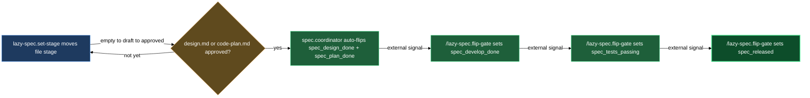

# Gates — driving asset readiness from design to release

Every spec asset tracks its progress at two levels that reinforce each other. Individual authored docs (`design.md`, `architecture.md`, `code-plan.md`, `test-plan.md`, `bug.md`, `tech.md`) carry a `spec_stage` — the per-file readiness signal. The asset's status folder-note carries five gate booleans (`spec_design_done` through `spec_released`) — the overall progression ladder. This block's three members work together across both levels: `/lazy-spec.set-stage` is the sole writer of per-file stages, and `/lazy-spec.flip-gate` is the sole writer of gate booleans. `lazy-spec.gate-tick` decides neither; it is a background poller that only clears a finished expert job's marker and structurally checks the folder-note. Rebasing branch pins and proposing the release gate after a merge moved to the `code-sync` block — see "See also" below.

When docs get approved in the review loop, the gates still advance without you having to flip anything by hand through S2 (design done, plan done) — but the decision now belongs to `spec.coordinator`, the LLM persona woken directly by the doc's own approval commit (as well as by a commit that changes the asset's folder-note). It reads the same readiness rules this block describes, then calls `/lazy-spec.flip-gate` itself. The remaining three gates — develop done, tests passing, released — need an external signal (a deploy, a green test suite, a branch merge) the coordinator cannot derive, so it narrates the asset's status in the folder-note's `# Status brief` instead of flipping blind. You never modify gate frontmatter by hand — you flip it yourself via `/lazy-spec.flip-gate`, or let the coordinator flip it once it has the signal.

**Where the coordinator actually runs.** The daemon that dispatches `spec.coordinator` runs in its own checkout — commonly a separate clone from the one you edit in Obsidian. Nothing you do reaches it until you commit AND push; nothing it decides reaches you until its own commit is pushed and you (or your vault's sync) pull. So "a commit wakes the coordinator" really means: you tick or edit → you commit and push → the daemon's own checkout pulls that commit in on its next iteration → the coordinator wakes, decides, and commits its own answer → the daemon pushes that commit → you pull it back. There is no faster path and no shared working tree.

## When you'd use this

- Marking a spec doc as in-progress, under review, or accepted as you author it.
- Checking why a gate has not advanced and manually flipping it once the prerequisite is met.
- Understanding what the background worker has already done — which stages it promoted, which gates it flipped, which callouts it dropped — after returning from a review session.
- Regressing a gate when a deploy is rolled back or a test suite breaks (`/lazy-spec.flip-gate --off`).
- Cancelling an optional doc (`tech.md`, `code-plan.md`, or `test-plan.md`) when a feature needs no code, a bug needs no formal fix plan, or an asset needs no dedicated functional test plan.

## How it fits together

You reach for `/lazy-spec.set-stage` whenever you want to record a conscious authoring decision on a single doc: moving it from `empty` to `draft` when you start writing, or from `draft` to `approved` manually before the review machinery has run. You pass it one file path and one stage value from the closed set `empty | draft | approved | rejected | cancelled`; the skill rewrites `spec_stage` in frontmatter, keeps the `spec/<stage>` Obsidian tag in sync, and appends a dated line to the asset folder-note's `# History` section. You never need to touch `spec_stage` or the mirror tag directly — the skill does both in a single edit and refuses any value outside the closed set, including the removed `review`, `done`, and `wtr` stages from older plugin versions. When the asset's category has a container note (e.g. `features/features.md`), the same commit also refreshes that note's stats summary so the bucket counts stay accurate — you never re-run a separate rollup step. Approving a living doc — `design.md`, `architecture.md`, or `tech.md`, any type declared `stages: true` and `append_only: false` — also promotes its `[!decision]` blocks into the decisions registry via `lazy-spec.decide`, in the same commit; a refusal there (the asset is cancelled, halted, or released) is reported back to you rather than worked around, and `code-plan.md` / `test-plan.md` never trigger this since they aren't living docs. See the `authoring` block for the decisions registry itself.

A markdown attachment sitting beside an owner doc — one carrying `spec_owner_doc` in its own frontmatter — never takes a stage change directly: `/lazy-spec.set-stage` refuses it as a target, because its `spec_stage` is a mirror of the owner's, not an independent value. Every stage write on the owner doc cascades the same stage and the same `spec/<stage>` tag to each of its markdown attachments, folded into that one commit — skipping only an attachment that is currently in its own review (`review_active: true`), which the review coordinator re-stamps once that review finalizes. A doc with no attachments makes the cascade a silent no-op.

`lazy-spec.gate-tick` runs in the background on every daemon tick, dispatched per matched status folder-note by the runtime — but it only does two small, mechanical things now: it checks whether the asset's currently-active expert job bundle carries a terminal marker (clearing it and, for an implementation/testing job, opening review on the report it wrote), and it runs a structural check on the folder-note's frontmatter and section roster. It no longer promotes stages, evaluates gate readiness, or drops `[!ready]` callouts — that reasoning moved to `spec.coordinator`, woken by the separate `lazy-spec.coordinator-watch` routine on a pulled commit that changes the folder-note, clears its active-job marker, or lands a review approval directly on one of the asset's own docs. The coordinator walks the same sibling-doc-approval and gate-readiness logic this block still describes, then calls `/lazy-spec.set-stage` and `/lazy-spec.flip-gate` itself, narrating what it did (and what it's waiting on) in the folder-note's `# Status brief`.

You reach for `/lazy-spec.flip-gate` yourself when you need to advance or regress a gate explicitly — the most common case being the three human-signal gates: after a deploy, after tests go green, after a branch merges, you run `/lazy-spec.flip-gate <asset> spec_develop_done` (or the relevant gate). The primitive itself no longer checks readiness before flipping — it performs the mutation unconditionally, refusing only when the asset is cancelled — so satisfying the gate's actual precondition (design approved, code-plan approved-or-absent, and so on) is on you when you call it directly; the skill's confirmation question is your own chance to double check before it commits. The skill asks that one confirmation question unless you pass `--auto`; pass `--off` to regress a gate, which is likewise unconditional except for the cancelled-asset guard.

The old fully-automatic tick-driven chain from a freshly approved `design.md` to S2 (plan done) no longer exists as a fixed cycle count — it now runs as a `spec.coordinator` wake per pushed-and-pulled commit to the asset (its folder-note, or a sibling doc's own approval): one wake promotes `design.md`'s stage, a further wake (or the same one, depending on what else changed) evaluates and flips `spec_design_done`, reconciles the ladder, and so on. Every mutation is still a separate atomic commit, and each one has to complete its own push-then-pull round trip before it is visible to whichever side reacts to it next — what changed is that an LLM decision, and a network hop, sit between each commit instead of a fixed two-tick cadence.

## Common adjustments

- **Stage a doc before submitting it for review.** Run `/lazy-spec.set-stage <path/to/design.md> draft`. The skill accepts any authored doc whose `spec_role` is `design`, `architecture`, `tech`, `code-plan`, `test-plan`, or `bug`.
- **Cancel an optional doc.** Run `/lazy-spec.set-stage <path/to/code-plan.md> cancelled` when the feature needs no code. The skill refuses `cancelled` on `design.md`, `bug.md`, and `architecture.md` (mandatory docs — `architecture.md` becomes mandatory the moment the coordinator judges the asset code-bearing) — use it only on `tech.md`, `code-plan.md`, or `test-plan.md`. The same rule protects a product's or the project's own `design.md` (typed `system-design`) as a mandatory doc; its paired `tech.md` (typed `system-tech`) stays cancellable exactly like an asset's `tech.md`.
- **Flip a human-signal gate.** Run `/lazy-spec.flip-gate <asset-dir-or-slug> spec_develop_done` after the work is deployed. For assets where the deploy is rolled back, run `/lazy-spec.flip-gate <asset> spec_develop_done --off`.
- **Skip the confirmation prompt.** Pass `--auto` to `/lazy-spec.flip-gate` when scripting or orchestrating from another skill. Without `--auto` the skill asks one wizard question before acting.
- **Check what the coordinator last did on an asset.** Read the asset folder-note's `# Status brief` (its own rewritten-every-invocation narration) and `# History`; the daemon log records each `gate-tick` and `coordinator-watch` dispatch, and `lazy-spec.flip-gate` writes its own log under `.logs/claude/lazy-spec.flip-gate/` for every flip.
- **Re-open a rejected doc.** Run `/lazy-spec.set-stage <path/to/design.md> draft` — `rejected` is not terminal; moving back to `draft` re-opens the review loop.
- **Advance a doc that has markdown attachments beside it.** Run `/lazy-spec.set-stage` on the owner doc as usual — the cascade re-stamps every attachment's `spec_stage` and `spec/<stage>` tag in the same commit. Do not target the attachment itself; the skill refuses it and points you back at the owner.

## How the layers feed each other

Per-file `spec_stage` moves `empty → draft → approved` via `lazy-spec.set-stage`, and once `design.md` (or `code-plan.md`, when authored) reaches `approved`, `spec.coordinator` — not `lazy-spec.gate-tick` — auto-flips `spec_design_done` and `spec_plan_done`. From there the three human-signal gates (`spec_develop_done`, `spec_tests_passing`, `spec_released`) advance in a chain, each flipped via `/lazy-spec.flip-gate` on an external signal.

```mermaid
%%{init: {'themeVariables':{'background':'transparent','lineColor':'#000','textColor':'#000','edgeLabelBackground':'#fff'},'themeCSS':'.edgeLabel{background-color:transparent!important}.edgeLabel p{background-color:transparent!important}','flowchart':{'diagramPadding':5,'useMaxWidth':true}}}%%
flowchart LR
  setStagePerFile["lazy-spec.set-stage moves file stage"]
  stageReachesApproved{"design.md or code-plan.md approved?"}
  autoFlipDesignPlanGates["spec.coordinator auto-flips spec_design_done + spec_plan_done"]
  flipDevelopDone["/lazy-spec.flip-gate sets spec_develop_done"]
  flipTestsPassing["/lazy-spec.flip-gate sets spec_tests_passing"]
  flipReleased["/lazy-spec.flip-gate sets spec_released"]

  setStagePerFile -->|empty to draft to approved| stageReachesApproved
  stageReachesApproved -->|not yet| setStagePerFile
  stageReachesApproved -->|yes| autoFlipDesignPlanGates
  autoFlipDesignPlanGates -->|external signal| flipDevelopDone
  flipDevelopDone -->|external signal| flipTestsPassing
  flipTestsPassing -->|external signal| flipReleased

  classDef entry fill:#1e3a5f,stroke:#4a90e2,color:#fff
  classDef guard fill:#5f4a1e,stroke:#e2a14a,color:#fff
  classDef action fill:#1e5f3a,stroke:#4ae290,color:#fff
  classDef success fill:#0d4d2a,stroke:#4ae290,color:#fff,stroke-width:2px

  class setStagePerFile entry
  class stageReachesApproved guard
  class autoFlipDesignPlanGates action
  class flipDevelopDone action
  class flipTestsPassing action
  class flipReleased success
```

## See also

- `authoring` block — create the spec assets whose docs flow into these gates; also owns `lazy-spec.decide` and the decisions registry that `spec_stage: approved` promotes into.
- `code-sync` block — `lazy-spec.sync-with-code` drives `spec_develop_done` and `spec_tests_passing` from code state; `lazy-spec.finalize-branch` rebases branch pins and proposes `spec_released` once a branch merges — see that chapter for the full flow.
- `asset-to-release` walkthrough — full journey of a single asset from creation through all five gates.
