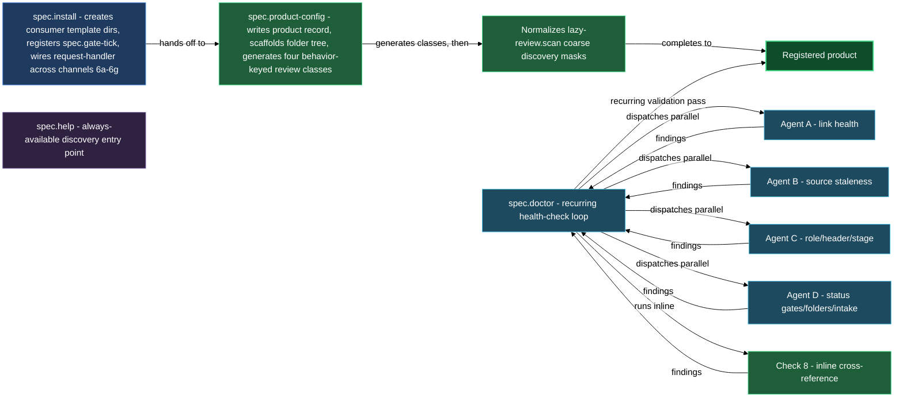

# Bootstrapping, configuring products, and auditing spec health

Before you author a single spec asset, three things need to be in place: the plugin's consumer directories and daemon routines must be wired, at least one product must be registered with a path and (optionally) a source repo, and you need a way to check that the spec stays consistent as the codebase and the team evolve. This block covers all three. `/spec.install` sets up the plugin, `/spec.product-config` walks you through creating or editing a product record, `/spec.doctor` audits that record for validity and drift, and `/spec.help` gives you a skill map whenever you need a reminder of what the plugin can do.

Running these four in order is the fastest path from "just installed the plugin" to a fully wired product ready for the gate-and-review cycle. They are also each independently re-runnable: `spec.install` is idempotent, `spec.product-config` has an edit mode, and `spec.doctor` is read-only by default — safe to run at any time.

## When you'd use this

- Setting up the plugin for the first time in a project: run `/spec.install` to create the per-category template override directories, register the `spec.gate-tick` daemon routine, and wire the full request-handler runtime (the open and apply channels plus the `spec.request-router` expert, the review class for `requests/*.md`, and the spawned-doc review classes), then chain into `/spec.product-config` when prompted to register your first product.
- Registering a new product (code-bound or design-only): run `/spec.product-config` to walk through source repo attachment, language, icon, review experts, and built-in asset categories — the skill writes the product record, scaffolds the entire folder tree (including protected `# Summary` container sections with précis and stats markers on every folder-note), generates four behavior-keyed review classes (one per doc-kind — `design@`, `plan@`, `tech@`, `bug@` — each with wildcard globs spanning every asset category, built-in and operator-defined alike), and normalizes the `lazy-review.scan` discovery masks in one pass.
- Adding a source repo to a design-only product you previously registered: run `/spec.product-config` in edit mode — it detects the existing record and lets you attach the source binding without touching other fields.
- Checking spec health after a sprint, a branch merge, or a period of active coding: run `/spec.doctor <product>` to dispatch four parallel scan agents — link health, source staleness (code-bound products only), role and stage violations, and gate/folder/intake integrity — then surface findings grouped by severity. Re-run with `--apply` to walk targeted fixes interactively after reviewing the report.
- Recalling which skill to use for a task you have not done in a while: run `/spec.help` for a one-screen capability map of every skill the plugin ships, grouped by area.

## What's in this block

**`/spec.install`** bootstraps the plugin in your project and leaves it ready for product creation. It creates the per-category template override directories (`.claude/templates/spec.feature/`, `spec.change/`, `spec.bug/`, `spec.product/`, `spec.request/`) so you can customize scaffold templates per product later. It reads or seeds the repo's default authoring language into the `spec` settings section, registers the `spec.gate-tick` md-scan routine so the daemon automatically advances asset gates, and wires the request-handler runtime across five channels: the mechanical open routine (`spec.request-open`, fires on naked request files), the mechanical apply routine (`spec.request-apply`, fires post-finalize on approved requests), the `spec.request-router` expert entry, the review class for `requests/*.md` (with a `terminal.routing` writer), and the spawned-doc review classes for `design.md` / `plan.md` paths under every registered product. It also normalizes the `lazy-review.scan` discovery routine (Step 6f): the routine's path sieve is deliberately coarse — two scope-root masks (the requests inbox and the products tree, each prefixed with the vault root) rather than one glob per doc kind — so the skill ensures those masks are present, removes any legacy filename-suffixed masks they subsume, and tightens the routine's frontmatter filter; precise routing lives in the review classes, not the sieve. It then offers optional protocols for the spec writer routine (Step 6g). Every write follows a silent-merge policy — absent targets are created, cleanly mergeable targets are merged, only genuine conflicts ask a question. The skill is fully idempotent: re-running after a plugin update surfaces any new wiring requirements without overwriting anything you have customized — for instance, an existing project's request-inbox routines pick up the current tick cadence and the filter clause that keeps the `requests/` folder-note itself from being endlessly re-dispatched, merged in cleanly alongside anything you have customized.

**`/spec.product-config`** is the product-registration wizard. In create mode it walks you through the compound-key (subsystem, optional namespace, leaf), the vault-relative `spec_path`, an optional source binding (`repo` key + covered paths), dependency detection via a parallel source scan, language, icon, and the four review expert roles (designer, developer, tester, historian). On save it writes the product record into `lazy.settings.json[products]`, scaffolds the product folder tree (`features/`, `changes/`, `bugs/`, the product folder-note, and per-category folder-notes), and writes the protected `# Summary` container section on each folder-note — including a précis placeholder between `<!-- spec:precis:* -->` markers and a stats block between `<!-- spec:stats:* -->` markers that the plugin keeps fresh as assets change. It then generates four behavior-keyed review classes — one per doc-kind (`design@<key>`, `plan@<key>`, `tech@<key>`, `bug@<key>`), each with wildcard globs spanning the product root and every asset category folder so a new category never needs its own class — reconciling any legacy per-category classes from an older install when re-run in edit mode, and refusing to persist a class that would reference an unregistered expert. It normalizes the `lazy-review.scan` discovery routine — ensuring one coarse mask covering the new product's whole subtree and removing any legacy per-doc masks it subsumes — then closes by running `/spec.doctor` to confirm everything is consistent. It also ensures the vault-root `requests/` inbox exists (shared by all products) and carries its own protected `# Summary` folder-note. In edit mode it reads the existing record first and lets you add a source binding, extend dependencies, or switch language and icon — without touching asset categories or other fields you do not explicitly change.

**`/spec.doctor`** audits a product spec for validity and drift. It dispatches four parallel Explore agents in a single pass: Agent A checks wikilink health and source URL consistency (bare wikilinks, broken targets, branch-pin drift); Agent B diffs the tech-doc surface against current code for code-bound products (missing routes, removed functions, changed constants, new files); Agent C validates `spec_role` against its closed set, header section shape (H1 title and breadcrumb), `spec_stage` against its closed set, and the tag mirror between `spec_stage` and `spec/<stage>` — it also enforces that every asset status folder-note carries exactly the three protected H1 sections (`# Summary`, `# Gates`, `# History`) and that every container folder-note carries a `# Summary` section with both a précis marker and a stats marker; Agent D checks gate booleans, the strict five-gate ladder, gate-to-stage coupling, top-level folder validity, operator-zone folder-note shape, and request intake schema. An inline Check 8 runs cross-product — it verifies the vault-root `requests/requests.md` inbox note's protected `# Summary` section and flags any loose `changelog.md` files. Without `--apply` the skill is fully read-only — it surfaces what is wrong and stops. With `--apply` it walks each finding and offers a targeted fix per item, asking one question per fix before writing anything. Fixes that require a stage or gate change delegate to the canonical skills (`spec.set-stage`, `spec.flip-gate`) rather than raw-editing values.

**`/spec.help`** prints a one-screen capability map of every skill the plugin ships, grouped by area (bootstrap, authoring, gates and lifecycle, request processing, sync and validation, primitives). It is a command that outputs static text — no tool calls, no config reads. Use it as a quick orientation when you need to recall which skill handles a specific job.

## How they work together

The first time you work in a project, run `/spec.install`. It checks that the plugin is enabled, creates the consumer template directories, seeds the authoring language if needed, and registers the daemon routines and full request-handler wiring. At the end it offers to chain directly into `/spec.product-config` — accepting that offer is the fastest path to a working product. You can also skip and run `/spec.product-config` manually once install finishes.

`/spec.product-config` is the heavier step. It collects the information install cannot derive: what the product is called, where its spec lives, whether it has source code, which experts review its docs. When you attach a source repo, it runs a dependency scan in the background. On save, the skill writes the product folder-note and all three category folder-notes, each with a protected `# Summary` section carrying a précis placeholder (which it fills immediately) and stats markers (which the daemon keeps current as assets are added and gates flip). Four behavior-keyed review classes are generated — one per doc-kind, with wildcard globs covering every asset category — and the `lazy-review.scan` discovery routine gains one coarse mask covering the product's whole subtree, so the daemon immediately starts watching the new product's files; the precise file-to-class routing happens at dispatch time through the class globs. Re-running `/spec.product-config` in edit mode on a product from an older install reconciles any legacy per-category classes into the collapsed set automatically. The skill ends with a `/spec.doctor` call, so the product arrives in a verified state. It also ensures the vault-root `requests/` inbox exists as a shared folder-note with the same protected `# Summary` structure.

After that, `/spec.doctor` is a recurring check you run on demand: after any significant coding sprint, after merging a branch, or whenever you suspect drift. For a code-bound product, Agent B diffs the tech-doc surface against the current code and reports undocumented routes, removed functions, and changed constants. For all products, Agent C catches the consistency errors that accumulate during active development — a `spec_stage` whose mirror tag was not updated, a missing or duplicated protected H1 section on a status folder-note, a broken wikilink introduced by a rename. Agent D catches gate-model violations: a gate flipped manually without its coupling doc in `approved` stage, a precedence violation (a later gate true while an earlier is false), a top-level folder that is neither built-in nor a declared asset category. Running without `--apply` first gives you the full report with no side effects; then re-run with `--apply` to walk the fixes interactively.

`/spec.help` stands apart from the other three — it is not part of the installation flow but is useful at any point when the plugin surface is unfamiliar or hard to recall from memory.

## Common adjustments

- **Change the authoring language for a product.** Run `/spec.product-config` in edit mode and pick a different language at the language step. The record is updated; all subsequent prose-generating skills use the new language for that product.
- **Change the review experts assigned to a product's docs.** Run `/spec.product-config` in edit mode and step through the expert questions. The built-in review classes in `lazy.settings.json[review.classes]` are regenerated with the new expert names.
- **Register an operator-defined asset category.** After the initial product registration, run `/spec.add-asset-category <compound-key>` — it is a separate skill, not inline in `spec.product-config`. The `spec.product-config` report mentions this if you chose to add categories at Step 8. The new category's docs are covered automatically by the product's existing behavior-keyed review classes (their globs already span every category folder) — `spec.add-asset-category` never touches `review.classes`.
- **Re-run install after a plugin update.** Run `/spec.install` again. It surfaces any new wiring requirements (new routines, new review classes, new settings keys) and merges them in silently. Already-present entries are left untouched; orphaned entries from removed features are kept, never deleted.
- **Fix spec errors in bulk.** Run `/spec.doctor <product> --apply`. Each finding is presented one at a time with a description of the exact fix — you confirm or skip per item. Fixes that require a stage or gate change delegate to `spec.set-stage` or `spec.flip-gate` respectively; `/spec.doctor` never raw-edits those values directly.
- **Run doctor across all registered products.** Run `/spec.doctor` with no product argument and choose "all products" — it iterates every key in `lazy.settings.json[products]` and produces a per-product report.
- **Doctor reports a missing protected section on a folder-note.** This means a `# Summary`, `# Gates`, or `# History` H1 section (with its `#protected/spec/*` tag) is absent from a status folder-note, or a `# Summary` section with précis and stats markers is absent from a container folder-note. Re-run `/spec.product-config` in edit mode to regenerate the folder-notes, or add the missing skeleton manually and run `/spec.doctor --apply` to confirm.

## See also

- [authoring](authoring.md) — create spec assets (features, changes, bugs, operator-defined categories) and capture raw ideas into the requests inbox.
- [gates](gates.md) — advance assets through readiness gates and per-file stages after the product is registered.
- [new-product-from-code](walkthroughs/new-product-from-code.md) — end-to-end walkthrough: register a product, generate its spec from code, and scaffold the first feature.

## How the pieces fit together

