# Bootstrapping, configuring products, and auditing spec health

Before you author a single spec asset, three things need to be in place: the plugin's consumer directories and daemon routines must be wired, at least one product must be registered with a path and (optionally) a source repo, and you need a way to check that the spec stays consistent as the codebase and the team evolve. This block covers all three. `/spec.install` sets up the plugin, `/spec.product-config` walks you through creating or editing a product record, `/spec.doctor` audits that record for validity and drift, and `/spec.help` gives you a skill map whenever you need a reminder of what the plugin can do.

Running these four in order is the fastest path from "just installed the plugin" to a fully wired product ready for the gate-and-review cycle. They are also each independently re-runnable: `spec.install` is idempotent, `spec.product-config` has an edit mode, and `spec.doctor` is read-only by default — safe to run at any time.

## When you'd use this

- Setting up the plugin for the first time in a project: run `/spec.install` to create the consumer template directories, register the `spec.gate-tick` daemon routine, and wire the request-handler runtime, then chain into `/spec.product-config` when prompted to register your first product.
- Registering a new product (code-bound or design-only): run `/spec.product-config` to walk through source repo attachment, language, icon, review experts, and built-in asset categories — the skill writes the product record and scaffolds the entire folder tree in one pass.
- Adding a source repo to a design-only product you previously registered: run `/spec.product-config` in edit mode — it detects the existing record and lets you attach the source binding without touching other fields.
- Checking spec health after a sprint, a branch merge, or a period of active coding: run `/spec.doctor <product>` to surface staleness, broken wikilinks, gate-precedence violations, missing folder-notes, and `spec_stage`/tag drift. Re-run with `--apply` to write targeted fixes after reviewing what each one changes.
- Recalling which skill to use for a task you have not done in a while: run `/spec.help` for a one-screen capability map of every skill the plugin ships.

## What's in this block

**`/spec.install`** bootstraps the plugin in your project and leaves it ready for product creation. It creates the per-category template override directories (`.claude/templates/spec.feature/`, `spec.change/`, `spec.bug/`, `spec.product/`, `spec.request/`) so you can customize scaffold templates per product later. It reads or seeds the repo's default authoring language, registers the `spec.gate-tick` md-scan routine so the daemon automatically advances asset gates, and wires the three-channel request-handler runtime (the mechanical open and apply routines, the `spec.request-router` expert entry, the built-in review classes for request files and spawned spec docs). Every write follows a silent-merge policy — absent targets are created, cleanly mergeable targets are merged, only genuine conflicts ask a question. The skill is fully idempotent: re-running after a plugin update surfaces any new wiring requirements without overwriting anything you have customized.

**`/spec.product-config`** is the product-registration wizard. In create mode it walks you through the compound-key (subsystem, optional namespace, leaf), the vault-relative `spec_path`, an optional source binding (`repo` key + covered paths), dependency detection via a parallel source scan, language, icon, and the four review expert roles (designer, developer, tester, historian). On save it writes the product record into `lazy.settings.json[products]`, scaffolds the product folder tree (`features/`, `changes/`, `bugs/`, `requests/`, the product folder-note, and per-category folder-notes with their iconize icons), generates the eight built-in review classes, and syncs the `lazy-review.scan` routine's path list. It closes by running `/spec.doctor` on the new product to confirm everything is consistent. In edit mode it reads the existing record first and lets you add a source binding, extend dependencies, or switch language and icon — without touching asset categories or other fields you do not explicitly change.

**`/spec.doctor`** audits a product spec for validity and drift. It dispatches four parallel Explore agents — link health (wikilinks and source URLs), source staleness (tech-doc content vs current code for code-bound products), role and header violations (`spec_role` closed set, required H1/breadcrumb, `spec_stage` closed set and tag mirroring), and status folder-note integrity (gate booleans, gate-precedence ladder, gate-to-stage coupling, folder structure, operator-zone folder-notes, request intake). It merges their findings by severity (FAIL, WARN, INFO) and prints a structured report. Without `--apply` it is fully read-only — it surfaces what is wrong and stops. With `--apply` it walks each finding and offers a targeted fix per item, asking one `AskUserQuestion` per fix before writing anything. Fix delegates go to the canonical skills — `spec.set-stage` to resync a tag, `spec.flip-gate` to correct a precedence violation — rather than raw-editing files.

**`/spec.help`** prints a one-screen capability map of every skill the plugin ships, grouped by area (bootstrap, authoring, gates and lifecycle, request processing, sync and validation, primitives). It is a command that outputs static text — no tool calls, no config reads. Use it as a quick orientation when you need to recall which skill handles a specific job.

## How they work together

The first time you work in a project, run `/spec.install`. It checks that the plugin is enabled, creates the consumer template directories, seeds the authoring language if needed, and registers the daemon routines. At the end it offers to chain directly into `/spec.product-config` — accepting that offer is the fastest path to a working product. You can also skip and run `/spec.product-config` manually once install finishes.

`/spec.product-config` is the heavier step. It collects the information install cannot derive: what the product is called, where its spec lives, whether it has source code, which experts review its docs. When you attach a source repo, it runs a dependency scan in the background. When it saves, the eight built-in review classes are generated and the scan routine is updated — the daemon immediately starts watching the new product's files. The skill ends with a `/spec.doctor` call, so the product arrives in a verified state.

After that, `/spec.doctor` is a recurring check you run on demand: after any significant coding sprint, after merging a branch, or whenever you suspect drift. For a code-bound product, the source-staleness agent (Agent B) diffs the tech-doc surface against the current code and reports undocumented routes, removed functions, and changed constants. For all products, the gate and stage agents catch the consistency errors that can accumulate during active development — a gate flipped manually without its coupling doc in `approved` stage, a `spec_stage` whose mirror tag was not updated, a broken wikilink introduced by a rename. Running without `--apply` first gives you the full report with no side effects; then re-run with `--apply` to walk the fixes interactively.

`/spec.help` stands apart from the other three — it is not part of the installation flow but is useful at any point when the plugin surface is unfamiliar or hard to recall from memory.

## Common adjustments

- **Change the authoring language for a product.** Run `/spec.product-config` in edit mode and pick a different language at Step 3. The record is updated; all subsequent prose-generating skills (creation, from-code) use the new language for that product.
- **Change the review experts assigned to a product's docs.** Run `/spec.product-config` in edit mode and step through the expert questions. The review classes in `lazy.settings.json[review.classes]` are regenerated with the new expert names.
- **Register an operator-defined asset category.** After the initial product registration, run `/spec.add-asset-category <compound-key>` — it is a separate skill, not inline in `spec.product-config`. The `spec.product-config` report mentions this if you answered "add categories now" at Step 8.
- **Re-run install after a plugin update.** Run `/spec.install` again. It surfaces any new wiring requirements (new routines, new review classes, new settings keys) and merges them in silently. Already-present entries are left untouched.
- **Fix spec errors in bulk.** Run `/spec.doctor <product> --apply`. Each finding is presented one at a time with a description of the exact fix — you confirm or skip per item. Fixes that require a stage or gate change delegate to `spec.set-stage` or `spec.flip-gate` respectively; `/spec.doctor` never raw-edits those values directly.
- **Run doctor across all registered products.** Run `/spec.doctor` with no product argument and choose "all products" — it iterates every key in `lazy.settings.json[products]` and produces a per-product report.

## See also

- [authoring](authoring.md) — create spec assets (features, changes, bugs, operator-defined categories) and capture raw ideas into the requests inbox.
- [gates](gates.md) — advance assets through readiness gates and per-file stages after the product is registered.
- [new-product-from-code](walkthroughs/new-product-from-code.md) — end-to-end walkthrough: register a product, generate its spec from code, and scaffold the first feature.

## How the pieces fit together

```mermaid
%%{init: {'themeVariables':{'background':'transparent','lineColor':'#000','textColor':'#000','edgeLabelBackground':'#fff'},'themeCSS':'.edgeLabel{background-color:transparent!important}.edgeLabel p{background-color:transparent!important}','flowchart':{'diagramPadding':5,'useMaxWidth':true}}}%%
flowchart LR
  specInstall[spec.install]
  createConsumerDirs[Create consumer dirs]
  registerGateTick[Register gate-tick routine]
  wireRequestHandler[Wire request-handler runtime]
  specProductConfig[spec.product-config]
  writeProductRecord[Write product record]
  scaffoldFolderTree[Scaffold folder tree]
  generateReviewClasses[Generate review classes]
  registeredProduct([Registered product])
  specDoctor{spec.doctor health-check}
  specHelp[spec.help]

  specInstall -->|creates| createConsumerDirs
  specInstall -->|registers| registerGateTick
  specInstall -->|wires| wireRequestHandler
  createConsumerDirs -->|ready| specProductConfig
  registerGateTick -->|ready| specProductConfig
  wireRequestHandler -->|ready| specProductConfig
  specProductConfig -->|writes| writeProductRecord
  specProductConfig -->|scaffolds| scaffoldFolderTree
  specProductConfig -->|generates| generateReviewClasses
  writeProductRecord -->|completes| registeredProduct
  scaffoldFolderTree -->|completes| registeredProduct
  generateReviewClasses -->|completes| registeredProduct
  registeredProduct -->|triggers| specDoctor
  specDoctor -->|valid| registeredProduct
  specDoctor -->|fix applied| registeredProduct
  specHelp -->|discovers| specInstall

  classDef entry fill:#1e3a5f,stroke:#4a90e2,color:#fff
  classDef action fill:#1e5f3a,stroke:#4ae290,color:#fff
  classDef guard fill:#5f4a1e,stroke:#e2a14a,color:#fff
  classDef success fill:#0d4d2a,stroke:#4ae290,color:#fff,stroke-width:2px

  class specInstall entry
  class specHelp entry
  class createConsumerDirs action
  class registerGateTick action
  class wireRequestHandler action
  class specProductConfig action
  class writeProductRecord action
  class scaffoldFolderTree action
  class generateReviewClasses action
  class registeredProduct success
  class specDoctor guard
```

<!-- /lazy-diagram.draw lands the fence here; do not author a code block manually. -->
