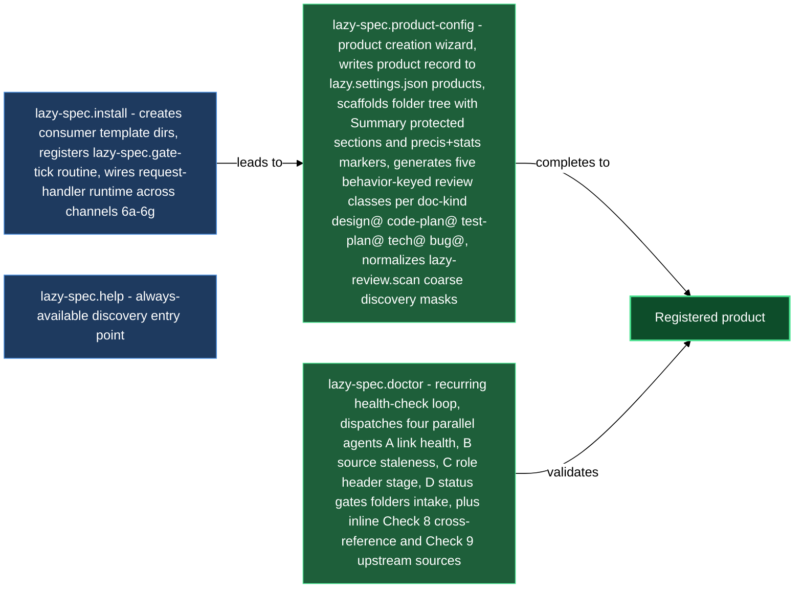

# Bootstrapping, configuring products, and auditing spec health

Before you author a single spec asset, several things need to be in place: the plugin's consumer directories and daemon routines must be wired, the project-wide vault spec (`vision.md`) must exist, at least one product must be registered with a path and (optionally) a source repo, and you need a way to check that both the plugin itself and the spec content stay consistent as the codebase and the team evolve. This block covers all of that: `/lazy-spec.install` sets up the plugin and seeds the vault spec draft, `/lazy-spec.product-config` walks you through creating or editing a product record, `/lazy-spec.doctor` audits a registered product's spec for validity and drift, and `/lazy-spec.help` is the always-available reference for the plugin's full skill surface when you need to recall a verb mid-session.

Running `/lazy-spec.install` then `/lazy-spec.product-config` in order is the fastest path from "just installed the plugin" to a fully wired product ready for the gate-and-review cycle. All three action skills are also independently re-runnable: `lazy-spec.install` is idempotent, `lazy-spec.product-config` has an edit mode, and `lazy-spec.doctor` is read-only by default — safe to run at any time. `/lazy-spec.help` is even simpler: it prints a static reference block and touches nothing, so run it whenever you want a refresher on which verb does what.

## When you'd use this

- Setting up the plugin for the first time in a project: run `/lazy-spec.install` to create the per-category template override directories, mirror the plugin's `spec.decisions.md` rule into `.claude/rules/`, register the `lazy-spec.gate-tick`, `lazy-spec.coordinator-watch`, and `lazy-spec.collect` daemon routines, wire the full request-handler runtime (the open and apply channels plus the `spec.coordinator` expert, the review class for `requests/*.md`, and the review classes for every spawned doc kind), seed the `agent_models` tier for `spec.coordinator`, seed the project-wide vault spec draft if it doesn't already exist, and register the plugin's own `Bash(lazycortex-specs *)` permission so dispatched experts can call it under `dontAsk` mode — then chain into `/lazy-spec.product-config` when prompted to register your first product.
- Registering a new product (code-bound or design-only): run `/lazy-spec.product-config` to walk through the product's stable key, its spec folder, source repo attachment, language, icon, and the built-in review-expert roles — the skill writes the product record and its own folder-note (category folders such as `features/` or `changes/` appear lazily the first time you scaffold an asset into them), generates or reuses the vault-wide shared review classes covering every doc kind a product can produce, and normalizes the `lazy-review.scan` discovery masks in one pass.
- Registering your first-ever product, before the vault spec exists: `/lazy-spec.product-config` refuses in create mode until `<content-root>/vision.md` — the project-wide vault spec — is on disk, OR a pre-existing `<content-root>/design.md` without a vision does (the legal pre-vision state, migrated by the operator by hand — a product is a consequence of it either way). Run `/lazy-spec.install` first (or again); its Step 6.9 seeds a starting draft from the `vault-vision.md` template only when neither file exists, and leaves an existing draft (or a pre-vision `design.md`) untouched.
- Adding a source repo to a design-only product you previously registered: run `/lazy-spec.product-config` in edit mode — it detects the existing record and lets you attach the source binding without touching other fields.
- Registering a product whose code lives in the very repo that holds the spec vault: run `/lazy-spec.product-config`, and when the source step asks for the repo's `local_path`, pick "this repo (.)" instead of typing an absolute path — the same product record then resolves correctly whether you are working in your dev checkout or a separate runtime clone.
- Checking spec health after a sprint, a branch merge, or a period of active coding: run `/lazy-spec.doctor <product>` to dispatch four parallel scan agents — link health, source staleness (code-bound products only), role/type and stage violations, and gate/folder/intake integrity — then surface findings grouped by severity. Re-run with `--apply` to walk targeted fixes interactively after reviewing the report.
- Migrating an older catalog after a plugin update: re-run `/lazy-spec.install` — its one-shot backfills stamp `spec_doc_type` / `spec_asset_type` onto documents and assets that predate typing, and rename any lingering `dev-plan` / `dev-report` document-type usage to `code-plan` / `code-report`, all idempotently and without committing on your behalf.
- Forgetting which skill does what, mid-session: run `/lazy-spec.help` — it prints the full skill surface grouped by phase (bootstrap, authoring, gates & lifecycle, request processing, sync & validation, primitives) with a one-line description for each verb, plus links to this help chapter's walkthroughs, troubleshooting, and FAQ. It makes no changes and needs no arguments.

## What's in this block

**`/lazy-spec.install`** bootstraps the plugin in your project and leaves it ready for product creation. It creates the per-category template override directories (`.claude/templates/spec.feature/`, `spec.change/`, `spec.bug/`, `spec.product/`, `spec.request/`) so you can customize scaffold templates per product later. It also mirrors the plugin's own `spec.decisions.md` rule into `.claude/rules/` so the decisions-registry conventions load into every session, re-syncing it on every later run. It reads or seeds the repo's default authoring language into the `spec` settings section, registers the `lazy-spec.gate-tick` md-scan routine (a pure poller — active-job polling plus a structural note-check, nothing more) and the `lazy-spec.coordinator-watch` git-watch routine that wakes `spec.coordinator` once a non-bot commit reaches the daemon's own checkout (which is typically not the checkout you edit in — your gesture has to be committed and pushed before this routine ever sees it) and touches an asset's status folder-note, its commands section, an answered question, or any typed document under a registered product. It also registers the `lazy-spec.collect` routine — a lightweight postman that sweeps the runtime's job-marker sidecar every tick and re-runs `lazy-spec.gate-tick`'s per-note check for any note whose dispatched expert job just finished, since a finished job's terminal marker lands outside the note's own folder and so is invisible to `lazy-spec.gate-tick`'s own file-watch scan. It wires the request-handler runtime across five channels: the mechanical open routine (`lazy-spec.request-open`, fires on naked request files), the mechanical apply routine (`lazy-spec.request-apply`, fires post-finalize on approved requests), the `spec.coordinator` expert entry, the review class for `requests/*.md` (with a `terminal.routing` writer naming `spec.coordinator`, run in its routing mode), and the review classes for every spawned doc kind (vision, use-cases, design, system-vision, system-design, system-tech, architecture, ui-design, code-plan, test-plan, bug, plus each tool's own report kind — code-report, test-report, data-report, docs-report) under every registered product — the `system-vision`, `system-design`, and `system-tech` classes specifically cover the product-root and project-wide (content-root) `vision.md` / `design.md` / `tech.md` set, distinct from the asset-level `vision` and `design` classes that review a feature's or change's own `vision.md` / `design.md`. It also normalizes the `lazy-review.scan` discovery routine and attaches the mandatory expert-signals protocol to it: the routine's path sieve is deliberately coarse — two scope-root masks (the requests inbox and the products tree, each prefixed with the vault root) rather than one glob per doc kind — so the skill ensures those masks are present and tightens the routine's frontmatter filter. It then offers optional protocols for the spec writer routine, and registers the `lazy-spec.upstream-tick` schedule routine once a `spec.upstream` source is configured, so the fetch/detect pass over external design sources runs unattended instead of relying on you to remember `/lazy-spec.upstream-run`. Three one-shot backfills round out a fresh or upgraded install: `spec_doc_type` is stamped onto every catalog document that predates typing, `spec_asset_type` is stamped onto every asset's status note, and any document still carrying the retired `dev-plan` / `dev-report` type names is renamed to `code-plan` / `code-report` — all three are idempotent, and none of them commits, leaving the writes in your worktree to fold into your own commit. Because a product is now a consequence of the project-wide spec rather than a standalone record, the skill also seeds that spec: if `<content-root>/vision.md` — the vault spec — doesn't already exist, it instantiates the `vault-vision.md` template into that path as a starting draft (stating what the project is and why it exists); an existing draft, in any state, is left untouched — and so is a pre-existing `<content-root>/design.md` without a vision, since a vault migrated before the vision document existed is a legal state the skill never seeds over, only the operator migrates it by hand. This step runs before the skill offers to chain into product registration, since `/lazy-spec.product-config` refuses to register a first product without one of the two. The skill seeds the `agent_models` tiers for the plugin's `spec.coordinator` subagent, and — when `lazycortex-wiki` is installed — ensures the vault's `product` and `category` tag axes exist, seeds each wiki scope that already covers a registered product with a sensible default filter (skip drafts, rejected docs, deferred/parked documents, and plan/report working papers), and seeds the same deferred-document exclusion into the wiki's own terms and structure scan routines so a parked document never dispatches a curator job either — silently doing nothing when the wiki plugin is absent. Finally, because expert subprocesses run under Claude Code's `dontAsk` permission mode, the skill registers a `Bash(lazycortex-specs *)` allow-pattern in `settings.local.json` — without it, every cross-skill CLI call `spec.coordinator` or another dispatched expert makes is silently denied. Every write follows a silent-merge policy — absent targets are created, cleanly mergeable targets are merged, only genuine conflicts ask a question. The skill is fully idempotent: re-running after a plugin update surfaces any new wiring requirements without overwriting anything you have customized.

**`/lazy-spec.product-config`** is the product-registration wizard. In create mode it first confirms the project-wide vault spec exists: `<content-root>/vision.md` must be on disk, OR a pre-existing `<content-root>/design.md` without a vision does (the legal pre-vision state, since the split into products is a consequence of that repo-wide spec, not the other way around). If neither file is present, the wizard aborts with `aborted:no-vault-spec` and points you at `/lazy-spec.install`, whose seeding step creates the vision draft; edit mode skips this check, since a registered catalog predates the requirement. Once that's settled, it walks you through the product's settings key — an arbitrary stable string you choose (e.g. `chapter`), never derived from the folder it lives in — and the vault-relative `spec_path`: any folder shape you like, since the plugin reads no meaning from path segments. It then asks for an optional source binding (`repo` key + covered paths), runs dependency detection via a parallel source scan, and asks for language, icon, and the nine built-in review-expert roles (`use-case-writer`, `designer`, `system-designer`, `architect`, `ui-designer`, `planner`, `developer`, `tester`, `data-writer` — plus an optional `docs-writer` for the docs-report kind, with no default). It also offers an optional guidelines step — a dict of repo-relative paths keyed by dispatched role (`planner`, `tester`, `developer`, `architect`, plus a wildcard `*` that applies to every role) whose contents are folded into a launch-checkbox job's context the moment the coordinator dispatches it, so a style guide or a `docs/structure.md` map reaches the right expert without any per-job wiring; a path that doesn't resolve surfaces as a warning on the asset's `# History` line rather than failing silently. When the source step points at a repo that is not registered yet, an inline wizard registers it: for the checkout's `local_path` you choose between "this repo (.)" — write the literal `.` so every checkout (your dev copy, or a separate runtime clone) resolves its own root at read time via `git rev-parse --show-toplevel`, keeping no absolute machine path in `lazy.settings.json` — or an absolute path when the product's code lives in a different checkout entirely; either way the default branch is auto-detected before you confirm. On save the skill writes the product record into `lazy.settings.json[products]` and scaffolds the product root — its level note (`<spec_path>/<leaf>.md`), owned by `spec.catalog-coordinator` rather than left as a plain operator container: it runs `lazycortex-specs catalog-note backfill <key>`, which stamps `spec_role: product`, the four level gates (`spec_vision_done`, `spec_design_done`, `spec_ui_design_done`, `spec_tech_done`) plus `spec_halted: false`, the managed paint keys, and the coordinator's own body sections — `# Summary` (carrying the précis and stats markers the plugin keeps fresh between `<!-- spec:precis:* -->` / `<!-- spec:stats:* -->` markers), `# Gates`, `# Status brief`, `# Coordinator rules`, `# Coordinator commands`, `# History`, `# Attachments` — adding only what is missing on a note that already exists, so nothing you wrote into `# Coordinator rules` or the rendered `# Summary` is disturbed — and, in create mode, the product's own `vision.md`: the same seeding guard as the vault-level draft, writing `<spec_path>/vision.md` from the `system-vision.md` template only when neither that file nor a pre-vision `<spec_path>/design.md` already exists, never over a product migrated before the vision document landed. Category folders such as `features/`, `changes/`, or `bugs/` are NOT created upfront — they, and their own folder-notes, appear lazily the first time `/lazy-spec.create-asset` lands an asset in them. It then generates or reuses the vault-wide shared review classes — one class per doc kind (`vision`, `use-cases`, `design`, `system-vision`, `system-design`, `system-tech`, `architecture`, `ui-design`, `code-plan`, `test-plan`, `bug`, `code-report`, `test-report`, `data-report`, `docs-report`), with right-anchored wildcard globs spanning every product and asset type — so a first product normally seeds the shared set and every later product just rides it; a product whose review-expert roles genuinely diverge gets its own `<kind>@<key>` override set instead, generated and reconciled automatically, and refusing to persist a class that would reference an unregistered expert. It normalizes the `lazy-review.scan` discovery routine — ensuring one coarse mask covering the new product's whole subtree — then closes by running `/lazy-spec.doctor` to confirm everything is consistent. It also ensures the vault-root `requests/` inbox exists (shared by all products) and carries its own protected `# Summary` folder-note. In edit mode it reads the existing record first and lets you add a source binding, extend dependencies, or switch language and icon — without touching the product's `asset_types` / `tool_types` declarations or any other field you do not explicitly change.

**`/lazy-spec.doctor`** audits a registered product's spec for validity and drift. It dispatches four parallel Explore agents in a single pass: Agent A checks wikilink health, source URL consistency, and the decisions-registry's own links (bare wikilinks, broken targets, branch-pin drift, dangling decision anchors); Agent B diffs the tech-doc surface against current code for code-bound products (missing routes, removed functions, changed constants, new files); Agent C validates every authored document's declared type (`spec_doc_type`) against the product's own type declarations, header section shape, and the per-file stage closed set together with its `spec/<stage>` tag mirror — it also enforces that every asset status folder-note carries exactly six protected H1 sections (`# Summary`, `# Gates`, `# Status brief`, `# Coordinator rules`, `# Coordinator commands`, `# History`) and that every container folder-note carries a `# Summary` section with both a précis marker and a stats marker; Agent D checks the five flat gate booleans and their strict ladder order, gate-to-document coupling resolved against the asset's own declared type and tool playbooks (so what closes a gate differs per asset type and per tool, not a single hardcoded table), top-level folder validity, operator-zone folder-note shape — including the `# Coordinator rules` layer, which now covers container folder-notes as well as the product folder-note (the same rule chain `spec.coordinator` reads top-down before deciding anything) — request intake schema, and the two level notes `spec.catalog-coordinator` owns (the catalog root's and each product's own, the same note `/lazy-spec.product-config` seeds): each must resolve a `product` / `catalog` role and carry the four level gates (`spec_vision_done`, `spec_design_done`, `spec_ui_design_done`, `spec_tech_done`) correctly coupled to its `vision.md` / `design.md` / `ui-design.md` / `tech.md` siblings — a gate true with its optional document simply absent is healthy, only a gate out of step with a document that exists at the wrong stage is a finding. An inline Check 8 runs cross-product — it verifies the vault-root `requests/requests.md` inbox note's protected `# Summary` section and flags any loose `changelog.md` files. A further inline Check 9 covers `upstream/` — every configured `spec.upstream` source's fetch health and every mirrored unit's note consistency — and stays silent entirely when no `spec.upstream` source is configured. A further inline Check 10 reports, INFO-only and never blocking, whether `lazycortex-wiki` is installed and configured — the research surface the plugin's architect, designer, and planner experts lean on for cheaper, better-grounded lookups — without fixing or installing anything itself. A final inline Check 11 confirms the project-wide vault spec exists: with neither `<content-root>/vision.md` nor a pre-vision `<content-root>/design.md` on disk it surfaces `[WARN] vault-spec-missing`, pointing you back at `/lazy-spec.install` to seed the draft; a `design.md` present without a `vision.md` is the legal pre-vision state and surfaces only `[INFO] pre-vision vault` — migrate it to `vision.md` by hand when ready. A catalog registered before this requirement existed is not refused for it, only flagged. Without `--apply` the skill is fully read-only — it surfaces what is wrong and stops. With `--apply` it walks each finding and offers a targeted fix per item, asking one question per fix before writing anything. Fixes that require a stage or gate change delegate to the canonical skills (`lazy-spec.set-stage`, `lazy-spec.flip-gate`) rather than raw-editing values.

**`/lazy-spec.help`** is the plugin's static reference command — it prints the whole skill surface grouped by phase (bootstrap, authoring, gates & lifecycle, request processing, sync & validation, and the resolver primitives other skills call internally) with a one-line description for each verb, plus links out to this help chapter's walkthroughs, troubleshooting, and FAQ. It makes no tool calls beyond printing the block, changes nothing, and needs no arguments — run it any time you have forgotten which skill flips a gate, which one seeds a doc, or where a given primitive is dispatched from. Because it is pure static text, it never goes stale mid-session and is safe to run as often as you like.

## How they work together

The first time you work in a project, run `/lazy-spec.install`. It checks that the plugin is enabled, creates the consumer template directories, seeds the authoring language if needed, seeds the project-wide vault spec draft (`vision.md`) at the content root when neither it nor a pre-vision `design.md` already exists, and registers the daemon routines and full request-handler wiring. At the end it offers to chain directly into `/lazy-spec.product-config` — accepting that offer is the fastest path to a working product. You can also skip and run `/lazy-spec.product-config` manually once install finishes. Re-running install after a plugin update also re-syncs the mirrored `spec.decisions.md` rule, re-seeds agent-model tiers, and re-runs the `spec_doc_type` / `spec_asset_type` backfills — safe to do at any time, since every pass is idempotent.

`/lazy-spec.product-config` is the heavier step. Before anything else, in create mode, it checks that the vault spec install seeded actually exists — a product is registered as a consequence of the project-wide spec, not independently of it, so a missing `vision.md` (and no pre-vision `design.md`) at the content root aborts the wizard with `aborted:no-vault-spec` rather than registering a product with nothing above it; fill in the draft and re-run. Past that gate, the wizard collects the information install cannot derive: what the product is called, where its spec lives, whether it has source code, which experts review its docs. When you attach a source repo — registering it inline if it is new, including the same-repo "." shortcut for products whose code lives alongside the spec vault — it runs a dependency scan in the background. On save, the skill runs the `catalog-note backfill` verb to write the product's level note — `spec_role: product`, the four level gates, and the coordinator's own sections (`# Summary` carrying a précis placeholder it fills immediately, plus stats markers the daemon keeps current as assets are added and gates flip, `# Gates`, `# Status brief`, `# Coordinator rules`, `# Coordinator commands`, `# History`, `# Attachments`) — the same note `spec.catalog-coordinator` maintains from then on; it also seeds the product's own `vision.md` from the same template, guarded the same way as the vault-level draft so a pre-vision `design.md` is never overwritten. Category folders and their own folder-notes are seeded lazily as you actually scaffold assets into them. The shared review classes — one per doc kind, with wildcard globs covering every product and asset type — mean a first product's registration seeds the vault-wide set and every later product normally rides it without adding any classes of its own; only a product whose expert roles genuinely diverge gets its own override set. The `lazy-review.scan` discovery routine gains one coarse mask covering the product's whole subtree, so the daemon immediately starts watching the new product's files. The skill ends with a `/lazy-spec.doctor` call, so the product arrives in a verified state. It also ensures the vault-root `requests/` inbox exists as a shared folder-note with the same protected `# Summary` structure.

After that, `/lazy-spec.doctor` is a recurring check you run on demand: after any significant coding sprint, after merging a branch, or whenever you suspect drift. For a code-bound product, Agent B diffs the tech-doc surface against the current code and reports undocumented routes, removed functions, and changed constants. For all products, Agent C catches the consistency errors that accumulate during active development — a stage whose mirror tag was not updated, a missing or duplicated protected section on a status folder-note, a document whose declared type no longer resolves against the product's own type declarations, a broken wikilink introduced by a rename. Agent D catches gate-model violations: a gate flipped manually without its owning document (per the asset's own type and tool playbooks) actually approved, a precedence violation (a later gate true while an earlier is false), and a status folder-note whose declared asset type or tool names something no declaration covers. A wiki-companion check runs alongside, INFO-only, nudging you toward `lazycortex-wiki` when it would sharpen the experts' research without ever installing or configuring anything on its own. A vault-spec check runs too, confirming the content-root `vision.md` (or a legal pre-vision `design.md`) still exists — WARN if neither does, since a registered product is nominally a consequence of it. Running without `--apply` first gives you the full report with no side effects; then re-run with `--apply` to walk the fixes interactively.

`/lazy-spec.help` sits outside this lifecycle entirely — it is a stateless lookup you can run before, during, or after any of the above whenever you need a reminder of what a given skill does; it never needs a product to be registered, or the plugin's config to be in any particular state.

## Common adjustments

- **Add group-wide constraints for a category of assets.** Add a `# Coordinator rules` section to the category's container folder-note (e.g. `features/features.md`) — `spec.coordinator` now reads it for every asset filed under that container, the same way it already reads the product folder-note's own section. Run `/lazy-spec.doctor` to confirm the section carries the `#protected/spec/coordinator-rules` tag, or `--apply` to have it add the empty scaffold for you.
- **Switch a product to spec-only mode.** Run `/lazy-spec.product-config` in edit mode and pick `spec-only` at the workflow-mode step — every asset under the product then stops at `design.md` approval instead of running the full architecture/plan/implementation/test ladder (`lazy-spec.coordination-playbook.md` Chapter 14 covers the shorter ladder in full). Absent the choice, a product stays on the ordinary full ladder.
- **Change the authoring language for a product.** Run `/lazy-spec.product-config` in edit mode and pick a different language at the language step. The record is updated; all subsequent prose-generating skills use the new language for that product.
- **Change the review experts assigned to a product's docs.** Run `/lazy-spec.product-config` in edit mode and step through the expert questions. If this product still rides the shared review classes, the shared classes are updated with the new expert names (which changes review for every product riding them); if the roles now diverge from the shared set, a per-product override set is generated instead.
- **Declare an asset type of the product's own.** After the initial product registration, run `/lazy-spec.add-asset-type <compound-key>` — it is a separate skill, not inline in `lazy-spec.product-config`. The `lazy-spec.product-config` report mentions this if you chose to declare types at Step 9. The wizard writes the declaration — icon, start document, default tools, default folder, playbook — into `products[<key>].asset_types` and creates nothing on disk beyond a playbook stub when you choose to write your own; the type's folder appears at the first asset scaffolded into it. The new type's docs are covered automatically by the vault-wide shared review classes — `lazy-spec.add-asset-type` never touches `review.classes`.
- **Register a source repo that lives in the same checkout as the spec vault.** Run `/lazy-spec.product-config`, attach a new repo at the source step, and answer "this repo (.)" at the `local_path` question instead of typing a path — every checkout resolves its own root at read time, so the same product record works from your dev copy and from a separate runtime clone without editing settings per machine.
- **`/lazy-spec.product-config` aborts with `aborted:no-vault-spec`.** This means the project-wide vault spec — `<content-root>/vision.md` — doesn't exist yet, and no pre-vision `<content-root>/design.md` satisfies the gate either, so a product cannot be registered as a consequence of a spec that isn't there. Run `/lazy-spec.install`; it seeds a starting draft from the `vault-vision.md` template when neither file is present, and leaves an existing draft (or pre-vision `design.md`) untouched. Fill the draft in (or just let it sit as a stub — presence is the only gate, not approval state) and re-run `/lazy-spec.product-config`.
- **Re-run install after a plugin update.** Run `/lazy-spec.install` again. It surfaces any new wiring requirements (new routines, new review classes, new settings keys) and merges them in silently. Already-present entries are left untouched; orphaned entries from removed features are kept, never deleted.
- **Fix spec errors in bulk.** Run `/lazy-spec.doctor <product> --apply`. Each finding is presented one at a time with a description of the exact fix — you confirm or skip per item. Fixes that require a stage or gate change delegate to `lazy-spec.set-stage` or `lazy-spec.flip-gate` respectively; `/lazy-spec.doctor` never raw-edits those values directly.
- **Run doctor across all registered products.** Run `/lazy-spec.doctor` with no product argument and choose "all products" — it iterates every key in `lazy.settings.json[products]` and produces a per-product report.
- **Doctor reports a missing protected section on a folder-note.** This means one of the six plugin-owned H1 sections (`# Summary`, `# Gates`, `# Status brief`, `# Coordinator rules`, `# Coordinator commands`, `# History`, each with its own `#protected/spec/*` tag) is absent from a status folder-note, or a `# Summary` section with précis and stats markers is absent from a container folder-note. Re-run `/lazy-spec.product-config` in edit mode to regenerate the folder-notes, or add the missing skeleton manually and run `/lazy-spec.doctor --apply` to confirm.
- **Give one dispatched role extra context.** Run `/lazy-spec.product-config` in edit mode and step through the guidelines question — add or change per-role paths (`planner`, `tester`, `developer`, `architect`, or the wildcard `*`); each declared path's contents are folded into that role's next launch-checkbox job. A path that doesn't resolve surfaces as a warning on the asset's `# History` line, never a silent drop.
- **Re-sync typing and permissions after a plugin update.** Re-run `/lazy-spec.install` — its one-shot backfills stamp `spec_doc_type` and `spec_asset_type` onto anything that predates typing and rename lingering `dev-plan` / `dev-report` document types to `code-plan` / `code-report`; the same run also confirms the `Bash(lazycortex-specs *)` permission is registered in `settings.local.json`, without which dispatched experts running under `dontAsk` mode silently lose every call into the plugin's own CLI. All of it is idempotent.
- **Forgot which skill does what.** Run `/lazy-spec.help` — it prints the plugin's full skill surface grouped by phase, with a one-line description per verb, and no side effects; nothing to configure and nothing it can leave in a bad state.
- **Pull design content from another repo instead of writing everything locally.** That's `spec.upstream`, not this block — see the [FAQ](faq.md) for the current shape.

## See also

- [authoring](authoring.md) — create spec assets (features, changes, bugs, operator-defined categories) and capture raw ideas into the requests inbox.
- [gates](gates.md) — advance assets through readiness gates and per-file stages after the product is registered.
- [new-product-from-code](walkthroughs/new-product-from-code.md) — end-to-end walkthrough: register a product, generate its spec from code, and scaffold the first feature.

## How the pieces fit together

```mermaid
%%{init: {'themeVariables':{'background':'transparent','lineColor':'#000','textColor':'#000','edgeLabelBackground':'#fff'},'themeCSS':'.edgeLabel{background-color:transparent!important}.edgeLabel p{background-color:transparent!important}','flowchart':{'diagramPadding':5,'useMaxWidth':true}}}%%
flowchart LR
  specInstall[lazy-spec.install - creates consumer template dirs, registers lazy-spec.gate-tick routine, wires request-handler runtime across channels 6a-6g]
  specProductConfig[lazy-spec.product-config - product creation wizard, writes product record to lazy.settings.json products, scaffolds folder tree with Summary protected sections and precis+stats markers, generates five behavior-keyed review classes per doc-kind design@ code-plan@ test-plan@ tech@ bug@, normalizes lazy-review.scan coarse discovery masks]
  registeredProduct[Registered product]
  specDoctor[lazy-spec.doctor - recurring health-check loop, dispatches four parallel agents A link health, B source staleness, C role header stage, D status gates folders intake, plus inline Check 8 cross-reference and Check 9 upstream sources]
  specHelp[lazy-spec.help - always-available discovery entry point]

  specInstall -->|leads to| specProductConfig
  specProductConfig -->|completes to| registeredProduct
  specDoctor -->|validates| registeredProduct

  classDef entry fill:#1e3a5f,stroke:#4a90e2,color:#fff
  classDef action fill:#1e5f3a,stroke:#4ae290,color:#fff
  classDef success fill:#0d4d2a,stroke:#4ae290,color:#fff,stroke-width:2px

  class specInstall entry
  class specHelp entry
  class specProductConfig action
  class specDoctor action
  class registeredProduct success
```
