# Requests

When you or a collaborator have an idea, bug report, or design brief that doesn't yet have a home in the spec tree, the requests block handles the journey from raw text to a properly-attributed entry in the right asset. You drop a request into the content root's `requests/` inbox, the block works out what it is and where it belongs, and the result is either a new entity scaffolded from the request body or an existing entity enriched with the request's content — with a review cycle opened on every doc that changed.

The block covers five members: `spec.request-router` (the review-loop specialist that orchestrates classification and routing), `spec.request-classify` (the classifier primitive), `spec.request-find-candidates` (the vault search primitive), `spec.request-attach` (the primitive that distributes body content into a target entity), and `spec.request-spawn` (the primitive that scaffolds a new entity and hands it immediately to attach).

## When you'd use this

- You received a customer request in plain text and want it tracked against the right feature without manually deciding where it belongs.
- A collaborator filed a bug description in the inbox and you need it classified, matched to the right bug asset (or a new one created), and opened for review — without manually copying prose into three docs.
- You have a rough design brief you typed quickly and want distributed across the relevant `design.md` and `plan.md` of an existing feature.
- You're processing a batch of requests after a sprint and need each one classified, routed, and attributed before the retro.

## How it fits together

The pipeline starts before the routing block fires. You create a request file with `/spec.create-request`, which captures the raw body into the content root's `requests/` inbox as a plain markdown note. A daemon routine adds the `request_class`, `request_status`, and `spec/` mirror tags on the next tick — the create skill writes body only.

Once the review cycle on the request file opens, `spec.request-router` fires as the routing specialist. It works in two sub-skill calls, then surfaces its proposal for your confirmation.

**Classify.** The router calls `/spec.request-classify` to determine what kind of work the request represents. The classifier reads the body and resolves the valid class set dynamically from `lazy.settings.json`: the closed meta classes (`task` / `spec` / `plan` / `feedback` / `unknown`) plus the asset categories of the target product — built-in `feature` / `change` / `bug` plus any operator-defined keys such as `characters` or `scenes` registered via `/spec.add-asset-category`. The classifier applies a priority rubric (bug beats change beats operator-defined categories, and so on down to `feedback` and `unknown`) and returns one lowercase token. The router uses that value verbatim; it never invents a label outside the resolved set. If the class comes back `unknown`, the router surfaces a `[!question]` callout asking you to clarify before candidate search proceeds.

**Find candidates.** With the class in hand, the router calls `/spec.request-find-candidates`, which searches the content root for existing entities that could be attach targets. Search scope is filtered by class — a `bug` request searches only the product's bugs folder; a `task` request searches across features, changes, and bugs. Each candidate is scored by term overlap against the entity's work-tracking doc, title overlap against the entity's folder name and heading, and whether the entity already lists a related request in its `## Source requests` block (a strong "continuation" signal). The router receives a ranked list of up to five candidates with a one-sentence rationale per entry.

**Surface for confirmation.** The router writes its proposal into the request file's `# Routing` section. The section carries three things on every round: a short plain-language summary of the routing decision; a `[!question] Confirm the routing?` callout with two checkboxes — "Apply the routing-decision block as written" or "I want a different routing — re-open the review so I can describe it"; and a machine-readable `<!-- routing-decision ... -->` comment block at the end, listing `spawn <kind> <slug>` or `attach <repo-relative-path>` lines, one decision per line. The apply worker reads only the comment block; the prose and callout are for you. You tick one checkbox to confirm. Until you do, the request stays at action-needed. You can also edit the `routing-decision` block in place before ticking — the router reads back whatever you typed on the next round.

The router never enacts the routing itself. That is `spec.request-apply`'s job once the review closes.

**Attach to an existing entity.** When the routing calls for attaching to an existing entity, `/spec.request-attach` runs. It reads the request body (stripping the `# Routing` section), infers the target entity kind from the folder-note path, and distributes the body content across the entity's authored docs in three tiers: whole-doc match (title-suffix hint, known template shape, or clear structural judgment) lands the body in the matching doc wholesale; recognised section headers are routed per the body-distribution map; and unstructured prose falls back to the entity's primary work-tracking doc (`design.md` for features and changes, `bug.md` for bugs). What happens next depends on the target doc's current stage:

- `empty` — the distributed content replaces the empty body and the doc transitions to `draft`.
- `draft` — the content is appended flat under its named sections; stage stays `draft`.
- `approved` — the content is inserted as diff blocks (additions marked, accepted prose untouched), the doc transitions back to `draft`, and a review cycle opens directly at the reviewer round.
- `rejected` or `cancelled` — the attach is refused. Run `/spec.set-stage <doc> draft` to revive the doc before retrying.

Each populated doc gets the request's wikilink appended to its `spec_source_requests` frontmatter list and its `## Requests` bullet list re-projected inside the `# Sources` section (the bullet list between `<!-- auto:spec-requests:start -->` and `:end -->` markers is the only thing rewritten; every other byte in the doc is left alone). A wikilink-only line is added to the folder-note's `## Source requests` section — no body prose goes there. A review cycle opens on every doc that received content; the folder-note is not opened into review.

**Spawn a new entity.** When no existing entity scores above the match threshold (or the class permits spawning a new one), `/spec.request-spawn` takes over. It invokes the deterministic `lazycortex-specs scaffold-asset` CLI primitive — a Python script with no LLM judgment — which reads `lazy.settings.json`, resolves the template directory, substitutes template tokens, writes the folder-note plus authored docs at their template-default stages (`design.md`/`bug.md` → `draft`, `plan.md` → `empty`), and seeds the folder-note's history. Once the scaffold exits cleanly, spawn immediately delegates to `spec.request-attach` to populate the new entity from the request body. The result is a fully-attributed new entity in `draft` state, with a review cycle open on every doc that received content.

## Common adjustments

**Scope to a product.** When the vault holds multiple products and the request body doesn't make the product obvious, pass `--product <key>` to `/spec.request-classify` — the classifier scopes the asset-category half of the valid set to that product's `asset_categories` instead of unioning across all products.

**Force a class.** If you know the class before the router fires — a body that is unambiguously a bug report — pre-set `request_class` in the request file's frontmatter. The router reads it and skips the classify call.

**Override the spawn slug.** The router derives a slug from the request title. If you want a different slug, edit the slug in the `routing-decision` block before confirming — the apply worker reads whatever you left in the block.

**Register a new asset category.** If none of the built-in classes fit a request for a non-software product, run `/spec.add-asset-category` first to register the new category (e.g. `chapters`). On the next classifier dispatch, the new category appears in the resolved valid set automatically.

**Revive a rejected doc before attaching.** If `spec.request-attach` refuses because a target doc is in `rejected` or `cancelled` stage, run `/spec.set-stage <doc> draft` to revive it, then re-trigger the attach.

## How the block flows

```mermaid
%%{init: {'themeVariables':{'background':'transparent','lineColor':'#000','textColor':'#000','edgeLabelBackground':'#fff'},'themeCSS':'.edgeLabel{background-color:transparent!important}.edgeLabel p{background-color:transparent!important}','flowchart':{'diagramPadding':5,'useMaxWidth':true}}}%%
flowchart LR
  requestReceived[Request received]
  classifyRequest[spec.request-classify]
  findCandidates[spec.request-find-candidates]
  scoreCheck{High-confidence match?}
  attachEntity[spec.request-attach]
  spawnEntity[spec.request-spawn]
  operatorConfirm{Operator confirms?}
  applyChanges[Apply changes]
  requestCancelled[Request cancelled]

  requestReceived -->|orchestrate| classifyRequest
  classifyRequest -->|class token| findCandidates
  findCandidates -->|ranked candidates| scoreCheck
  scoreCheck -->|high confidence| attachEntity
  scoreCheck -->|no match| spawnEntity
  spawnEntity -->|delegate| attachEntity
  attachEntity -->|router output| operatorConfirm
  operatorConfirm -->|confirm| applyChanges
  operatorConfirm -->|reject| requestCancelled

  classDef entry fill:#1e3a5f,stroke:#4a90e2,color:#fff
  classDef guard fill:#5f4a1e,stroke:#e2a14a,color:#fff
  classDef action fill:#1e5f3a,stroke:#4ae290,color:#fff
  classDef success fill:#0d4d2a,stroke:#4ae290,color:#fff,stroke-width:2px
  classDef error fill:#5f1e1e,stroke:#e24a4a,color:#fff,stroke-width:2px

  class requestReceived entry
  class classifyRequest action
  class findCandidates action
  class scoreCheck guard
  class attachEntity action
  class spawnEntity action
  class operatorConfirm guard
  class applyChanges success
  class requestCancelled error
```

## See also

- [authoring](authoring.md) — create and scaffold spec assets that requests route into
- [gates](gates.md) — drive an asset's readiness gates once a request has been attached and the review cycle advances
