# Requests

When you or a collaborator have an idea, bug report, or design brief that doesn't yet have a home in the spec tree, the requests block handles the journey from raw text to a properly-attributed entry in the right asset. You drop a request into the vault's inbox, the block works out what it is and where it belongs, and the result is either a new entity scaffolded from the request body or an existing entity enriched with the request's content — with a review cycle opened on every doc that changed.

The block covers five members: `spec.request-router` (the agent that orchestrates classification and routing during review), `spec.request-classify` (the classifier primitive), `spec.request-find-candidates` (the vault search primitive), `spec.request-attach` (the primitive that distributes body content into a target entity), and `spec.request-spawn` (the primitive that scaffolds a new entity and hands it immediately to attach).

## When you'd use this

- You received a customer request in plain text and want it tracked against the right feature without manually deciding where it belongs.
- A collaborator filed a bug description in the inbox and you need it classified, matched to the right bug asset (or a new one created), and opened for review — without manually copying prose into three docs.
- You have a rough design brief you typed quickly and want distributed across the relevant `design.md` and `plan.md` of an existing feature.
- You're processing a batch of requests in the inbox after a sprint and need each one classified, routed, and attributed before the retro.

## How it fits together

The pipeline starts before the routing block fires. You create a request file with `/spec.create-request`, which captures the raw body into the vault's `requests/` inbox as a plain markdown note. The frontmatter fields (`request_class`, `request_status`, and the `spec/` mirror tags) are added by the `spec.request-open` md-scan routine on the next daemon tick — the create skill writes body only.

Once the review cycle on the request file opens, `spec.request-router` fires as the routing specialist. It calls `/spec.request-classify` to determine what kind of work the request represents. The classifier reads the body, resolves the valid class set from `lazy.settings.json` (built-in `feature` / `change` / `bug` plus any operator-defined asset categories such as `characters` or `scenes`, plus the closed meta classes `task` / `spec` / `plan` / `feedback` / `unknown`), and returns a single lowercase token. The router uses that token verbatim.

With the class in hand, the router calls `/spec.request-find-candidates`, which searches the vault for existing entities that could be attach targets for this request. The search scope is filtered by class — a `bug` request searches only the product's bugs folder, a `task` request searches across features, changes, and bugs. Each candidate is scored by term overlap against the entity's authored docs, title overlap, and whether the entity already lists a related request in its `## Source requests` block. The router gets a ranked list of up to five candidates with one-sentence rationale per entry.

The router then presents the routing proposal to you in the request file's `# Routing` section: a human-readable summary, a `[!question]` confirmation callout, and a machine-readable `routing-decision` block listing `spawn` or `attach` lines. You confirm (or adjust) the proposal before the review closes. The router never enacts the routing itself — that is `spec.request-apply`'s job once you approve.

When the routing calls for attaching to an existing entity, `/spec.request-attach` runs. It reads the request body (stripping the `# Routing` section), determines the target entity kind from the folder-note path, and distributes the body content across the entity's authored docs. Whole-doc matches land in the right doc directly; structured bodies with recognised section headers are split across docs per the body-distribution rules; unstructured prose falls back to the entity's primary work-tracking doc (`design.md` for features and changes, `bug.md` for bugs). Each populated doc gets the request wikilink appended to its `spec_source_requests` frontmatter and its `## Requests` sub-section under `# Sources` re-projected. A fresh review cycle opens on every doc that received content. The folder-note gets a wikilink-only entry in `## Source requests` — no body prose goes there.

When no existing entity scores above the match threshold (or the class permits spawning a new one), `/spec.request-spawn` takes over. It calls the deterministic `lazycortex-specs scaffold-asset` primitive to create an empty entity on disk — folder-note plus authored docs at their template-default stages — then immediately delegates to `spec.request-attach` to populate it. The result is a fully-attributed new entity in `draft` state, review cycle open, ready for the design round.

## Common adjustments

**Scope to a product.** When the vault holds multiple products and the request body doesn't make the product obvious, pass `--product <key>` to `/spec.request-classify` — the classifier scopes the asset-category half of the valid set to that product's `asset_categories` instead of unioning across all products.

**Force a class.** If you know the class before the router fires — a body that is unambiguously a bug report — you can pre-set `request_class` in the request file's frontmatter. The router reads it and skips the classify call.

**Override the slug.** The spawn primitive derives a slug from the request title. If you want a different slug, edit the `slug` field in the router's `routing-decision` block before confirming — the operator-edited block is what `spec.request-apply` reads.

**Add a new asset category.** If you're routing a request for a non-software product and none of the built-in classes fit, run `/spec.add-asset-category` first to register the new category (e.g. `chapters`). On the next classifier dispatch, the new category appears in the resolved valid set without any rubric changes.

**Re-attach after revival.** If `spec.request-attach` refuses because a target doc is in `rejected` or `cancelled` stage, run `/spec.set-stage <doc> draft` to revive it, then re-trigger the attach.

## How the block flows

```mermaid
%%{init: {'themeVariables':{'background':'transparent','lineColor':'#000','textColor':'#000','edgeLabelBackground':'#fff'},'themeCSS':'.edgeLabel{background-color:transparent!important}.edgeLabel p{background-color:transparent!important}','flowchart':{'diagramPadding':5,'useMaxWidth':true}}}%%
flowchart LR
  incomingRequest[Incoming request]
  requestRouter[spec.request-router]
  requestClassify[spec.request-classify]
  requestFindCandidates[spec.request-find-candidates]
  confidenceCheck{High-confidence match?}
  operatorConfirm{Operator confirms?}
  requestSpawn[spec.request-spawn]
  requestAttach[spec.request-attach]
  attachDone[Entity attached]
  spawnAborted[Apply aborted]

  incomingRequest -->|dispatch| requestRouter
  requestRouter -->|classify| requestClassify
  requestClassify -->|class token| requestRouter
  requestRouter -->|find candidates| requestFindCandidates
  requestFindCandidates -->|ranked candidates| confidenceCheck
  confidenceCheck -->|high score| operatorConfirm
  confidenceCheck -->|no match| requestSpawn
  requestSpawn -->|scaffold done| operatorConfirm
  operatorConfirm -->|confirmed| requestAttach
  operatorConfirm -->|rejected| spawnAborted
  requestAttach -->|attached| attachDone

  classDef entry fill:#1e3a5f,stroke:#4a90e2,color:#fff
  classDef action fill:#1e5f3a,stroke:#4ae290,color:#fff
  classDef guard fill:#5f4a1e,stroke:#e2a14a,color:#fff
  classDef success fill:#0d4d2a,stroke:#4ae290,color:#fff,stroke-width:2px
  classDef error fill:#5f1e1e,stroke:#e24a4a,color:#fff,stroke-width:2px

  class incomingRequest entry
  class requestRouter action
  class requestClassify action
  class requestFindCandidates action
  class confidenceCheck guard
  class operatorConfirm guard
  class requestSpawn action
  class requestAttach action
  class attachDone success
  class spawnAborted error
```

<!-- /lazy-diagram.draw lands the fence here; do not author a code block manually. -->

## See also

- [authoring](authoring.md) — create and scaffold spec assets that requests route into
- [gates](gates.md) — drive an asset's readiness gates once a request has been attached and the review cycle advances
