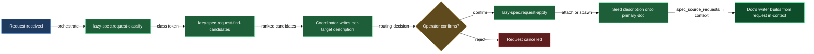

# Requests

When you or a collaborator have an idea, bug report, or design brief that doesn't yet have a home in the spec tree, the requests block handles the journey from raw text to a properly-attributed entry in the right asset. You drop a request into the content root's `requests/` inbox, the block works out what it is and where it belongs, and the result is either a new entity scaffolded from the request, an existing entity marked up with a short description of what changed, or — when the code already does what the request asks — a link pointing at the entity that already covers it. Every doc that gets a fresh seed opens a review cycle, and the full request itself reaches that doc's own writer through its review job's context.

The block covers three invocable members: `lazy-spec.create-request` (the intake skill that captures a raw idea into the vault-wide `requests/` inbox), `lazy-spec.request-classify` (the classifier primitive), and `lazy-spec.request-find-candidates` (the vault search primitive). Once a request enters the review cycle, `spec.coordinator` — running in its routing mode, one of the five modes the same coordinator persona runs across the whole spec system — orchestrates classification and candidate search automatically and surfaces the routing decision for your confirmation. Enacting that decision — attaching to an existing entity, spawning a new one, or simply linking to one that already covers it — is not a skill you invoke: it is `lazy-spec.request-apply`, a deterministic Python worker that fires on its own once you confirm.

## When you'd use this

- You received a customer request in plain text and want it tracked against the right feature without manually deciding where it belongs.
- A collaborator filed a bug description in the inbox and you need it classified, matched to the right bug asset (or a new one created), and opened for review — without manually copying prose into three docs.
- You have a rough design brief you typed quickly and want it turned into a short description on the relevant feature's `design.md`, with the full brief available to whoever writes the real doc content next.
- You're processing a batch of requests after a sprint and need each one classified, routed, and attributed before the retro.

## How it fits together

The pipeline starts before the routing block fires. You create a request file with `/lazy-spec.create-request`, which captures the raw body into the content root's `requests/` inbox as a plain markdown note. A daemon routine adds the `request_class`, `request_status`, and `request/<value>` mirror tag on the next tick — the create skill writes body only.

Once the review cycle on the request file opens, `spec.coordinator` fires in its routing mode. It works in two sub-skill calls, then surfaces its proposal for your confirmation.

**Classify.** The coordinator calls `/lazy-spec.request-classify` to determine what kind of work the request represents. The classifier reads the body and resolves the valid class set dynamically from `lazy.settings.json`: the closed meta classes (`task` / `spec` / `plan` / `feedback` / `unknown`) plus the asset types visible on the target product — the plugin's shipped `feature` / `change` / `bug` / `content` / `research` with the product's own `asset_types` merged over them key-by-key, so a type declared via `/lazy-spec.add-asset-type` (`characters`, `scenes`, …) shows up alongside them. The classifier applies a priority rubric (bug beats change beats the product's own declared types, and so on down to `feedback` and `unknown`) and returns one lowercase token. The coordinator uses that value verbatim; it never invents a label outside the resolved set. If the class comes back `unknown`, the coordinator surfaces a `[!question]` callout asking you to clarify before candidate search proceeds.

**Find candidates.** With the class in hand, the coordinator calls `/lazy-spec.request-find-candidates`, which searches the content root for existing entities that could be attach targets. Search scope is filtered by class — a `bug` request searches only the product's bugs folder; a `task` request searches across features, changes, and bugs. Each candidate is scored by term overlap against the entity's primary doc, title overlap against the entity's folder name and heading, and whether the entity already lists a related request in its `## Source requests` block (a strong "continuation" signal). The coordinator receives a ranked list of up to five candidates with a one-sentence rationale per entry.

**Check for "already built" before proposing a new asset.** Before it proposes a spawn, the coordinator checks whether the request describes something the code already does — the same research routes an expert's own research pass uses against the target product (`lazy-wiki.structure` query mode, `/lazy-wiki.domains`, `lazy-spec.lookup`). A request whose body names an upstream design-mirror unit runs this check unconditionally, before any spawn decision, plus a `lazy-spec.coverage` gap-scan against the target product's code — a freshly-mirrored source routinely turns out to already be built. Anything the check finds already implemented gets proposed as a **link** to that existing asset rather than a new one (see "Describe, don't distribute" below); an ambiguous overlap goes to you as a `[!question]` rather than a guess either way.

**Describe, don't distribute.** For every attach, spawn, or link target it settles on, the coordinator writes one short per-target description — a sentence or two naming what the target is or what changes — rather than splitting the request body into sections. A link's description is written loud on purpose: it names, in full sentences, which existing asset covers the request and what evidence backs that call, because a wrong link is invisible — nobody notices a request that quietly got marked "already done" and nothing gets built, where a wrong new-asset proposal is at least visible and easy to merge away. If the target is an already-launched feature (its implementation has started — `spec_develop_done: true`, an active `Start implementation` job, or a `code-report.md`), the coordinator is required to route to a change instead of attaching directly, naming the feature in the change's `targets=` field so the change's own design cascades into the feature later, once approved.

**Surface for confirmation.** The coordinator writes its proposal into the request file's `# Routing` section. The section carries three things on every round: a short plain-language summary of the routing decision; a `[!question] Confirm the routing?` callout with two checkboxes — "Apply the routing-decision block as written" or "I want a different routing — re-open the review so I can describe it"; and a machine-readable `<!-- routing-decision ... -->` comment block at the end, listing one decision per line under one of three verbs — `spawn <asset-type> <slug> docs=<file>:<doc_type>[,...] [product=<key>] [path=<dir>] [tools=<tool>[,...]] [targets=<folder>/<slug>,...] [:: <description>]`, `attach <repo-relative-path> [drop=<file>[,...]] [:: <description>]`, or `reference <repo-relative-path> [:: <description>]`. `docs=` is mandatory on a spawn line — it names the new asset's starting documents, drawn from the target type's own declaration, so a spawn line missing it is rejected once you confirm. `product=` names which registered product a spawn lands in, stated explicitly whenever the vault holds more than one; `path=` and `tools=` are optional overrides; `targets=` only applies to a `change`-kind spawn, feeding its design cascade; `drop=` on an attach line names which of the target's existing documents a pre-launch rollback removes — leaving it out means dropping nothing at all. The apply worker reads only the comment block; the prose and callout are for you. You tick one checkbox to confirm. Until you do, the request stays at action-needed. You can also edit the `routing-decision` block in place before ticking — the coordinator reads back whatever you typed on the next round, including the description after `::` and every named field.

The coordinator never enacts the routing itself. That is `lazy-spec.request-apply`'s job once the review closes.

**Enact the decision.** Once you confirm, `lazy-spec.request-apply` — a deterministic Python worker, not an LLM-dispatched skill — reads the resolved `# Routing` section and enacts every spawn, attach, and reference line in it:

- **Attach** — the target's primary doc (`design.md` for feature/change, `bug.md` for bug) gets an `> [!attention] change requested: <description>` block spliced in. The doc's existing content is never rewritten.
- **Spawn** — the worker scaffolds the new entity first (the same deterministic primitive `lazy-spec.create-asset --empty` uses), then seeds the description as the primary doc's initial draft content, the same way an attach target's delta is seeded.
- **Reference** — the worker touches nothing on the linked asset: no doc edit, no attribution, no review reopened. It only records the link on the request's own frontmatter (`spec_targets`). A request routed entirely through reference lines still finishes as a full accept — it just added no new asset, because the coordinator judged one already exists.
- **No description was written** (a legacy routing-decision line with no `::` suffix) — a fallback one-line seed, `Request routed here — see linked request`, lands instead of an empty splice. Reference lines carry no fallback — a link is either backed by a real description or not proposed at all.

In neither the attach nor spawn case does the request BODY get copied into the doc. What actually makes it into the finished doc comes later: every doc `lazy-spec.request-apply` seeds also gets the request's wikilink appended to its `spec_source_requests` frontmatter, and that list is exactly what the review dispatcher folds into the doc's own main-writer job as `context/` (`context_from_frontmatter`, wired on the `design` and `bug` review classes). The writer reads the actual request from context and builds the real prose from it — the seeded description is a pointer to start from, not a stand-in for the source.

**A not-yet-launched feature's in-flight ladder rolls back first.** If the attach target is a feature whose planning has already started (a `code-plan.md` / `test-plan.md` exists, or a gate from `spec_plan_done` onward is already true) but hasn't launched implementation, the coordinator names which of the target's existing documents to remove via the attach line's `drop=` field — drawn from the target type's own playbook, and left absent means dropping nothing at all. When `drop=` names documents, the worker cancels the target's active job, stops review on the named siblings, drops them from the worktree, flips the downstream gates back off, and only then seeds the attach delta — landing the feature back where it would be if the ladder had never started, before the fresh request revises its design.

Each seeded doc's folder-note also gets a wikilink-only line in `## Source requests` — no body prose goes there. A review cycle opens on every doc that received a seed (skipping the opening writer round in favor of `submit` when a pre-launch rollback just reopened it); the folder-note itself is never opened into review.

## Common adjustments

**Scope to a product.** When the vault holds multiple products and the request body doesn't make the product obvious, pass `--product <key>` to `/lazy-spec.request-classify` — the classifier scopes the asset-type half of the valid set to that product's visible `asset_types` instead of unioning across all products.

**Correct a wrong class.** There's no pre-set frontmatter shortcut — `request_class` stays `unknown` in the file until the apply worker stamps it post-finalize, and the coordinator always calls the classifier itself. If the coordinator's proposed class is wrong, edit the `routing-decision` block in place before ticking the confirm callout's "Apply" option, or tick "I want a different routing" to re-open review and describe the correct class in prose for the next round.

**Override the spawn slug, description, or any of the named fields.** The coordinator derives a slug from the request title and writes its own description. If you want any of it different, edit the `routing-decision` block before confirming — the apply worker reads whatever you left in the block, including `docs=`, `path=`, `tools=`, and `product=` on a spawn line, `targets=` on a change-kind spawn, and `drop=` on an attach line.

**Disagree with a proposed link.** If the coordinator proposes `reference` and you think the request genuinely needs new work, tick "I want a different routing" to re-open review rather than confirming the link — the same mechanism that corrects a wrong class or a wrong target.

**Declare a new asset type.** If none of the shipped classes fit a request for a non-software product, run `/lazy-spec.add-asset-type` first to declare the type (e.g. `chapters`). On the next classifier dispatch, the new type appears in the resolved valid set automatically — the declaration alone is enough, and no folder has to exist for it yet.

## How the block flows

```mermaid
%%{init: {'themeVariables':{'background':'transparent','lineColor':'#000','textColor':'#000','edgeLabelBackground':'#fff'},'themeCSS':'.edgeLabel{background-color:transparent!important}.edgeLabel p{background-color:transparent!important}','flowchart':{'diagramPadding':5,'useMaxWidth':true}}}%%
flowchart LR
  requestReceived[Request received]
  classifyRequest[lazy-spec.request-classify]
  findCandidates[lazy-spec.request-find-candidates]
  writeDescription[Coordinator writes per-target description]
  operatorConfirm{Operator confirms?}
  applyWorker[lazy-spec.request-apply]
  seedDoc[Seed description onto primary doc]
  writerBuilds[Doc's writer builds from request in context]
  requestCancelled[Request cancelled]

  requestReceived -->|orchestrate| classifyRequest
  classifyRequest -->|class token| findCandidates
  findCandidates -->|ranked candidates| writeDescription
  writeDescription -->|routing decision| operatorConfirm
  operatorConfirm -->|confirm| applyWorker
  operatorConfirm -->|reject| requestCancelled
  applyWorker -->|attach or spawn| seedDoc
  seedDoc -->|spec_source_requests → context| writerBuilds

  classDef entry fill:#1e3a5f,stroke:#4a90e2,color:#fff
  classDef guard fill:#5f4a1e,stroke:#e2a14a,color:#fff
  classDef action fill:#1e5f3a,stroke:#4ae290,color:#fff
  classDef success fill:#0d4d2a,stroke:#4ae290,color:#fff,stroke-width:2px
  classDef error fill:#5f1e1e,stroke:#e24a4a,color:#fff,stroke-width:2px

  class requestReceived entry
  class classifyRequest action
  class findCandidates action
  class writeDescription action
  class operatorConfirm guard
  class applyWorker action
  class seedDoc action
  class writerBuilds success
  class requestCancelled error
```

## See also

- [authoring](authoring.md) — create and scaffold spec assets that requests route into
- [gates](gates.md) — drive an asset's readiness gates once a request has been attached and the review cycle advances
