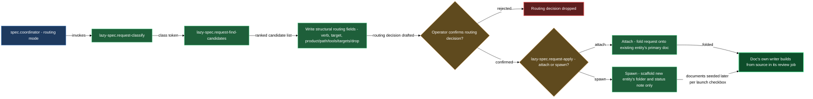

# Requests

When you or a collaborator have an idea, bug report, or design brief that doesn't yet have a home in the spec tree, the requests block handles the journey from raw text to a properly-attributed entry in the right asset. You drop a request into the content root's `requests/` inbox, the block works out what it is and where it belongs, and the result is either a new entity scaffolded from the request — its documents created later, one at a time, as you tick its own launch checkboxes — a new product registered outright when the request describes something bigger than a single asset, an existing entity (or an existing system document) whose relevant content is attributed to the request and sent straight into review, or — when the code already does what the request asks — a link pointing at the entity that already covers it. Every document a request ever populates, whether immediately or later, opens a review cycle in which its own writer reads the full request from that cycle's job context and builds the real prose from it.

None of the block's members is something you invoke directly. The routing decision itself is made by a sibling coordinator that runs on the catalog root — the level note sitting above every registered product — rather than on the request's own asset, because only from there is every product visible at once; a request that could land in any of several products needs that wider view before it can be classified and matched. That routing coordinator wakes once a request reaches the terminal group of its own review cycle and orchestrates the two primitives this block ships: `lazy-spec.request-classify` (the classifier primitive) and `lazy-spec.request-find-candidates` (the vault search primitive). `spec.coordinator` — the persona that owns each individual asset's own status folder-note — never receives that routing wake and never writes into a request's `# Routing` section; its part in this pipeline is downstream, described under "Enact the decision" below, where a spawned or attached asset's own folder-note wakes it for the ordinary reconciliation that turns a routing decision into a live launch checkbox. A request only reaches this block after `/lazy-spec.create-request` — the authoring block's own intake skill — has captured it into the vault-wide `requests/` inbox; this block never captures a request itself, it only routes one that already exists. Enacting the routing decision — attaching to an existing entity, spawning a new one, spawning a whole new product, or simply linking to one that already covers it — is not a skill you invoke either: it is `lazy-spec.request-apply`, a deterministic Python worker that fires on its own once you confirm.

## When you'd use this

- You received a customer request in plain text and want it tracked against the right feature without manually deciding where it belongs.
- A collaborator filed a bug description in the inbox and you need it classified, matched to the right bug asset (or a new one created), and opened for review — without manually copying prose into three docs.
- You have a rough design brief you typed quickly and want it attached to the relevant feature so its next review round folds the brief straight into `design.md`, with the full brief still available to whoever writes the real prose.
- You're processing a batch of requests after a sprint and need each one classified, routed, and attributed before the retro.

## How it fits together

The pipeline starts before the routing block fires. You create a request file with `/lazy-spec.create-request`, which captures the raw body into the content root's `requests/` inbox as a plain markdown note. A daemon routine adds the `request_class`, `request_status`, and `request/<value>` mirror tag on the next tick — the create skill writes body only.

Once the review cycle on the request file closes, the request reaches the terminal group of its own review, and the catalog-root coordinator fires its routing mode there. It works in two sub-skill calls, then surfaces its proposal for your confirmation.

**Classify.** The routing coordinator calls `/lazy-spec.request-classify` to determine what kind of work the request represents. The classifier reads the body and resolves the valid class set dynamically from `lazy.settings.json`: the closed meta classes (`task` / `spec` / `plan` / `feedback` / `unknown`) plus the asset types visible on the target product — the plugin's shipped `feature` / `change` / `bug` / `content` / `research` with the product's own `asset_types` merged over them key-by-key, so a type declared via `/lazy-spec.add-asset-type` (`characters`, `scenes`, …) shows up alongside them. The classifier applies a priority rubric (bug beats change beats the product's own declared types, and so on down to `feedback` and `unknown`) and returns one lowercase token. The routing coordinator uses that value verbatim; it never invents a label outside the resolved set. If the class comes back `unknown`, it surfaces a `[!question]` callout asking you to clarify before candidate search proceeds.

**Find candidates.** With the class in hand, the routing coordinator calls `/lazy-spec.request-find-candidates`, which searches the content root for existing entities that could be attach targets. Search scope is filtered by class — a `bug` request searches only the product's bugs folder; a `task` request searches across features, changes, and bugs. Each candidate is scored by term overlap against the entity's primary doc, title overlap against the entity's folder name and heading, and whether the entity already lists a related request in its `## Source requests` block (a strong "continuation" signal). The routing coordinator receives a ranked list of up to five candidates with a one-sentence rationale per entry.

**Check for "already built" before proposing a new asset.** Before it proposes a spawn, the routing coordinator checks whether the request describes something the code already does — the same research routes an expert's own research pass uses against the target product (`lazy-wiki.structure` query mode, `/lazy-wiki.domains`, `lazy-spec.lookup`). A request whose body names an upstream design-mirror unit runs this check unconditionally, before any spawn decision, plus a `lazy-spec.coverage` gap-scan against the target product's code — a freshly-mirrored source routinely turns out to already be built. Anything the check finds already implemented gets proposed as a **reference** to that existing asset rather than a new one (see "No per-target description" below); an ambiguous overlap goes to you as a `[!question]` rather than a guess either way.

**No per-target description.** A routing line carries only its verb, target, and structural fields — never prose describing what the target is or what changes. Nothing is seeded from a description at apply time, on any of spawn, spawn-product, or attach: every downstream writer resolves the originating request(s) itself, through the target's `spec_source_requests` frontmatter and the review dispatcher's `context_from_frontmatter`, and reads the real request body from its own job context — never a re-telling the routing coordinator wrote in its place. A `reference` line is the one exception that still carries prose — not a target description, but the coordinator's own rationale for the call, written loud in the routing section's plain text: which existing asset covers the request and what evidence backs that call. It is written loud on purpose: a wrong `reference` is invisible — nobody notices a request that quietly got marked "already done" while nothing gets built — where a wrong new-asset spawn is at least visible and easy to merge away.

**Surface for confirmation.** The routing coordinator writes its proposal into the request file's `# Routing` section. The section carries three things on every round: a short plain-language summary of the routing decision; a `[!question] Confirm the routing?` callout with two checkboxes — "Apply the routing-decision block as written" or "I want a different routing — re-open the review so I can describe it"; and a machine-readable `<!-- routing-decision ... -->` comment block at the end, listing one decision per line under one of four verbs — `spawn <asset-type> <slug> [product=<key>] [path=<dir>] [tools=<tool>[,...]] [targets=<folder>/<slug>,...]`, `spawn-product key=<key> path=<spec_path> [experts=<role>:<name>,...] :: <description>`, `attach <repo-relative-path> [drop=<file>[,...]]`, or `reference <repo-relative-path>`. A spawn line names no documents. `product=` names which registered product a spawn lands in, stated explicitly whenever the vault holds more than one; `path=` and `tools=` are optional overrides; `targets=` only applies to a `change`-kind spawn, feeding its design cascade; `drop=` on an attach line names which of the target's existing documents a pre-launch rollback removes — leaving it out means dropping nothing at all. An `attach` line can also name a system document loose at a product root or at the content root — `vision.md`, `design.md`, `ui-design.md`, or `tech.md` — instead of an asset's folder-note; see "Attach a request to a system document" below. `spawn-product` is the odd one out: its `:: <description>` IS read rather than ignored, because no target document exists yet to carry the intent; `key=` and `path=` are both required, and an optional `experts=` field names the new product's role experts once you've settled them through the callout the routing coordinator raises during the same review. The apply worker reads only the comment block; the prose and callout are for you. You tick one checkbox to confirm. Until you do, the request stays at action-needed. You can also edit the `routing-decision` block in place before ticking — the routing coordinator reads back whatever you typed on the next round, including every named field. (A `docs=` field or a trailing `:: <description>` on a `spawn` / `attach` / `reference` line, left over from an older request, is tolerated at parse time and simply ignored — nothing seeds from either.)

The routing coordinator never enacts the routing itself. That is `lazy-spec.request-apply`'s job once the review closes.

**Enact the decision.** Once you confirm, `lazy-spec.request-apply` — a deterministic Python worker, not an LLM-dispatched skill — reads the resolved `# Routing` section and enacts every spawn, spawn-product, attach, and reference line in it:

- **Spawn** — the worker scaffolds the asset folder and its status folder-note alone, through the same primitive `lazy-spec.create-asset` uses for an empty scaffold — no document is written and no review opens yet. The request is recorded on the new folder-note's `## Source requests` list. Every document the asset eventually needs, `design.md` included, is created later, one at a time: ticking a `Write <doc>` launch checkbox on the folder-note dispatches `seed-doc`, which seeds that one doc at stage `empty` and copies the folder-note's accumulated `spec_source_requests` onto it, then opens the writer round via `lazy-review.start` once the folder-note carries at least one source-request entry — the class's main writer works its first round straight from the request(s), never from a placeholder. Reconciling that launch checkbox and dispatching `seed-doc` once you tick it is `spec.coordinator`'s ordinary job on the asset's own folder-note — its first wake after a spawn is a plain transition, not a routing decision.
- **Spawn a product** — a `spawn-product` line registers a whole new product rather than one asset inside an existing one: the worker records the product with the given path and no code binding yet (add one later, in edit mode, with `/lazy-spec.product-config`), scaffolds the product's own folder and level note, seeds its `vision.md` at stage `empty` with the request already attributed to it, and opens that document's review — the product's own vision starts from the request, the same way a spawned asset's first document does. Any role experts you settled during the request's review land on the product's config; leave the field off and `/lazy-spec.product-config` fills them in later.
- **Attach** — the target's primary doc (`design.md` for feature/change, `bug.md` for bug) gets the request added to its `spec_source_requests` frontmatter and its `## Requests` projection under `# Sources` refreshed to match; the target's own folder-note gets a `## Source requests` bullet too. The apply worker never rewrites the doc's existing content itself — instead it opens review on the doc directly: normally at the writer round (`lazy-review.start`), so the class's writer folds the newly attached request into the design on its own next pass, or via `submit` when a pre-launch rollback (below) just reopened that same doc. An attach line naming a system document instead of an asset skips the folder-note step entirely — see "Attach a request to a system document" below.
- **Reference** — the worker touches nothing on the linked asset: no doc edit, no attribution, no review reopened. It only records the link on the request's own frontmatter (`spec_targets`). A request routed entirely through reference lines still finishes as a full accept — it just added no new asset, because the routing coordinator judged one already exists.

No document's prose is ever assembled from the routing decision itself. What actually lands in a doc comes from its own writer, once dispatched — an attach target's writer immediately, a spawned asset's writer later, on its own launch checkbox — reading the real request through `spec_source_requests` → `context_from_frontmatter` and building content from it. The seeded frontmatter is a pointer to start from, never a stand-in for the source.

**A not-yet-launched feature's in-flight ladder rolls back first.** If the attach target is a feature whose planning has already started (a `code-plan.md` / `test-plan.md` exists, or a gate from `spec_plan_done` onward is already true) but hasn't launched implementation, the routing coordinator names which of the target's existing documents to remove via the attach line's `drop=` field — drawn from the target type's own playbook, and left absent means dropping nothing at all. When `drop=` names documents, the worker cancels the target's active job, stops review on the named siblings, drops them from the worktree, flips the downstream gates back off, and only then applies the attach — landing the feature back where it would be if the ladder had never started, before the fresh request's writer round revises its design.

**Attach a request to a system document.** When a request is really feedback on a product's overall direction rather than on one specific feature or bug — a note about the product's `vision.md`, `design.md`, `ui-design.md`, or `tech.md`, or about the catalog root's own copies of those four — the routing coordinator writes an `attach` line naming that document's path directly instead of an asset's folder-note. Apply stamps `spec_source_requests` onto the document itself and reopens its review; there is no folder-note in between to record the source request on, since a level document's home note carries no `## Source requests` section of its own. `drop=` has no meaning on a line like this — a level's system documents are never rolled back as a set the way an in-flight feature's ladder is.

## Common adjustments

**Scope to a product.** When the vault holds multiple products and the request body doesn't make the product obvious, pass `--product <key>` to `/lazy-spec.request-classify` — the classifier scopes the asset-type half of the valid set to that product's visible `asset_types` instead of unioning across all products.

**Correct a wrong class.** There's no pre-set frontmatter shortcut — `request_class` stays `unknown` in the file until the apply worker stamps it post-finalize, and the routing coordinator always calls the classifier itself. If the proposed class is wrong, edit the routing prose in place before ticking the confirm callout's "Apply" option, or tick "I want a different routing" to re-open review and describe the correct class in prose for the next round.

**Override the spawn slug or any of the named fields.** The routing coordinator derives a slug from the request title. If you want it — or `path=`, `tools=`, `product=`, `targets=`, or `drop=` — different, edit the `routing-decision` block before confirming; the apply worker reads back whatever you left there.

**Disagree with a proposed link.** If the routing coordinator proposes `reference` and you think the request genuinely needs new work, tick "I want a different routing" to re-open review rather than confirming the link — the same mechanism that corrects a wrong class or a wrong target.

**Declare a new asset type.** If none of the shipped classes fit a request for a non-software product, run `/lazy-spec.add-asset-type` first to declare the type (e.g. `chapters`). On the next classifier dispatch, the new type appears in the resolved valid set automatically — the declaration alone is enough, and no folder has to exist for it yet.

## How the block flows

```mermaid
%%{init: {'themeVariables':{'background':'transparent','lineColor':'#000','textColor':'#000','edgeLabelBackground':'#fff'},'themeCSS':'.edgeLabel{background-color:transparent!important}.edgeLabel p{background-color:transparent!important}','flowchart':{'diagramPadding':5,'useMaxWidth':true}}}%%
flowchart LR
  specCoordinatorRoutingMode["spec.coordinator - routing mode"]
  requestClassify["lazy-spec.request-classify"]
  requestFindCandidates["lazy-spec.request-find-candidates"]
  writeRoutingFields["Write structural routing fields - verb, target, product/path/tools/targets/drop"]
  operatorConfirms{"Operator confirms routing decision?"}
  requestDropped["Routing decision dropped"]
  requestApply{"lazy-spec.request-apply - attach or spawn?"}
  attachToPrimaryDoc["Attach - fold request onto existing entity's primary doc"]
  spawnNewEntity["Spawn - scaffold new entity's folder and status note only"]
  writerBuildsFromSource["Doc's own writer builds from source in its review job"]

  specCoordinatorRoutingMode -->|invokes| requestClassify
  requestClassify -->|class token| requestFindCandidates
  requestFindCandidates -->|ranked candidate list| writeRoutingFields
  writeRoutingFields -->|routing decision drafted| operatorConfirms
  operatorConfirms -->|rejected| requestDropped
  operatorConfirms -->|confirmed| requestApply
  requestApply -->|attach| attachToPrimaryDoc
  requestApply -->|spawn| spawnNewEntity
  attachToPrimaryDoc -->|folded| writerBuildsFromSource
  spawnNewEntity -->|documents seeded later per launch checkbox| writerBuildsFromSource

  classDef entry fill:#1e3a5f,stroke:#4a90e2,color:#fff
  classDef guard fill:#5f4a1e,stroke:#e2a14a,color:#fff
  classDef action fill:#1e5f3a,stroke:#4ae290,color:#fff
  classDef success fill:#0d4d2a,stroke:#4ae290,color:#fff,stroke-width:2px
  classDef error fill:#5f1e1e,stroke:#e24a4a,color:#fff,stroke-width:2px
  class specCoordinatorRoutingMode entry
  class requestClassify action
  class requestFindCandidates action
  class writeRoutingFields action
  class operatorConfirms guard
  class requestApply guard
  class attachToPrimaryDoc action
  class spawnNewEntity action
  class writerBuildsFromSource success
  class requestDropped error
```

## See also

- [authoring](authoring.md) — create and scaffold spec assets that requests route into
- [gates](gates.md) — drive an asset's readiness gates once a request has been attached and the review cycle advances
