# Source links — repos, dependencies, and forge-correct URLs

When a spec document links to source code or records a dependency on another product, it needs to know which git forge hosts the code and what path scheme that forge uses. GitHub uses `/blob/<branch>/<path>`, GitLab uses `/-/blob/<branch>/<path>`, Bitbucket uses `/src/<branch>/<path>`, and so on. Keeping that knowledge in every skill that emits a link is fragile; the source-links block centralises it in three focused primitives so the rest of the spec system never has to care about forge differences.

`spec.resolve-repo` is the foundation: given a repo key from your settings, it reads the git remote, normalises the URL, and identifies the forge. `spec.source-url` sits above it and builds one correct URL for any file or directory in that repo, handling branch pinning transparently. `spec.resolve-dependency` sits beside them and turns the three flavours of dependency entry (internal product, internal repo, external) into a ready-to-use record containing both a spec wikilink and a dev URL.

## When you'd use this

- You're looking at a spec document that contains a broken or stale source link and want to understand how those links are built so you can tell where the configuration gap is.
- A skill (such as `/spec.create-from-code` or `/spec.sync-with-code`) aborts with a forge or repo error, and you need to diagnose or fix the registration.
- You've registered a product hosted on a self-hosted GitLab or Gitea instance and want to confirm the forge override is resolving correctly.
- You're calling `/spec.product-config` and it asks you about dependencies — the wizard invokes `/spec.resolve-dependency` to classify each entry, so understanding its three shapes (product, repo, external) helps you answer correctly.
- You're debugging why a spec doc's `## Sources` section has incorrect or missing links after a branch merge.

## How it fits together

Everything flows through `/spec.resolve-repo`. You give it a repo key — a string you chose when you ran `/spec.product-config` to register the repo, such as `backend` or `shared`. The skill reads that record from `lazy.settings.json[repos]`, inspects `origin` on the local checkout, normalises the URL from SSH to HTTPS if needed, and identifies the forge by matching the hostname against the known-forges table. What comes back is a `RepoInfo` record: `local_path`, `branch`, `remote_url`, `host`, `owner`, `repo`, `forge`, and `base_url`. Callers cache this record for the duration of a run so repeated URL construction doesn't shell out repeatedly.

`/spec.source-url` calls `spec.resolve-repo` first, then picks up the forge key and looks up the URL template for the requested `kind` — `blob` for a file, `tree` for a directory. It substitutes `base_url`, branch, and path into the template and returns the complete URL. When the calling doc has a `spec_source_branches` pin for that repo, you pass the pinned branch as the optional `branch` argument and the URL points at the feature branch instead of the default. The skill is stateless and idempotent: same inputs, same URL, every time.

`/spec.resolve-dependency` handles the dependency side. A product's `dependencies` array in `lazy.settings.json` accepts three entry shapes. A `product:` entry names another product by compound key; the skill looks that product up, calls `spec.resolve-repo` on its source repo, and returns a wikilink to its design doc plus a `dev_link` pointing at the repo root. A `repo:` entry names a repo key directly; the skill resolves it the same way and finds whichever product declares that repo as its source. An `external:` entry already has `spec_url` and `dev_url` spelled out — the skill just validates the fields are present and returns them as-is. The output is always `{kind, spec_link, dev_link, local_spec_path?}` — one consistent shape regardless of entry flavour, which is what callers like `spec.product-config` import classification expect.

## Common adjustments

**Registering a repo** — if `/spec.resolve-repo` aborts because a key is not registered, run `/spec.product-config` to add or edit the product that owns that repo. The wizard writes `lazy.settings.json[repos][<key>]` with `local_path` and `branch`. You do not edit the settings file by hand.

**Adding a forge override for a self-hosted instance** — if the hostname is not in the known-forges table (e.g., `gitlab.internal.company.example`), `/spec.resolve-repo` aborts with a message naming the missing key. Run `/spec.product-config`, find the repo record, and set `forge` to one of the supported keys (`github`, `gitlab`, `bitbucket`, `gitea`, `forgejo`, `sourcehut`) — whichever matches the instance's URL scheme. The skill writes the override; you do not edit JSON.

**Changing the default branch** — the `branch` field in the repo record controls which branch source URLs default to. If your project has moved its default branch, run `/spec.product-config` to update the record. Existing spec docs that had the old branch pinned via `spec_source_branches` are reconciled by `/spec.finalize-branch` once the old branch merges or is deleted.

**Adding or editing a product dependency** — run `/spec.product-config` in edit mode to extend the `dependencies` array. The wizard accepts the three entry shapes (`product:`, `repo:`, `external:`) interactively and calls `/spec.resolve-dependency` to validate each entry before writing.

## How the three skills compose

```mermaid
%%{init: {'themeVariables':{'background':'transparent','lineColor':'#000','textColor':'#000','edgeLabelBackground':'#fff'},'themeCSS':'.edgeLabel{background-color:transparent!important}.edgeLabel p{background-color:transparent!important}','flowchart':{'diagramPadding':5,'useMaxWidth':true}}}%%
flowchart LR
  callerSourceUrl[spec.source-url called]
  callerResolveDep[spec.resolve-dependency called]
  resolveRepo[spec.resolve-repo]
  readSettings[Read lazy.settings.json repos section]
  inspectRemote[Inspect git remote]
  repoInfo[RepoInfo returned]
  guardEntryType{Entry type?}
  internalProduct[internal-product path]
  internalRepoPath[internal-repo path]
  otherEntry[other entry path]
  buildDepRecord[Build dep record]
  outputUrl[Output: URL]
  outputDepRecord[Output: dep record]

  callerSourceUrl -->|calls| resolveRepo
  callerResolveDep -->|entry type check| guardEntryType
  guardEntryType -->|internal-product| internalProduct
  guardEntryType -->|internal-repo| internalRepoPath
  guardEntryType -->|other| otherEntry
  internalProduct -->|calls| resolveRepo
  internalRepoPath -->|calls| resolveRepo
  resolveRepo -->|reads| readSettings
  readSettings -->|then| inspectRemote
  inspectRemote -->|produces| repoInfo
  repoInfo -->|returned to source-url| outputUrl
  repoInfo -->|returned to resolve-dep| buildDepRecord
  otherEntry -->|builds directly| buildDepRecord
  buildDepRecord -->|produces| outputDepRecord

  classDef entry fill:#1e3a5f,stroke:#4a90e2,color:#fff
  classDef guard fill:#5f4a1e,stroke:#e2a14a,color:#fff
  classDef action fill:#1e5f3a,stroke:#4ae290,color:#fff
  classDef success fill:#0d4d2a,stroke:#4ae290,color:#fff,stroke-width:2px
  classDef error fill:#5f1e1e,stroke:#e24a4a,color:#fff,stroke-width:2px
  class callerSourceUrl entry
  class callerResolveDep entry
  class guardEntryType guard
  class resolveRepo action
  class readSettings action
  class inspectRemote action
  class repoInfo action
  class internalProduct action
  class internalRepoPath action
  class otherEntry action
  class buildDepRecord action
  class outputUrl success
  class outputDepRecord success
```

