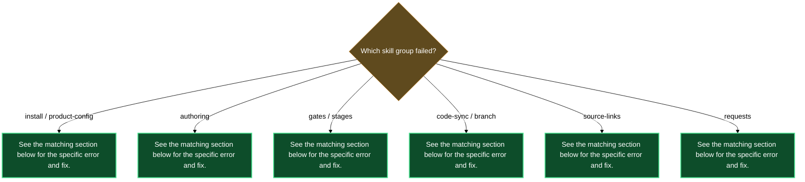

# Troubleshooting

## `/spec.install` says the plugin is not installed

**Symptom**: Running `/spec.install` prints a refusal along the lines of "plugin not installed — no entry in `installed_plugins.json`".

**Likely cause**: `lazycortex-specs@lazycortex` has not been added to `enabledPlugins` in your Claude Code settings, so the plugin cache does not exist yet.

**Fix**: Add `"lazycortex-specs@lazycortex": true` to `enabledPlugins` in your `~/.claude/settings.json` (or the project-level `.claude/settings.json`), restart Claude Code, then run `/plugin install lazycortex/lazycortex-specs`. After that re-run `/spec.install`.

---

## `/spec.product-config` aborts pointing at `lazycortex-experts`

**Symptom**: The wizard reaches the expert-assignment step and aborts with a message saying a chosen expert name is not registered.

**Likely cause**: The designer, developer, tester, or historian persona you selected is not a key in the `experts` settings section. This happens when the persona has not been composed yet or the name was mistyped.

**Fix**: Compose the missing persona via `lazycortex-experts` first, then re-run `/spec.product-config`. Do not type a free-form name that does not exist in the registry — the skill validates every name against `settings-get experts`.

---

## `/spec.product-config` refuses because the `spec_path` is nested

**Symptom**: The wizard rejects the derived path with a message that the `spec_path` sits inside another product's `spec_path`.

**Likely cause**: Products in lazycortex-specs are flat siblings — one product's folder must not be a subdirectory of another product's folder. A path like `Server/products/api/auth` would be rejected if `Server/products/api` is already registered.

**Fix**: Choose a sibling path at the same level as the other product, or introduce an optional namespace folder (e.g. `Server/products/backend/auth` alongside `Server/products/backend/api`). Re-run `/spec.product-config` with the corrected path.

---

## `/spec.product-config` refuses because the compound-key already exists

**Symptom**: The wizard aborts saying the derived `<subsystem>[-<namespace>]-<leaf>` key is already present in `products`.

**Likely cause**: A product with the same subsystem/namespace/leaf combination was registered previously.

**Fix**: If you want to edit the existing product, re-invoke `/spec.product-config` with that product's key or path — the skill enters edit mode. If you genuinely need a new sibling product, pick a different leaf or namespace so the compound-key is unique.

---

## `/spec.add-asset-category` aborts saying an icon is required

**Symptom**: The wizard refuses to write anything and prints "icon is required — the category is not registered without one".

**Likely cause**: The operator declined every icon option without typing a value. An icon is mandatory because it drives the Obsidian iconize system on the category folder.

**Fix**: Re-invoke `/spec.add-asset-category` and supply a Lucide icon name (e.g. `LiUsers`) or an emoji when prompted. The wizard will not proceed without a non-empty icon value.

---

## `/spec.add-asset-category` or `/spec.product-config` audit reports FAIL after writing review classes

**Symptom**: The skill's final report includes an `audit: FAIL` line from `lazy-review.audit`, naming unregistered experts or schema violations.

**Likely cause**: One or more of the designer / developer / tester / historian names you chose in the wizard are not registered as experts, or the generated review-class schema is inconsistent (e.g. a validation section references a missing expert).

**Fix**: Identify the failing expert from the audit output, compose that persona via `lazycortex-experts`, then re-run `/spec.product-config` (or `/spec.add-asset-category`) to regenerate the review classes with valid expert assignments.

---

## `/spec.create-asset` (or `create-feature` / `create-change` / `create-bug`) refuses naming an unknown product

**Symptom**: The skill prints a refusal naming the product key and suggesting `/spec.product-config`.

**Likely cause**: The product compound-key you passed has no record in `lazy.settings.json[products]`. The product was never registered, or the key was misspelled.

**Fix**: Run `/spec.product-config` to register the product, then re-invoke `/spec.create-asset <product> <category> <slug>`. Verify the compound-key matches exactly what the wizard wrote into config.

---

## `/spec.create-asset` refuses naming an unknown category

**Symptom**: The skill rejects the category name, saying it is neither a built-in nor a declared `asset_categories` key for the product.

**Likely cause**: You passed a category that does not exist in `products[<key>].asset_categories`. The built-in set is `feature`, `change`, `bug`; anything else must be declared first.

**Fix**: Run `/spec.add-asset-category <product> <category-name>` to register the new category, then re-invoke `/spec.create-asset`.

---

## `/spec.create-from-code` refuses an unregistered product or no-ops on a design-only product

**Symptom**: The skill either refuses with "product not registered" or prints "product is design-only — no code binding to sync" and stops without writing any files.

**Likely cause**: For the "not registered" case, the product key is not in `products`. For the "design-only" case, the product record exists but has no `source` block binding it to a code repo.

**Fix**: For an unregistered product, run `/spec.product-config` first. For a design-only product, re-run `/spec.product-config` in edit mode to attach a source repo — the wizard adds the `source.repo` + `source.paths` block without clobbering any existing asset categories.

---

## `/spec.flip-gate` refuses with "precondition not met"

**Symptom**: The primitive exits with an error message naming a specific gate whose precondition does not hold, rather than performing the flip.

**Likely cause**: The five gates are a strict ladder (`spec_design_done` → `spec_plan_done` → `spec_develop_done` → `spec_tests_passing` → `spec_released`). Flipping a gate requires all earlier gates to already be `true`, and for derived gates (`spec_design_done`, `spec_plan_done`) the corresponding authored doc must be in `approved` stage first.

**Fix**: Satisfy the precondition named in the refusal. For `spec_design_done`, the asset's `design.md` (or `bug.md` for a bug) must reach `spec_stage: approved` — use `/spec.set-stage` after the doc is reviewed and accepted. For `spec_plan_done`, `plan.md` must be `approved` or `cancelled`. Then re-invoke `/spec.flip-gate`.

---

## `/spec.flip-gate` refuses with "asset cancelled"

**Symptom**: The gate flip is refused with a message that the asset is cancelled.

**Likely cause**: `spec_cancelled: true` on the asset's status folder-note freezes all gate progression. No flip — on or off — is allowed while an asset is cancelled.

**Fix**: Uncancel the asset by running `/spec.flip-gate <asset> spec_cancelled --off` if you want to resume it, or leave it cancelled if the work is truly abandoned. After uncancelling, gate flips proceed normally.

---

## `/spec.flip-gate` cannot resolve the asset

**Symptom**: The skill prints a refusal saying the input matches zero or more than one asset.

**Likely cause**: The path or slug you passed is ambiguous — it could map to multiple products or categories — or it does not match any asset folder.

**Fix**: Pass the unambiguous asset directory path (e.g. `Server/products/api/features/csv-export`). If you are unsure of the exact path, run `/spec.doctor <product>` to list assets under the product.

---

## `/spec.set-stage` refuses because the file's `spec_role` is not an authored-doc role

**Symptom**: The skill rejects the target file with "file `spec_role` is not an authored-doc role".

**Likely cause**: You called `/spec.set-stage` on a status folder-note, a category folder-note, or another non-authored file. Per-file stages apply only to `design`, `tech`, `plan`, and `bug` docs.

**Fix**: Run `/spec.set-stage` on the authored doc inside the asset folder (`design.md`, `plan.md`, `bug.md`, or the product-level `docs/tech.md`), not on the folder-note.

---

## `/spec.set-stage` refuses an invalid stage value

**Symptom**: The skill prints "stage `<value>` is not in the closed set", naming the offending value.

**Likely cause**: You passed a stage value that was removed from the model (`review`, `done`, `wtr`) or a free-form string that is not in `{empty, draft, approved, rejected, cancelled}`.

**Fix**: Use one of the current closed-set values. If the doc is in review, use `draft` with `review_active: true` on the doc's frontmatter. If the doc has been accepted, use `approved`. Run `/spec.set-stage <doc> <correct-stage>`.

---

## `/spec.set-stage` refuses `cancelled` on `design.md` or `bug.md`

**Symptom**: The skill rejects the transition with "cancelled not allowed on `design.md`" (or `bug.md`).

**Likely cause**: `design.md` for a feature/change and `bug.md` for a bug are mandatory docs — cancelling them is forbidden because they are the minimal evidence a spec entry existed. Only `tech.md` and `plan.md` may be cancelled.

**Fix**: To indicate that implementation will not happen, cancel `plan.md` instead. If you want to retire the whole asset, set `spec_cancelled: true` on the status folder-note via `/spec.flip-gate <asset> spec_cancelled`.

---

## `/spec.sync-with-code` refuses or no-ops for a product

**Symptom**: The skill either refuses naming an unregistered product, or prints "product is design-only" and stops without syncing.

**Likely cause**: Same as `spec.create-from-code` — the product is missing from `products` or has no `source` block.

**Fix**: Register the product via `/spec.product-config`, or attach a source repo in edit mode. Then re-run `/spec.sync-with-code`.

---

## `/spec.sync-with-code` aborts with "fetch failed"

**Symptom**: The sync aborts early with a message that `git fetch --prune` failed.

**Likely cause**: The source repo's remote is unreachable — network error, authentication failure, or no remote configured at `local_path`.

**Fix**: Confirm network connectivity and credentials for the source repo. If the repo has no remote, add one (`git remote add origin <url>`). The skill refuses to operate on stale refs, so fix connectivity first, then re-run.

---

## A proposed `spec_develop_done` flip during `spec.sync-with-code` is refused

**Symptom**: After approving the gate proposal in the sync wizard, the skill surfaces a `flip_gate` refusal message rather than advancing the gate.

**Likely cause**: The gate's precondition (`spec_plan_done: true`) does not hold. The plan doc has not yet been approved and its gate has not been derived.

**Fix**: Settle the plan first — the asset's `plan.md` must reach `spec_stage: approved` and `spec_plan_done` must be `true`. Once the plan gate is set, re-run `/spec.sync-with-code` to re-propose the `spec_develop_done` flip.

---

## `/spec.finalize-branch` aborts with "fetch failed"

**Symptom**: The skill aborts before scanning any pinned specs, with an error naming a repo where `git fetch --prune` failed.

**Likely cause**: Network error, auth failure, or no remote configured in `lazy.settings.json[repos]` for one of the registered repos.

**Fix**: Fix connectivity or credentials for the affected repo, then re-run `/spec.finalize-branch`. The skill never operates on stale remote refs.

---

## `/spec.finalize-branch` reports "still open" for a named branch

**Symptom**: When invoked with an explicit branch name, the skill reports "still open" and makes no changes.

**Likely cause**: The branch is not yet an ancestor of the default branch and still exists on the remote — it has not been merged.

**Fix**: Merge the branch via your normal workflow. If the merge used a squash and the ancestry check therefore fails, re-run `/spec.finalize-branch <branch> --force-merged` after confirming the squash was deliberate. Alternatively, delete the branch — after `fetch --prune` the skill treats a deleted branch as merged.

---

## A proposed `spec_released` flip during `spec.finalize-branch` is refused

**Symptom**: After approving the release proposal for an asset, the skill surfaces a `flip_gate` refusal rather than setting `spec_released`.

**Likely cause**: The release precondition (`spec_tests_passing: true`) does not hold. The full ladder must be satisfied: design done → plan done → develop done → tests passing → released.

**Fix**: Settle the holding gate. For `spec_tests_passing`, flip it once a green test report exists for the asset's code (run `/spec.flip-gate <asset> spec_tests_passing`). The branch rebase from `spec.finalize-branch` is already applied — only the release flip is held back. Re-run `/spec.finalize-branch` to re-propose the release once the gate is set.

---

## `/spec.resolve-repo` aborts naming a key not registered in `repos`

**Symptom**: The skill prints "repo key `<key>` not in `lazy.settings.json[repos]`".

**Likely cause**: The `repos` section has no entry for the key. This key should have been written by `/spec.product-config`'s inline repo wizard when you first attached a source repo to a product.

**Fix**: Run `/spec.product-config` in edit mode on any product that uses this repo. The inline repo wizard registers the `local_path` and `branch` into `lazy.settings.json[repos][<key>]`. Then re-invoke the skill that triggered this error.

---

## `/spec.resolve-repo` aborts with an unknown forge

**Symptom**: The skill prints "unknown forge for host `<host>`" and lists the supported forge keys.

**Likely cause**: The remote's hostname is not in the known-forges table and no explicit `forge:` override is set on the `repos[<key>]` record. This occurs with self-hosted GitLab, Gitea, or Forgejo instances whose hostnames are not publicly recognisable.

**Fix**: Add `"forge": "<key>"` to the repo's record in `lazy.settings.json[repos][<key>]` — supported values are `github`, `gitlab`, `bitbucket`, `gitea`, `forgejo`, `sourcehut`. Use `/spec.product-config` in edit mode (the inline repo wizard) to write the record; do not hand-edit the settings file.

---

## `/spec.resolve-dependency` refuses a malformed entry or missing product/repo

**Symptom**: The skill aborts with "malformed dep entry", "product not found", or "repo not found".

**Likely cause**: A `dependencies` entry in `products[<key>].dependencies` is missing the required `product:`, `repo:`, or `external:` key, or names a product/repo key that is not registered.

**Fix**: For a malformed entry, check each dependency entry shape in the product record — each must carry exactly one of the three keys. For a missing product, run `/spec.product-config` to register it. For a missing repo, re-run `/spec.product-config` (inline repo wizard) to register the `repos[<key>]` record. Edit the entry via `/spec.product-config` in edit mode; do not hand-edit `lazy.settings.json`.

---

## `/spec.create-request` reports that `requests/` does not exist

**Symptom**: The skill tries to write the request file and prints an error because the `requests/` inbox directory is missing.

**Likely cause**: The vault-wide `requests/` directory was never created. It is normally scaffolded during `/spec.product-config` as part of the product's built-in category dirs, but may be absent if the product was registered before this convention or the directory was deleted.

**Fix**: The skill creates `requests/` automatically when absent, so a second invocation should succeed. If the directory is still missing, run `/spec.product-config` in edit mode for any registered product to re-scaffold the built-in dirs.

---

## `/spec.request-find-candidates` refuses with "class is unknown"

**Symptom**: The search refuses to run and prints "unknown class — classify first".

**Likely cause**: `spec.request-classify` returned `unknown` for the request body, meaning the body is too vague or ambiguous to place in any category. `spec.request-find-candidates` requires a concrete class token to scope its search.

**Fix**: Provide more detail in the request body. Edit the request file to clarify the intent — add a scope section, describe what the user will be able to do, or identify whether it is a bug, change, or new feature. Once the body has enough signal, the classifier will return a concrete class and the search will proceed.

---

## `/spec.request-attach` refuses because the target doc is in a terminal stage

**Symptom**: The skill aborts with a refusal naming the target doc's stage (`rejected` or `cancelled`), saying the operator must revive the doc before attaching.

**Likely cause**: The entity doc you are trying to attach to (`design.md`, `plan.md`, `bug.md`) is in a terminal stage. The attach skill will not modify a doc the operator has explicitly rejected or cancelled.

**Fix**: Decide whether the doc should be revived. If yes, run `/spec.set-stage <doc> draft` to return it to draft stage, then re-invoke the request attach flow. The request file is left untouched so you can retry without data loss.

---

## `/spec.request-spawn` fails because the target folder already exists

**Symptom**: The scaffold primitive exits non-zero with a JSON error saying the target folder already exists.

**Likely cause**: An entity with the same product, kind, and slug combination was already scaffolded — either by a previous spawn attempt that partially succeeded, or by a manual `/spec.create-asset` run.

**Fix**: If the existing entity is the correct target, use `/spec.request-attach` directly on the existing folder-note rather than spawning again. If it is a collision from a failed earlier run, inspect the existing folder to confirm it is a stale partial scaffold, then remove it and re-run.

---

## `/spec.doctor` reports gate-precedence violations

**Symptom**: The doctor report contains FAIL lines naming gate-precedence violations, e.g. "`spec_tests_passing: true` but `spec_develop_done: false`".

**Likely cause**: A later gate was set `true` while an earlier gate in the strict S0..S5 ladder was still `false`. This can happen if gates were edited outside the `/spec.flip-gate` primitive or imported from an older format.

**Fix**: Run `/spec.doctor <product> --apply`. The fix loop offers to turn each orphaned later gate off via `/spec.flip-gate <asset> <gate> --off`, which enforces the ladder from above. Confirm each proposal; do not manually edit frontmatter.

---

## `/spec.doctor` reports that `spec_stage` and `spec/<stage>` tag are out of sync

**Symptom**: The doctor report contains FAIL lines for stage/tag mirror drift, e.g. "`design.md` `spec_stage: approved` but `tags:` has `spec/draft`".

**Likely cause**: The `spec_stage` frontmatter and the mirrored `spec/<stage>` tag diverged — this happens when frontmatter was edited by hand without going through `/spec.set-stage`, which keeps both fields in lock-step.

**Fix**: Run `/spec.set-stage <doc> <current-stage>` — even when the stage value is not changing, the skill re-syncs the tag. For bulk drift after a migration, run `/spec.doctor <product> --apply` and accept each re-sync proposal.

---

## Diagnostic flowchart

