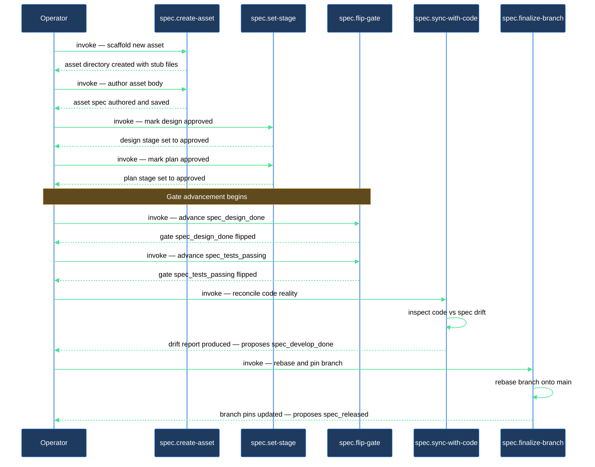

# How do I take an asset from creation all the way to release?

This walkthrough is for anyone who has a product registered in the spec system and wants to carry a single asset — a feature, change, or bug — through its complete lifecycle: from a blank scaffold to a confirmed release gate. Five skills divide the work: `spec.create-asset` builds the scaffold and authors the docs; `spec.set-stage` records when a doc moves from draft to approved; `spec.flip-gate` advances the flat readiness gates; `spec.sync-with-code` keeps the spec current with code commits and proposes gates grounded in what actually landed; and `spec.finalize-branch` cleans up source-branch pins and proposes the final `spec_released` gate once the branch merges.

## Outcome

After completing this journey you have:

- A fully authored spec folder for the asset (`design.md` approved, `plan.md` approved, source links pointing at the default branch).
- All five gates (`spec_design_done` through `spec_released`) set to `true` in the asset's status folder-note.
- A complete `# History` trail in the folder-note recording every stage transition and gate flip.

## What you need

- `lazycortex-specs` installed (`/spec.install` already run).
- A product registered in `lazy.settings.json[products]` via `/spec.product-config`.
- For the sync and branch phases: the product must have a `source` binding (a `source.repo` entry pointing at a local checkout), and that repo must have a remote configured so `git fetch` can run.
- The asset category you want to create (`feature`, `change`, `bug`, or an operator-defined category) must be valid for the product — either built-in or declared via `/spec.add-asset-category`.

## The journey

### Step 1 — Create the asset

Run `/spec.create-asset <product> <category> <slug>`, where `<product>` is the compound key for your registered product, `<category>` is `feature`, `change`, `bug`, or an operator-defined category, and `<slug>` is a lowercase-with-hyphens name for this asset.

`spec.create-asset` opens a wizard (2–5 questions, one at a time) to gather scope, behavior, and edge-case detail for the category. After you answer, it scaffolds the asset folder at `<spec_path>/<category>/<slug>/`, authors `design.md` (starting at `draft` stage) and `plan.md` (starting at `empty` stage), fills in the folder-note's `# Summary` précis, and draws the primary behavioral diagram in `design.md`. The folder-note (`<slug>.md`) is created with all five gates at `false` and a `# History` H1 section carrying a scaffold entry.

`design.md` describes the intended behavior only — it never writes in "not yet supported" or half-built code paths as if they were spec limitations. If a section feels narrower than you expected, that's an explicit scope decision from the wizard answers, not a reflection of what the code currently does.

**Verification gate:** confirm the asset folder exists, `design.md` carries `spec_stage: draft`, the folder-note's `# Summary` précis is filled in (not a placeholder), and the folder-note lists all five gates as `false`.

If the skill refuses naming an unknown product, run `/spec.product-config` to register it, then re-invoke. If it refuses naming an unknown category, run `/spec.add-asset-category` to declare it, then re-invoke.

### Step 2 — Review and approve the design doc

Read `design.md` and iterate on its prose as needed (the skill authored a first draft; refinement is yours). When the design is ready for implementation, run:

```
/spec.set-stage <design.md path> approved
```

`spec.set-stage` rewrites `spec_stage: approved` in the frontmatter, mirrors the `spec/approved` tag in lock-step, and appends a transition line to the folder-note's `# History` section. The history line takes the form `- <YYYY-MM-DD> — spec.set-stage · design.md spec_stage draft→approved`. It accepts only the closed set `empty | draft | approved | rejected | cancelled`; anything outside that set is rejected with a clear error.

**Verification gate:** open the folder-note's `# History` section and confirm the transition line for `design.md draft→approved` is present.

### Step 3 — Flip the design-done gate

With the design doc approved, the `spec_design_done` precondition is satisfied. Advance the gate:

```
/spec.flip-gate <asset> spec_design_done
```

`spec.flip-gate` asks one confirmation question (naming the asset and gate, and explaining what the flip signals). On yes, it subprocesses the primitive, which writes `spec_design_done: true` on the folder-note and appends a history line. If the primitive refuses with "precondition not met", the design doc is not yet `approved` — return to Step 2.

### Step 4 — Author, approve, and gate the plan

Open `plan.md` and fill in the implementation plan. When it is ready, approve it:

```
/spec.set-stage <plan.md path> approved
```

Then flip the next gate:

```
/spec.flip-gate <asset> spec_plan_done
```

`spec_plan_done` is a derived gate — the primitive checks that `plan.md` carries `spec_stage: approved` before flipping. If the primitive refuses with "precondition not met", return to the `set-stage` step for `plan.md`.

**Verification gate:** the folder-note's `# History` and gate frontmatter should now show `spec_design_done: true` and `spec_plan_done: true`.

### Step 5 — Sync with code after implementation

Once the implementation is written (in its own source-repo branch), run:

```
/spec.sync-with-code <product>
```

`spec.sync-with-code` fetches the source repo, walks commits since the last sync, updates the product tech doc with code-level changes (new routes, functions, files), and surfaces user-visible behavior changes for you to review before applying them to the design doc. It also inspects every asset folder-note and, when commits on the default branch objectively implement this asset, proposes flipping `spec_develop_done` via one confirmation question. On yes, it invokes `spec.flip-gate` for you.

If the proposed `spec_develop_done` flip is refused by the primitive (precondition: `spec_plan_done` must be `true`), return to Step 4 first, then re-run `/spec.sync-with-code`.

After sync, flip the tests gate manually once a green test report exists:

```
/spec.flip-gate <asset> spec_tests_passing
```

**Verification gate:** `spec_develop_done: true` and `spec_tests_passing: true` on the folder-note.

### Step 6 — Finalize the branch and release

After you merge (or delete) the source-repo branch, run:

```
/spec.finalize-branch <branch>
```

`spec.finalize-branch` fetches the remote, walks every spec file that carries `spec_source_branches:` pins for the merged branch, rebases the source URLs to the default branch, and removes the pin entries. For any asset whose pinned docs covered the now-merged branch, it proposes flipping `spec_released` via one confirmation question per asset. On yes, it invokes `spec.flip-gate <asset> spec_released`.

`flip_gate` enforces the full precondition ladder before flipping `spec_released` — all four earlier gates must be `true`. If it refuses, the message names the holding gate. Settle that gate and re-run `/spec.finalize-branch`.

For squash-merges where the branch still exists on the remote, pass `--force-merged`:

```
/spec.finalize-branch <branch> --force-merged
```

**Verification gate:** all five gates are `true` on the folder-note; `spec_source_branches` is absent from `design.md` and `plan.md` (or empty); source URLs in the tech doc and plan doc point at the default branch.

## After you're done

The asset is now fully released. Its folder-note carries five `true` gates and a `# History` trail covering every stage transition and gate flip. The product tech doc reflects the latest code state, and all source links resolve against the default branch.

To revisit a decision — for instance if a test passes retroactively or a design is revised — use `/spec.flip-gate <asset> <gate> --off` to regress a gate, or `/spec.set-stage <doc> draft` to re-open a doc for editing. Each operation appends a history line so the audit trail stays complete.

Run `/spec.doctor <product>` periodically to catch drift: missing stage mirrors, stale links, gate inconsistencies, or docs that gained new content without a stage transition.

## How the journey flows


