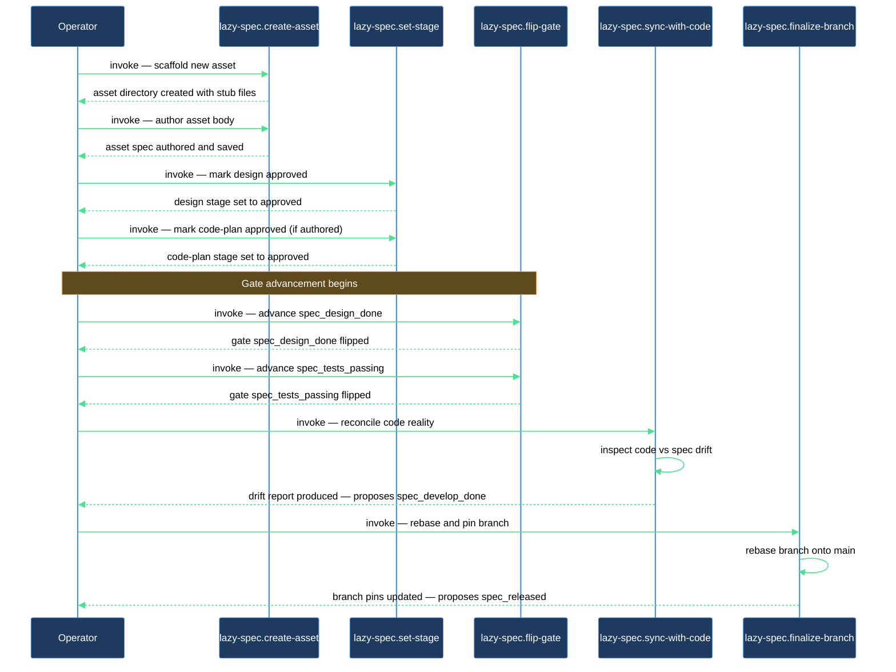

# How do I take an asset from creation all the way to release?

This walkthrough is for anyone who has a product registered in the spec system and wants to carry a single asset — a feature, change, or bug — through its complete lifecycle: from a blank scaffold to a confirmed release gate. Five skills divide the work: `lazy-spec.create-asset` builds the scaffold and authors the docs; `lazy-spec.set-stage` records when a doc moves from draft to approved; `lazy-spec.flip-gate` advances the flat readiness gates; `lazy-spec.sync-with-code` keeps the spec current with code commits and proposes gates grounded in what actually landed; and `lazy-spec.finalize-branch` cleans up source-branch pins and proposes the final `spec_released` gate once the branch merges.

## Outcome

After completing this journey you have:

- A fully authored spec folder for the asset (`design.md` approved and, if you chose to author one, `code-plan.md` approved; source links pointing at the default branch).
- All five gates (`spec_design_done` through `spec_released`) set to `true` in the asset's status folder-note.
- A complete `# History` trail in the folder-note recording every stage transition and gate flip.

## What you need

- `lazycortex-specs` installed (`/lazy-spec.install` already run).
- A product registered in `lazy.settings.json[products]` via `/lazy-spec.product-config`.
- For the sync and branch phases: the product must have a `source` binding (a `source.repo` entry pointing at a local checkout), and that repo must have a remote configured so `git fetch` can run.
- The asset type you want to create (`feature`, `change`, `bug`, `content`, `research`, or a type the product declares itself) must be valid for the product — either one of the plugin's shipped types or declared via `/lazy-spec.add-asset-type`.

## The journey

### Step 1 — Create the asset

Run `/lazy-spec.create-asset <product> <category> <slug>`, where `<product>` is the compound key for your registered product, `<category>` is `feature`, `change`, `bug`, or an operator-defined category, and `<slug>` is a lowercase-with-hyphens name for this asset.

`lazy-spec.create-asset` opens a wizard (2–5 questions, one at a time) to gather scope, behavior, and edge-case detail for the category. After you answer, it scaffolds the asset folder at `<spec_path>/<category>/<slug>/`, authors the one doc it seeds — `design.md` (starting at `draft` stage) — and fills in the folder-note's `# Summary` précis. The scaffold draws no diagrams of its own — once `design.md`'s prose is settled, ask for one explicitly via `/lazy-diagram.draw` if the doc needs a picture. The folder-note (`<slug>.md`) is created with all five gates at `false` and a `# History` H1 section carrying a scaffold entry. `code-plan.md` and `test-plan.md` are opt-in — the scaffold never creates them; Step 4 below covers authoring a code plan when your asset needs one.

`design.md` describes the intended behavior only — it never writes in "not yet supported" or half-built code paths as if they were spec limitations. If a section feels narrower than you expected, that's an explicit scope decision from the wizard answers, not a reflection of what the code currently does.

**Verification gate:** confirm the asset folder exists, `design.md` carries `spec_stage: draft`, the folder-note's `# Summary` précis is filled in (not a placeholder), and the folder-note lists all five gates as `false`.

If the skill refuses naming an unknown product, run `/lazy-spec.product-config` to register it, then re-invoke. If it refuses naming an unknown category, run `/lazy-spec.add-asset-type` to declare it, then re-invoke.

### Step 2 — Review and approve the design doc

Read `design.md` and iterate on its prose as needed (the skill authored a first draft; refinement is yours). When the design is ready for implementation, run:

```
/lazy-spec.set-stage <design.md path> approved
```

`lazy-spec.set-stage` rewrites `spec_stage: approved` in the frontmatter, mirrors the `spec/approved` tag in lock-step, and appends a transition line to the folder-note's `# History` section. The history line takes the form `- <YYYY-MM-DD> — lazy-spec.set-stage · design.md spec_stage draft→approved`. It accepts only the closed set `empty | draft | approved | rejected | cancelled`; anything outside that set is rejected with a clear error.

Approving `design.md` carries three side effects along in the same commit, none of which need a separate step from you:

- **Attachments cascade.** Any markdown attachment sitting beside `design.md` (one carrying `spec_owner_doc: design.md`) picks up `spec_stage: approved` too — unless it's mid-review itself, in which case its own review cycle owns it until that finishes.
- **The category container note refreshes.** If the asset's category has a container note (e.g. `features/features.md`), its bucket counts update to reflect the new stage.
- **Decisions promote automatically.** If `design.md` carries any `[!decision]` callouts, approving it transfers them into the product's `decisions.md` — each callout in `design.md` becomes a reference link, and a `**Supersedes.**` command on one of them stamps the superseded decision's own file `superseded-by`.

**Verification gate:** open the folder-note's `# History` section and confirm the transition line for `design.md draft→approved` is present.

### Step 3 — Flip the design-done gate

With the design doc approved, `spec_design_done` is ready to advance:

```
/lazy-spec.flip-gate <asset> spec_design_done
```

`lazy-spec.flip-gate` asks one confirmation question (naming the asset and gate, and explaining what the flip signals). On yes, it subprocesses the primitive, which writes `spec_design_done: true` on the folder-note and appends a history line unconditionally — the primitive itself no longer checks whether `design.md` is actually `approved`, so if you jump ahead here, nothing stops you; go back and finish Step 2 first if you skipped it. (If a daemon runs in this project, `spec.coordinator` would ordinarily have flipped this gate on its own the moment it saw `design.md` approved — this step is what you'd otherwise wait for.)

### Step 4 — Author (or skip) the code plan, then gate it

`code-plan.md` is opt-in — the scaffold never creates it. If this asset needs no separate implementation plan, skip straight to flipping the gate:

```
/lazy-spec.flip-gate <asset> spec_plan_done
```

An asset with no `code-plan.md` sibling has nothing to approve, so `spec_plan_done`'s usual readiness is already satisfied by that absence alone — the flip lands regardless, since the primitive no longer checks readiness on its own either way.

If you DO want a code plan, author it first — create `code-plan.md` in the asset folder from the `code-plan.md` template for this category, fill in the implementation plan, then approve it:

```
/lazy-spec.set-stage <code-plan.md path> approved
```

Then flip the next gate:

```
/lazy-spec.flip-gate <asset> spec_plan_done
```

`spec_plan_done` is a derived gate — its usual readiness is a present `code-plan.md` carrying `spec_stage ∈ {approved, cancelled}`, or no `code-plan.md` at all. The primitive itself doesn't check this before flipping anymore, so make sure the `set-stage` step above actually landed before you flip — an early flip here just means the gate says `true` while the plan doc doesn't back it up yet.

**Verification gate:** the folder-note's `# History` and gate frontmatter should now show `spec_design_done: true` and `spec_plan_done: true`.

### Step 5 — Sync with code after implementation

Once the implementation is written (in its own source-repo branch), run:

```
/lazy-spec.sync-with-code <product>
```

`lazy-spec.sync-with-code` fetches the source repo, walks commits since the last sync, updates the product tech doc with code-level changes (new routes, functions, files), and surfaces user-visible behavior changes for you to review before applying them to the design doc. It also inspects every asset folder-note and, when commits on the default branch objectively implement this asset AND `spec_plan_done` already reads `true`, proposes flipping `spec_develop_done` via one confirmation question. On yes, it invokes `lazy-spec.flip-gate` for you.

That `spec_plan_done` check is `sync-with-code`'s own readiness gate, not something the underlying `flip-gate` primitive enforces on its own. If Step 4 hasn't landed yet, sync doesn't propose the flip at all — it reports the asset as blocked on its code-plan gate instead. Finish Step 4, then re-run the sync to get the proposal.

After sync, flip the tests gate manually once a green test report exists:

```
/lazy-spec.flip-gate <asset> spec_tests_passing
```

**Verification gate:** `spec_develop_done: true` and `spec_tests_passing: true` on the folder-note.

For a lighter check on just this one asset — without waiting for a full product sync — run `/lazy-spec.sync-with-code <asset>` instead of the bare product key. This asset mode reconciles the asset's `design.md` (and `architecture.md`, when present) against the current code by anchor — source links in `code-plan.md` / `test-plan.md`, domain-group terms, or the structure map — rather than by commit diff, and it runs on no periodic schedule of its own. It never rewrites `design.md` / `architecture.md` prose silently: a discrepancy becomes an `[!attention]` callout on the doc, a proposed change asset, or the same kind of gate-correction proposal described above.

### Step 6 — Finalize the branch and release

After you merge (or delete) the source-repo branch, run:

```
/lazy-spec.finalize-branch <branch>
```

`lazy-spec.finalize-branch` fetches the remote, walks every spec file that carries `spec_source_branches:` pins for the merged branch, rebases the source URLs to the default branch, and removes the pin entries — this rebase always applies, regardless of any asset's gate state. For any asset whose pinned docs covered the now-merged branch, it then checks that asset's own `spec_released`, `spec_cancelled`, and `spec_tests_passing`: only when `spec_released` is `false`, `spec_cancelled` is `false`, and `spec_tests_passing` is `true` does it propose flipping `spec_released` via one confirmation question. On yes, it invokes `lazy-spec.flip-gate <asset> spec_released`.

That readiness check is `finalize-branch`'s own, not the underlying `flip-gate` primitive's — `flip-gate` flips unconditionally once confirmed, refusing only when the asset is cancelled. `finalize-branch` only checks `spec_tests_passing`, not the whole ladder behind it, so glance at the folder-note yourself to confirm `spec_design_done`, `spec_plan_done`, and `spec_develop_done` already read `true` before confirming. If `spec_tests_passing` isn't `true` yet, no proposal appears at all — settle it (flip `spec_tests_passing` once a green test report exists), then re-run `/lazy-spec.finalize-branch <branch>`; the rebase itself doesn't need repeating, only the release flip was held back.

For squash-merges where the branch still exists on the remote, pass `--force-merged`:

```
/lazy-spec.finalize-branch <branch> --force-merged
```

**Verification gate:** all five gates are `true` on the folder-note; `spec_source_branches` is absent from `design.md` and, if you authored one, `code-plan.md` (or empty on either); source URLs in the tech doc and any code-plan doc point at the default branch.

## After you're done

The asset is now fully released. Its folder-note carries five `true` gates and a `# History` trail covering every stage transition and gate flip. The product tech doc reflects the latest code state, and all source links resolve against the default branch.

To revisit a decision — for instance if a test passes retroactively or a design is revised — use `/lazy-spec.flip-gate <asset> <gate> --off` to regress a gate, or `/lazy-spec.set-stage <doc> draft` to re-open a doc for editing. Each operation appends a history line so the audit trail stays complete.

Run `/lazy-spec.doctor <product>` periodically to catch drift: missing stage mirrors, stale links, gate inconsistencies, or docs that gained new content without a stage transition.

## How the journey flows


```mermaid
%%{init: {'themeVariables':{'background':'transparent','primaryColor':'#1e3a5f','primaryBorderColor':'#4a90e2','primaryTextColor':'#fff','lineColor':'#4ae290','actorBkg':'#1e3a5f','actorBorder':'#4a90e2','actorTextColor':'#fff','actorLineColor':'#4a90e2','signalColor':'#4ae290','signalTextColor':'#000','noteBkgColor':'#5f4a1e','noteBorderColor':'#e2a14a','noteTextColor':'#fff','labelBoxBkgColor':'#5f4a1e','labelBoxBorderColor':'#e2a14a','labelTextColor':'#fff','loopTextColor':'#e2a14a'},'sequence':{'diagramPadding':5,'useMaxWidth':true}}}%%
sequenceDiagram
  participant operator as Operator
  participant createAsset as lazy-spec.create-asset
  participant setStage as lazy-spec.set-stage
  participant flipGate as lazy-spec.flip-gate
  participant syncCode as lazy-spec.sync-with-code
  participant finalize as lazy-spec.finalize-branch

  operator->>createAsset: invoke — scaffold new asset
  createAsset-->>operator: asset directory created with stub files
  operator->>createAsset: invoke — author asset body
  createAsset-->>operator: asset spec authored and saved

  operator->>setStage: invoke — mark design approved
  setStage-->>operator: design stage set to approved
  operator->>setStage: invoke — mark code-plan approved (if authored)
  setStage-->>operator: code-plan stage set to approved

  Note over operator,flipGate: Gate advancement begins

  operator->>flipGate: invoke — advance spec_design_done
  flipGate-->>operator: gate spec_design_done flipped
  operator->>flipGate: invoke — advance spec_tests_passing
  flipGate-->>operator: gate spec_tests_passing flipped

  operator->>syncCode: invoke — reconcile code reality
  syncCode->>syncCode: inspect code vs spec drift
  syncCode-->>operator: drift report produced — proposes spec_develop_done

  operator->>finalize: invoke — rebase and pin branch
  finalize->>finalize: rebase branch onto main
  finalize-->>operator: branch pins updated — proposes spec_released
```
