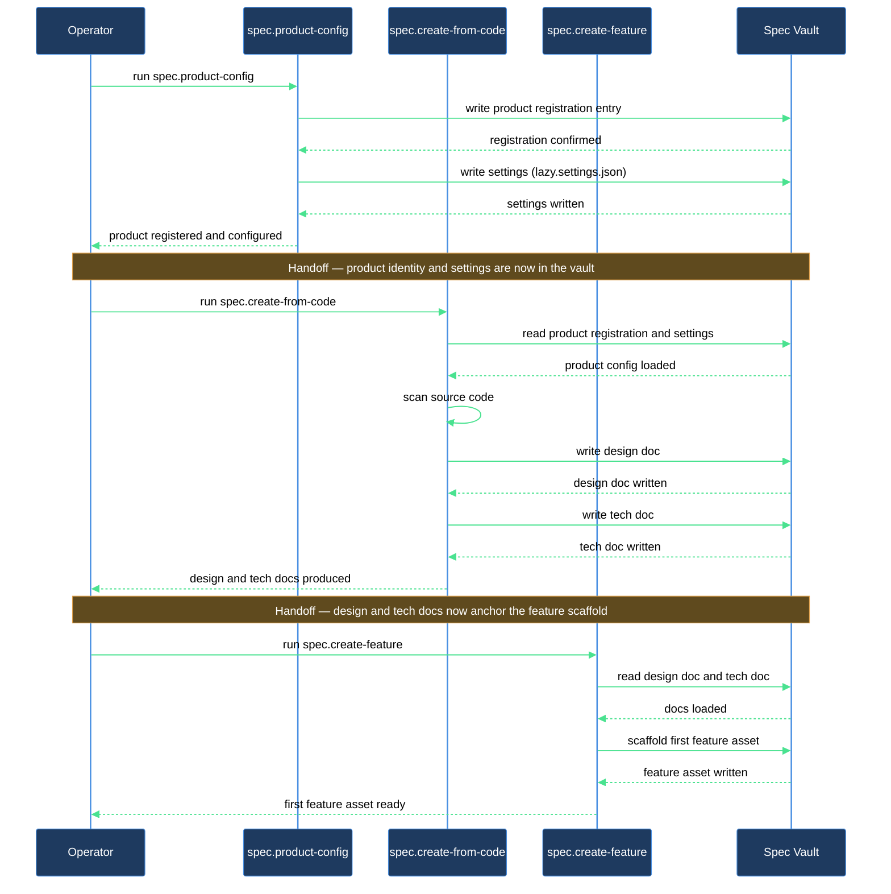

# How do I get specs for a codebase that already exists?

You have a working codebase — a service, a library, an application — and no spec to go with it. This walkthrough takes you through all three steps: registering the product in the spec system, generating a behavior-and-source-grounded specification directly from the code, and scaffolding the first feature so the asset lifecycle can begin. Three skills carry the work; your job is to answer their wizard questions and review what lands.

## Outcome

After completing this walkthrough you will have:

- A product record in `lazy.settings.json[products]` that names your codebase's source repo and the paths within it your product covers.
- A `design.md` — behavior-only, no source URLs — describing what the product does for its users, with an inline flow diagram under `## Behavior` and an inline layout diagram under `## Layout` (if the product has a UI).
- A `tech.md` — code-grounded, with forge-correct source URLs — covering the source map, architecture, and components, with an architecture diagram under `## Architecture` and a class diagram under `## Components`.
- At least one feature folder under `features/<slug>/` with a scaffolded `design.md` and `plan.md` ready for authoring.
- Review classes wired so every doc enters the review loop automatically.

## What you need

- `lazycortex-specs` installed and running (`/spec.install` completed at least once in this repo).
- `lazycortex-core` available — it provides the `settings-get` / `settings-set` CLI and the runtime daemon.
- A local checkout of the source repo you want to document — either the same repo that holds your spec vault (`/spec.product-config` can register it with `local_path: "."`, so every checkout resolves its own root with no absolute path needed), or a separate checkout that exists on disk at a path Claude Code can read.
- At least one expert registered in `lazy.settings.json[experts]` for the designer, developer, and tester roles. If you have not set up experts yet, run `/spec.install` — it offers to configure them — or run `lazycortex-experts` to compose the personas first.
- `lazycortex-diagram` available — the creation skill draws diagrams in the generated docs.

## The journey

### Step 1 — Register the product with `/spec.product-config`

Run `/spec.product-config`. The skill opens a wizard and asks one question at a time.

The key decisions you will make:

- **Product leaf name** — the folder name that becomes the trailing segment of the compound key (e.g. `api-gateway`, `invoicing`). Use lowercase-with-hyphens.
- **Subsystem and namespace** — where in the vault the product folder sits. You can place it directly under a top-level subsystem folder, or inside an optional namespace grouping folder.
- **Source repo** — whether this product has source code (it does) and which registered repo key maps to it. If the checkout is not registered yet, the wizard runs an inline sub-wizard to capture the local path and default branch for you. When the code lives in the very repo that holds your spec vault, pick `this repo (.)` — the wizard writes the literal `"."` so every checkout (dev machine, or a runtime checkout elsewhere) resolves its own root, no absolute path required. Otherwise point it at the root of a separate checkout that lives elsewhere on disk.
- **Source paths** — the subdirectories within the repo that this product covers. A single path like `src/api` is fine; you can add more paths if the product spans multiple subdirectories. The skill validates that each path exists on disk.
- **Dependencies** — the skill dispatches a read-only scan of your source paths and presents each detected dependency (internal products, cross-repo, or external packages) for you to accept or skip, one at a time.
- **Expert assignments** — the designer, developer, and tester personas that will review this product's docs. Pick from your registered experts.

When the wizard finishes, the skill writes the product record into settings, creates the on-disk folder tree with its operator-zone folder-notes (each carrying a `# Summary` skeleton with a précis and stats markers), and generates the built-in review classes — one per doc-kind (design, plan, tech, bug), each with wildcard globs spanning every asset category so a later category you add is covered automatically. It then runs `/spec.doctor` automatically and reports any issues.

If `/spec.product-config` points you at `lazycortex-experts` before finishing, it means a chosen expert name is not registered. Compose the persona via `lazycortex-experts`, then re-run `/spec.product-config`.

**Verification gate.** Before continuing, confirm that `spec.doctor` in the report shows no failures. The product folder and its `features/`, `changes/`, and `bugs/` subdirectories should exist on disk.

### Step 2 — Generate the spec from code with `/spec.create-from-code`

Run `/spec.create-from-code <compound-key>` where `<compound-key>` is the key the previous step just wrote (e.g. `backend-api-gateway`).

The skill resolves your product's source binding, then fans out four parallel Explore agents to scan the codebase:

- **Agent A** — classes, functions, routes, and their signatures.
- **Agent B** — data structures, constants, and UI or template surfaces.
- **Agent C** — known limitations, TODOs, and cross-repo imports.
- **Agent D** — candidate features: sub-folders or route groups that cohere as independently nameable units.

After scanning, the skill authors two docs:

**`design.md`** is behavior-only: what the product does, who uses it, and what the user-visible limitations are. It never contains source URLs or file paths — just observable behavior. Two diagrams land inline here: a `flow` diagram under `## Behavior` and a `layout` diagram under `## Layout` (for products with a UI; otherwise the layout seam reports `skipped-section-empty`).

**`tech.md`** is code-grounded: the source map, architecture narrative, component breakdown, route tables (if applicable), and a dependency table with forge-correct source URLs. Two more diagrams land inline here: a `c4-container` diagram under `## Architecture` and a `class` diagram under `## Components`.

Once both docs are written, the skill presents Agent D's candidate feature list and asks you what to do with each one:

- **scaffold feature** — delegates immediately to `spec.create-asset`, which opens its own wizard for that feature (see Step 3). Pick this for features you want to document now. Each scaffolded feature also receives a wikilink in the product `design.md`'s `## Roadmap` section.
- **treat as architectural area** — adds a subsection to the tech doc's `## Architectural Areas`; no feature folder is created.
- **skip** — leaves no trace.

Work through each candidate. You do not need to scaffold all of them now — you can run `/spec.create-feature` again later for any candidate you skipped.

**Verification gate.** Both `design.md` and `tech.md` should exist and carry `spec_stage: draft`. The design doc must contain no source URLs. Confirm that all four diagram seams are accounted for in the skill's verification report: `design.md:## Behavior` (flow), `design.md:## Layout` (layout), `tech.md:## Architecture` (c4-container), `tech.md:## Components` (class).

### Step 3 — Scaffold the first feature with `/spec.create-feature`

If you chose "scaffold feature" for at least one candidate in Step 2, `spec.create-asset` already ran inside that step and your first feature folder is ready. You can skip directly to the verification gate below.

If you deferred all candidates or want to add a feature that was not in the candidate list, run:

```
/spec.create-feature <compound-key> <feature-slug>
```

The skill asks you a small set of clarifying questions about the feature's scope, who triggers it, and any edge-case behavior to capture. It then scaffolds `features/<feature-slug>/` with:

- A status folder-note (`<feature-slug>.md`) carrying the feature icon, a `# Summary` précis, and an empty gate record.
- `design.md` — authored from your answers, behavior-only, with a `flow` diagram drawn under the behavior section.
- `plan.md` — a placeholder at `spec_stage: empty`; your planning workflow fills this when work begins.

**Verification gate.** The feature folder `features/<feature-slug>/` should contain the folder-note, `design.md` (stage `draft`), and `plan.md` (stage `empty`). Open `design.md` and confirm the flow diagram is rendered. No `tech.md` and no `layout` doc should be present — those roles do not exist at the asset level.

## After you're done

The product is registered and its initial spec is live. From here:

- **Add more features** — run `/spec.create-feature <compound-key> <slug>` for each new feature you want to document. You can scaffold any of the candidates Agent D surfaced, or invent a new slug for a feature the scan did not detect.
- **Keep docs in sync with code** — when source changes land, run `/spec.sync-with-code <compound-key>` to reconcile the tech doc, surface behavior changes for the design doc, and update branch pins if you are working on a non-default branch.
- **Drive assets through their gates** — use `/spec.flip-gate` to advance a feature's readiness gates (`spec_design_done` → `spec_plan_done` → …), or let the `spec.gate-tick` daemon routine advance derived gates automatically on each md-scan tick.
- **Re-run the doc scan** — if the codebase grows significantly, re-run `/spec.create-from-code <compound-key>` to refresh the design and tech docs. The skill reconciles existing branch pins before overwriting.
- **Doctor checks** — run `/spec.doctor <compound-key>` at any time to audit the product tree for broken links, missing sections, role violations, and source-link staleness.

## How the skills hand off


